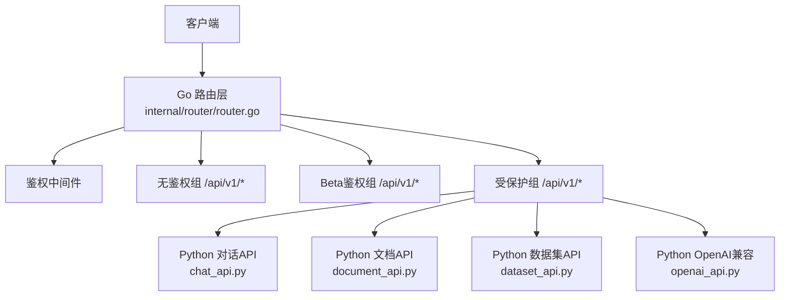
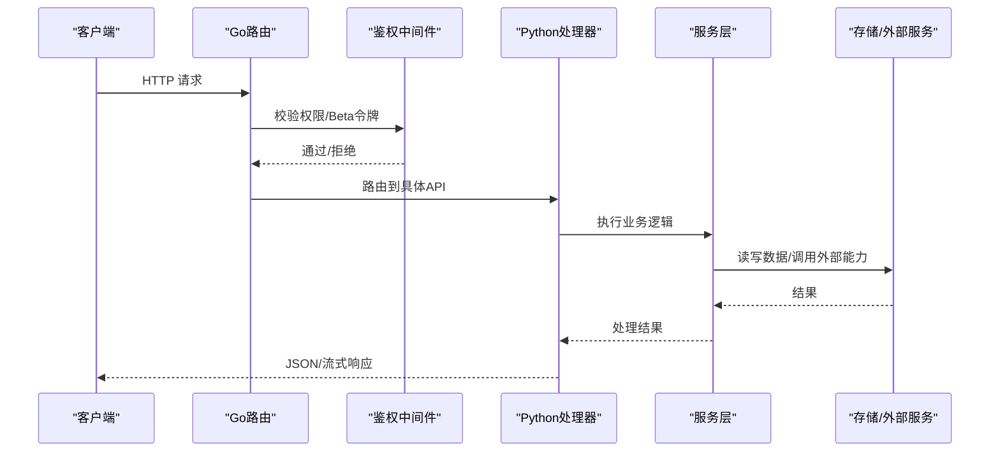
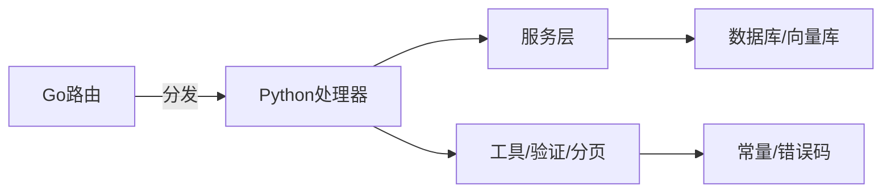

# API接口参考

<cite>
**本文引用的文件**
- [router.go](file://internal/router/router.go)
- [chat_api.py](file://api/apps/restful_apis/chat_api.py)
- [dataset_api.py](file://api/apps/restful_apis/dataset_api.py)
- [document_api.py](file://api/apps/restful_apis/document_api.py)
- [openai_api.py](file://api/apps/restful_apis/openai_api.py)
- [constants.py](file://common/constants.py)
</cite>

## 目录
1. [简介](#简介)
2. [项目结构](#项目结构)
3. [核心组件](#核心组件)
4. [架构总览](#架构总览)
5. [详细组件分析](#详细组件分析)
6. [依赖关系分析](#依赖关系分析)
7. [性能考虑](#性能考虑)
8. [故障排查指南](#故障排查指南)
9. [结论](#结论)
10. [附录](#附录)

## 简介
本参考文档面向RAGFlow的RESTful API与流式接口，覆盖认证授权、数据模型、错误码、版本兼容、WebSocket/SSE实时通信协议、限流与安全最佳实践等。文档基于后端路由注册与各业务API实现进行梳理，提供调用示例（curl/SDK）与流程图示，帮助开发者准确理解并高效使用所有可用接口。

## 项目结构
- Go侧负责统一路由注册、鉴权中间件、系统健康检查、部分Beta能力与MCP服务；Python侧承载具体业务API（数据集、文档、对话、检索、文件、插件、组件等）。
- 路由入口位于Go端，按“无鉴权组”、“Beta鉴权组”、“受保护组”分层挂载；各业务模块在Python端以restful_apis下的多个API文件组织。

**图示来源**
- [router.go:140-236](file://internal/router/router.go#L140-L236)
- [router.go:234-741](file://internal/router/router.go#L234-L741)

**章节来源**
- [router.go:140-236](file://internal/router/router.go#L140-L236)
- [router.go:234-741](file://internal/router/router.go#L234-L741)

## 核心组件
- 路由与鉴权：统一注册HTTP路由，提供无鉴权、Beta鉴权、受保护三类分组；内置日志与健康检查。
- 业务API：
  - 对话与聊天：会话管理、消息补全、思维导图、推荐、音频合成/转写、OpenAI兼容SSE流。
  - 数据集：创建/更新/删除/搜索、标签聚合、知识图谱、编译产物（Artifacts）、导航与技能。
  - 文档：上传（本地/URL/空文档）、元数据批量更新、解析任务控制、缩略图与预览。
  - 其他：文件、插件、组件、MCP、连接器等。
- 错误与状态码：统一的RetCode枚举用于业务返回码；HTTP状态码遵循REST规范。

**章节来源**
- [constants.py:60-78](file://common/constants.py#L60-L78)
- [chat_api.py:424-513](file://api/apps/restful_apis/chat_api.py#L424-L513)
- [dataset_api.py:86-174](file://api/apps/restful_apis/dataset_api.py#L86-L174)
- [document_api.py:129-189](file://api/apps/restful_apis/document_api.py#L129-L189)

## 架构总览
下图展示从请求到响应的主要路径：客户端→Go路由→鉴权中间件→Python处理器→服务层→存储/外部服务→响应。

**图示来源**
- [router.go:140-236](file://internal/router/router.go#L140-L236)
- [router.go:234-741](file://internal/router/router.go#L234-L741)

## 详细组件分析

### 认证与授权
- 无鉴权组：系统信息、健康检查、公开静态数据、登录、注册、忘记密码流程、连接器OAuth回调、Dify检索健康检查等。
- Beta鉴权组：需要Beta令牌（或等效鉴权），包含搜索机器人、聊天机器人、Agent相关能力、文档预览/图片/缩略图、Agent文件上传下载、MCP服务端点等。
- 受保护组：用户信息、租户、文档、对话、数据集、搜索、文件、记忆、技能、提供商、模型、插件、组件、编译模板、连接器、MCP、系统变量/Tokens等。

典型端点（节选）
- GET /health, GET /api/v1/system/ping, GET /api/v1/system/config, GET /api/v1/system/version, GET /api/v1/system/healthz, GET /api/v1/language
- POST /api/v1/auth/login, POST /api/v1/users
- GET /api/v1/connectors/gmail/oauth/web/callback 等
- POST /api/v1/searchbots/related_questions, POST /api/v1/chatbots/:dialog_id/completions
- GET /api/v1/user/info, GET /api/v1/tenant/list
- POST /api/v1/documents/upload, GET /api/v1/documents
- GET /api/v1/chats, POST /api/v1/chats, GET /api/v1/chats/:chat_id/sessions
- POST /api/v1/chat/completions, POST /api/v1/openai/:chat_id/chat/completions
- GET /api/v1/datasets, POST /api/v1/datasets, GET /api/v1/datasets/:id
- POST /api/v1/files, GET /api/v1/files
- GET /api/v1/components, GET /api/v1/compilation-templates/builtins
- GET /api/v1/mcp/servers, POST /api/v1/mcp/servers
- GET /api/v1/system/tokens, POST /api/v1/system/tokens

调用示例（curl）
- 登录
  - curl -X POST https://your-host/api/v1/auth/login -H "Content-Type: application/json" -d '{"email":"...","password":"..."}'
- 获取系统配置
  - curl https://your-host/api/v1/system/config
- 上传文档（表单）
  - curl -X POST https://your-host/api/v1/documents/upload -F "file=@/path/to/file.pdf"
- 对话补全（非流）
  - curl -X POST https://your-host/api/v1/chat/completions -H "Content-Type: application/json" -d '{"messages":[{"role":"user","content":"你好"}]}'
- OpenAI兼容流式补全
  - curl -N -X POST https://your-host/api/v1/openai/{chat_id}/chat/completions -H "Content-Type: application/json" -d '{"model":"...","messages":[...],"stream":true}'

SDK使用方法（通用步骤）
- 初始化客户端时设置Base URL为服务地址，并在请求头携带鉴权信息（如Authorization: Bearer <token>）。
- 调用对应模块方法（如datasets.create、documents.upload、chat.completions），根据返回结构处理data/message/code字段。
- 对于流式接口，使用支持SSE的客户端库读取事件流，直到收到结束标记。

**章节来源**
- [router.go:156-232](file://internal/router/router.go#L156-L232)
- [router.go:234-741](file://internal/router/router.go#L234-L741)

### 数据集API
- 列表/筛选/分页：GET /api/v1/datasets
- 创建/更新/删除：POST/PUT/DELETE /api/v1/datasets
- 搜索：POST /api/v1/datasets/search, POST /api/v1/datasets/:id/search
- 标签聚合/重命名/删除：GET/PUT/DELETE /api/v1/datasets/:id/tags
- 知识图谱：GET /api/v1/datasets/:id/graph
- 编译产物（Artifacts）：HEAD/GET/DELETE /api/v1/datasets/:id/artifacts, GET /api/v1/datasets/:id/artifacts/topics, GET /api/v1/datasets/:id/artifacts/graph
- 导航与技能：GET/DELETE /api/v1/datasets/:id/navigation, GET/DELETE /api/v1/datasets/:id/skills

请求参数要点
- 分页：page, page_size（默认值由工具函数提供）
- 排序：orderby, desc
- 过滤：name, id, ids, keywords, owner_ids等
- 搜索：question, doc_ids, knn_top_k, knn_num_candidates, similarity_threshold, vector_similarity_weight, use_kg, cross_languages, keyword, meta_data_filter, include_knowledge_compilation

响应格式
- 成功：{ code: 0, data: ... }
- 失败：{ code: 非0, message: "..." }

调用示例（curl）
- 创建数据集
  - curl -X POST https://your-host/api/v1/datasets -H "Content-Type: application/json" -d '{"name":"知识库A","description":"...","chunk_method":"naive"}'
- 搜索数据集
  - curl -X POST https://your-host/api/v1/datasets/search -H "Content-Type: application/json" -d '{"dataset_ids":["..."],"question":"问题"}'

**章节来源**
- [dataset_api.py:86-174](file://api/apps/restful_apis/dataset_api.py#L86-L174)
- [dataset_api.py:342-438](file://api/apps/restful_apis/dataset_api.py#L342-L438)
- [dataset_api.py:541-595](file://api/apps/restful_apis/dataset_api.py#L541-L595)
- [dataset_api.py:598-768](file://api/apps/restful_apis/dataset_api.py#L598-L768)

### 文档API
- 上传与解析：POST /api/v1/documents/upload（表单file或url），POST /api/v1/datasets/:id/documents（type=local/web/empty）
- 文档列表/详情/更新/删除：GET/PUT/DELETE /api/v1/documents/:id, PATCH /api/v1/datasets/:id/documents/:document_id
- 元数据操作：GET /api/v1/datasets/:id/metadata/summary, POST /api/v1/datasets/:id/metadata/update
- 解析任务：POST /api/v1/datasets/:id/documents/parse, POST /api/v1/datasets/:id/documents/stop, GET/PUT/DELETE /api/v1/datasets/ingestion/tasks
- 缩略图/预览：GET /api/v1/documents/images/:image_id, GET /api/v1/thumbnails

请求参数要点
- 上传：file/url（二选一），parser_config（受限键白名单），parent_path（嵌套路径）
- 更新：name, parser_config, chunk_method, enabled, pipeline_id（切换流水线解析）
- 元数据批量更新：selector（metadata_condition/document_ids），updates[], deletes[]

响应格式
- 成功：{ code: 0, data: {...} }
- 失败：{ code: 非0, message: "..." }

调用示例（curl）
- 上传本地文件
  - curl -X POST https://your-host/api/v1/datasets/{dataset_id}/documents?type=local -F "file=@/path/to/doc.pdf"
- 更新文档解析配置
  - curl -X PATCH https://your-host/api/v1/datasets/{dataset_id}/documents/{document_id} -H "Content-Type: application/json" -d '{"parser_config":{"ext":{"table_column_mode":"auto"}}}'

**章节来源**
- [document_api.py:129-189](file://api/apps/restful_apis/document_api.py#L129-L189)
- [document_api.py:192-323](file://api/apps/restful_apis/document_api.py#L192-L323)
- [document_api.py:325-447](file://api/apps/restful_apis/document_api.py#L325-L447)
- [document_api.py:450-727](file://api/apps/restful_apis/document_api.py#L450-L727)

### 对话与OpenAI兼容接口
- 会话管理：GET/POST/DELETE /api/v1/chats, GET/DELETE/PATCH /api/v1/chats/:chat_id, GET/POST/DELETE/PATCH /api/v1/chats/:chat_id/sessions
- 消息反馈：PUT /api/v1/chats/:chat_id/sessions/:session_id/messages/:msg_id/feedback
- 对话补全：POST /api/v1/chat/completions
- OpenAI兼容：POST /api/v1/openai/:chat_id/chat/completions（支持stream=true的SSE）

流式SSE协议
- Content-Type: text/event-stream
- 事件体：JSON对象，delta.content增量输出，最终事件携带final_content与reference
- 结束：data:[DONE]

调用示例（curl）
- 流式对话
  - curl -N -X POST https://your-host/api/v1/openai/{chat_id}/chat/completions -H "Content-Type: application/json" -d '{"model":"...","messages":[{"role":"user","content":"..."}],"stream":true}'

**章节来源**
- [chat_api.py:424-513](file://api/apps/restful_apis/chat_api.py#L424-L513)
- [openai_api.py:88-197](file://api/apps/restful_apis/openai_api.py#L88-L197)
- [openai_api.py:237-376](file://api/apps/restful_apis/openai_api.py#L237-L376)

### 系统与管理
- 健康与版本：GET /health, GET /api/v1/system/ping, GET /api/v1/system/version, GET /api/v1/system/healthz
- 配置与变量：GET/PUT /api/v1/system/config/log, GET/PUT /api/v1/system/variables, GET /api/v1/system/environments
- Tokens管理：GET/POST/DELETE /api/v1/system/tokens, GET/POST/DELETE /api/v1/system/keys
- 统计：GET /api/v1/system/stats

调用示例（curl）
- 查看版本
  - curl https://your-host/api/v1/system/version
- 创建Token
  - curl -X POST https://your-host/api/v1/system/tokens -H "Content-Type: application/json" -d '{"name":"..."}'

**章节来源**
- [router.go:153-164](file://internal/router/router.go#L153-L164)
- [router.go:658-696](file://internal/router/router.go#L658-L696)

## 依赖关系分析
- 路由层集中声明所有HTTP端点，并通过中间件完成鉴权与日志。
- Python业务API通过Quart路由装饰器暴露接口，内部调用服务层与数据库/存储。
- 常量定义统一了返回码、任务状态、解析类型等，保证前后端一致性。

**图示来源**
- [router.go:140-236](file://internal/router/router.go#L140-L236)
- [constants.py:60-78](file://common/constants.py#L60-L78)

**章节来源**
- [router.go:140-236](file://internal/router/router.go#L140-L236)
- [constants.py:60-78](file://common/constants.py#L60-L78)

## 性能考虑
- 流式响应：优先使用SSE流式接口减少首字节延迟，避免大对象一次性返回。
- 分页与过滤：合理使用page/page_size与查询过滤，降低数据库压力。
- 并发与队列：解析与索引任务采用异步队列，避免阻塞主线程。
- 缓存策略：对静态资源（如组件目录、模板）可结合CDN或反向代理缓存。
- 资源限制：合理设置最大内容长度、超时时间、并发上限，防止资源耗尽。

[本节为通用指导，不直接分析具体文件]

## 故障排查指南
- 常见错误码
  - 0：成功
  - 101：参数错误
  - 102：数据错误
  - 109：认证失败
  - 400/401/403/404/500：HTTP标准状态码
- 定位步骤
  - 检查请求头是否携带正确的鉴权信息（Bearer Token或Beta Token）。
  - 核对请求体字段类型与必填项，关注分页与过滤参数的合法性。
  - 查看响应message与code，结合日志定位异常堆栈。
  - 对于流式接口，确认SSE头部与事件格式是否正确。

**章节来源**
- [constants.py:60-78](file://common/constants.py#L60-L78)

## 结论
本文档系统化梳理了RAGFlow的RESTful API与流式接口，涵盖路由组织、鉴权机制、核心业务端点、错误码与最佳实践。建议在实际集成中优先使用官方SDK或封装良好的HTTP客户端，严格遵循鉴权与参数规范，充分利用分页与流式能力以获得稳定高效的体验。

## 附录

### 错误处理规范
- 统一返回结构：{ code, message, data }
- 业务错误优先使用RetCode枚举值，HTTP状态码遵循REST语义。
- 流式接口错误通过SSE事件传递，并在最后事件标注finish_reason。

**章节来源**
- [constants.py:60-78](file://common/constants.py#L60-L78)
- [openai_api.py:88-197](file://api/apps/restful_apis/openai_api.py#L88-L197)

### 版本兼容性
- 路由前缀：/api/v1
- 兼容字段：部分接口接受历史别名（如top_k作为knn_top_k的别名），但建议迁移至新字段。
- 废弃能力：旧版索引/追踪接口已替换为编译状态查询等新契约。

**章节来源**
- [router.go:156-232](file://internal/router/router.go#L156-L232)
- [dataset_api.py:541-595](file://api/apps/restful_apis/dataset_api.py#L541-L595)

### WebSocket与实时通信
- 当前仓库未实现传统WebSocket端点；实时交互主要通过SSE流式接口（OpenAI兼容）完成。
- SSE协议要点：text/event-stream、增量delta、最终事件携带完整内容与引用、结束标记[DONE]。

**章节来源**
- [openai_api.py:88-197](file://api/apps/restful_apis/openai_api.py#L88-L197)

### 安全与限流
- 鉴权：区分无鉴权、Beta鉴权与受保护路由；敏感操作需具备相应权限。
- 输入校验：严格校验URL、文件类型、JSON结构与字段范围。
- 限流：建议在网关层实施速率限制与IP黑白名单；应用层可对高频接口增加幂等与去抖。
- 审计：关键操作记录审计日志（如数据集增删改）。

**章节来源**
- [router.go:156-232](file://internal/router/router.go#L156-L232)
- [dataset_api.py:86-174](file://api/apps/restful_apis/dataset_api.py#L86-L174)