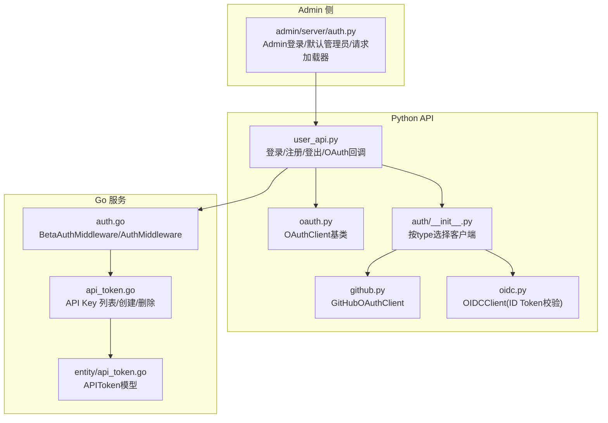
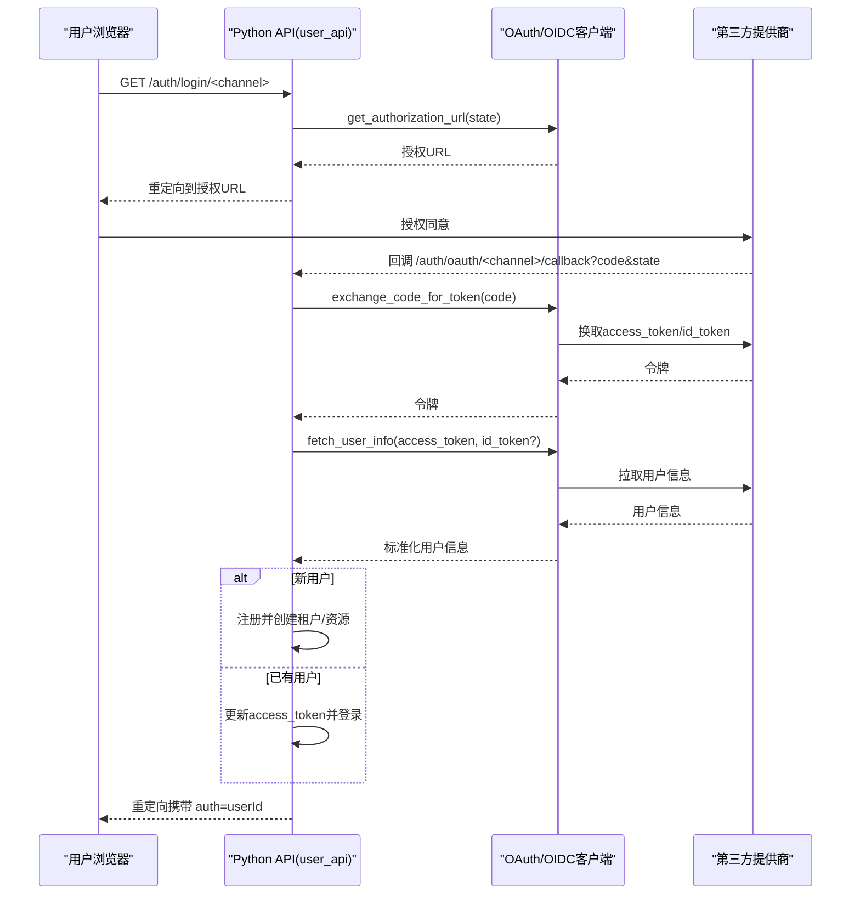
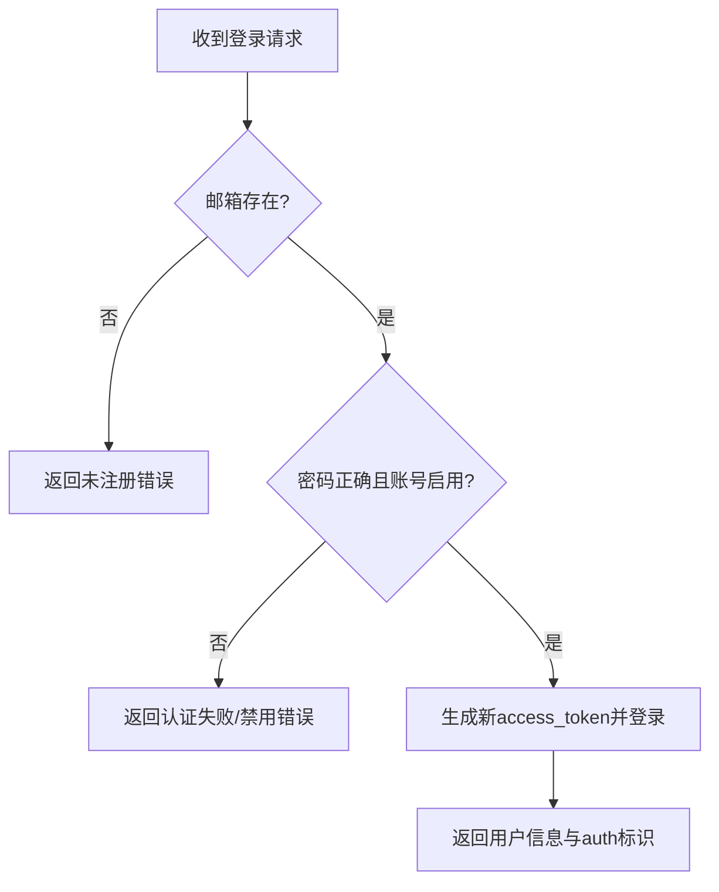
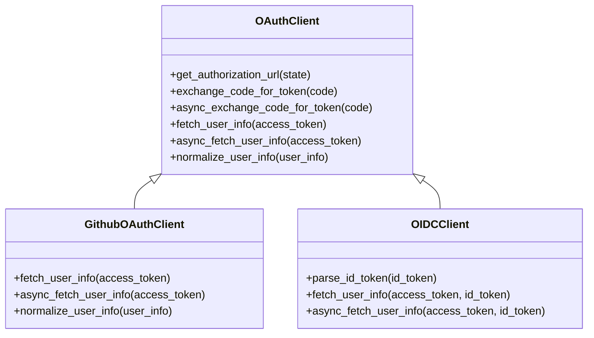
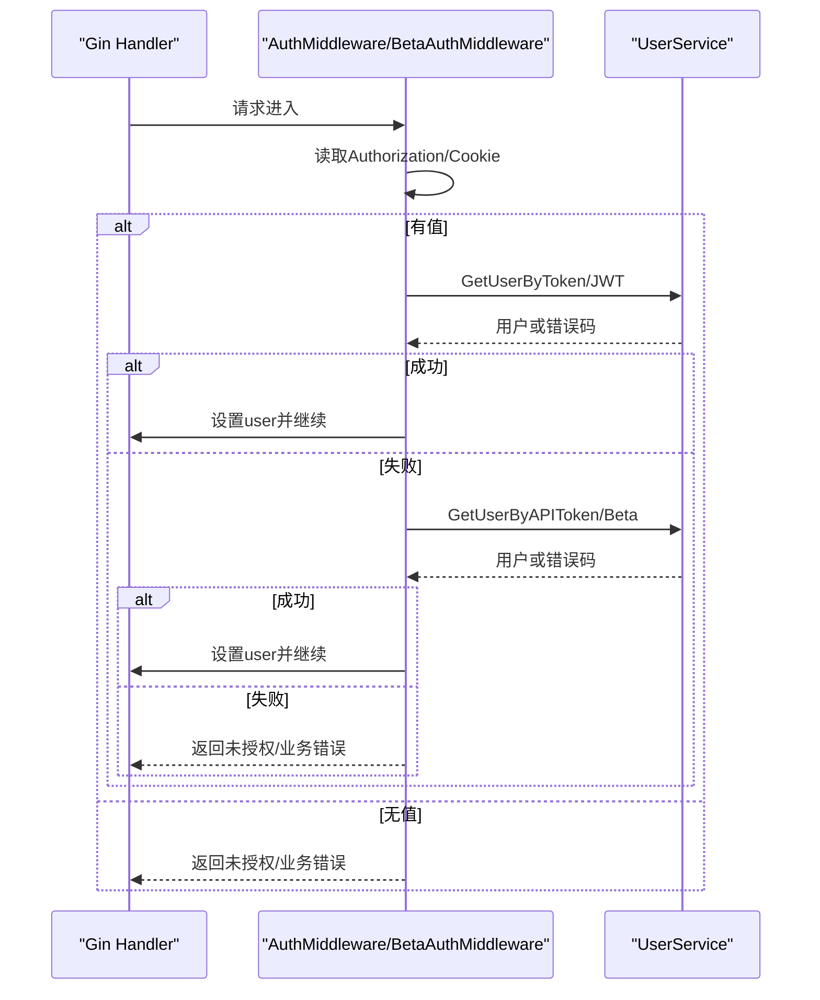
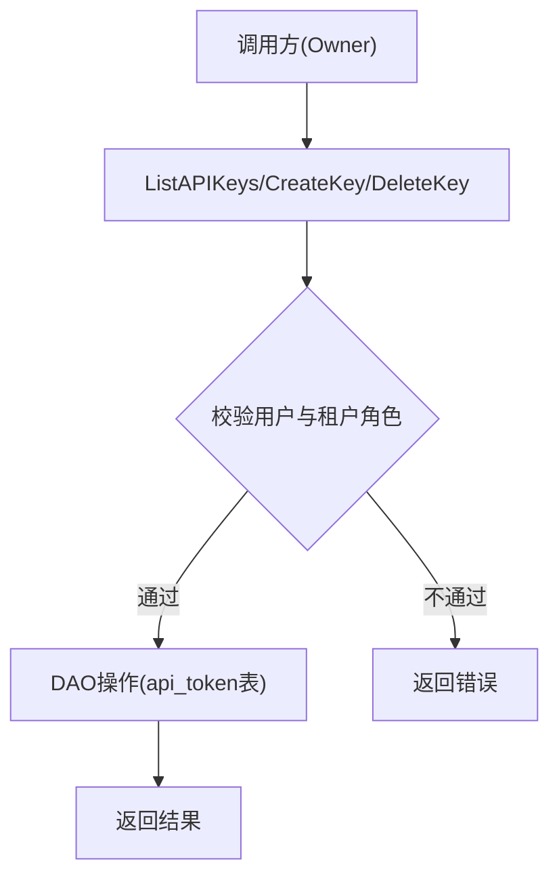
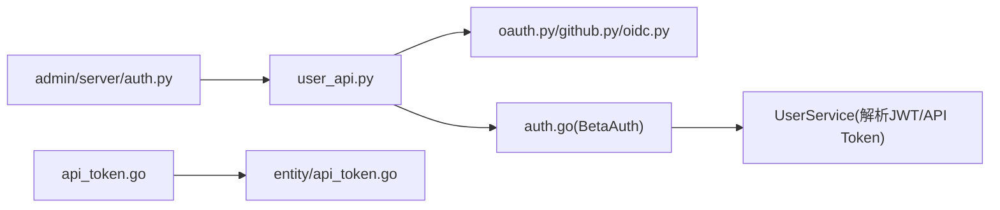

# 认证授权API

<cite>
**本文引用的文件**
- [api/apps/restful_apis/user_api.py](file://api/apps/restful_apis/user_api.py)
- [api/apps/auth/oauth.py](file://api/apps/auth/oauth.py)
- [api/apps/auth/github.py](file://api/apps/auth/github.py)
- [api/apps/auth/oidc.py](file://api/apps/auth/oidc.py)
- [api/apps/auth/__init__.py](file://api/apps/auth/__init__.py)
- [internal/handler/auth.go](file://internal/handler/auth.go)
- [internal/handler/api_token.go](file://internal/handler/api_token.go)
- [internal/entity/api_token.go](file://internal/entity/api_token.go)
- [admin/server/auth.py](file://admin/server/auth.py)
</cite>

## 目录
1. [简介](#简介)
2. [项目结构](#项目结构)
3. [核心组件](#核心组件)
4. [架构总览](#架构总览)
5. [详细组件分析](#详细组件分析)
6. [依赖关系分析](#依赖关系分析)
7. [性能与安全考量](#性能与安全考量)
8. [故障排查指南](#故障排查指南)
9. [结论](#结论)
10. [附录：API端点清单与示例](#附录api端点清单与示例)

## 简介
本文件系统性梳理 RAGFlow 的认证授权能力，覆盖用户登录、注册、登出、OAuth/OIDC 集成、JWT 令牌机制、API Token 管理、多租户隔离与权限控制等。文档面向开发者与运维人员，提供端到端的流程说明、错误处理建议与最佳实践，并给出第三方认证（GitHub、OIDC）的集成要点与常见问题解决方案。

## 项目结构
RAGFlow 的认证相关代码主要分布在以下位置：
- Python 侧对外 REST API：用户登录、注册、登出、OAuth/OIDC 回调、密码找回等
- OAuth/OIDC 客户端抽象与实现：通用 OAuth 流程、GitHub 专用、OIDC 专用（含 ID Token 校验）
- Go 侧鉴权中间件与 API Token 管理：统一解析 Authorization、支持 JWT、API Token、Beta Token
- 管理员侧认证：Admin 面板登录、默认超级管理员初始化、访问令牌加载

图表来源
- [api/apps/restful_apis/user_api.py:63-289](file://api/apps/restful_apis/user_api.py#L63-L289)
- [api/apps/auth/oauth.py:32-142](file://api/apps/auth/oauth.py#L32-L142)
- [api/apps/auth/github.py:21-87](file://api/apps/auth/github.py#L21-L87)
- [api/apps/auth/oidc.py:69-167](file://api/apps/auth/oidc.py#L69-L167)
- [api/apps/auth/__init__.py:17-37](file://api/apps/auth/__init__.py#L17-L37)
- [internal/handler/auth.go:54-163](file://internal/handler/auth.go#L54-L163)
- [internal/handler/api_token.go:32-153](file://internal/handler/api_token.go#L32-L153)
- [internal/entity/api_token.go:19-33](file://internal/entity/api_token.go#L19-L33)
- [admin/server/auth.py:115-167](file://admin/server/auth.py#L115-L167)

章节来源
- [api/apps/restful_apis/user_api.py:63-289](file://api/apps/restful_apis/user_api.py#L63-L289)
- [internal/handler/auth.go:54-163](file://internal/handler/auth.go#L54-L163)
- [admin/server/auth.py:115-167](file://admin/server/auth.py#L115-L167)

## 核心组件
- 用户认证与会话
  - 登录：POST /auth/login，校验邮箱与密码，成功后生成 access_token 并写入会话
  - 登出：POST /auth/logout，失效当前 access_token 并清理会话
  - 用户资料：GET/PATCH /users/me，受保护接口需登录态或有效 API Token
- OAuth/OIDC 集成
  - 获取渠道：GET /auth/login/channels
  - 发起授权：GET /auth/login/<channel>
  - 回调处理：GET /auth/oauth/<channel>/callback，交换 code 为 token，拉取用户信息，自动注册/登录
- API Token 管理（Go 侧）
  - 列出密钥：ListAPIKeys（仅租户 owner）
  - 创建密钥：CreateKey（可选参数）
  - 删除密钥：DeleteKey（仅租户 owner）
- 管理员认证
  - Admin 登录：admin/server/auth.py 中 login_admin，返回 access_token
  - 请求加载器：setup_auth 从 Authorization 头解析并加载用户

章节来源
- [api/apps/restful_apis/user_api.py:63-151](file://api/apps/restful_apis/user_api.py#L63-L151)
- [api/apps/restful_apis/user_api.py:292-325](file://api/apps/restful_apis/user_api.py#L292-L325)
- [api/apps/restful_apis/user_api.py:160-289](file://api/apps/restful_apis/user_api.py#L160-L289)
- [internal/handler/api_token.go:32-153](file://internal/handler/api_token.go#L32-L153)
- [admin/server/auth.py:333-367](file://admin/server/auth.py#L333-L367)

## 架构总览
下图展示一次完整的 OAuth/OIDC 登录流程，包括前端跳转、服务端回调、令牌交换、用户信息拉取与本地账户登录/注册。

图表来源
- [api/apps/restful_apis/user_api.py:181-289](file://api/apps/restful_apis/user_api.py#L181-L289)
- [api/apps/auth/oauth.py:47-103](file://api/apps/auth/oauth.py#L47-L103)
- [api/apps/auth/github.py:36-87](file://api/apps/auth/github.py#L36-L87)
- [api/apps/auth/oidc.py:115-167](file://api/apps/auth/oidc.py#L115-L167)

## 详细组件分析

### 用户登录与注册（Python）
- 登录
  - 路径：POST /auth/login
  - 行为：校验邮箱与密码（密码解密后比对），若成功则生成新的 access_token 并记录登录时间；失败返回未认证错误
  - 安全：对禁用账号进行拦截；记录审计日志
- 注册
  - 路径：POST /users
  - 行为：校验邮箱格式、白名单、唯一性、密码策略；成功后创建用户、租户、根目录等资源，并自动登录
  - 开关：可通过配置项控制是否允许注册
- 登出
  - 路径：POST /auth/logout
  - 行为：将 access_token 标记为无效并清理会话；记录审计日志

图表来源
- [api/apps/restful_apis/user_api.py:63-151](file://api/apps/restful_apis/user_api.py#L63-L151)
- [api/apps/restful_apis/user_api.py:498-606](file://api/apps/restful_apis/user_api.py#L498-L606)
- [api/apps/restful_apis/user_api.py:292-325](file://api/apps/restful_apis/user_api.py#L292-L325)

章节来源
- [api/apps/restful_apis/user_api.py:63-151](file://api/apps/restful_apis/user_api.py#L63-L151)
- [api/apps/restful_apis/user_api.py:498-606](file://api/apps/restful_apis/user_api.py#L498-L606)
- [api/apps/restful_apis/user_api.py:292-325](file://api/apps/restful_apis/user_api.py#L292-L325)

### OAuth/OIDC 客户端与回调
- 客户端抽象
  - OAuthClient：封装授权 URL 生成、code 换 token、拉取用户信息、标准化 UserInfo
  - GithubOAuthClient：针对 GitHub 的用户信息拉取与邮箱获取
  - OIDCClient：从 issuer 发现元数据，严格限制 ID Token 签名算法，使用 JWKS 验证 ID Token
- 回调流程
  - 校验 state 防 CSRF
  - 用 code 换取 access_token（可选 id_token）
  - 拉取用户信息，若不存在且允许注册则自动创建账户并登录

图表来源
- [api/apps/auth/oauth.py:21-142](file://api/apps/auth/oauth.py#L21-L142)
- [api/apps/auth/github.py:21-87](file://api/apps/auth/github.py#L21-L87)
- [api/apps/auth/oidc.py:69-167](file://api/apps/auth/oidc.py#L69-L167)

章节来源
- [api/apps/auth/oauth.py:32-142](file://api/apps/auth/oauth.py#L32-L142)
- [api/apps/auth/github.py:21-87](file://api/apps/auth/github.py#L21-L87)
- [api/apps/auth/oidc.py:69-167](file://api/apps/auth/oidc.py#L69-L167)
- [api/apps/auth/__init__.py:17-37](file://api/apps/auth/__init__.py#L17-L37)
- [api/apps/restful_apis/user_api.py:160-289](file://api/apps/restful_apis/user_api.py#L160-L289)

### JWT 令牌机制与中间件（Go）
- 中间件优先级
  - BetaAuthMiddleware：优先尝试 Beta API Token，其次 JWT（常规会话），再次普通 API Token；任一成功即设置 user 上下文
  - AuthMiddleware：先尝试 JWT，再尝试 API Token；拒绝超级管理员访问特定 URL；检查许可证状态
- 令牌来源
  - Authorization 头（可带或不带 Bearer 前缀，内部会处理）
  - Cookie（当 Authorization 为空时回退读取）
- 上下文注入
  - 成功解析后将 user、user_id、email、auth_via_api_token 等放入 gin.Context

图表来源
- [internal/handler/auth.go:54-163](file://internal/handler/auth.go#L54-L163)

章节来源
- [internal/handler/auth.go:54-163](file://internal/handler/auth.go#L54-L163)

### API Token 管理（Go）
- 能力
  - 列出密钥：仅租户 owner 可查
  - 创建密钥：支持可选参数（如 dialog_id/source/beta）
  - 删除密钥：仅租户 owner 可删
- 数据模型
  - APIToken：包含 tenant_id、token、dialog_id、source、beta 等字段

图表来源
- [internal/handler/api_token.go:32-153](file://internal/handler/api_token.go#L32-L153)
- [internal/entity/api_token.go:19-33](file://internal/entity/api_token.go#L19-L33)

章节来源
- [internal/handler/api_token.go:32-153](file://internal/handler/api_token.go#L32-L153)
- [internal/entity/api_token.go:19-33](file://internal/entity/api_token.go#L19-L33)

### 多租户与权限控制
- 多租户
  - 注册/OAuth 回调会为每个用户创建独立租户及根目录等资源
  - API Token 与租户绑定，用于跨服务/机器人场景的细粒度访问
- 权限
  - Admin 登录需超级管理员身份，并对写操作记录审计日志
  - 部分接口限制仅 Owner 可管理 API Token
  - 中间件禁止超级管理员访问某些 URL，避免越权

章节来源
- [api/apps/restful_apis/user_api.py:457-495](file://api/apps/restful_apis/user_api.py#L457-L495)
- [internal/handler/api_token.go:46-92](file://internal/handler/api_token.go#L46-L92)
- [admin/server/auth.py:306-329](file://admin/server/auth.py#L306-L329)
- [internal/handler/auth.go:116-163](file://internal/handler/auth.go#L116-L163)

## 依赖关系分析
- Python 层
  - user_api.py 依赖 OAuth/OIDC 客户端以完成第三方登录
  - OAuth 客户端依赖 HTTP 客户端与 JWT（OIDC）库
- Go 层
  - 中间件依赖 UserService 解析各类令牌
  - API Token 处理器依赖 DAO 与实体模型
- Admin 层
  - 基于 Flask-Login 的请求加载器，从 Authorization 头解析 access_token 并加载用户

图表来源
- [api/apps/restful_apis/user_api.py:160-289](file://api/apps/restful_apis/user_api.py#L160-L289)
- [internal/handler/auth.go:54-163](file://internal/handler/auth.go#L54-L163)
- [internal/handler/api_token.go:32-153](file://internal/handler/api_token.go#L32-L153)
- [internal/entity/api_token.go:19-33](file://internal/entity/api_token.go#L19-L33)
- [admin/server/auth.py:115-167](file://admin/server/auth.py#L115-L167)

章节来源
- [api/apps/restful_apis/user_api.py:160-289](file://api/apps/restful_apis/user_api.py#L160-L289)
- [internal/handler/auth.go:54-163](file://internal/handler/auth.go#L54-L163)
- [internal/handler/api_token.go:32-153](file://internal/handler/api_token.go#L32-L153)
- [admin/server/auth.py:115-167](file://admin/server/auth.py#L115-L167)

## 性能与安全考量
- 性能
  - OAuth 回调中使用异步方法优先（如 async_exchange_code_for_token、async_fetch_user_info），降低阻塞
  - 合理设置 HTTP 超时，避免外部依赖拖慢整体响应
- 安全
  - OIDC ID Token 校验采用严格算法白名单，并从可信元数据推导，防止算法混淆攻击
  - 使用 JWKS 动态获取公钥，避免硬编码密钥
  - 登录/注册/登出均记录审计日志，便于追踪
  - 管理员登录密码传输加密，失败时返回通用错误，避免泄露信息
  - API Token 与租户绑定，最小权限原则

章节来源
- [api/apps/auth/oidc.py:22-67](file://api/apps/auth/oidc.py#L22-L67)
- [api/apps/auth/oidc.py:115-146](file://api/apps/auth/oidc.py#L115-L146)
- [api/apps/restful_apis/user_api.py:134-144](file://api/apps/restful_apis/user_api.py#L134-L144)
- [admin/server/auth.py:333-367](file://admin/server/auth.py#L333-L367)

## 故障排查指南
- 常见错误
  - 未注册邮箱：登录失败，提示邮箱未注册
  - 密码错误/解密失败：返回认证错误或服务器错误
  - 账号被禁用：登录被拒，提示联系管理员
  - OAuth state 不匹配：回调被拒绝，提示 invalid_state
  - 缺少 code：回调被拒绝，提示 missing_code
  - 无法获取 access_token：回调被拒绝，提示 token_failed
  - 邮箱缺失：回调被拒绝，提示 email_missing
  - 非白名单邮箱：注册/自动注册被拒
  - 未授权：API 调用缺少有效 Authorization 头或令牌无效
- 定位建议
  - 检查 OAuth 配置是否正确（client_id、secret、redirect_uri、scope）
  - 确认 OIDC issuer 与 JWKS 可达
  - 核对 API Token 所属租户与角色权限
  - 查看服务端日志中的异常堆栈与审计记录

章节来源
- [api/apps/restful_apis/user_api.py:94-151](file://api/apps/restful_apis/user_api.py#L94-L151)
- [api/apps/restful_apis/user_api.py:195-289](file://api/apps/restful_apis/user_api.py#L195-L289)
- [internal/handler/auth.go:71-113](file://internal/handler/auth.go#L71-L113)

## 结论
RAGFlow 的认证授权体系以 Python 侧的 REST API 为核心，结合 Go 侧的统一鉴权中间件，实现了灵活的登录方式（本地、OAuth、OIDC）、健壮的令牌机制（JWT、API Token、Beta Token）以及完善的多租户与权限控制。通过严格的 OIDC 校验、审计日志与错误处理，系统在生产环境中具备较高的安全性与可维护性。

## 附录：API端点清单与示例
以下为认证相关的主要端点与行为摘要（具体请求体/响应体请参考各端点注释与返回值）：
- 用户认证
  - POST /auth/login：登录，返回用户信息与 auth 标识
  - POST /auth/logout：登出，失效当前 access_token
  - GET /users/me：获取当前用户资料
  - PATCH /users/me：更新用户资料（含密码修改）
- 第三方认证
  - GET /auth/login/channels：获取支持的认证渠道
  - GET /auth/login/<channel>：发起授权跳转
  - GET /auth/oauth/<channel>/callback：回调处理，自动注册/登录
- API Token（Go）
  - ListAPIKeys：列出当前租户的 API Keys（仅 owner）
  - CreateKey：创建 API Key（可选参数）
  - DeleteKey：删除指定 API Key（仅 owner）
- 管理员
  - admin/server/auth.py：提供管理员登录与默认管理员初始化逻辑

章节来源
- [api/apps/restful_apis/user_api.py:63-151](file://api/apps/restful_apis/user_api.py#L63-L151)
- [api/apps/restful_apis/user_api.py:160-289](file://api/apps/restful_apis/user_api.py#L160-L289)
- [api/apps/restful_apis/user_api.py:292-437](file://api/apps/restful_apis/user_api.py#L292-L437)
- [internal/handler/api_token.go:32-153](file://internal/handler/api_token.go#L32-L153)
- [admin/server/auth.py:333-367](file://admin/server/auth.py#L333-L367)