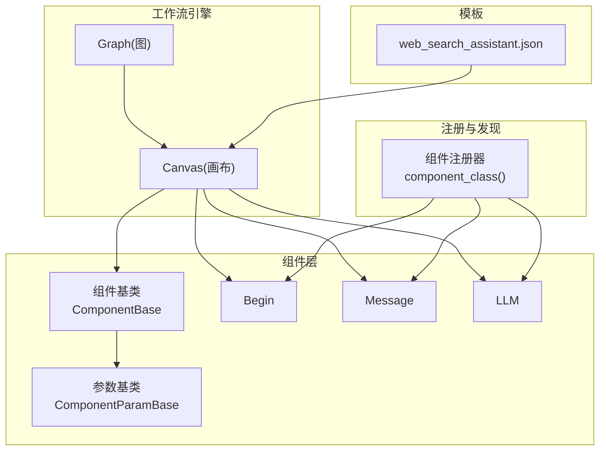
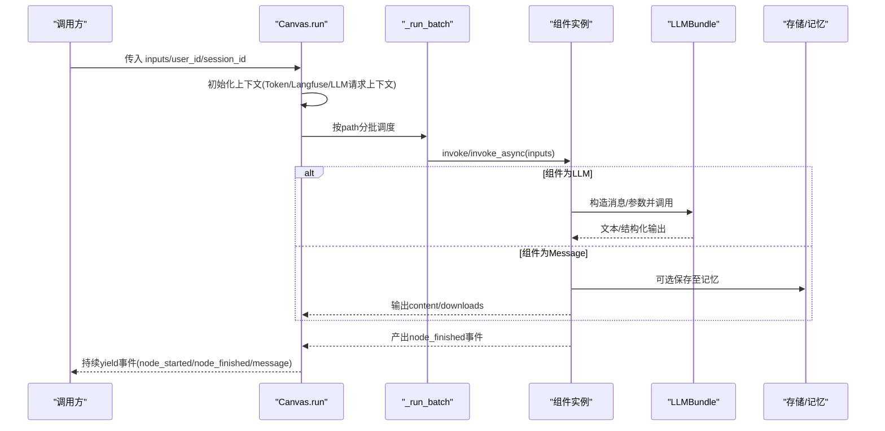
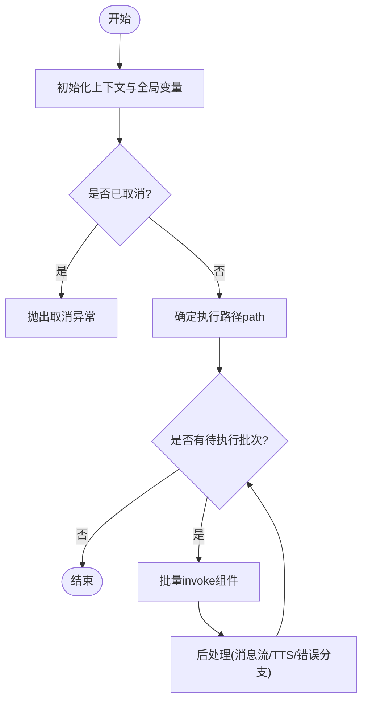
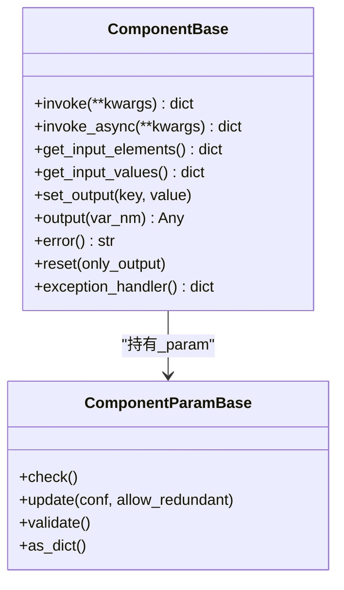
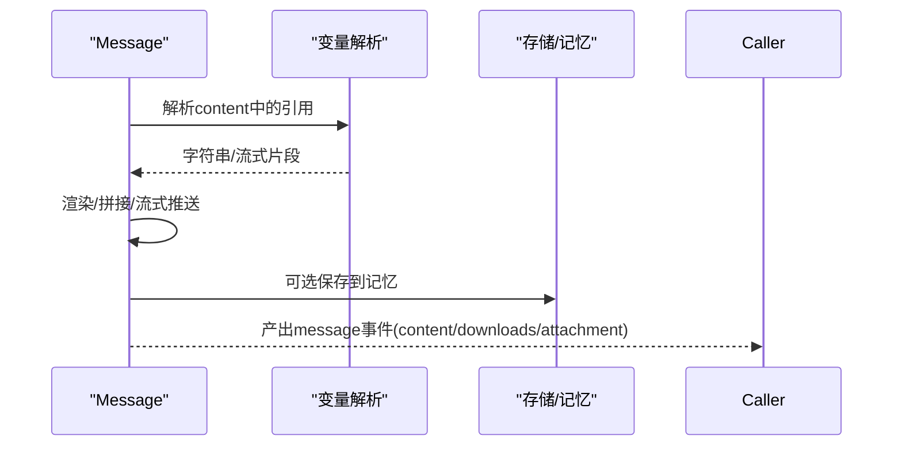
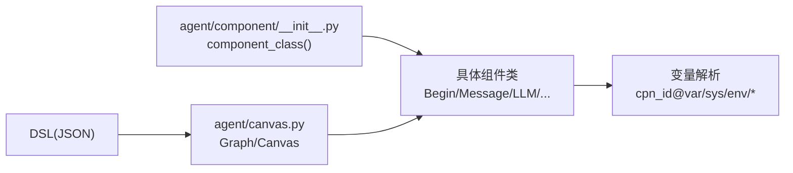

# Agent工作流系统

<cite>
**本文引用的文件**
- [agent/canvas.py](file://agent/canvas.py)
- [agent/component/base.py](file://agent/component/base.py)
- [agent/component/__init__.py](file://agent/component/__init__.py)
- [agent/component/begin.py](file://agent/component/begin.py)
- [agent/component/message.py](file://agent/component/message.py)
- [agent/component/llm.py](file://agent/component/llm.py)
- [agent/settings.py](file://agent/settings.py)
- [agent/templates/web_search_assistant.json](file://agent/templates/web_search_assistant.json)
</cite>

## 目录
1. [简介](#简介)
2. [项目结构](#项目结构)
3. [核心组件](#核心组件)
4. [架构总览](#架构总览)
5. [详细组件分析](#详细组件分析)
6. [依赖关系分析](#依赖关系分析)
7. [性能与并发](#性能与并发)
8. [调试、测试与部署](#调试测试与部署)
9. [自定义组件开发指南](#自定义组件开发指南)
10. [故障诊断与排错](#故障诊断与排错)
11. [结论](#结论)

## 简介
本文件系统性地梳理并文档化 RAGFlow 中的 Agent 工作流编排引擎。该引擎以“图（Graph）+ 节点（Component）”的方式描述 AI 代理的工作流程，支持 LLM 调用、工具调用、代码执行、条件分支、循环迭代等能力；提供可视化 DSL 模板、运行时事件流、变量解析、错误处理与可观测性（Token 用量、Langfuse 关联上下文）。本文面向开发者与使用者，覆盖从概念到实现、从使用到扩展的全链路说明。

## 项目结构
Agent 工作流的核心由以下模块构成：
- 工作流图与画布：负责加载 DSL、构建组件实例、维护全局变量与执行路径、调度执行与事件输出。
- 组件基类与参数校验：统一输入/输出模型、模板变量解析、异常处理、超时控制、并发限制。
- 内置组件：Begin、Message、LLM 等，以及通过动态导入机制注册的更多组件。
- 模板示例：JSON 格式的 DSL 模板，便于快速复用和二次定制。

图表来源
- [agent/canvas.py:49-124](file://agent/canvas.py#L49-L124)
- [agent/component/base.py:56-379](file://agent/component/base.py#L56-L379)
- [agent/component/__init__.py:26-60](file://agent/component/__init__.py#L26-L60)
- [agent/templates/web_search_assistant.json:14-305](file://agent/templates/web_search_assistant.json#L14-L305)

章节来源
- [agent/canvas.py:49-124](file://agent/canvas.py#L49-L124)
- [agent/component/base.py:56-379](file://agent/component/base.py#L56-L379)
- [agent/component/__init__.py:26-60](file://agent/component/__init__.py#L26-L60)
- [agent/templates/web_search_assistant.json:14-305](file://agent/templates/web_search_assistant.json#L14-L305)

## 核心组件
- Graph：工作流图的抽象，负责解析 DSL、创建组件对象、维护 path/upstream/downstream、变量读写、取消任务、序列化等。
- Canvas：继承自 Graph，增加全局变量 globals、会话历史 history、检索结果 retrieval、记忆 memory、运行期 Token 统计、异步 run 流程与事件流。
- ComponentBase：所有组件的基类，定义统一的 invoke/invoke_async、输入/输出、模板变量解析、异常处理、超时、并发信号量等。
- ComponentParamBase：参数校验与更新、废弃参数兼容、验证规则、类型检查工具方法。
- 组件注册器：自动扫描 agent.component 包下的组件类，并通过 component_class(name) 动态查找与实例化。

关键职责与交互
- Canvas.run 启动一次工作流执行，设置上下文（Token 用量、Langfuse 属性、LLM 请求上下文），按 path 顺序批量调度组件，产出 node_started/node_finished/message 等事件。
- 组件通过 get_input_elements 声明输入字段，支持引用 cpn_id@var、sys.*、env.* 及迭代别名 item/index/result。
- 异常时可通过 exception_method/exception_goto/exception_default_value 进行跳转或默认值回填。

章节来源
- [agent/canvas.py:49-124](file://agent/canvas.py#L49-L124)
- [agent/canvas.py:331-470](file://agent/canvas.py#L331-L470)
- [agent/canvas.py:472-800](file://agent/canvas.py#L472-L800)
- [agent/component/base.py:56-379](file://agent/component/base.py#L56-L379)
- [agent/component/base.py:369-679](file://agent/component/base.py#L369-L679)
- [agent/component/__init__.py:26-60](file://agent/component/__init__.py#L26-L60)

## 架构总览
下图展示了一次工作流执行的端到端时序：客户端触发 Canvas.run，引擎按路径批量调度组件，组件内部可能调用 LLM、外部工具或进行消息输出，最终向调用方返回事件流。

图表来源
- [agent/canvas.py:431-470](file://agent/canvas.py#L431-L470)
- [agent/canvas.py:548-654](file://agent/canvas.py#L548-L654)
- [agent/component/llm.py:96-164](file://agent/component/llm.py#L96-L164)
- [agent/component/message.py:283-316](file://agent/component/message.py#L283-L316)

## 详细组件分析

### 工作流图与画布（Graph/Canvas）
- DSL 加载与校验：Graph.load 将 DSL 中 components 映射为真实组件实例，并对每个组件参数进行校验。
- 变量体系：Canvas 维护 globals（如 sys.query、sys.user_id、sys.conversation_turns、sys.files、sys.history、sys.date）与 variables，支持 cpn_id@var、sys.*、env.* 引用与嵌套取值。
- 执行流程：Canvas._run_impl 组装输入、重置已执行节点、按 path 分段批量执行，期间持续产出事件；对 Message 节点支持流式内容与自动 TTS 播放。
- 取消与恢复：支持 is_canceled/cancel_task，并在批执行前检查；支持 resume 模式（当 path 非空且起始于 UserFillUp 时）。

图表来源
- [agent/canvas.py:431-470](file://agent/canvas.py#L431-L470)
- [agent/canvas.py:472-654](file://agent/canvas.py#L472-L654)
- [agent/canvas.py:654-800](file://agent/canvas.py#L654-L800)

章节来源
- [agent/canvas.py:49-124](file://agent/canvas.py#L49-L124)
- [agent/canvas.py:331-470](file://agent/canvas.py#L331-L470)
- [agent/canvas.py:472-800](file://agent/canvas.py#L472-L800)

### 组件基类与参数（ComponentBase/ComponentParamBase）
- 参数校验：ComponentParamBase 提供丰富的类型与范围校验方法，支持 JSON 驱动的校验规则与递归更新。
- 输入解析：ComponentBase.get_input_elements/get_input_values 支持模板变量替换与迭代别名解析，统一注入到组件输入。
- 执行包装：invoke/invoke_async 统一计时、异常捕获、错误输出、超时控制（环境变量 COMPONENT_EXEC_TIMEOUT）、并发限制（MAX_CONCURRENT_CHATS）。
- 异常策略：支持 exception_method/exception_goto/exception_default_value，可在失败时跳转到指定节点或返回默认值。

图表来源
- [agent/component/base.py:56-379](file://agent/component/base.py#L56-L379)
- [agent/component/base.py:369-679](file://agent/component/base.py#L369-L679)

章节来源
- [agent/component/base.py:56-379](file://agent/component/base.py#L56-L379)
- [agent/component/base.py:369-679](file://agent/component/base.py#L369-L679)

### 开始节点（Begin）
- 作用：作为工作流的入口，合并运行时 inputs 与系统变量（如 sys.query），将输入写入各输出端口，供下游节点消费。
- 模式：支持 conversational/task/Webhook 三种模式，Webhook 模式下可将 payload 注入 begin 的输出。

章节来源
- [agent/component/begin.py:19-71](file://agent/component/begin.py#L19-L71)
- [agent/canvas.py:492-507](file://agent/canvas.py#L492-L507)

### 消息节点（Message）
- 作用：将上游数据渲染为最终回复内容，支持流式输出、Jinja2 模板、下载附件、输出格式转换（markdown/html/pdf/docx/xlsx）、记忆保存。
- 流式处理：若 content 包含变量引用且为 partial/异步生成器，则逐段推送 message 事件；支持自动 TTS 播放（需配置 TTS 模型）。
- 输出格式：根据 output_format 将内容转换为不同格式并上传存储，同时产出 attachment 信息。

图表来源
- [agent/component/message.py:153-316](file://agent/component/message.py#L153-L316)
- [agent/component/message.py:415-587](file://agent/component/message.py#L415-L587)
- [agent/component/message.py:588-602](file://agent/component/message.py#L588-L602)

章节来源
- [agent/component/message.py:54-316](file://agent/component/message.py#L54-L316)
- [agent/component/message.py:415-587](file://agent/component/message.py#L415-L587)
- [agent/component/message.py:588-602](file://agent/component/message.py#L588-L602)

### LLM 组件
- 作用：封装大模型调用，支持系统提示词、用户提示词、消息历史裁剪、图片提取、结构化输出、引用标注等。
- 参数：温度、Top-P、惩罚项、最大 token、重试次数、思考模式等；可从租户默认模型解析出 chat 类型配置。
- 上下文：在 Canvas.run 设置的 LLM 请求上下文（session_id、user_id）会透传到上游 LLM 提供商。

章节来源
- [agent/component/llm.py:40-164](file://agent/component/llm.py#L40-L164)
- [agent/canvas.py:431-470](file://agent/canvas.py#L431-L470)

### 模板示例（网页搜索助手）
- 结构：包含多个 Agent、Retrieval、Message、Begin 节点，通过 edges/nodes 描述拓扑；Agent 节点内可挂载工具（如 TavilySearch、Google、Bing、Wikipedia 等）。
- 用法：可直接作为 DSL 载入 Canvas，修改 prompts/tools/dataset_ids 等参数即可复用。

章节来源
- [agent/templates/web_search_assistant.json:14-305](file://agent/templates/web_search_assistant.json#L14-L305)
- [agent/templates/web_search_assistant.json:312-800](file://agent/templates/web_search_assistant.json#L312-L800)

## 依赖关系分析
- 组件注册：通过 agent/component/__init__.py 的动态导入与提取，将所有公开组件类暴露给 component_class(name) 查询，支持跨包（agent.component、agent.tools、rag.flow）查找。
- 组件与画布：Canvas 在 load 阶段根据 DSL 中的 component_name 动态实例化组件，并注入 canvas、id、param。
- 变量引用：组件输入支持 cpn_id@var、sys.*、env.* 与迭代别名，统一由 Base 层的正则与解析逻辑处理。

图表来源
- [agent/component/__init__.py:26-60](file://agent/component/__init__.py#L26-L60)
- [agent/canvas.py:90-124](file://agent/canvas.py#L90-L124)
- [agent/component/base.py:369-379](file://agent/component/base.py#L369-L379)

章节来源
- [agent/component/__init__.py:26-60](file://agent/component/__init__.py#L26-L60)
- [agent/canvas.py:90-124](file://agent/canvas.py#L90-L124)
- [agent/component/base.py:369-379](file://agent/component/base.py#L369-L379)

## 性能与并发
- 并发控制：
  - 全局并发：ComponentBase.thread_limiter 基于 MAX_CONCURRENT_CHATS 环境变量限制并发聊天数。
  - 批执行并发：Canvas._run_batch 使用 asyncio.Semaphore(max_workers=线程池大小)，默认 5，控制同批组件的并发度。
- 超时保护：组件执行受 COMPONENT_EXEC_TIMEOUT 环境变量保护，避免长时间阻塞。
- 资源清理：Canvas.close 会关闭 MCP 工具会话；Canvas.reset 清理 Redis 日志与取消标记。
- 可观测性：每次 run 设置独立的 token_usage_sink 与 Langfuse 属性，确保跨组件统计准确且不泄漏。

章节来源
- [agent/component/base.py:369-379](file://agent/component/base.py#L369-L379)
- [agent/canvas.py:170-185](file://agent/canvas.py#L170-L185)
- [agent/canvas.py:431-470](file://agent/canvas.py#L431-L470)
- [agent/canvas.py:548-609](file://agent/canvas.py#L548-L609)

## 调试、测试与部署
- 调试
  - 单组件调试：使用组件的 debug 方法直接执行 _invoke，结合 get_input_values/debug_inputs 查看输入输出。
  - 工作流调试：通过 Canvas.__str__ 序列化当前图状态，观察 path、components、globals 等。
  - 事件追踪：Canvas.run 产出的 node_started/node_finished/message 事件可用于前端实时展示与问题定位。
- 测试
  - 模板驱动：使用 agent/templates/*.json 作为最小可运行用例，逐步替换参数验证行为。
  - 断言要点：关注输出 content、downloads、attachment、错误分支跳转是否正确。
- 部署
  - 环境变量：MAX_CONCURRENT_CHATS、COMPONENT_EXEC_TIMEOUT、FLOAT_ZERO、PARAM_MAXDEPTH 等影响并发与校验深度。
  - 服务集成：Canvas 可与上层 API/通道集成，通过 webhook_payload 注入 Webhook 模式的 Begin 输入。

章节来源
- [agent/component/base.py:602-603](file://agent/component/base.py#L602-L603)
- [agent/canvas.py:126-158](file://agent/canvas.py#L126-L158)
- [agent/canvas.py:492-507](file://agent/canvas.py#L492-L507)
- [agent/settings.py:17-19](file://agent/settings.py#L17-L19)

## 自定义组件开发指南
- 接口规范
  - 继承 ComponentParamBase 定义参数类，实现 check() 完成参数校验。
  - 继承 ComponentBase 实现组件类，至少实现 _invoke（同步）或 _invoke_async（异步），并通过 set_output 写出结果。
  - 可选实现 get_input_form/get_input_elements 以声明 UI 表单与输入字段。
- 注册机制
  - 将组件类放入 agent/component 包下（或 agent.tools、rag.flow），组件名需与 DSL 中 component_name 一致。
  - 通过 component_class(name) 动态查找，无需手动注册。
- 生命周期管理
  - 初始化：Canvas 在 load 阶段创建组件实例并注入 canvas、id、param。
  - 执行：Canvas 按 path 调用 invoke/invoke_async，统一计时与异常处理。
  - 清理：Canvas.close 会尝试关闭组件持有的 MCP 会话等资源。
- 最佳实践
  - 使用 string_format 与 get_input_elements_from_text 解析模板变量。
  - 合理设置 exception_method/exception_goto/exception_default_value 提升鲁棒性。
  - 注意并发与超时，避免长耗时阻塞；必要时拆分组件或使用异步。

章节来源
- [agent/component/base.py:56-379](file://agent/component/base.py#L56-L379)
- [agent/component/base.py:369-679](file://agent/component/base.py#L369-L679)
- [agent/component/__init__.py:26-60](file://agent/component/__init__.py#L26-L60)
- [agent/canvas.py:90-124](file://agent/canvas.py#L90-L124)
- [agent/canvas.py:170-185](file://agent/canvas.py#L170-L185)

## 故障诊断与排错
- 常见问题
  - 变量未解析：检查 cpn_id@var 是否存在、路径是否正确；确认上游组件已输出对应键。
  - 组件报错：查看 node_finished 事件中的 error 字段；必要时启用 exception_default_value 降级。
  - 任务被取消：is_canceled 检查失败时会提前终止；可通过 cancel_task 主动取消。
  - 模板渲染失败：Message 的 Jinja2 渲染异常会回退到原始内容；检查变量是否为 None。
- 诊断手段
  - 事件流：通过 node_started/node_finished 的 elapsed_time、inputs、outputs 定位瓶颈与错误。
  - 序列化图：Canvas.__str__ 输出当前图状态，辅助比对期望与实际。
  - 日志：组件层与 Canvas 层均有丰富日志，关注 “[Canvas]” 与 “_logger” 输出。

章节来源
- [agent/canvas.py:548-654](file://agent/canvas.py#L548-L654)
- [agent/canvas.py:654-800](file://agent/canvas.py#L654-L800)
- [agent/component/base.py:416-456](file://agent/component/base.py#L416-L456)
- [agent/component/message.py:283-316](file://agent/component/message.py#L283-L316)

## 结论
RAGFlow 的 Agent 工作流系统以“图+组件”的清晰抽象实现了高可扩展的 AI 代理编排能力。通过统一的参数校验、变量解析、异常处理、并发与超时控制，以及丰富的内置组件与模板，用户可以快速搭建复杂的多步骤 AI 工作流。配合事件流与可观测性，开发与运维效率显著提升；而开放的组件注册机制与清晰的接口规范，使得二次扩展变得简单可靠。