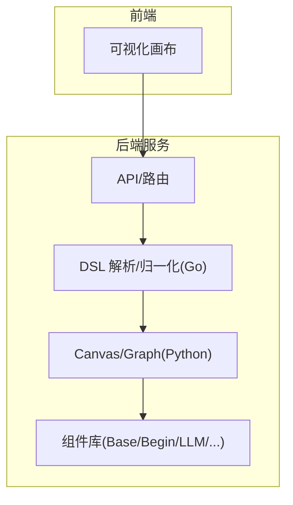
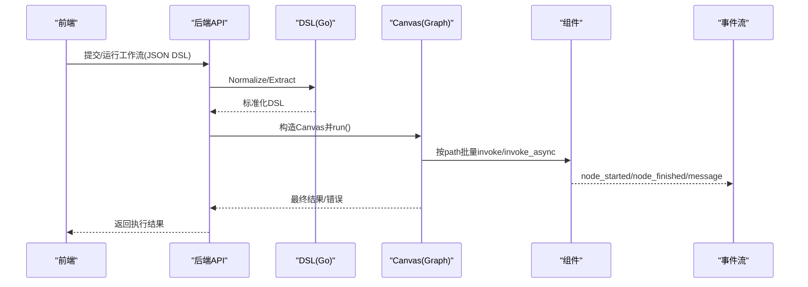
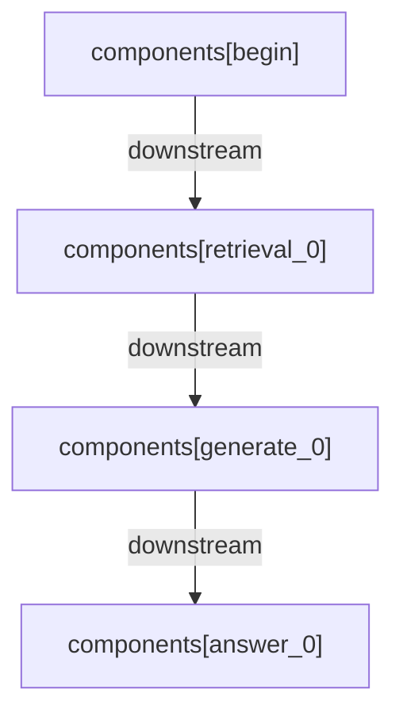
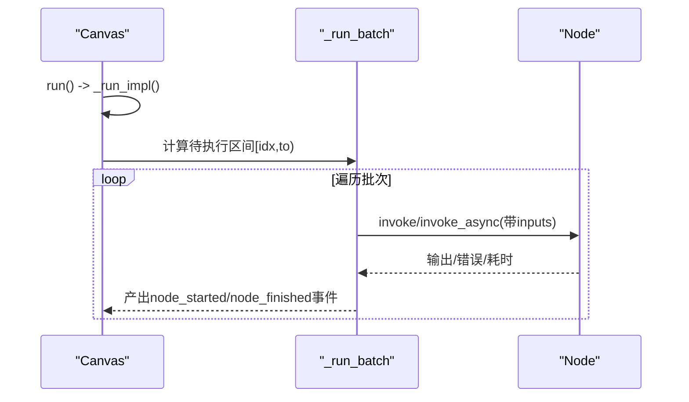
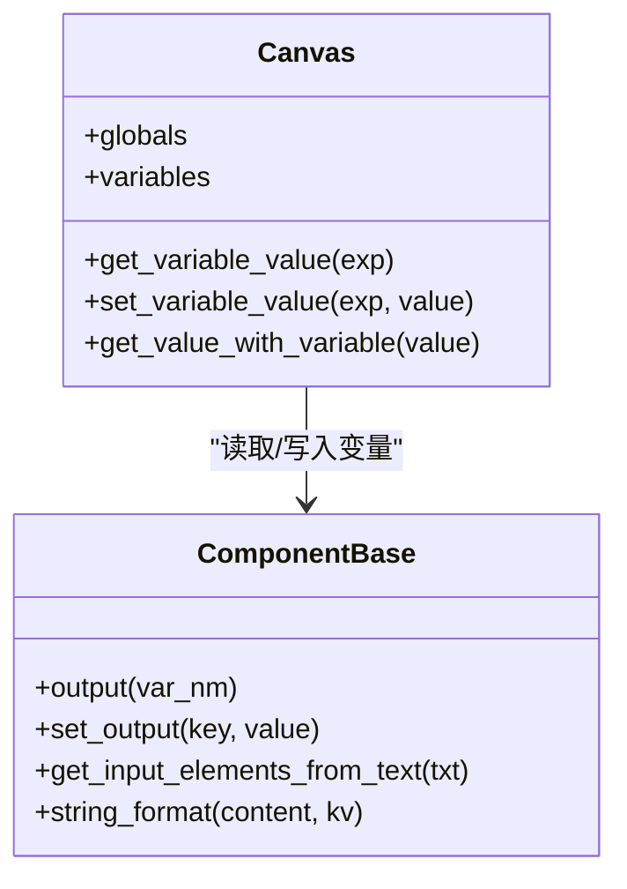
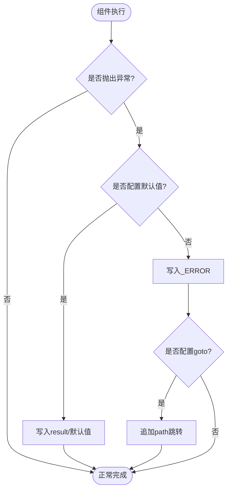
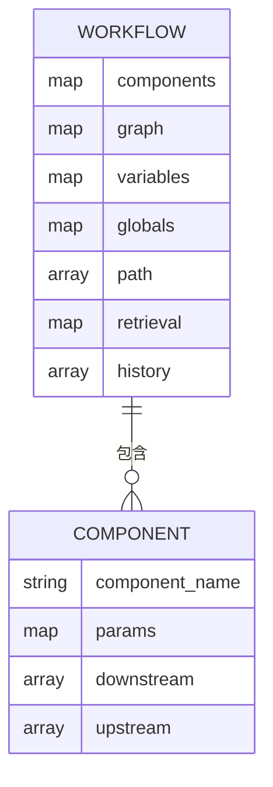
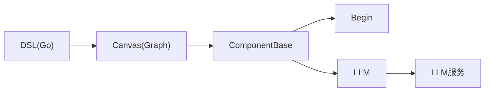

# 工作流编排引擎

<cite>
**本文引用的文件**
- [agent/canvas.py](file://agent/canvas.py)
- [agent/component/base.py](file://agent/component/base.py)
- [agent/component/begin.py](file://agent/component/begin.py)
- [agent/component/llm.py](file://agent/component/llm.py)
- [internal/agent/dsl/extract.go](file://internal/agent/dsl/extract.go)
- [internal/agent/dsl/normalize.go](file://internal/agent/dsl/normalize.go)
- [agent/templates/deep_research.json](file://agent/templates/deep_research.json)
</cite>

## 目录
1. [简介](#简介)
2. [项目结构](#项目结构)
3. [核心组件](#核心组件)
4. [架构总览](#架构总览)
5. [详细组件分析](#详细组件分析)
6. [依赖关系分析](#依赖关系分析)
7. [性能考量](#性能考量)
8. [故障排查指南](#故障排查指南)
9. [结论](#结论)
10. [附录](#附录)

## 简介
本文件面向“可视化工作流编排引擎”的设计与实现，系统阐述节点定义、连接规则、执行顺序控制、DSL（JSON）语法与结构、编译验证优化、执行流程、状态管理（变量作用域、数据传递、错误处理）、调试工具（执行跟踪、断点调试、性能分析），以及复杂工作流的设计模式与最佳实践。该引擎以 Canvas/Graph 为核心，结合 Python 运行时与 Go DSL 规范化模块，提供从前端可视化到后端执行的完整闭环。

## 项目结构
工作流编排引擎由以下关键部分组成：
- 运行时编排：Python 侧的 Graph/Canvas 负责加载 DSL、实例化组件、调度执行、维护全局状态与事件流。
- 组件体系：基于 ComponentBase 的统一抽象，支持同步/异步执行、输入输出、模板引用解析、异常处理等。
- DSL 规范与转换：Go 侧 dsl 包提供对 JSON DSL 的提取、归一化、兼容层处理，确保前后端一致性与可渲染性。
- 示例与工作流模板：templates 下的 JSON 文件展示了真实工作流的 DSL 结构与节点组织方式。

图表来源
- [internal/agent/dsl/normalize.go:1-120](file://internal/agent/dsl/normalize.go#L1-L120)
- [agent/canvas.py:90-110](file://agent/canvas.py#L90-L110)

章节来源
- [agent/canvas.py:90-110](file://agent/canvas.py#L90-L110)
- [internal/agent/dsl/normalize.go:1-120](file://internal/agent/dsl/normalize.go#L1-L120)

## 核心组件
- Graph：DSL 的内存表示与生命周期管理，负责组件实例化、参数校验、路径维护、变量读写、任务取消等。
- Canvas：继承 Graph，扩展全局变量 globals、历史 history、检索结果 retrieval、记忆 memory，并提供 run() 异步执行入口。
- ComponentBase：所有节点的基类，统一输入/输出、模板引用解析、异常处理、超时与并发控制、调试输入等。
- Begin/LLM 等具体组件：实现业务逻辑，如开始节点注入输入、LLM 节点组装提示词并调用模型。

章节来源
- [agent/canvas.py:49-110](file://agent/canvas.py#L49-L110)
- [agent/canvas.py:331-375](file://agent/canvas.py#L331-L375)
- [agent/component/base.py:369-456](file://agent/component/base.py#L369-L456)
- [agent/component/begin.py:19-71](file://agent/component/begin.py#L19-L71)
- [agent/component/llm.py:40-105](file://agent/component/llm.py#L40-L105)

## 架构总览
下图展示从 DSL 到执行的关键路径：前端保存的 JSON DSL 经 Go 侧 normalize/extract 进行兼容修复与字段提取；Python 侧 Canvas 加载 DSL，构建组件图，按 path 顺序批量执行，并通过事件流输出节点开始/结束、消息、错误等信息。

图表来源
- [internal/agent/dsl/normalize.go:97-158](file://internal/agent/dsl/normalize.go#L97-L158)
- [internal/agent/dsl/extract.go:45-96](file://internal/agent/dsl/extract.go#L45-L96)
- [agent/canvas.py:431-470](file://agent/canvas.py#L431-L470)
- [agent/canvas.py:548-654](file://agent/canvas.py#L548-L654)

## 详细组件分析

### 节点定义与连接规则
- 节点定义：每个组件在 DSL 的 components 下以唯一 ID 标识，包含 obj.component_name、obj.params、downstream/upstream 等拓扑信息。
- 连接规则：通过 downstream/upstream 声明依赖；Canvas 在执行时依据 path 顺序与依赖完整性决定执行批次。
- 可视化映射：Go 侧将 components 转换为 React Flow 的 nodes/edges，保证前端可渲染与编辑。

图表来源
- [agent/canvas.py:51-87](file://agent/canvas.py#L51-L87)
- [internal/agent/dsl/normalize.go:297-378](file://internal/agent/dsl/normalize.go#L297-L378)

章节来源
- [agent/canvas.py:51-87](file://agent/canvas.py#L51-L87)
- [internal/agent/dsl/normalize.go:297-378](file://internal/agent/dsl/normalize.go#L297-L378)

### 执行顺序控制与批处理
- 执行入口：Canvas.run() 设置上下文（token 用量、Langfuse 属性、LLM 请求上下文），并启动 _run_impl()。
- 批处理策略：_run_batch 使用信号量限制并发，优先执行 begin/userfillup，再根据输入元素是否满足依赖决定跳过或执行。
- 事件流：为每个节点产出 node_started、node_finished、message 等事件，便于前端实时反馈与调试。

图表来源
- [agent/canvas.py:431-470](file://agent/canvas.py#L431-L470)
- [agent/canvas.py:548-654](file://agent/canvas.py#L548-L654)

章节来源
- [agent/canvas.py:431-470](file://agent/canvas.py#L431-L470)
- [agent/canvas.py:548-654](file://agent/canvas.py#L548-L654)

### 变量作用域与数据传递
- 全局变量：globals 包含 sys.* 等系统变量（如 query、user_id、conversation_turns、files、history、date）。
- 组件输出：ComponentBase.output()/set_output() 管理各组件的输出键值；Canvas.get_variable_value/set_variable_value 支持 cpn_id@var 与 sys/env 引用。
- 模板解析：ComponentBase.variable_ref_patt 支持 {sys.query}、{cpn_id@var}、{env.xxx} 等占位符替换，支持迭代别名 item/index/result。

图表来源
- [agent/canvas.py:214-317](file://agent/canvas.py#L214-L317)
- [agent/component/base.py:369-456](file://agent/component/base.py#L369-L456)

章节来源
- [agent/canvas.py:214-317](file://agent/canvas.py#L214-L317)
- [agent/component/base.py:369-456](file://agent/component/base.py#L369-L456)

### 错误处理与异常恢复
- 组件级异常：ComponentBase.invoke/invoke_async 捕获异常，若配置了默认值则写入 result，否则写 _ERROR。
- 跳转与分支：Canvas 在 message 节点后检查 exception_handler，若存在 goto 则追加到 path，实现错误分支跳转。
- 任务取消：Canvas.is_canceled/cancel_task 通过 Redis 标记取消，组件在执行前检查并提前退出。

图表来源
- [agent/component/base.py:416-456](file://agent/component/base.py#L416-L456)
- [agent/canvas.py:788-800](file://agent/canvas.py#L788-L800)

章节来源
- [agent/component/base.py:416-456](file://agent/component/base.py#L416-L456)
- [agent/canvas.py:788-800](file://agent/canvas.py#L788-L800)

### DSL 语法与结构（JSON）
- 顶层字段：components（执行拓扑）、graph（前端可视化）、variables（变量定义）、globals（全局变量）、path/retrieval/history（运行时状态）。
- 组件对象：每个组件包含 component_name、params（含 inputs/outputs 等）、downstream/upstream。
- 示例：deep_research.json 展示了多 Agent 协作的工作流，包含搜索、抽取、合成等节点及参数。

图表来源
- [internal/agent/dsl/normalize.go:16-37](file://internal/agent/dsl/normalize.go#L16-L37)
- [agent/templates/deep_research.json:18-58](file://agent/templates/deep_research.json#L18-L58)

章节来源
- [internal/agent/dsl/normalize.go:16-37](file://internal/agent/dsl/normalize.go#L16-L37)
- [agent/templates/deep_research.json:18-58](file://agent/templates/deep_research.json#L18-L58)

### 编译、验证与优化
- 参数校验：Graph.validate_component_parameters 为每个组件创建 Param 对象并调用 check()，失败时抛出 ValueError。
- DSL 归一化：Go 侧 NormalizeForCanvas/NormalizeForRun 修复 handle ids、生成 graph、折叠旧版 Loop/Iteration 子节点、重写别名引用，确保前后端一致。
- 优化点：批处理并行执行、上下文变量拷贝避免线程泄漏、LLM 提示词裁剪与结构化输出重试。

章节来源
- [agent/canvas.py:113-124](file://agent/canvas.py#L113-L124)
- [internal/agent/dsl/normalize.go:97-158](file://internal/agent/dsl/normalize.go#L97-L158)
- [agent/component/llm.py:379-424](file://agent/component/llm.py#L379-L424)

### 状态管理机制
- 全局状态：Canvas.globals 维护会话级变量，reset() 会清空 sys.* 与 env.* 相关项。
- 组件状态：每个组件维护 inputs/outputs/debug_inputs，reset() 仅清空值保留结构。
- 会话隔离：每次 run() 重置 token 用量与 Langfuse 上下文，避免跨调用污染。

章节来源
- [agent/canvas.py:331-375](file://agent/canvas.py#L331-L375)
- [agent/canvas.py:389-430](file://agent/canvas.py#L389-L430)
- [agent/component/base.py:475-485](file://agent/component/base.py#L475-L485)

### 调试工具与使用
- 执行跟踪：Canvas 产出 node_started/node_finished 事件，包含组件名、类型、输入输出摘要、耗时、错误等。
- 断点调试：可通过设置 debug_inputs 覆盖组件输入，配合 get_input_values() 查看实际解析后的输入。
- 性能分析：组件输出 _created_time/_elapsed_time，结合事件时间戳可定位瓶颈；LLM 节点支持结构化输出与重试。

章节来源
- [agent/canvas.py:610-634](file://agent/canvas.py#L610-L634)
- [agent/component/base.py:416-456](file://agent/component/base.py#L416-L456)
- [agent/component/llm.py:425-506](file://agent/component/llm.py#L425-L506)

## 依赖关系分析
- Canvas 依赖组件工厂与参数校验；组件依赖 Base 提供的通用能力。
- Go DSL 模块独立于运行时，仅做数据结构操作，降低耦合。
- LLM 组件依赖模型配置与服务，支持视觉/聊天模式切换与上下文裁剪。

图表来源
- [internal/agent/dsl/extract.go:45-96](file://internal/agent/dsl/extract.go#L45-L96)
- [agent/canvas.py:90-110](file://agent/canvas.py#L90-L110)
- [agent/component/base.py:369-456](file://agent/component/base.py#L369-L456)
- [agent/component/llm.py:96-105](file://agent/component/llm.py#L96-L105)

章节来源
- [internal/agent/dsl/extract.go:45-96](file://internal/agent/dsl/extract.go#L45-L96)
- [agent/canvas.py:90-110](file://agent/canvas.py#L90-L110)
- [agent/component/base.py:369-456](file://agent/component/base.py#L369-L456)
- [agent/component/llm.py:96-105](file://agent/component/llm.py#L96-L105)

## 性能考量
- 并发控制：_run_batch 使用 asyncio.Semaphore 限制最大并发，避免资源争用。
- 上下文传播：同步组件通过 contextvars.copy_context 将用户/会话上下文传入线程池，保证追踪一致性。
- 提示词优化：LLM 节点进行消息拟合与结构化输出重试，减少无效调用。
- 资源清理：run() finally 中重置 ContextVar，防止跨调用泄漏。

章节来源
- [agent/canvas.py:548-609](file://agent/canvas.py#L548-L609)
- [agent/component/llm.py:379-424](file://agent/component/llm.py#L379-L424)
- [agent/canvas.py:431-470](file://agent/canvas.py#L431-L470)

## 故障排查指南
- 常见问题
  - 变量未解析：检查模板引用是否符合 {sys.*}/{cpn_id@var}/{env.*} 格式，确认上游组件已输出对应键。
  - 执行中断：查看 node_finished 中的 error 字段与 _ERROR 输出，必要时启用默认值或跳转分支。
  - 任务取消：确认 Redis 中是否存在 task_id-cancel 标记，或在组件中检查 is_canceled。
- 调试步骤
  - 使用 get_input_values() 查看实际输入，设置 debug_inputs 模拟不同场景。
  - 观察事件流中的 elapsed_time 与 created_at，定位慢节点。
  - 对 LLM 节点检查提示词拟合与结构化输出重试日志。

章节来源
- [agent/canvas.py:610-634](file://agent/canvas.py#L610-L634)
- [agent/component/base.py:416-456](file://agent/component/base.py#L416-L456)
- [agent/component/llm.py:379-424](file://agent/component/llm.py#L379-L424)

## 结论
本工作流编排引擎通过 Python Canvas/Graph 与 Go DSL 模块协同，实现了从可视化设计到稳定执行的完整链路。其核心优势包括：
- 清晰的节点定义与连接规则，支持复杂拓扑与条件分支。
- 强大的变量与作用域机制，支持模板引用与迭代别名。
- 健壮的异常处理与任务取消机制，保障执行稳定性。
- 完善的调试与性能观测能力，便于问题定位与优化。
建议在设计复杂工作流时，遵循模块化、可复用、可观测的原则，充分利用批处理并行与事件流反馈，提升整体效率与可维护性。

## 附录
- 设计模式与最佳实践
  - 分层编排：将大工作流拆分为多个子流程，通过 Begin/Message 节点组合。
  - 容错设计：为关键节点配置异常默认值与跳转分支，提高鲁棒性。
  - 可观测性：利用事件流与组件耗时指标，建立监控与告警。
  - 性能优化：合理设置并发度，避免长尾任务阻塞；对 LLM 调用进行提示词裁剪与重试。