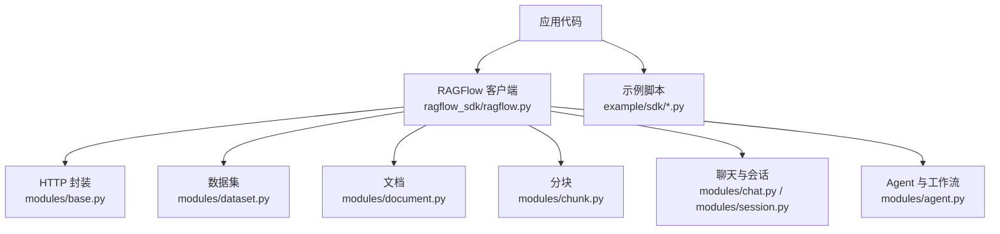
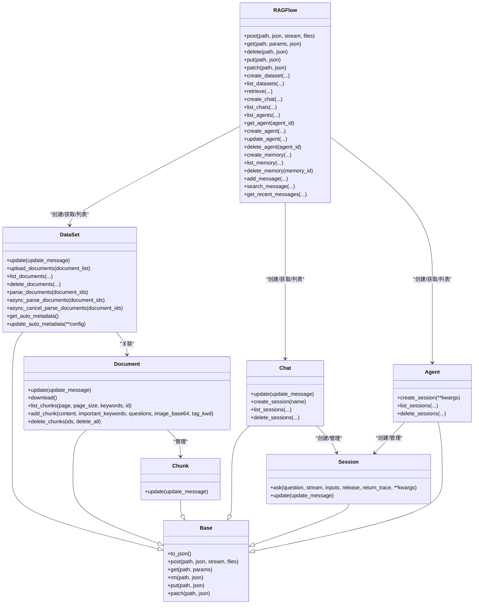
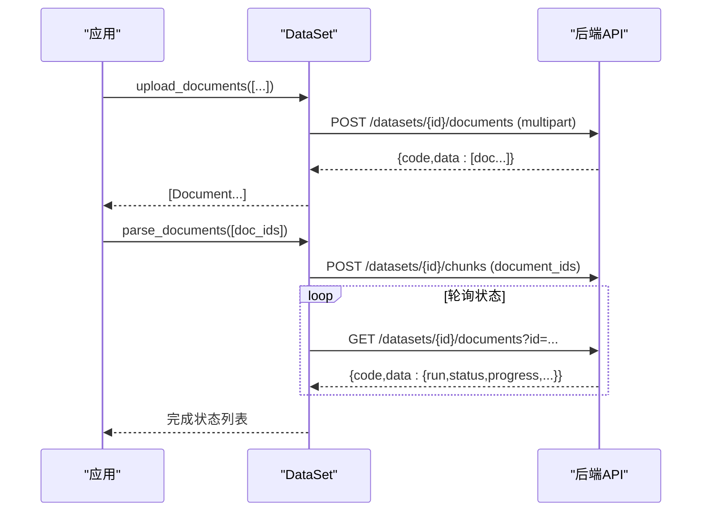
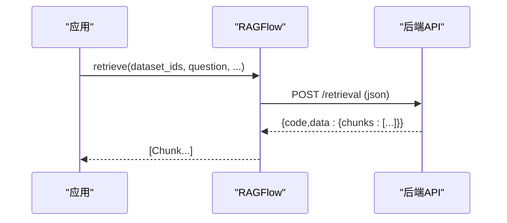
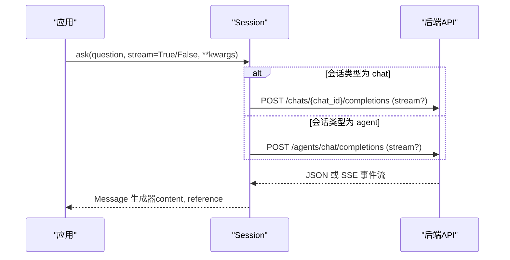
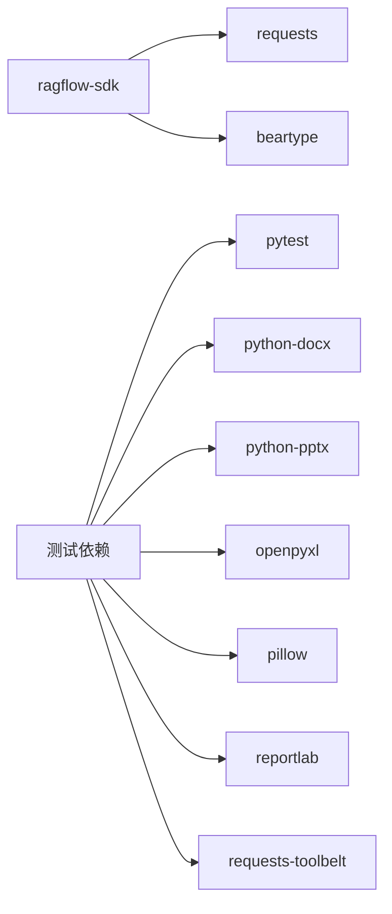

# Python SDK

<cite>
**本文引用的文件**
- [pyproject.toml](file://sdk/python/pyproject.toml)
- [hello_ragflow.py](file://sdk/python/hello_ragflow.py)
- [ragflow_sdk/__init__.py](file://sdk/python/ragflow_sdk/__init__.py)
- [ragflow_sdk/ragflow.py](file://sdk/python/ragflow_sdk/ragflow.py)
- [ragflow_sdk/modules/base.py](file://sdk/python/ragflow_sdk/modules/base.py)
- [ragflow_sdk/modules/dataset.py](file://sdk/python/ragflow_sdk/modules/dataset.py)
- [ragflow_sdk/modules/document.py](file://sdk/python/ragflow_sdk/modules/document.py)
- [ragflow_sdk/modules/chunk.py](file://sdk/python/ragflow_sdk/modules/chunk.py)
- [ragflow_sdk/modules/chat.py](file://sdk/python/ragflow_sdk/modules/chat.py)
- [ragflow_sdk/modules/session.py](file://sdk/python/ragflow_sdk/modules/session.py)
- [ragflow_sdk/modules/agent.py](file://sdk/python/ragflow_sdk/modules/agent.py)
- [example/sdk/chat_assistant_example.py](file://example/sdk/chat_assistant_example.py)
</cite>

## 目录
1. [简介](#简介)
2. [项目结构](#项目结构)
3. [核心组件](#核心组件)
4. [架构总览](#架构总览)
5. [详细组件分析](#详细组件分析)
6. [依赖关系分析](#依赖关系分析)
7. [性能与连接池](#性能与连接池)
8. [故障排查指南](#故障排查指南)
9. [结论](#结论)
10. [附录：常见用法示例](#附录：常见用法示例)

## 简介
本文件为 RAGFlow Python SDK 的详细使用文档，覆盖安装方式、客户端初始化与认证、知识库管理、文档上传与解析、检索、Agent 工作流调用、异步与流式处理、错误处理与重试策略、连接池管理与性能优化建议。SDK 基于 requests 实现同步 HTTP 调用，并通过统一的 Base 类封装对后端 API 的访问。

## 项目结构
Python SDK 位于 sdk/python 目录，核心入口为 ragflow_sdk 包，提供 RAGFlow 客户端与各资源模块（数据集、文档、分块、会话、聊天、Agent、记忆等）。示例脚本位于 example/sdk。

图表来源
- [ragflow_sdk/ragflow.py:27-54](file://sdk/python/ragflow_sdk/ragflow.py#L27-L54)
- [ragflow_sdk/modules/base.py:18-59](file://sdk/python/ragflow_sdk/modules/base.py#L18-L59)
- [ragflow_sdk/modules/dataset.py:22-183](file://sdk/python/ragflow_sdk/modules/dataset.py#L22-L183)
- [ragflow_sdk/modules/document.py:23-105](file://sdk/python/ragflow_sdk/modules/document.py#L23-L105)
- [ragflow_sdk/modules/chunk.py:28-62](file://sdk/python/ragflow_sdk/modules/chunk.py#L28-L62)
- [ragflow_sdk/modules/chat.py:22-68](file://sdk/python/ragflow_sdk/modules/chat.py#L22-L68)
- [ragflow_sdk/modules/session.py:25-187](file://sdk/python/ragflow_sdk/modules/session.py#L25-L187)
- [ragflow_sdk/modules/agent.py:21-70](file://sdk/python/ragflow_sdk/modules/agent.py#L21-L70)

章节来源
- [pyproject.toml:1-35](file://sdk/python/pyproject.toml#L1-L35)
- [hello_ragflow.py:17-20](file://sdk/python/hello_ragflow.py#L17-L20)
- [ragflow_sdk/__init__.py:17-34](file://sdk/python/ragflow_sdk/__init__.py#L17-L34)

## 核心组件
- RAGFlow 客户端：负责构建 API URL、设置鉴权头、统一发起 HTTP 请求，并提供数据集、聊天、检索、Agent、记忆等高层方法。
- Base：所有资源对象的基类，封装 to_json、HTTP 方法转发、字典到对象属性的自动映射。
- DataSet：创建/更新/删除数据集，批量上传文档，列表查询，异步解析与状态轮询。
- Document：文档元数据更新、下载、分块列表、手动添加/删除分块。
- Chunk：分块对象，支持更新操作并抛出专用异常。
- Chat/Session：创建聊天助手、会话；支持标准与流式问答，自动区分 chat/agent 会话类型。
- Agent：工作流（DSL）的创建、更新、删除与执行会话管理。
- Memory：记忆存储的创建、查询、消息追加与搜索。

章节来源
- [ragflow_sdk/ragflow.py:27-399](file://sdk/python/ragflow_sdk/ragflow.py#L27-L399)
- [ragflow_sdk/modules/base.py:18-63](file://sdk/python/ragflow_sdk/modules/base.py#L18-L63)
- [ragflow_sdk/modules/dataset.py:22-183](file://sdk/python/ragflow_sdk/modules/dataset.py#L22-L183)
- [ragflow_sdk/modules/document.py:23-105](file://sdk/python/ragflow_sdk/modules/document.py#L23-L105)
- [ragflow_sdk/modules/chunk.py:28-62](file://sdk/python/ragflow_sdk/modules/chunk.py#L28-L62)
- [ragflow_sdk/modules/chat.py:22-68](file://sdk/python/ragflow_sdk/modules/chat.py#L22-L68)
- [ragflow_sdk/modules/session.py:25-187](file://sdk/python/ragflow_sdk/modules/session.py#L25-L187)
- [ragflow_sdk/modules/agent.py:21-70](file://sdk/python/ragflow_sdk/modules/agent.py#L21-L70)

## 架构总览
SDK 采用“客户端 + 资源对象”的分层设计。RAGFlow 客户端集中管理鉴权与基础 HTTP 能力，各资源模块通过 Base 复用 HTTP 调用，将后端返回的 JSON 自动映射为对象属性，简化上层使用。

图表来源
- [ragflow_sdk/ragflow.py:27-399](file://sdk/python/ragflow_sdk/ragflow.py#L27-L399)
- [ragflow_sdk/modules/base.py:18-63](file://sdk/python/ragflow_sdk/modules/base.py#L18-L63)
- [ragflow_sdk/modules/dataset.py:22-183](file://sdk/python/ragflow_sdk/modules/dataset.py#L22-L183)
- [ragflow_sdk/modules/document.py:23-105](file://sdk/python/ragflow_sdk/modules/document.py#L23-L105)
- [ragflow_sdk/modules/chunk.py:28-62](file://sdk/python/ragflow_sdk/modules/chunk.py#L28-L62)
- [ragflow_sdk/modules/chat.py:22-68](file://sdk/python/ragflow_sdk/modules/chat.py#L22-L68)
- [ragflow_sdk/modules/session.py:25-187](file://sdk/python/ragflow_sdk/modules/session.py#L25-L187)
- [ragflow_sdk/modules/agent.py:21-70](file://sdk/python/ragflow_sdk/modules/agent.py#L21-L70)

## 详细组件分析

### 客户端初始化与认证
- 初始化参数：api_key（用于 Bearer Token）、base_url（服务地址）、version（默认 v1）。
- 鉴权：在请求头中注入 Authorization: Bearer <api_key>。
- 基础 HTTP：封装 post/get/delete/put/patch，供各资源模块复用。

章节来源
- [ragflow_sdk/ragflow.py:27-54](file://sdk/python/ragflow_sdk/ragflow.py#L27-L54)

### 知识库管理（DataSet）
- 创建/更新/删除：支持权限、分片策略、嵌入模型、解析配置与自动元数据配置。
- 文档上传：支持多文件 multipart 上传，返回文档对象列表。
- 文档列表：分页、关键词、时间范围过滤。
- 解析任务：
  - 异步解析：提交解析任务后不阻塞。
  - 同步解析：内部轮询文档状态直至完成或失败。
  - 取消解析：支持中断进行中的解析任务。
- 自动元数据：读取与更新数据集的自动元数据配置。

图表来源
- [ragflow_sdk/modules/dataset.py:54-162](file://sdk/python/ragflow_sdk/modules/dataset.py#L54-L162)

章节来源
- [ragflow_sdk/modules/dataset.py:22-183](file://sdk/python/ragflow_sdk/modules/dataset.py#L22-L183)

### 文档与分块（Document/Chunk）
- 文档：
  - 更新元数据（含 meta_fields 校验）。
  - 下载原始文件内容。
  - 列出分块、手动添加/删除分块。
- 分块：
  - 更新分块内容或标签，失败时抛出 ChunkUpdateError。

章节来源
- [ragflow_sdk/modules/document.py:23-105](file://sdk/python/ragflow_sdk/modules/document.py#L23-L105)
- [ragflow_sdk/modules/chunk.py:28-62](file://sdk/python/ragflow_sdk/modules/chunk.py#L28-L62)

### 检索（Retrieval）
- 支持按数据集/文档维度检索，可配置相似度阈值、向量权重、top_k、重排序模型、关键词开关、跨语言、元数据条件、知识图谱增强、目录增强等。
- 返回分块列表，包含相似度、位置等信息。

图表来源
- [ragflow_sdk/ragflow.py:193-237](file://sdk/python/ragflow_sdk/ragflow.py#L193-L237)

章节来源
- [ragflow_sdk/ragflow.py:193-237](file://sdk/python/ragflow_sdk/ragflow.py#L193-L237)

### 聊天与会话（Chat/Session）
- 创建聊天助手并绑定数据集、LLM、提示词等。
- 会话支持两种模式：
  - 非流式：一次性返回完整回答。
  - 流式：SSE 推送增量内容，自动解析 data: 行与结束标记。
- 自动识别会话类型（chat/agent），分别调用不同后端接口。

图表来源
- [ragflow_sdk/modules/session.py:39-170](file://sdk/python/ragflow_sdk/modules/session.py#L39-L170)
- [ragflow_sdk/modules/chat.py:22-68](file://sdk/python/ragflow_sdk/modules/chat.py#L22-L68)

章节来源
- [ragflow_sdk/modules/session.py:25-187](file://sdk/python/ragflow_sdk/modules/session.py#L25-L187)
- [ragflow_sdk/modules/chat.py:22-68](file://sdk/python/ragflow_sdk/modules/chat.py#L22-L68)

### Agent 工作流（Agent）
- 创建工作流（DSL）、更新、删除。
- 通过会话执行工作流，支持输入变量、是否发布版本、是否返回执行轨迹等。
- 会话管理：创建、列表、删除。

章节来源
- [ragflow_sdk/ragflow.py:239-320](file://sdk/python/ragflow_sdk/ragflow.py#L239-L320)
- [ragflow_sdk/modules/agent.py:21-70](file://sdk/python/ragflow_sdk/modules/agent.py#L21-L70)

### 记忆（Memory）
- 创建记忆、列表、删除。
- 追加消息、语义搜索、获取最近消息。

章节来源
- [ragflow_sdk/ragflow.py:322-399](file://sdk/python/ragflow_sdk/ragflow.py#L322-L399)

## 依赖关系分析
- 运行时依赖：requests（HTTP 客户端）、beartype（类型检查，启用包级类型守卫）。
- 测试依赖：pytest、openpyxl、pillow、python-docx、python-pptx、reportlab、requests-toolbelt 等。
- 约束：urllib3>=2.7.0（通过 uv 约束）。

图表来源
- [pyproject.toml:1-35](file://sdk/python/pyproject.toml#L1-L35)

章节来源
- [pyproject.toml:1-35](file://sdk/python/pyproject.toml#L1-L35)

## 性能与连接池
- 连接复用：当前 SDK 使用 requests 默认会话行为，同一进程内多次请求会复用底层 TCP 连接，有助于减少握手开销。
- 并发与吞吐：如需更高并发，可在上层使用线程池/协程池并行调用 SDK 方法；注意服务端限流与幂等性。
- 流式响应：会话问答支持 SSE 流式输出，适合实时展示与低延迟交互。
- 解析任务：大文档解析建议采用异步提交 + 轮询状态的方式，避免长时间阻塞。
- 网络与超时：建议在业务层根据网络环境合理设置超时与重试（见下节）。

[本节为通用指导，不直接分析具体文件]

## 故障排查指南
- 认证失败：确认 api_key 正确且 base_url 可达；请求头已携带 Authorization: Bearer。
- 资源不存在：如数据集/聊天/Agent 未找到，检查 ID 或名称是否正确。
- 解析失败：查看文档 run/status/progress 字段；必要时调用取消解析接口。
- 分块更新失败：捕获 ChunkUpdateError，查看 code/message/details。
- 流式结束：SSE 流以 data: [DONE] 或特定结束标志终止，确保循环正确处理空行与非 JSON 行。
- 错误传播：多数方法在 code != 0 时抛出异常，调用方需 try/except 捕获并记录日志。

章节来源
- [ragflow_sdk/modules/chunk.py:20-62](file://sdk/python/ragflow_sdk/modules/chunk.py#L20-L62)
- [ragflow_sdk/modules/session.py:106-138](file://sdk/python/ragflow_sdk/modules/session.py#L106-L138)
- [ragflow_sdk/modules/dataset.py:113-162](file://sdk/python/ragflow_sdk/modules/dataset.py#L113-L162)
- [ragflow_sdk/ragflow.py:80-90](file://sdk/python/ragflow_sdk/ragflow.py#L80-L90)

## 结论
RAGFlow Python SDK 提供了从知识库管理、文档处理、检索到聊天与 Agent 工作流的完整能力。其设计简洁清晰，通过 Base 抽象与资源对象化降低了使用复杂度。结合流式响应与异步解析，可满足实时性与批处理场景需求。生产环境中建议配合合理的超时、重试与监控策略，以获得稳定高效的体验。

[本节为总结性内容，不直接分析具体文件]

## 附录：常见用法示例
以下示例均基于仓库提供的示例脚本与 SDK 接口，实际使用时请替换环境变量中的服务地址与 API Key。

- 安装与导入
  - 通过 pip 安装：参考 pyproject.toml 中的包名与依赖。
  - 源码运行：可直接运行 hello_ragflow.py 验证版本。

- 客户端初始化与认证
  - 使用 RAGFlow(api_key, base_url) 初始化，自动设置 Bearer Token。

- 知识库与文档
  - 创建数据集、上传文档、列表查询、异步解析与状态轮询。
  - 文档下载、分块增删改查。

- 检索
  - 调用 retrieve 按数据集/文档检索，返回分块及相似度信息。

- 聊天与会话
  - 创建聊天助手与会话，支持标准与流式问答。
  - 参考示例：example/sdk/chat_assistant_example.py。

- Agent 工作流
  - 创建/更新/删除 Agent，创建会话并传入 Begin 组件输入变量，支持发布版本与执行轨迹。

- 错误处理与重试
  - 捕获各方法抛出的异常，记录 code/message/details。
  - 对网络抖动或瞬时错误，可在业务层实现指数退避重试。

- 性能优化建议
  - 使用流式响应降低首字节延迟。
  - 解析任务采用异步提交 + 轮询。
  - 合理控制 top_k、相似度阈值与关键词开关以减少计算量。
  - 在高并发场景下，结合连接池与并发工具提升吞吐。

章节来源
- [pyproject.toml:1-35](file://sdk/python/pyproject.toml#L1-L35)
- [hello_ragflow.py:17-20](file://sdk/python/hello_ragflow.py#L17-L20)
- [ragflow_sdk/ragflow.py:27-54](file://sdk/python/ragflow_sdk/ragflow.py#L27-L54)
- [ragflow_sdk/modules/dataset.py:54-162](file://sdk/python/ragflow_sdk/modules/dataset.py#L54-L162)
- [ragflow_sdk/modules/document.py:65-105](file://sdk/python/ragflow_sdk/modules/document.py#L65-L105)
- [ragflow_sdk/ragflow.py:193-237](file://sdk/python/ragflow_sdk/ragflow.py#L193-L237)
- [ragflow_sdk/modules/session.py:39-170](file://sdk/python/ragflow_sdk/modules/session.py#L39-L170)
- [example/sdk/chat_assistant_example.py:22-94](file://example/sdk/chat_assistant_example.py#L22-L94)