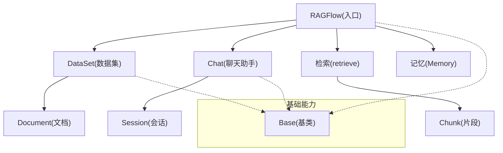
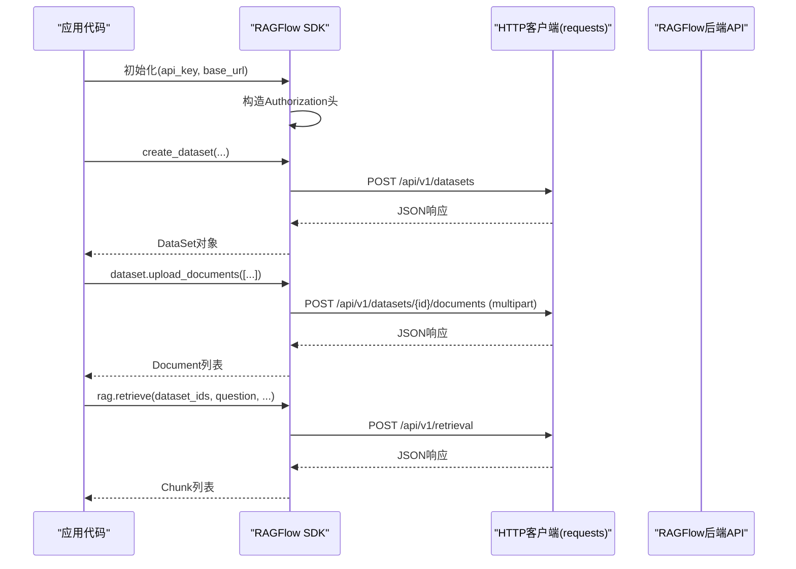
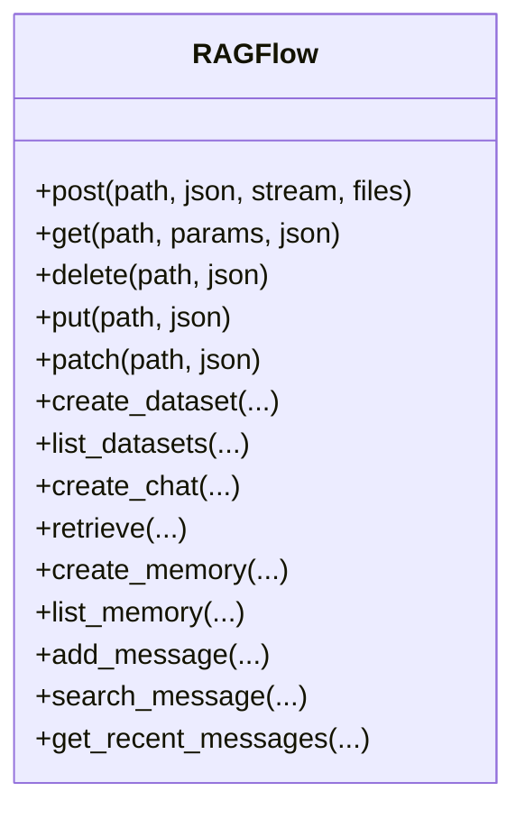
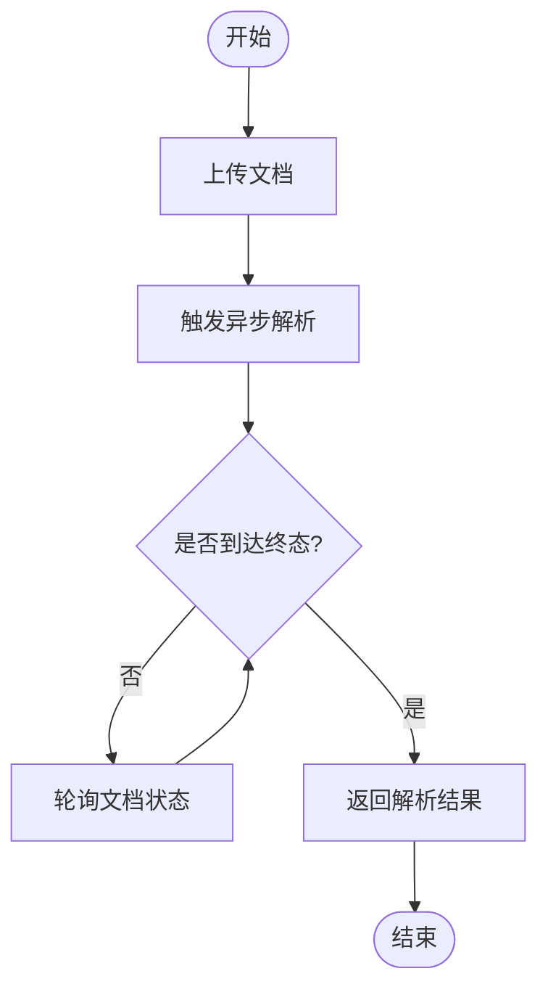
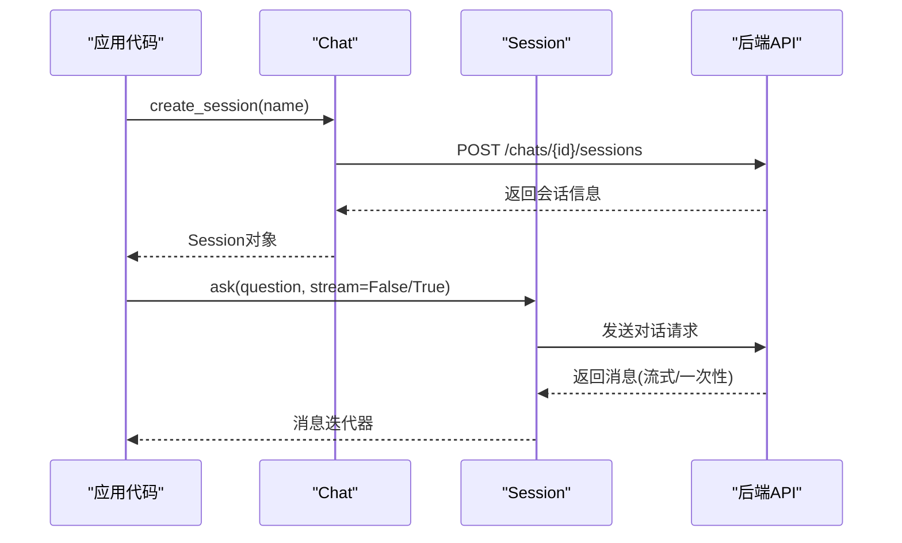
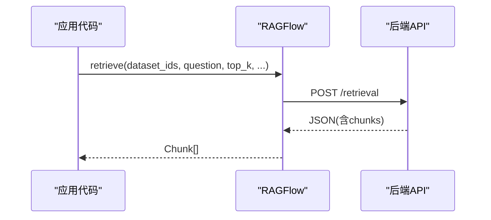
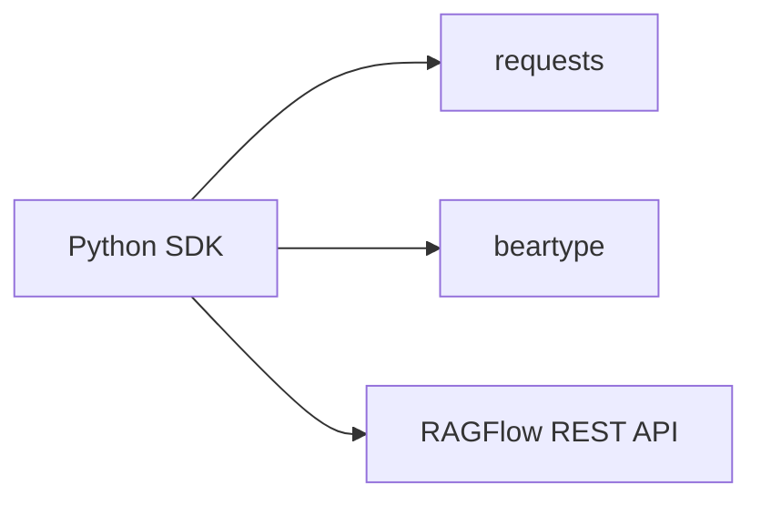

# SDK使用指南

<cite>
**本文引用的文件**
- [ragflow_sdk/__init__.py](file://sdk/python/ragflow_sdk/__init__.py)
- [ragflow_sdk/ragflow.py](file://sdk/python/ragflow_sdk/ragflow.py)
- [ragflow_sdk/modules/base.py](file://sdk/python/ragflow_sdk/modules/base.py)
- [ragflow_sdk/modules/chat.py](file://sdk/python/ragflow_sdk/modules/chat.py)
- [ragflow_sdk/modules/dataset.py](file://sdk/python/ragflow_sdk/modules/dataset.py)
- [example/sdk/chat_assistant_example.py](file://example/sdk/chat_assistant_example.py)
- [example/sdk/dataset_example.py](file://example/sdk/dataset_example.py)
- [example/sdk/document_example.py](file://example/sdk/document_example.py)
- [example/sdk/retrieval_example.py](file://example/sdk/retrieval_example.py)
- [sdk/python/pyproject.toml](file://sdk/python/pyproject.toml)
</cite>

## 目录
1. [简介](#简介)
2. [项目结构](#项目结构)
3. [核心组件](#核心组件)
4. [架构总览](#架构总览)
5. [详细组件分析](#详细组件分析)
6. [依赖关系分析](#依赖关系分析)
7. [性能与最佳实践](#性能与最佳实践)
8. [故障排查指南](#故障排查指南)
9. [结论](#结论)
10. [附录：安装、配置与示例](#附录安装配置与示例)

## 简介
本指南面向希望集成RAGFlow能力的开发者，提供Python SDK的安装、配置与常用API调用示例，涵盖客户端初始化、认证、数据集管理、文档上传与解析、检索、会话与流式对话等场景。同时给出错误处理、异步解析、重试策略、连接复用与资源清理等工程化建议，并说明版本兼容性与升级注意事项。当前仓库未包含JavaScript SDK实现，因此本指南聚焦Python SDK；如需JS集成，可参考HTTP API规范进行封装。

## 项目结构
Python SDK位于 sdk/python 目录下，采用“入口类 + 领域模块”的清晰分层：
- 入口类 RAGFlow：负责HTTP基础能力（GET/POST/PUT/PATCH/DELETE）、鉴权头注入、以及顶层资源编排（数据集、聊天助手、检索、记忆等）。
- 领域模块：DataSet、Chat、Session、Document、Chunk、Agent、Memory等，封装各自资源的CRUD与业务方法。
- 基础基类 Base：统一序列化/反序列化和HTTP代理，减少重复代码。
- 示例脚本：example/sdk 下提供端到端示例，覆盖数据集、文档、检索、对话等典型流程。

图表来源
- [ragflow_sdk/ragflow.py:27-54](file://sdk/python/ragflow_sdk/ragflow.py#L27-L54)
- [ragflow_sdk/modules/base.py:18-63](file://sdk/python/ragflow_sdk/modules/base.py#L18-L63)
- [ragflow_sdk/modules/dataset.py:22-65](file://sdk/python/ragflow_sdk/modules/dataset.py#L22-L65)
- [ragflow_sdk/modules/chat.py:22-68](file://sdk/python/ragflow_sdk/modules/chat.py#L22-L68)

章节来源
- [ragflow_sdk/__init__.py:17-34](file://sdk/python/ragflow_sdk/__init__.py#L17-L34)
- [ragflow_sdk/ragflow.py:27-54](file://sdk/python/ragflow_sdk/ragflow.py#L27-L54)
- [ragflow_sdk/modules/base.py:18-63](file://sdk/python/ragflow_sdk/modules/base.py#L18-L63)

## 核心组件
- RAGFlow：SDK入口，维护API密钥与基础URL，构造Authorization头，并提供通用HTTP方法与高层API（创建/删除数据集、聊天助手、检索、记忆等）。
- DataSet：数据集对象，支持更新、批量上传文档、列出/删除文档、异步解析与状态轮询、自动元数据配置读取与更新。
- Chat：聊天助手对象，支持更新配置、创建/列出/删除会话。
- Session：会话对象，支持标准与流式对话（ask），返回消息迭代器。
- Document/Chunk：文档与片段对象，用于展示解析结果与检索内容。
- Memory：记忆对象，支持添加/搜索/获取最近消息。

章节来源
- [ragflow_sdk/ragflow.py:56-399](file://sdk/python/ragflow_sdk/ragflow.py#L56-L399)
- [ragflow_sdk/modules/dataset.py:22-183](file://sdk/python/ragflow_sdk/modules/dataset.py#L22-L183)
- [ragflow_sdk/modules/chat.py:22-68](file://sdk/python/ragflow_sdk/modules/chat.py#L22-L68)

## 架构总览
SDK通过统一的HTTP客户端访问后端REST API。所有请求均携带Bearer Token鉴权。领域对象将响应数据映射为本地对象，便于链式调用与结构化操作。

图表来源
- [ragflow_sdk/ragflow.py:27-54](file://sdk/python/ragflow_sdk/ragflow.py#L27-L54)
- [ragflow_sdk/ragflow.py:56-237](file://sdk/python/ragflow_sdk/ragflow.py#L56-L237)
- [ragflow_sdk/modules/dataset.py:54-65](file://sdk/python/ragflow_sdk/modules/dataset.py#L54-L65)

## 详细组件分析

### RAGFlow 入口类
- 职责：维护API密钥与基础URL，注入Authorization头，封装HTTP方法，暴露高层API（数据集、聊天、检索、记忆等）。
- 关键点：
  - 构造时拼接base_url与版本号，形成统一API前缀。
  - 所有HTTP调用均附带Authorization头。
  - 对后端返回的code字段进行校验，非0时抛出异常，便于上层统一错误处理。
  - retrieve方法将后端返回的chunks映射为Chunk对象列表。

图表来源
- [ragflow_sdk/ragflow.py:27-54](file://sdk/python/ragflow_sdk/ragflow.py#L27-L54)
- [ragflow_sdk/ragflow.py:56-399](file://sdk/python/ragflow_sdk/ragflow.py#L56-L399)

章节来源
- [ragflow_sdk/ragflow.py:27-54](file://sdk/python/ragflow_sdk/ragflow.py#L27-L54)
- [ragflow_sdk/ragflow.py:56-399](file://sdk/python/ragflow_sdk/ragflow.py#L56-L399)

### DataSet 数据集
- 职责：数据集生命周期管理（更新、上传、列出、删除）、文档解析（同步/异步）、自动元数据配置读写。
- 关键点：
  - upload_documents以multipart形式上传多个文件，返回Document对象列表。
  - parse_documents内部先触发异步解析，再轮询直到完成或失败/取消。
  - _get_documents_status循环查询文档状态，直至达到终态（DONE/FAIL/CANCEL）或进度>=1.0。
  - get_auto_metadata/update_auto_metadata用于自动化元数据配置。

图表来源
- [ragflow_sdk/modules/dataset.py:54-65](file://sdk/python/ragflow_sdk/modules/dataset.py#L54-L65)
- [ragflow_sdk/modules/dataset.py:113-157](file://sdk/python/ragflow_sdk/modules/dataset.py#L113-L157)

章节来源
- [ragflow_sdk/modules/dataset.py:22-183](file://sdk/python/ragflow_sdk/modules/dataset.py#L22-L183)

### Chat 聊天助手与会话
- 职责：聊天助手配置更新、会话创建/列出/删除；Session支持标准与流式对话。
- 关键点：
  - create_session返回Session对象，后续通过session.ask(question, stream=...)发起对话。
  - list_sessions支持分页与过滤条件。
  - delete_sessions支持批量删除或全部删除。

图表来源
- [ragflow_sdk/modules/chat.py:22-68](file://sdk/python/ragflow_sdk/modules/chat.py#L22-L68)
- [example/sdk/chat_assistant_example.py:22-94](file://example/sdk/chat_assistant_example.py#L22-L94)

章节来源
- [ragflow_sdk/modules/chat.py:22-68](file://sdk/python/ragflow_sdk/modules/chat.py#L22-L68)
- [example/sdk/chat_assistant_example.py:22-94](file://example/sdk/chat_assistant_example.py#L22-L94)

### 检索 retrieve
- 职责：跨数据集语义检索，返回相关片段（Chunk）集合。
- 关键点：
  - 支持top_k、相似度阈值、向量权重、关键词检索、交叉语言、元数据条件、知识图谱增强等参数。
  - 将后端返回的chunks映射为Chunk对象列表，便于后续展示或进一步处理。

图表来源
- [ragflow_sdk/ragflow.py:193-237](file://sdk/python/ragflow_sdk/ragflow.py#L193-L237)

章节来源
- [ragflow_sdk/ragflow.py:193-237](file://sdk/python/ragflow_sdk/ragflow.py#L193-L237)

### 记忆 Memory
- 职责：追加消息、相似性搜索、获取最近消息。
- 关键点：
  - add_message支持外部主体user_id透传（API Key认证场景）。
  - search_message支持相似度阈值、关键词权重、top_n等检索参数。
  - get_recent_messages按限制条数拉取最近消息。

章节来源
- [ragflow_sdk/ragflow.py:322-399](file://sdk/python/ragflow_sdk/ragflow.py#L322-L399)

## 依赖关系分析
- Python SDK依赖requests进行HTTP通信，beartype用于类型检查（在包初始化时启用）。
- 版本约束由pyproject.toml声明，要求Python版本范围与依赖版本区间。

图表来源
- [sdk/python/pyproject.toml:1-9](file://sdk/python/pyproject.toml#L1-L9)
- [ragflow_sdk/__init__.py:17-23](file://sdk/python/ragflow_sdk/__init__.py#L17-L23)

章节来源
- [sdk/python/pyproject.toml:1-35](file://sdk/python/pyproject.toml#L1-L35)
- [ragflow_sdk/__init__.py:17-34](file://sdk/python/ragflow_sdk/__init__.py#L17-L34)

## 性能与最佳实践
- 连接复用：SDK基于requests，默认保持连接池。建议在应用中复用RAGFlow实例，避免频繁创建销毁导致连接开销。
- 并发与限流：对于批量上传或解析，建议分批提交并控制并发度，避免后端过载。
- 异步解析与轮询：使用dataset.async_parse_documents触发后台任务，并通过parse_documents或自定义轮询等待终态，提高吞吐。
- 流式对话：使用session.ask(stream=True)获得增量输出，降低首字延迟，提升交互体验。
- 资源清理：及时删除不再使用的数据集、会话与文档，释放存储与计算资源。
- 错误处理：捕获异常并根据message提示定位问题；对网络异常与超时进行重试（指数退避）。
- 日志与追踪：记录关键步骤与耗时，便于定位瓶颈与问题。
- 安全：仅传递必要参数，避免敏感信息入参；妥善保管API密钥。

[本节为通用指导，不直接分析具体文件]

## 故障排查指南
- 认证失败：确认base_url与api_key正确，Authorization头格式为Bearer <token>。
- 接口返回非0：SDK会抛出异常，message中包含后端错误信息，据此调整请求参数或权限。
- 解析未完成：确保调用async_parse_documents后轮询至终态；若长时间未完成，检查文档大小与后端负载。
- 检索结果为空：调整top_k、similarity_threshold、keyword开关或cross_languages等参数；确认文档已解析完成。
- 会话无响应：检查会话是否存在、LLM配置是否正确；必要时重建会话。

章节来源
- [ragflow_sdk/ragflow.py:56-399](file://sdk/python/ragflow_sdk/ragflow.py#L56-L399)
- [ragflow_sdk/modules/dataset.py:113-157](file://sdk/python/ragflow_sdk/modules/dataset.py#L113-L157)

## 结论
Python SDK提供了简洁一致的接口来管理RAGFlow的核心资源与能力，覆盖数据集、文档、检索、会话与记忆等常见场景。结合异步解析、流式对话与合理的错误处理与资源管理策略，可在生产环境中稳定高效地集成RAGFlow能力。当前仓库未提供JavaScript SDK，前端或Node.js侧可通过HTTP API自行封装。

[本节为总结性内容，不直接分析具体文件]

## 附录：安装、配置与示例

### 安装与环境
- Python版本要求与依赖见pyproject.toml。
- 推荐使用虚拟环境隔离依赖。

章节来源
- [sdk/python/pyproject.toml:1-9](file://sdk/python/pyproject.toml#L1-L9)

### 初始化与认证
- 使用RAGFlow(api_key, base_url)创建客户端实例，自动注入Authorization头。
- 环境变量方式传入HOST_ADDRESS与API_KEY，便于不同环境切换。

章节来源
- [example/sdk/chat_assistant_example.py:22-30](file://example/sdk/chat_assistant_example.py#L22-L30)
- [example/sdk/retrieval_example.py:22-31](file://example/sdk/retrieval_example.py#L22-L31)
- [example/sdk/document_example.py:5-11](file://example/sdk/document_example.py#L5-L11)

### 常用场景与示例路径
- 数据集CRUD：创建、更新、列出、删除
  - 示例路径：[example/sdk/dataset_example.py:21-52](file://example/sdk/dataset_example.py#L21-L52)
  - 关键方法：create_dataset、update、list_datasets、delete_datasets
  - 章节来源
    - [ragflow_sdk/ragflow.py:56-122](file://sdk/python/ragflow_sdk/ragflow.py#L56-L122)
    - [example/sdk/dataset_example.py:21-52](file://example/sdk/dataset_example.py#L21-L52)

- 文档上传与解析：上传文件、触发解析、轮询状态
  - 示例路径：[example/sdk/document_example.py:5-35](file://example/sdk/document_example.py#L5-L35)
  - 关键方法：upload_documents、async_parse_documents、parse_documents、_get_documents_status
  - 章节来源
    - [ragflow_sdk/modules/dataset.py:54-157](file://sdk/python/ragflow_sdk/modules/dataset.py#L54-L157)
    - [example/sdk/document_example.py:5-35](file://example/sdk/document_example.py#L5-L35)

- 检索：语义检索与关键词检索
  - 示例路径：[example/sdk/retrieval_example.py:22-96](file://example/sdk/retrieval_example.py#L22-L96)
  - 关键方法：retrieve
  - 章节来源
    - [ragflow_sdk/ragflow.py:193-237](file://sdk/python/ragflow_sdk/ragflow.py#L193-L237)
    - [example/sdk/retrieval_example.py:22-96](file://example/sdk/retrieval_example.py#L22-L96)

- 会话与对话：创建会话、标准与流式对话、会话管理
  - 示例路径：[example/sdk/chat_assistant_example.py:22-94](file://example/sdk/chat_assistant_example.py#L22-L94)
  - 关键方法：create_chat、create_session、ask、list_sessions、delete_sessions
  - 章节来源
    - [ragflow_sdk/modules/chat.py:22-68](file://sdk/python/ragflow_sdk/modules/chat.py#L22-L68)
    - [example/sdk/chat_assistant_example.py:22-94](file://example/sdk/chat_assistant_example.py#L22-L94)

### 高级特性
- 异步调用：使用dataset.async_parse_documents触发后台解析，配合轮询或parse_documents等待完成。
- 错误处理：捕获异常并根据message定位问题；对网络异常进行重试（指数退避）。
- 重试机制：建议在应用层封装重试逻辑，针对幂等接口（如GET/PUT）更安全。
- 连接池管理：复用RAGFlow实例，利用requests连接池；在高并发场景下合理设置连接池大小。
- 资源清理：及时删除数据集、会话与文档，避免资源泄漏。

章节来源
- [ragflow_sdk/modules/dataset.py:113-157](file://sdk/python/ragflow_sdk/modules/dataset.py#L113-L157)
- [ragflow_sdk/ragflow.py:56-399](file://sdk/python/ragflow_sdk/ragflow.py#L56-L399)

### 与其他系统集成模式
- 微服务集成：通过SDK作为客户端调用RAGFlow服务，封装业务逻辑与重试、熔断、监控。
- 事件驱动：将解析与检索结果写入消息队列，下游消费者处理。
- 前端集成：前端通过HTTP API调用RAGFlow，或使用JS封装SDK（当前仓库未提供JS SDK）。

[本节为概念性内容，不直接分析具体文件]

### 版本兼容性与升级
- Python版本：参见pyproject.toml中requires-python约束。
- 依赖版本：requests与beartype有明确版本区间，升级时注意兼容性。
- 升级建议：
  - 小步升级，优先升级依赖与测试用例。
  - 关注SDK版本变化（__version__）与API变更。
  - 在预发布环境验证后再上线。

章节来源
- [sdk/python/pyproject.toml:1-9](file://sdk/python/pyproject.toml#L1-L9)
- [ragflow_sdk/__init__.py:21-34](file://sdk/python/ragflow_sdk/__init__.py#L21-L34)