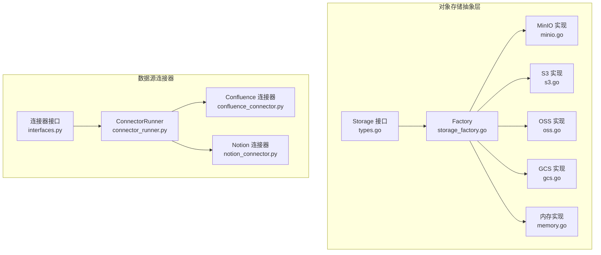
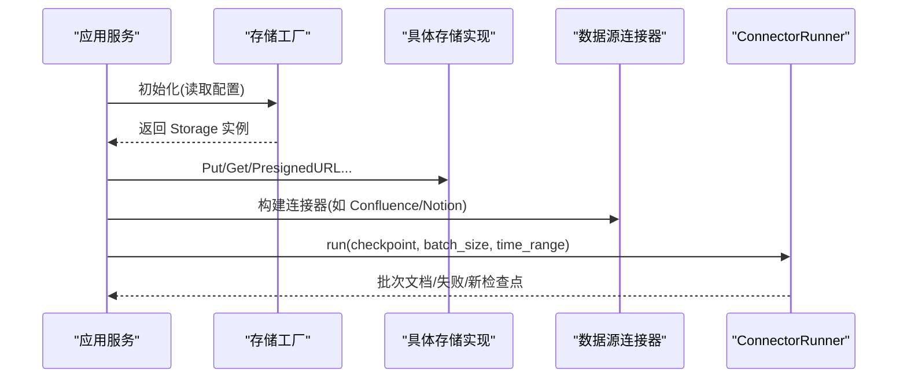
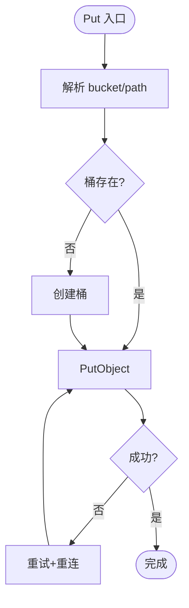
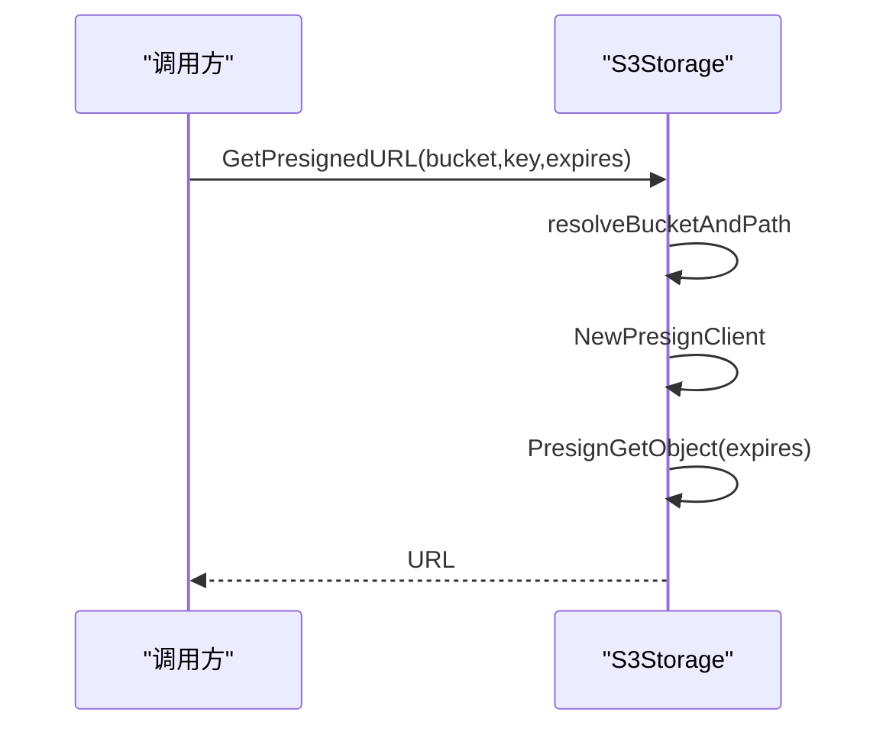
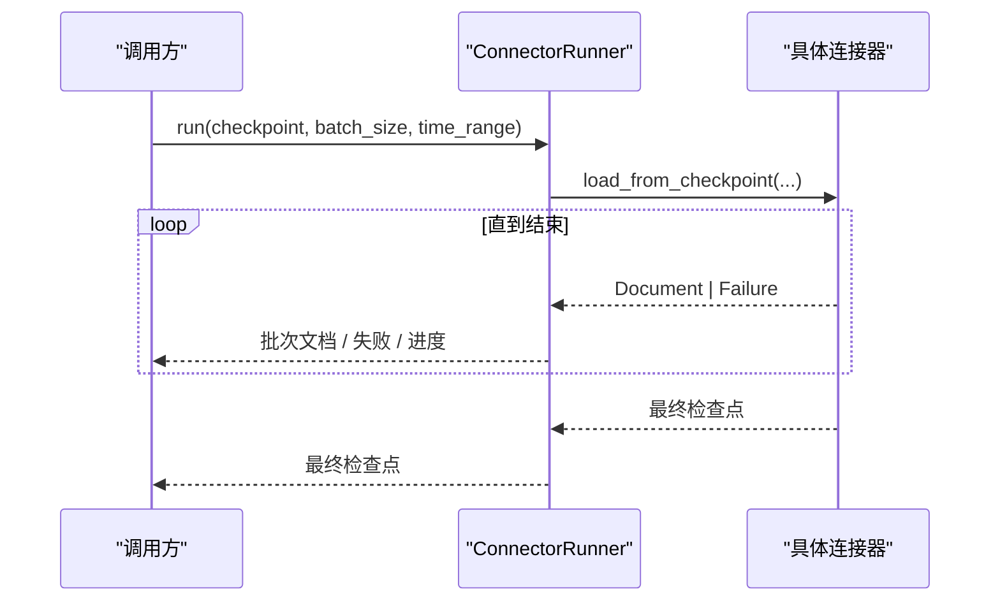
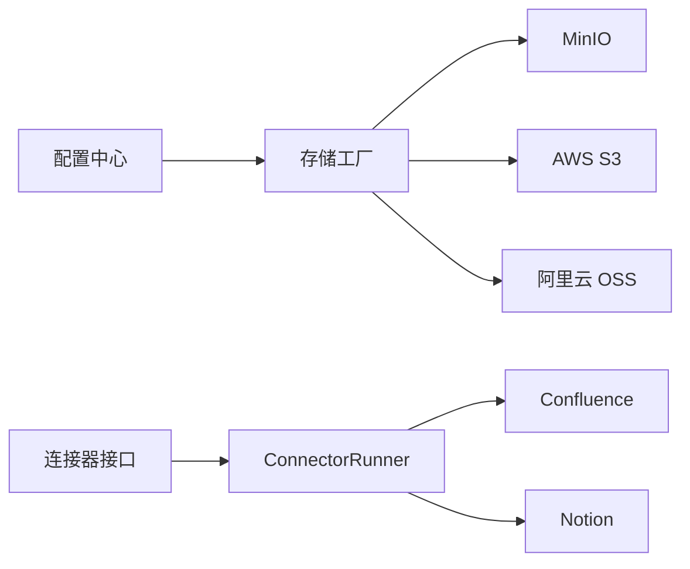

# 存储系统

<cite>
**本文引用的文件**
- [types.go](file://internal/storage/types.go)
- [storage_factory.go](file://internal/storage/storage_factory.go)
- [minio.go](file://internal/storage/minio.go)
- [s3.go](file://internal/storage/s3.go)
- [oss.go](file://internal/storage/oss.go)
- [memory.go](file://internal/storage/memory.go)
- [interfaces.py](file://common/data_source/interfaces.py)
- [connector_runner.py](file://common/data_source/connector_runner.py)
- [confluence_connector.py](file://common/data_source/confluence_connector.py)
- [notion_connector.py](file://common/data_source/notion_connector.py)
</cite>

## 目录
1. [简介](#简介)
2. [项目结构](#项目结构)
3. [核心组件](#核心组件)
4. [架构总览](#架构总览)
5. [详细组件分析](#详细组件分析)
6. [依赖关系分析](#依赖关系分析)
7. [性能考虑](#性能考虑)
8. [故障排查指南](#故障排查指南)
9. [结论](#结论)
10. [附录](#附录)

## 简介
本文件系统性说明 RAGFlow 的存储系统与数据源连接器：
- 对象存储抽象层：统一 MinIO、AWS S3、阿里云 OSS、Google Cloud Storage、OpenDAL 等后端的接口与实现，提供上传下载、预签名 URL、桶管理、复制移动等能力。
- 数据源连接器：支持从 GitHub、Confluence、Notion 等外部系统同步文档，具备增量同步、权限同步、批处理与断点续传（检查点）能力。
- 存储方案选择：内存存储用于测试与临时场景；Redis 作为连接器的分布式锁与凭据缓存；数据库用于持久化元数据与任务状态。
- 性能与安全：连接池与重试机制、并发控制、错误恢复、敏感信息脱敏、访问控制与加密传输等。

## 项目结构
存储子系统位于 Go 代码的 internal/storage 包，提供统一的 Storage 接口与多种后端实现；数据源连接器位于 Python 的 common/data_source，定义连接器接口与具体实现，并通过 ConnectorRunner 进行编排。

图表来源
- [types.go:58-103](file://internal/storage/types.go#L58-L103)
- [storage_factory.go:47-84](file://internal/storage/storage_factory.go#L47-L84)
- [minio.go:34-43](file://internal/storage/minio.go#L34-L43)
- [s3.go:37-43](file://internal/storage/s3.go#L37-L43)
- [oss.go:36-43](file://internal/storage/oss.go#L36-L43)
- [memory.go:40-51](file://internal/storage/memory.go#L40-L51)
- [interfaces.py:31-115](file://common/data_source/interfaces.py#L31-L115)
- [connector_runner.py:146-265](file://common/data_source/connector_runner.py#L146-L265)

章节来源
- [types.go:24-103](file://internal/storage/types.go#L24-L103)
- [storage_factory.go:28-84](file://internal/storage/storage_factory.go#L28-L84)
- [interfaces.py:31-115](file://common/data_source/interfaces.py#L31-L115)
- [connector_runner.py:146-265](file://common/data_source/connector_runner.py#L146-L265)

## 核心组件
- 存储接口与类型：定义 Storage 接口与存储类型枚举，统一 Put/Get/Remove/ListObjects/PresignedURL/BucketExists/Copy/Move/Close 等操作。
- 工厂模式：根据配置初始化具体存储后端（MinIO/S3/OSS/GCS），并提供单例访问与关闭。
- 后端实现：
  - MinIO：本地或私有云对象存储，支持 TLS、自动建桶、重试与重连。
  - AWS S3：兼容 S3 API 的云存储，支持自定义 Endpoint、静态凭据、版本删除清理。
  - 阿里云 OSS：基于 S3 兼容客户端接入，支持预签名 URL、批量删除。
  - Google Cloud Storage：通过工厂扩展接入。
  - 内存存储：线程安全字典实现，用于单元测试与临时缓存。
- 数据源连接器：
  - 接口体系：LoadConnector/PollConnector/CheckpointedConnector 等，支持全量、轮询与带检查点的增量同步。
  - 运行器：ConnectorRunner 负责批处理、异常日志脱敏、统一输出格式。
  - 具体连接器：Confluence、Notion 等，封装各自 API、分页、重试、权限同步与附件处理。

章节来源
- [types.go:24-103](file://internal/storage/types.go#L24-L103)
- [storage_factory.go:47-147](file://internal/storage/storage_factory.go#L47-L147)
- [minio.go:110-432](file://internal/storage/minio.go#L110-L432)
- [s3.go:123-476](file://internal/storage/s3.go#L123-L476)
- [oss.go:106-431](file://internal/storage/oss.go#L106-L431)
- [memory.go:53-257](file://internal/storage/memory.go#L53-L257)
- [interfaces.py:31-115](file://common/data_source/interfaces.py#L31-L115)
- [connector_runner.py:146-265](file://common/data_source/connector_runner.py#L146-L265)

## 架构总览
存储抽象层将上层业务与底层对象存储解耦，通过 Factory 按配置注入具体实现；数据源连接器通过统一接口产出 Document 流，交由后续入库与索引流程。

图表来源
- [storage_factory.go:47-84](file://internal/storage/storage_factory.go#L47-L84)
- [minio.go:127-182](file://internal/storage/minio.go#L127-L182)
- [s3.go:165-211](file://internal/storage/s3.go#L165-L211)
- [oss.go:148-194](file://internal/storage/oss.go#L148-L194)
- [connector_runner.py:172-216](file://common/data_source/connector_runner.py#L172-L216)

## 详细组件分析

### 存储接口与工厂
- Storage 接口：统一对象存储操作语义，包含健康检查、上传、下载、存在性判断、列表、预签名 URL、桶管理、复制移动与关闭。
- 工厂：根据全局配置创建并缓存对应后端实例，支持测试时替换实现。

```mermaid
classDiagram
class Storage {
+Type() string
+Health(ctx) bool
+Put(ctx,bucket,fnm,binary,tenantID...) error
+Get(ctx,bucket,fnm,tenantID...) []byte,error
+Remove(ctx,bucket,fnm,tenantID...) error
+ObjExist(ctx,bucket,fnm,tenantID...) bool
+ListObjects(ctx,bucket,tenantID...) []string,error
+GetPresignedURL(ctx,bucket,fnm,expires,tenantID...) string,error
+BucketExists(ctx,bucket) bool
+RemoveBucket(ctx,bucket) error
+Copy(ctx,srcB,srcP,destB,destP) bool
+Move(ctx,srcB,srcP,destB,destP) bool
+Close() error
}
class Factory {
-storage Storage
+Init(ctx) error
+GetStorage() Storage
+SetStorage(storage)
+CloseStorage() error
}
class MinioStorage
class S3Storage
class OSSStorage
class MemoryStorage
Storage <|.. MinioStorage
Storage <|.. S3Storage
Storage <|.. OSSStorage
Storage <|.. MemoryStorage
Factory --> Storage : "持有"
```

图表来源
- [types.go:58-103](file://internal/storage/types.go#L58-L103)
- [storage_factory.go:33-147](file://internal/storage/storage_factory.go#L33-L147)
- [minio.go:34-43](file://internal/storage/minio.go#L34-L43)
- [s3.go:37-43](file://internal/storage/s3.go#L37-L43)
- [oss.go:36-43](file://internal/storage/oss.go#L36-L43)
- [memory.go:40-51](file://internal/storage/memory.go#L40-L51)

章节来源
- [types.go:24-103](file://internal/storage/types.go#L24-L103)
- [storage_factory.go:28-147](file://internal/storage/storage_factory.go#L28-L147)

### MinIO 实现
- 连接与 TLS：支持 Secure/Verify 选项，使用静态 V4 凭据。
- 路径解析：支持默认 bucket/prefixPath 组合，便于多租户隔离。
- 健壮性：Put/Get/PresignedURL 内置重试与重连，自动创建缺失桶。
- 桶管理：支持递归列出与删除前缀下的对象，单桶模式下不删除实际桶。

图表来源
- [minio.go:90-108](file://internal/storage/minio.go#L90-L108)
- [minio.go:127-182](file://internal/storage/minio.go#L127-L182)

章节来源
- [minio.go:57-182](file://internal/storage/minio.go#L57-L182)
- [minio.go:260-365](file://internal/storage/minio.go#L260-L365)

### AWS S3 实现
- 配置加载：支持 region、静态凭据、自定义 BaseEndpoint。
- 健康检查：创建临时桶并写入测试对象。
- 删除策略：使用 ListObjectVersions 分页删除所有版本与删除标记，避免残留。
- 预签名 URL：通过 PresignClient 生成可下载的临时链接。

图表来源
- [s3.go:302-324](file://internal/storage/s3.go#L302-L324)
- [s3.go:373-436](file://internal/storage/s3.go#L373-L436)

章节来源
- [s3.go:60-95](file://internal/storage/s3.go#L60-L95)
- [s3.go:165-246](file://internal/storage/s3.go#L165-L246)
- [s3.go:302-436](file://internal/storage/s3.go#L302-L436)

### 阿里云 OSS 实现
- 复用 S3 客户端：通过 BaseEndpoint 指向 OSS 域名，静态凭据配置。
- 功能对齐：Put/Get/Head/List/PresignedURL/BucketExists/RemoveBucket 等。
- 删除优化：分页遍历并批量删除对象，再删除空桶。

章节来源
- [oss.go:60-84](file://internal/storage/oss.go#L60-L84)
- [oss.go:148-239](file://internal/storage/oss.go#L148-L239)
- [oss.go:295-391](file://internal/storage/oss.go#L295-L391)

### 内存存储
- 用途：单元测试、临时缓存与快速验证。
- 特性：线程安全、按需建桶、复制/移动原子性、Inspect 诊断。
- 限制：进程内数据，重启丢失。

章节来源
- [memory.go:40-257](file://internal/storage/memory.go#L40-L257)

### 数据源连接器接口与运行器
- 接口族：LoadConnector（全量）、PollConnector（轮询）、CheckpointedConnector（增量检查点）、SlimConnector（仅 ID）。
- 运行器：批处理、异常堆栈中敏感字段脱敏、统一产出 (Document|Failure, NextCheckpoint)。
- 典型用法：传入时间窗口与批大小，迭代获取文档批次与最终检查点。

图表来源
- [interfaces.py:31-115](file://common/data_source/interfaces.py#L31-L115)
- [connector_runner.py:172-216](file://common/data_source/connector_runner.py#L172-L216)

章节来源
- [interfaces.py:31-115](file://common/data_source/interfaces.py#L31-L115)
- [connector_runner.py:87-144](file://common/data_source/connector_runner.py#L87-L144)
- [connector_runner.py:172-265](file://common/data_source/connector_runner.py#L172-L265)

### Confluence 连接器
- 认证与连接：支持 OAuth 与 Personal Access Token，动态凭据刷新与 Redis 缓存。
- 分页与重试：封装 CQL 查询与分页，HTTP 错误重试与超时保护。
- 权限同步：提供 with_perm_sync 变体以同步空间/用户权限。
- 附件处理：下载并生成独立文档，保留标题与路径上下文。

章节来源
- [confluence_connector.py:88-140](file://common/data_source/confluence_connector.py#L88-L140)
- [confluence_connector.py:142-207](file://common/data_source/confluence_connector.py#L142-L207)
- [confluence_connector.py:347-415](file://common/data_source/confluence_connector.py#L347-L415)

### Notion 连接器
- 能力：全量加载、轮询更新、递归子页面、数据库查询、附件下载。
- 重试与限流：对 API 调用加退避重试，批量拉取减少请求数。
- 结构化内容：提取富文本、表格、公式、列表等，生成带链接的片段。

章节来源
- [notion_connector.py:48-120](file://common/data_source/notion_connector.py#L48-L120)
- [notion_connector.py:313-436](file://common/data_source/notion_connector.py#L313-L436)
- [notion_connector.py:516-725](file://common/data_source/notion_connector.py#L516-L725)

## 依赖关系分析
- 存储层：Factory 依赖全局配置与具体后端 SDK（MinIO SDK、AWS SDK v2）。
- 连接器层：接口定义在 interfaces.py，具体实现依赖第三方库（atlassian-python-api、requests/retry 等）。
- 运行时：ConnectorRunner 协调不同连接器类型，统一输出格式，屏蔽差异。

图表来源
- [storage_factory.go:47-84](file://internal/storage/storage_factory.go#L47-L84)
- [interfaces.py:31-115](file://common/data_source/interfaces.py#L31-L115)
- [connector_runner.py:146-265](file://common/data_source/connector_runner.py#L146-L265)

章节来源
- [storage_factory.go:47-84](file://internal/storage/storage_factory.go#L47-L84)
- [interfaces.py:31-115](file://common/data_source/interfaces.py#L31-L115)
- [connector_runner.py:146-265](file://common/data_source/connector_runner.py#L146-L265)

## 性能考虑
- 连接与重试
  - 存储后端：Put/Get/PresignedURL 均含重试与网络异常时的重连逻辑，降低瞬时抖动影响。
  - 连接器：对 API 调用采用指数退避重试，设置超时与最大尝试次数。
- 并发与批处理
  - 连接器：按批大小聚合文档，减少下游压力；分页游标避免重复拉取。
  - 存储：列表与删除使用服务端分页/批量接口，减少往返。
- 缓存策略
  - 连接器：动态凭据短期缓存于 Redis，降低频繁刷新开销。
  - 存储：预签名 URL 用于前端直下，减轻服务端带宽。
- 资源清理
  - S3/OSS：删除桶前递归清理所有版本与删除标记，避免残留占用。
  - MinIO：单桶模式下只清理前缀对象，不删除物理桶。

[本节为通用指导，无需特定文件引用]

## 故障排查指南
- 存储不可用
  - 现象：Put/Get 频繁失败，健康检查返回 false。
  - 排查：检查网络连通、TLS 配置、凭据与桶是否存在；观察重连与重试日志。
  - 参考位置：MinIO/S3/OSS 的健康检查与错误日志。
- 预签名 URL 生成失败
  - 现象：无法获取临时下载链接。
  - 排查：确认对象存在、过期时间合理、后端支持预签名；查看重试与重连日志。
- 连接器异常
  - 现象：拉取中断、权限不足、令牌过期。
  - 排查：检查凭据是否有效、权限范围、速率限制；查看 ConnectorRunner 的脱敏日志定位现场变量。
- 敏感信息泄露防护
  - 机制：ConnectorRunner 在异常堆栈中对常见凭据字段名进行脱敏，防止日志泄露。

章节来源
- [minio.go:112-125](file://internal/storage/minio.go#L112-L125)
- [s3.go:125-163](file://internal/storage/s3.go#L125-L163)
- [oss.go:108-146](file://internal/storage/oss.go#L108-L146)
- [connector_runner.py:241-265](file://common/data_source/connector_runner.py#L241-L265)

## 结论
本存储系统通过统一接口与工厂模式，屏蔽了不同对象存储的差异，提供健壮的上传下载、预签名 URL、桶管理与复制移动能力；数据源连接器以标准化接口对接外部系统，结合批处理、检查点与重试机制，保障大规模同步的稳定与高效。建议在生产环境：
- 选择合适的存储后端并按需开启 TLS、校验与区域配置。
- 合理设置批大小与超时，配合预签名 URL 提升下载体验。
- 启用连接器凭据缓存与重试，关注速率限制与权限范围。
- 定期清理无用桶与对象，避免资源浪费。

[本节为总结性内容，无需特定文件引用]

## 附录
- 分片存储说明：当前实现未内置分片上传逻辑，可通过客户端自行分块并行上传至对象存储后端；对于超大文件，建议结合预签名 URL 由浏览器/客户端直传。
- 缓存与持久化：
  - 内存存储：适用于测试与临时缓存。
  - Redis：用于连接器凭据缓存与分布式锁。
  - 数据库：用于任务、元数据与检查点等持久化（不在本文件范围内详述）。
- 安全特性：
  - 传输加密：MinIO/S3/OSS 支持 HTTPS/TLS。
  - 访问控制：通过各后端鉴权与桶策略控制访问。
  - 敏感信息：连接器日志对凭据字段脱敏，避免泄露。

[本节为补充说明，无需特定文件引用]