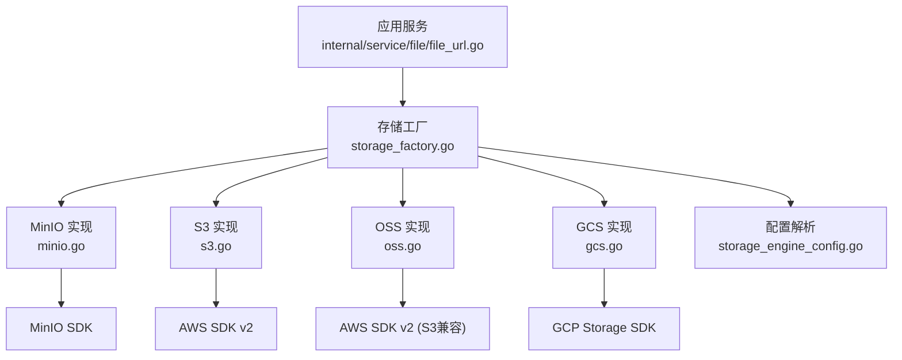
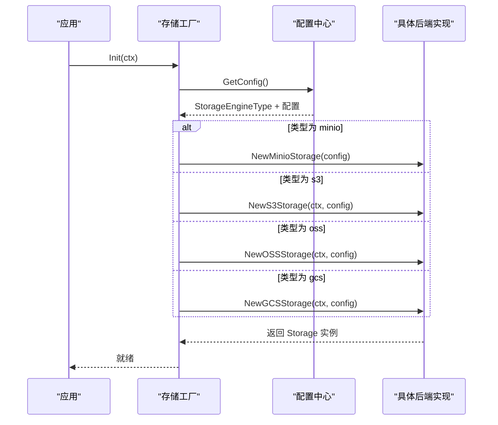
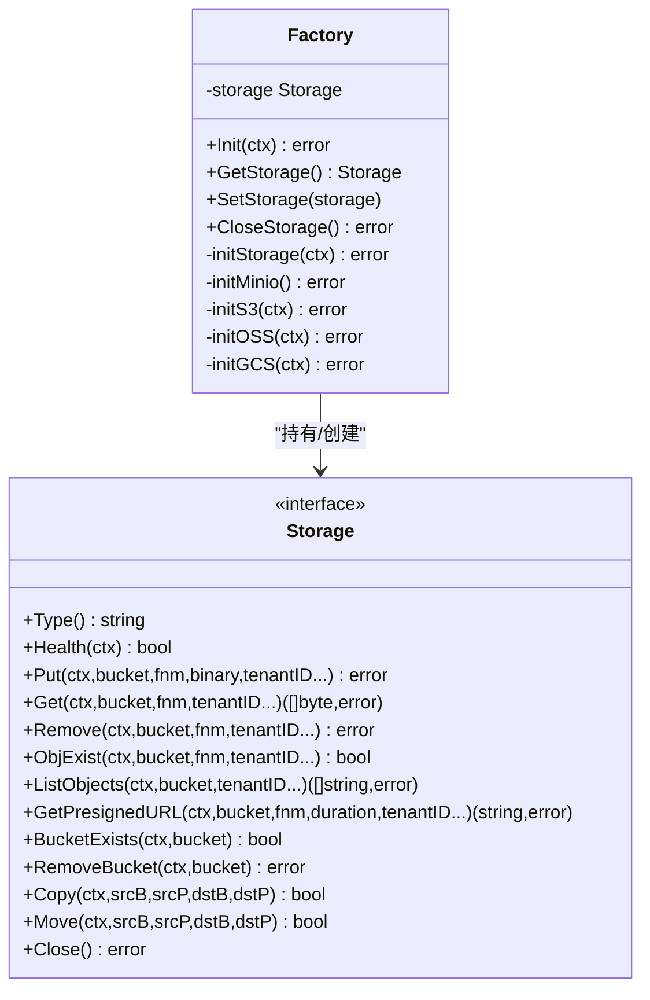
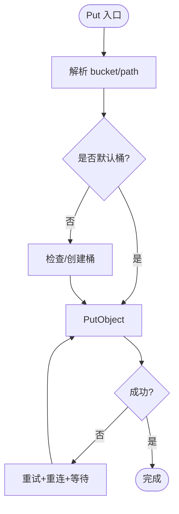
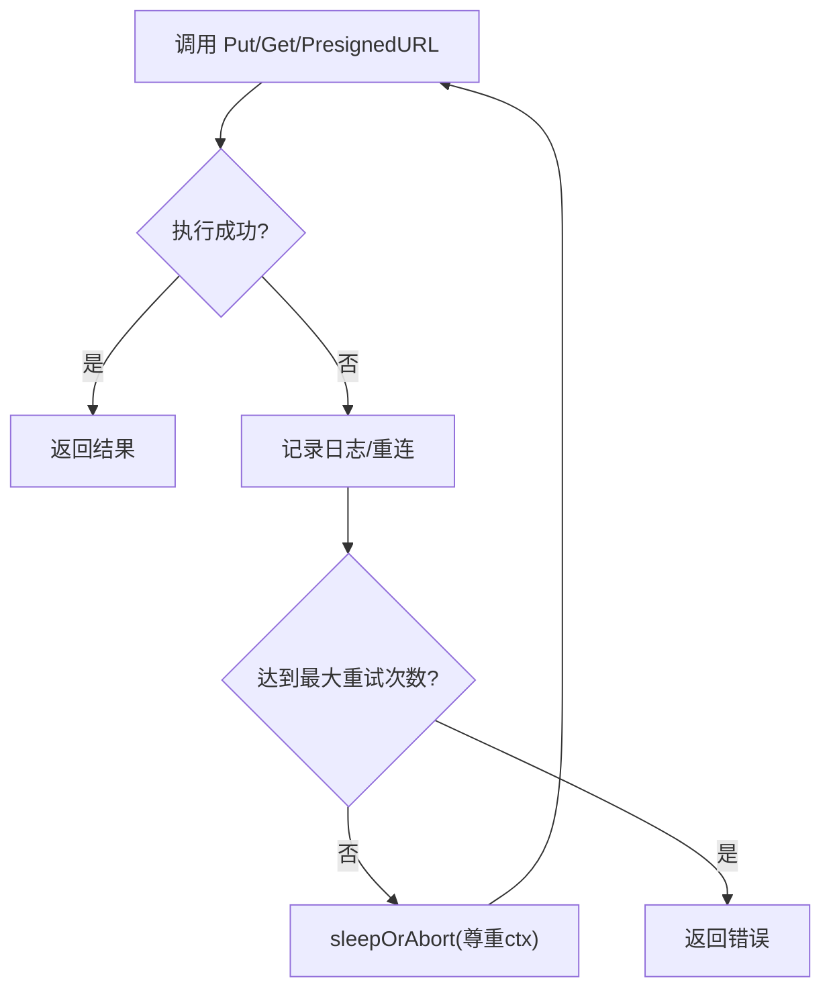
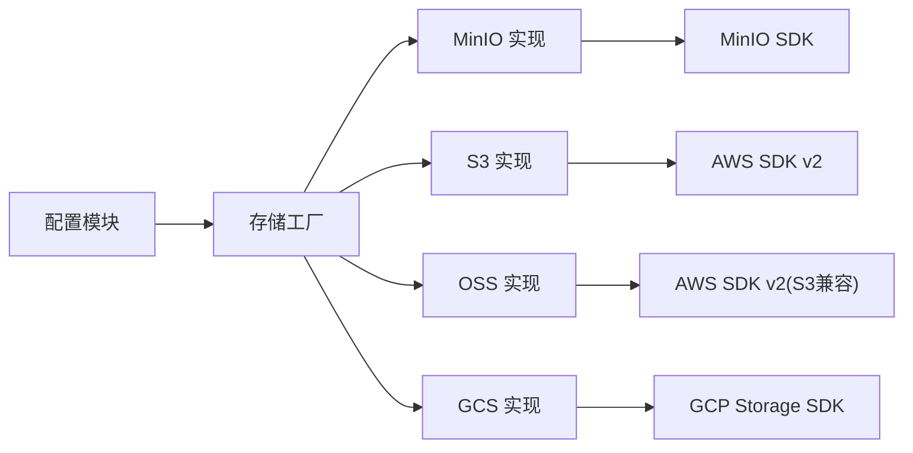

# 对象存储抽象层

<cite>
**本文引用的文件**
- [internal/storage/types.go](file://internal/storage/types.go)
- [internal/storage/storage_factory.go](file://internal/storage/storage_factory.go)
- [internal/storage/minio.go](file://internal/storage/minio.go)
- [internal/storage/s3.go](file://internal/storage/s3.go)
- [internal/storage/oss.go](file://internal/storage/oss.go)
- [internal/storage/gcs.go](file://internal/storage/gcs.go)
- [internal/server/config/storage_engine_config.go](file://internal/server/config/storage_engine_config.go)
- [internal/common/retry.go](file://internal/common/retry.go)
- [internal/service/file/file_url.go](file://internal/service/file/file_url.go)
</cite>

## 目录
1. [简介](#简介)
2. [项目结构](#项目结构)
3. [核心组件](#核心组件)
4. [架构总览](#架构总览)
5. [详细组件分析](#详细组件分析)
6. [依赖关系分析](#依赖关系分析)
7. [性能与优化建议](#性能与优化建议)
8. [故障排查指南](#故障排查指南)
9. [结论](#结论)
10. [附录：配置示例与最佳实践](#附录配置示例与最佳实践)

## 简介
本文件面向对象存储抽象层，系统性说明 Storage 接口的统一设计、工厂模式如何根据配置动态选择 MinIO、AWS S3、阿里云 OSS、Google Cloud Storage 等后端，以及连接配置、认证机制、错误处理策略。同时给出各后端的配置要点与最佳实践，并提供连接池管理、并发控制、重试机制等性能优化建议。

## 项目结构
- 接口定义与类型：internal/storage/types.go
- 工厂与生命周期：internal/storage/storage_factory.go
- 后端实现：
  - MinIO：internal/storage/minio.go
  - AWS S3：internal/storage/s3.go
  - 阿里云 OSS：internal/storage/oss.go
  - Google Cloud Storage：internal/storage/gcs.go
- 配置解析：internal/server/config/storage_engine_config.go
- 通用重试工具：internal/common/retry.go
- 上层使用示例（通过工厂获取存储实例）：internal/service/file/file_url.go

图表来源
- [internal/storage/storage_factory.go:70-140](file://internal/storage/storage_factory.go#L70-L140)
- [internal/storage/minio.go:42-82](file://internal/storage/minio.go#L42-L82)
- [internal/storage/s3.go:45-95](file://internal/storage/s3.go#L45-L95)
- [internal/storage/oss.go:45-84](file://internal/storage/oss.go#L45-L84)
- [internal/storage/gcs.go:39-61](file://internal/storage/gcs.go#L39-L61)
- [internal/server/config/storage_engine_config.go:33-48](file://internal/server/config/storage_engine_config.go#L33-L48)

章节来源
- [internal/storage/types.go:24-103](file://internal/storage/types.go#L24-L103)
- [internal/storage/storage_factory.go:28-169](file://internal/storage/storage_factory.go#L28-L169)
- [internal/server/config/storage_engine_config.go:25-48](file://internal/server/config/storage_engine_config.go#L25-L48)

## 核心组件
- Storage 接口：统一抽象了健康检查、上传、下载、删除、存在性检查、列表、预签名 URL、桶操作、复制/移动、关闭等能力。
- 工厂模式：根据全局配置中的存储引擎类型，在启动时创建并缓存对应的后端实现；提供线程安全的访问与替换能力（便于测试）。
- 后端实现：
  - MinIO：基于 minio-go，支持自定义传输层 TLS 校验、默认桶/前缀路径、自动建桶、重试与重连。
  - AWS S3：基于 aws-sdk-go-v2，支持区域、静态密钥、会话令牌、自定义 Endpoint、预签名 URL、版本化对象清理。
  - 阿里云 OSS：复用 S3 兼容客户端，通过 EndpointURL 指向 OSS 服务。
  - GCS：基于 google/go-storage，原生支持 GCS 的读写、列表、预签名 URL、桶删除等。
- 配置系统：集中解析 minio/s3/oss/gcs 的配置项，暴露 GetXxxConfig 方法供工厂初始化使用。
- 重试与恢复：Put/Get/PresignedURL 等关键路径内置有限次重试与上下文感知等待，配合通用重试工具可进一步扩展。

章节来源
- [internal/storage/types.go:58-103](file://internal/storage/types.go#L58-L103)
- [internal/storage/storage_factory.go:47-147](file://internal/storage/storage_factory.go#L47-L147)
- [internal/storage/minio.go:127-224](file://internal/storage/minio.go#L127-L224)
- [internal/storage/s3.go:165-246](file://internal/storage/s3.go#L165-L246)
- [internal/storage/oss.go:148-239](file://internal/storage/oss.go#L148-L239)
- [internal/storage/gcs.go:76-107](file://internal/storage/gcs.go#L76-L107)
- [internal/server/config/storage_engine_config.go:50-281](file://internal/server/config/storage_engine_config.go#L50-L281)

## 架构总览
启动流程：
1. 读取全局配置，确定 StorageEngineType（如 minio/s3/oss/gcs）。
2. 工厂根据类型调用对应 initXxx 方法，构造具体后端实例并缓存。
3. 业务侧通过工厂获取 Storage 实例进行数据存取。

图表来源
- [internal/storage/storage_factory.go:47-140](file://internal/storage/storage_factory.go#L47-L140)
- [internal/server/config/storage_engine_config.go:33-48](file://internal/server/config/storage_engine_config.go#L33-L48)

章节来源
- [internal/storage/storage_factory.go:47-140](file://internal/storage/storage_factory.go#L47-L140)
- [internal/server/config/storage_engine_config.go:33-48](file://internal/server/config/storage_engine_config.go#L33-L48)

## 详细组件分析

### Storage 接口与类型
- 类型枚举：定义了支持的存储后端类型标识。
- 接口方法：
  - Health：健康检查
  - Put/Get/Remove：上传、下载、删除
  - ObjExist：对象存在性检查
  - ListObjects：列出对象
  - GetPresignedURL：生成临时访问链接
  - BucketExists/RemoveBucket：桶级操作
  - Copy/Move：跨对象移动/复制
  - Close：资源释放

复杂度与注意事项
- 列表操作通常为 O(N) 或受服务端分页限制影响。
- 预签名 URL 生成一般 O(1)，但受网络与后端延迟影响。
- 大对象上传/下载需关注内存占用与流式处理。

章节来源
- [internal/storage/types.go:24-103](file://internal/storage/types.go#L24-L103)

### 工厂模式与生命周期
- 单例工厂：全局唯一，线程安全读写。
- 初始化：根据配置选择后端并创建实例。
- 关闭：统一释放底层连接。
- 测试注入：可通过 SetStorage 替换为内存或 Mock 实现。

图表来源
- [internal/storage/storage_factory.go:28-169](file://internal/storage/storage_factory.go#L28-L169)
- [internal/storage/types.go:58-103](file://internal/storage/types.go#L58-L103)

章节来源
- [internal/storage/storage_factory.go:28-169](file://internal/storage/storage_factory.go#L28-L169)

### MinIO 后端
- 连接与认证：静态 V4 凭据，可选 HTTPS/TLS 校验开关，支持 region。
- 桶与路径：支持默认桶与 prefixPath；未设置默认桶时按需创建。
- 重试与重连：Put/Get/PresignedURL 包含有限次重试与上下文感知的短暂休眠；失败时尝试重建客户端。
- 列表与删除：递归列出对象；删除桶时按前缀清理对象后再删除桶（非单桶模式）。

图表来源
- [internal/storage/minio.go:127-182](file://internal/storage/minio.go#L127-L182)
- [internal/storage/minio.go:90-108](file://internal/storage/minio.go#L90-L108)

章节来源
- [internal/storage/minio.go:42-108](file://internal/storage/minio.go#L42-L108)
- [internal/storage/minio.go:127-224](file://internal/storage/minio.go#L127-L224)
- [internal/storage/minio.go:260-315](file://internal/storage/minio.go#L260-L315)
- [internal/storage/minio.go:317-365](file://internal/storage/minio.go#L317-L365)

### AWS S3 后端
- 连接与认证：支持区域、静态密钥、会话令牌、自定义 Endpoint。
- 桶与路径：支持默认桶与 prefixPath；首次写入时按需创建桶。
- 重试与重连：Put/Get/PresignedURL 具备重试与重连逻辑。
- 列表与删除：支持版本化对象的批量删除；删除桶前先清空所有版本与标记。

章节来源
- [internal/storage/s3.go:45-95](file://internal/storage/s3.go#L45-L95)
- [internal/storage/s3.go:165-246](file://internal/storage/s3.go#L165-L246)
- [internal/storage/s3.go:302-324](file://internal/storage/s3.go#L302-L324)
- [internal/storage/s3.go:344-436](file://internal/storage/s3.go#L344-L436)

### 阿里云 OSS 后端
- 连接与认证：通过 S3 兼容客户端，以 EndpointURL 指向 OSS。
- 桶与路径：支持默认桶与 prefixPath；首次写入时按需创建桶。
- 重试与重连：Put/Get/PresignedURL 具备重试与重连逻辑。
- 列表与删除：分页列出对象并逐个删除；最后删除桶。

章节来源
- [internal/storage/oss.go:45-84](file://internal/storage/oss.go#L45-L84)
- [internal/storage/oss.go:148-239](file://internal/storage/oss.go#L148-L239)
- [internal/storage/oss.go:295-321](file://internal/storage/oss.go#L295-L321)
- [internal/storage/oss.go:341-391](file://internal/storage/oss.go#L341-L391)

### Google Cloud Storage 后端
- 连接与认证：使用官方 SDK 创建客户端。
- 桶与路径：支持默认桶；列表与删除均基于官方 API。
- 预签名 URL：通过 SignedURL 生成临时访问链接。
- 列表与删除：迭代对象并删除，再删除桶。

章节来源
- [internal/storage/gcs.go:39-61](file://internal/storage/gcs.go#L39-L61)
- [internal/storage/gcs.go:76-107](file://internal/storage/gcs.go#L76-L107)
- [internal/storage/gcs.go:154-168](file://internal/storage/gcs.go#L154-L168)
- [internal/storage/gcs.go:185-213](file://internal/storage/gcs.go#L185-L213)

### 配置系统与认证机制
- 配置项：
  - MinIO：host/user/password/bucket/prefix_path/secure/verify/region
  - S3：access_key/secret_key/region/session_token/endpoint_url/signature_version/addressing_style/bucket/prefix_path
  - OSS：access_key/secret_key/endpoint_url/region/bucket/prefix_path/signature_version/addressing_style
  - GCS：bucket/prefix_path/endpoint_url
- 解析流程：根据全局 StorageEngine 字段选择对应 parseXxxConfig 方法填充配置结构体。
- 认证方式：
  - MinIO：静态 V4 凭据
  - S3/OSS：静态密钥或环境变量/配置文件（由 SDK 加载），支持自定义 Endpoint
  - GCS：SDK 默认凭据链（服务账号、元数据服务器等）

章节来源
- [internal/server/config/storage_engine_config.go:50-281](file://internal/server/config/storage_engine_config.go#L50-L281)

### 错误处理与重试机制
- 后端内重试：MinIO/S3/OSS 在 Put/Get/PresignedURL 等关键路径实现了有限次重试与短暂休眠，并在失败时尝试重建客户端。
- 上下文感知：重试等待期间响应 ctx 取消/超时。
- 通用重试工具：common.RetryWithBackoff 提供指数退避重试，可用于更复杂的场景封装。

图表来源
- [internal/storage/minio.go:127-182](file://internal/storage/minio.go#L127-L182)
- [internal/storage/s3.go:165-246](file://internal/storage/s3.go#L165-L246)
- [internal/storage/oss.go:148-239](file://internal/storage/oss.go#L148-L239)
- [internal/storage/storage_factory.go:156-168](file://internal/storage/storage_factory.go#L156-L168)
- [internal/common/retry.go:1-42](file://internal/common/retry.go#L1-L42)

章节来源
- [internal/storage/minio.go:127-224](file://internal/storage/minio.go#L127-L224)
- [internal/storage/s3.go:165-246](file://internal/storage/s3.go#L165-L246)
- [internal/storage/oss.go:148-239](file://internal/storage/oss.go#L148-L239)
- [internal/common/retry.go:1-42](file://internal/common/retry.go#L1-L42)

### 上层使用示例
- 通过工厂获取存储实例，用于远程文件上传到对象存储。
- 若未初始化则返回“存储未初始化”错误。

章节来源
- [internal/service/file/file_url.go:33-50](file://internal/service/file/file_url.go#L33-L50)

## 依赖关系分析
- 工厂依赖配置模块决定后端类型。
- 各后端分别依赖其官方 SDK。
- 上层服务仅依赖 Storage 接口，解耦良好。

图表来源
- [internal/storage/storage_factory.go:70-140](file://internal/storage/storage_factory.go#L70-L140)
- [internal/server/config/storage_engine_config.go:33-48](file://internal/server/config/storage_engine_config.go#L33-L48)

章节来源
- [internal/storage/storage_factory.go:70-140](file://internal/storage/storage_factory.go#L70-L140)
- [internal/server/config/storage_engine_config.go:33-48](file://internal/server/config/storage_engine_config.go#L33-L48)

## 性能与优化建议
- 连接与客户端
  - 复用 SDK 客户端：各后端实现均在进程内复用客户端实例，避免频繁握手。
  - 合理设置超时与并发：依据后端 SDK 默认行为并结合业务 QPS 调整。
- 重试与退避
  - 已内置有限次重试与短暂休眠；对瞬时错误有较好容错。
  - 复杂场景可使用 common.RetryWithBackoff 实现指数退避与抖动。
- 列表与删除
  - 列表采用分页/迭代器，注意大数据量时的内存与耗时。
  - 删除桶前批量删除对象，S3 支持版本化对象批量删除，OSS/GCS 逐条删除。
- 预签名 URL
  - 适合前端直传/直下，减少后端带宽压力；注意过期时间与安全策略。
- 并发控制
  - 建议在业务层结合 goroutine 池或限流器控制并发度，避免打满后端连接数。
- 监控与可观测性
  - 利用健康检查接口定期探测后端可用性。
  - 记录关键指标：成功率、延迟、重试次数、错误码分布。

[本节为通用指导，不直接分析具体文件]

## 故障排查指南
- 无法连接后端
  - 检查配置项（host/endpoint_url/region/credentials）是否正确。
  - 观察健康检查返回值与日志中重连提示。
- 上传/下载失败
  - 查看重试次数与错误信息；确认桶/对象权限与命名规范。
  - 大文件建议分片或流式处理，避免内存峰值过高。
- 列表/删除缓慢
  - 对象数量巨大时，列表与删除会耗时较长；考虑分批或异步任务。
- 预签名 URL 无效
  - 检查过期时间与后端签名算法；确保网络可达且域名解析正确。

章节来源
- [internal/storage/minio.go:112-125](file://internal/storage/minio.go#L112-L125)
- [internal/storage/s3.go:125-163](file://internal/storage/s3.go#L125-L163)
- [internal/storage/oss.go:108-146](file://internal/storage/oss.go#L108-L146)
- [internal/storage/gcs.go:71-74](file://internal/storage/gcs.go#L71-L74)

## 结论
该对象存储抽象层通过统一的 Storage 接口屏蔽了不同云厂商的差异，借助工厂模式在启动时根据配置动态选择后端，具备良好的可扩展性与可维护性。各后端实现提供了健壮的连接、重试与资源管理能力，满足生产环境的稳定性要求。结合合理的配置与性能优化策略，可在多种存储后端上稳定运行。

[本节为总结，不直接分析具体文件]

## 附录：配置示例与最佳实践

- MinIO
  - 关键配置：host、user、password、bucket（可选）、prefix_path（可选）、secure/verify、region
  - 建议：开启 secure 并使用可信证书；生产环境固定 bucket 与 prefix 隔离多租户数据。
  - 参考：[internal/server/config/storage_engine_config.go:50-112](file://internal/server/config/storage_engine_config.go#L50-L112)

- AWS S3
  - 关键配置：access_key、secret_key、region、session_token（可选）、endpoint_url（可选）、signature_version、addressing_style、bucket、prefix_path
  - 建议：使用 IAM 最小权限原则；大对象启用分块上传（由 SDK 内部处理）；合理设置超时与重试。
  - 参考：[internal/server/config/storage_engine_config.go:114-182](file://internal/server/config/storage_engine_config.go#L114-L182)

- 阿里云 OSS
  - 关键配置：access_key、secret_key、endpoint_url、region、bucket、prefix_path、signature_version、addressing_style
  - 建议：使用 S3 兼容端点；按地域选择 endpoint；开启防盗链与生命周期规则。
  - 参考：[internal/server/config/storage_engine_config.go:184-248](file://internal/server/config/storage_engine_config.go#L184-L248)

- Google Cloud Storage
  - 关键配置：bucket（可选）、prefix_path（可选）、endpoint_url（可选）
  - 建议：使用服务账号授权；结合 IAM 控制访问；合理利用预签名 URL 降低后端负载。
  - 参考：[internal/server/config/storage_engine_config.go:250-281](file://internal/server/config/storage_engine_config.go#L250-L281)

- 通用最佳实践
  - 使用 prefix_path 做租户/环境隔离。
  - 统一错误处理与日志埋点，便于定位问题。
  - 定期健康检查与告警，保障高可用。
  - 对大文件采用流式读写，避免内存溢出。
  - 结合业务限流与并发控制，保护后端资源。

[本节为配置与最佳实践汇总，不直接分析具体文件]