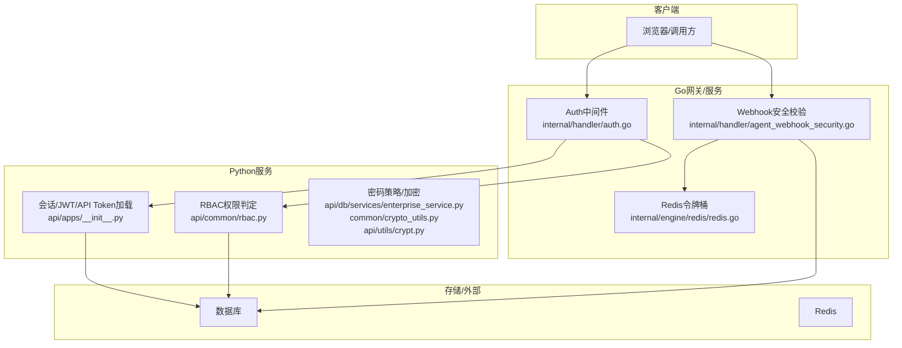
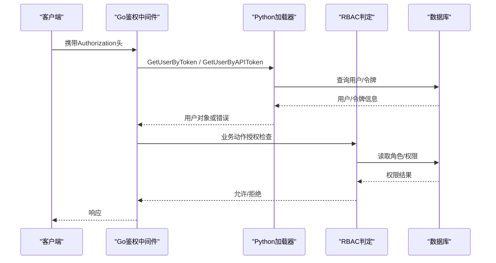
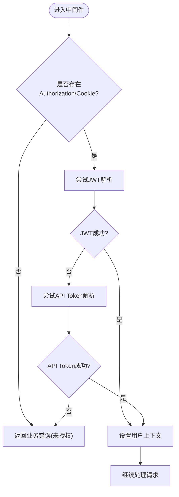
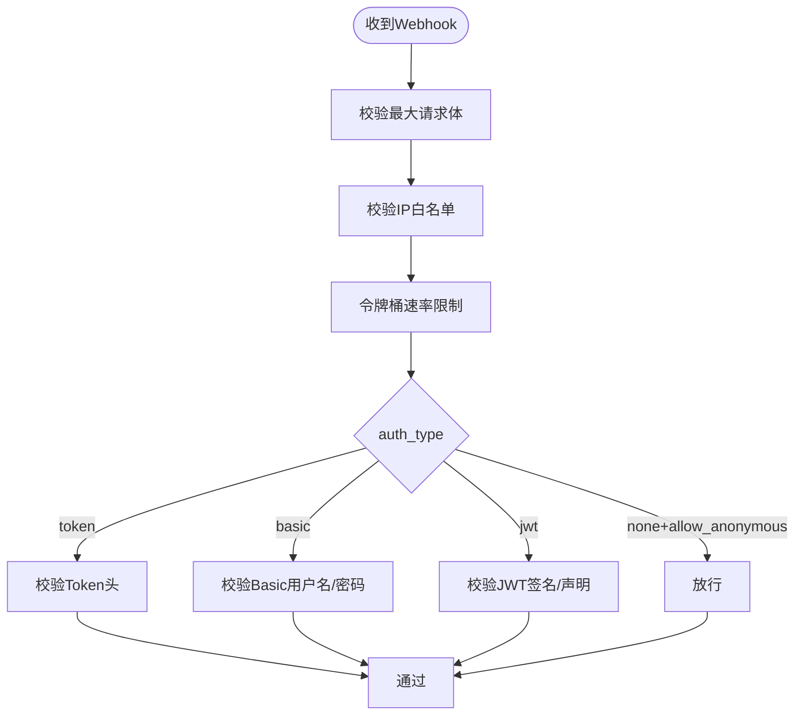
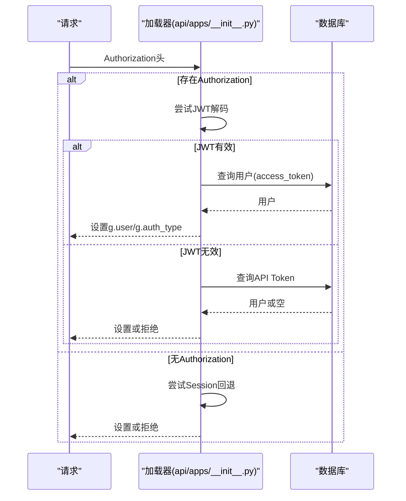
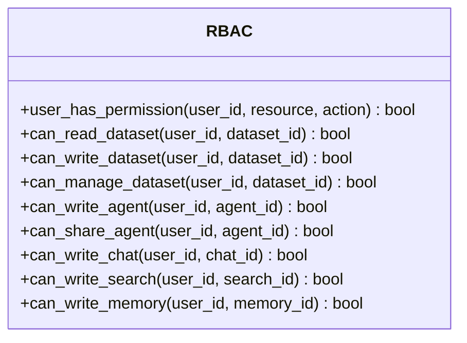
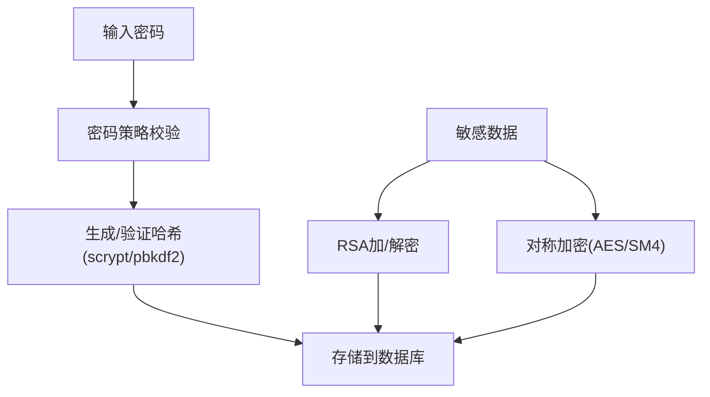
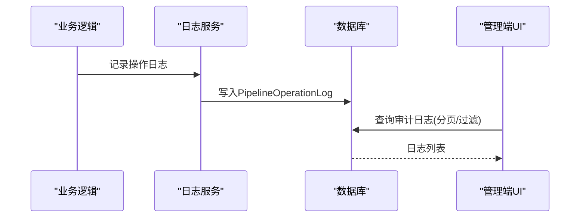
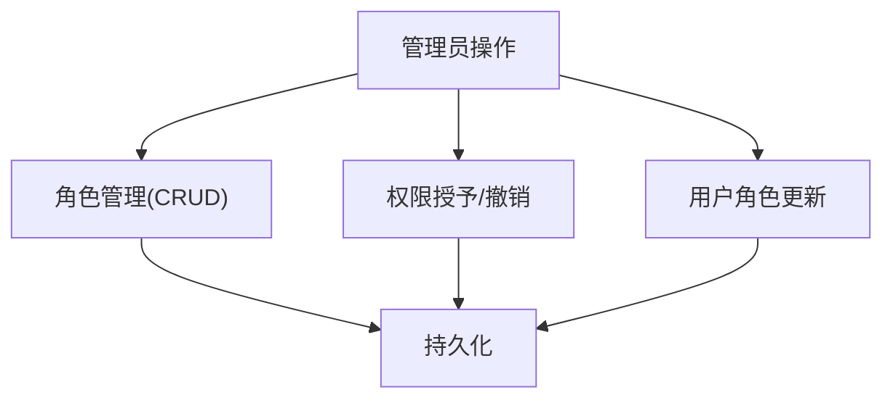
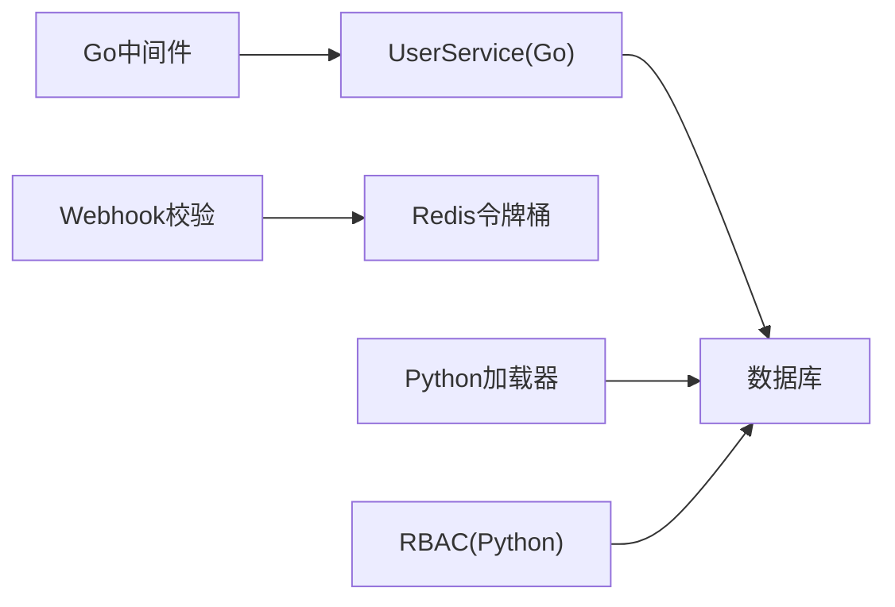

# 安全与认证

<cite>
**本文引用的文件**
- [internal/handler/auth.go](file://internal/handler/auth.go)
- [internal/service/user.go](file://internal/service/user.go)
- [api/apps/__init__.py](file://api/apps/__init__.py)
- [api/apps/restful_apis/agent_api.py](file://api/apps/restful_apis/agent_api.py)
- [internal/handler/agent_webhook_security.go](file://internal/handler/agent_webhook_security.go)
- [internal/engine/redis/redis.go](file://internal/engine/redis/redis.go)
- [api/common/rbac.py](file://api/common/rbac.py)
- [internal/admin/handler_ee.go](file://internal/admin/handler_ee.go)
- [api/db/services/pipeline_operation_log_service.py](file://api/db/services/pipeline_operation_log_service.py)
- [web/src/pages/admin/audit-logs.tsx](file://web/src/pages/admin/audit-logs.tsx)
- [common/crypto_utils.py](file://common/crypto_utils.py)
- [api/utils/crypt.py](file://api/utils/crypt.py)
- [SECURITY.md](file://SECURITY.md)
</cite>

## 目录
1. [简介](#简介)
2. [项目结构](#项目结构)
3. [核心组件](#核心组件)
4. [架构总览](#架构总览)
5. [详细组件分析](#详细组件分析)
6. [依赖关系分析](#依赖关系分析)
7. [性能考虑](#性能考虑)
8. [故障排查指南](#故障排查指南)
9. [结论](#结论)
10. [附录](#附录)

## 简介
本文件面向RAGFlow的安全与认证子系统，系统性说明用户认证机制（JWT、API Token、Session）、基于角色的访问控制（RBAC）模型、数据安全保护措施（密码加密、传输加密、敏感信息脱敏）、API安全防护（请求签名/令牌校验、速率限制、IP白名单）、安全配置指南与常见威胁防护方法，以及安全审计与合规性实现要点。文档以代码为依据，提供可追溯的源码路径与可视化图示，帮助读者快速理解并落地安全实践。

## 项目结构
安全与认证相关能力分布在Go后端与Python后端两条链路中：
- Go侧：统一鉴权中间件、Webhook安全校验（含速率限制、IP白名单、JWT/Bearer校验）、Redis令牌桶限流等。
- Python侧：会话/JWT/API Token加载、RBAC权限判定、密码策略、数据脱敏等。
- 前端：审计日志查看界面。

**图表来源**
- [internal/handler/auth.go:54-113](file://internal/handler/auth.go#L54-L113)
- [internal/handler/agent_webhook_security.go:107-126](file://internal/handler/agent_webhook_security.go#L107-L126)
- [internal/engine/redis/redis.go:940-971](file://internal/engine/redis/redis.go#L940-L971)
- [api/apps/__init__.py:137-233](file://api/apps/__init__.py#L137-L233)
- [api/common/rbac.py:21-99](file://api/common/rbac.py#L21-L99)

**章节来源**
- [internal/handler/auth.go:54-113](file://internal/handler/auth.go#L54-L113)
- [internal/handler/agent_webhook_security.go:107-126](file://internal/handler/agent_webhook_security.go#L107-L126)
- [api/apps/__init__.py:137-233](file://api/apps/__init__.py#L137-L233)
- [api/common/rbac.py:21-99](file://api/common/rbac.py#L21-L99)

## 核心组件
- 统一鉴权中间件：支持JWT（会话）、API Token、Beta API Token三种方式，按优先级解析Authorization头或Cookie，设置上下文用户信息。
- Webhook安全校验：对入站Webhook进行最大请求体大小、IP白名单、速率限制、Token/Bearer/JWT校验，默认“失败关闭”（fail-closed）。
- 会话/JWT/API Token加载：Python端从Authorization或Session Cookie恢复用户，兼容JWT与API Token。
- RBAC权限判定：基于角色与资源动作的细粒度授权，支持数据集、智能体、对话、搜索、记忆等资源的读写与共享控制。
- 密码与加密：支持werkzeug兼容哈希（scrypt/pbkdf2）、RSA加解密、通用对称加密工具类。
- 审计日志：记录操作时间、用户、动作、资源类型与ID、IP等，并提供管理端查询界面。

**章节来源**
- [internal/handler/auth.go:54-113](file://internal/handler/auth.go#L54-L113)
- [internal/handler/agent_webhook_security.go:107-126](file://internal/handler/agent_webhook_security.go#L107-L126)
- [api/apps/__init__.py:137-233](file://api/apps/__init__.py#L137-L233)
- [api/common/rbac.py:21-99](file://api/common/rbac.py#L21-L99)
- [common/crypto_utils.py:34-65](file://common/crypto_utils.py#L34-L65)
- [api/utils/crypt.py:37-63](file://api/utils/crypt.py#L37-L63)
- [api/db/services/pipeline_operation_log_service.py:131-200](file://api/db/services/pipeline_operation_log_service.py#L131-L200)

## 架构总览
下图展示一次受保护的API请求在Go与Python之间的认证与授权流程，包括JWT、API Token与会话回退，以及RBAC检查。

**图表来源**
- [internal/handler/auth.go:116-163](file://internal/handler/auth.go#L116-L163)
- [internal/service/user.go:947-981](file://internal/service/user.go#L947-L981)
- [api/apps/__init__.py:200-233](file://api/apps/__init__.py#L200-L233)
- [api/common/rbac.py:21-99](file://api/common/rbac.py#L21-L99)

## 详细组件分析

### 统一鉴权中间件（Go）
- 功能要点
  - BetaAuthMiddleware：优先尝试Beta API Token，其次JWT（会话），再普通API Token；未通过返回业务错误码。
  - AuthMiddleware：要求Authorization存在，先JWT后API Token；禁止超级管理员访问受限URL；检查许可证可用性。
- 关键行为
  - 从Authorization或Cookie获取凭证。
  - 将用户信息写入上下文，标记是否通过API Token访问。
  - 对缺失或无效凭证返回明确的HTTP状态码或业务错误。

**图表来源**
- [internal/handler/auth.go:54-113](file://internal/handler/auth.go#L54-L113)
- [internal/handler/auth.go:116-163](file://internal/handler/auth.go#L116-L163)

**章节来源**
- [internal/handler/auth.go:54-113](file://internal/handler/auth.go#L54-L113)
- [internal/handler/auth.go:116-163](file://internal/handler/auth.go#L116-L163)
- [internal/service/user.go:947-981](file://internal/service/user.go#L947-L981)

### Webhook安全校验（Go）
- 功能要点
  - 最大请求体大小限制（单位KB/MB，上限10MB）。
  - IP白名单（精确匹配与CIDR）。
  - 速率限制（基于Redis令牌桶，严格失败关闭）。
  - 认证方式：Token头、Basic Auth、JWT（HS/RS/ES系列，支持audience/issuer/required_claims）。
  - 默认“失败关闭”，需显式allow_anonymous=true才允许匿名。
- 关键行为
  - 顺序执行：max_body_size → ip_whitelist → rate_limit → auth。
  - Redis不可用时，严格模式下直接报错，避免静默放行。

**图表来源**
- [internal/handler/agent_webhook_security.go:107-126](file://internal/handler/agent_webhook_security.go#L107-L126)
- [internal/handler/agent_webhook_security.go:128-201](file://internal/handler/agent_webhook_security.go#L128-L201)
- [internal/handler/agent_webhook_security.go:203-303](file://internal/handler/agent_webhook_security.go#L203-L303)
- [internal/handler/agent_webhook_security.go:305-513](file://internal/handler/agent_webhook_security.go#L305-L513)
- [internal/engine/redis/redis.go:940-971](file://internal/engine/redis/redis.go#L940-L971)

**章节来源**
- [internal/handler/agent_webhook_security.go:107-126](file://internal/handler/agent_webhook_security.go#L107-L126)
- [internal/handler/agent_webhook_security.go:128-201](file://internal/handler/agent_webhook_security.go#L128-L201)
- [internal/handler/agent_webhook_security.go:203-303](file://internal/handler/agent_webhook_security.go#L203-L303)
- [internal/handler/agent_webhook_security.go:305-513](file://internal/handler/agent_webhook_security.go#L305-L513)
- [internal/engine/redis/redis.go:940-971](file://internal/engine/redis/redis.go#L940-L971)

### 会话/JWT/API Token加载（Python）
- 功能要点
  - 优先从Authorization头解析，若无则尝试Session Cookie回退。
  - 支持JWT解码与API Token查找，失败时返回None。
  - 对空/过短/失效的access_token进行防御性检查。
- 关键行为
  - 区分AUTH_JWT与AUTH_API两种认证类型。
  - 将用户与认证类型注入g上下文供后续使用。

**图表来源**
- [api/apps/__init__.py:137-171](file://api/apps/__init__.py#L137-L171)
- [api/apps/__init__.py:200-233](file://api/apps/__init__.py#L200-L233)

**章节来源**
- [api/apps/__init__.py:137-171](file://api/apps/__init__.py#L137-L171)
- [api/apps/__init__.py:200-233](file://api/apps/__init__.py#L200-L233)

### RBAC权限模型（Python）
- 功能要点
  - 超级用户始终放行；未分配企业角色的用户保持向后兼容（默认放行）。
  - 资源级权限：dataset、agent、chat、search、memory等，支持read/write/share等动作。
  - 结合知识库ACL与实体归属（如canvas/对话/搜索/记忆的所有者）做细粒度控制。
- 关键行为
  - user_has_permission作为统一入口，封装角色与资源权限判断。
  - can_*函数为具体资源提供便捷判定。

**图表来源**
- [api/common/rbac.py:21-99](file://api/common/rbac.py#L21-L99)

**章节来源**
- [api/common/rbac.py:21-99](file://api/common/rbac.py#L21-L99)

### 密码策略与加密（Python/Go）
- 密码策略
  - 最小长度、大小写、数字、特殊字符等规则可由安全设置驱动。
- 密码哈希
  - 兼容werkzeug格式：scrypt与pbkdf2，支持验证与生成。
- 数据传输/存储加密
  - RSA公钥/私钥加解密用于敏感字段传输与存储。
  - 通用对称加密工具类（AES/SM4等），PBKDF2派生密钥，随机IV。

**图表来源**
- [api/db/services/enterprise_service.py:616-629](file://api/db/services/enterprise_service.py#L616-L629)
- [internal/common/password.go:37-174](file://internal/common/password.go#L37-L174)
- [api/utils/crypt.py:37-63](file://api/utils/crypt.py#L37-L63)
- [common/crypto_utils.py:34-65](file://common/crypto_utils.py#L34-L65)

**章节来源**
- [api/db/services/enterprise_service.py:616-629](file://api/db/services/enterprise_service.py#L616-L629)
- [internal/common/password.go:37-174](file://internal/common/password.go#L37-L174)
- [api/utils/crypt.py:37-63](file://api/utils/crypt.py#L37-L63)
- [common/crypto_utils.py:34-65](file://common/crypto_utils.py#L34-L65)

### 审计日志与合规（Python/前端）
- 功能要点
  - 记录流水线/任务操作日志，包含创建时间、用户邮箱、动作、资源类型与ID、IP等。
  - 支持分页查询与过滤，便于合规审计与问题回溯。
- 关键行为
  - 服务层负责持久化与字段裁剪（如移除向量索引字段）。
  - 前端提供审计日志页面，支持按时间与动作筛选。

**图表来源**
- [api/db/services/pipeline_operation_log_service.py:131-200](file://api/db/services/pipeline_operation_log_service.py#L131-L200)
- [web/src/pages/admin/audit-logs.tsx:47-186](file://web/src/pages/admin/audit-logs.tsx#L47-L186)

**章节来源**
- [api/db/services/pipeline_operation_log_service.py:131-200](file://api/db/services/pipeline_operation_log_service.py#L131-L200)
- [web/src/pages/admin/audit-logs.tsx:47-186](file://web/src/pages/admin/audit-logs.tsx#L47-L186)

### 角色与权限管理（Go管理端）
- 功能要点
  - 提供角色CRUD、角色权限授予/撤销、资源列表、带权限的角色列表、用户角色更新、用户权限查看等接口。
- 关键行为
  - 参数校验与错误码标准化。
  - 通过服务层完成权限变更与查询。

**图表来源**
- [internal/admin/handler_ee.go:93-240](file://internal/admin/handler_ee.go#L93-L240)
- [internal/admin/handler_ee.go:1044-1081](file://internal/admin/handler_ee.go#L1044-L1081)

**章节来源**
- [internal/admin/handler_ee.go:93-240](file://internal/admin/handler_ee.go#L93-L240)
- [internal/admin/handler_ee.go:1044-1081](file://internal/admin/handler_ee.go#L1044-L1081)

## 依赖关系分析
- 中间件与服务耦合
  - Go鉴权中间件依赖UserService（Go）进行JWT/API Token解析，最终落到数据库。
  - Webhook安全校验依赖Redis令牌桶进行速率限制，强依赖Redis可用性与超时控制。
- Python与Go协作
  - Python加载器负责会话/JWT/API Token的兼容处理，Go中间件负责统一入口与上下文注入。
  - RBAC在Python侧实现，Go侧可通过服务调用或透传用户上下文进行授权。
- 外部依赖
  - Redis：令牌桶限流、OAuth回调（预留扩展）。
  - 数据库：用户、令牌、角色、权限、审计日志等。

**图表来源**
- [internal/handler/auth.go:54-113](file://internal/handler/auth.go#L54-L113)
- [internal/handler/agent_webhook_security.go:248-303](file://internal/handler/agent_webhook_security.go#L248-L303)
- [internal/engine/redis/redis.go:940-971](file://internal/engine/redis/redis.go#L940-L971)
- [api/apps/__init__.py:137-233](file://api/apps/__init__.py#L137-L233)
- [api/common/rbac.py:21-99](file://api/common/rbac.py#L21-L99)

**章节来源**
- [internal/handler/auth.go:54-113](file://internal/handler/auth.go#L54-L113)
- [internal/handler/agent_webhook_security.go:248-303](file://internal/handler/agent_webhook_security.go#L248-L303)
- [internal/engine/redis/redis.go:940-971](file://internal/engine/redis/redis.go#L940-L971)
- [api/apps/__init__.py:137-233](file://api/apps/__init__.py#L137-L233)
- [api/common/rbac.py:21-99](file://api/common/rbac.py#L21-L99)

## 性能考虑
- 速率限制
  - 使用Redis令牌桶实现高吞吐限流，严格模式下对异常失败关闭，避免雪崩。
  - 设置合理的窗口与阈值，避免误杀正常流量。
- 认证开销
  - JWT解析与数据库查询应缓存热点数据（如用户角色/权限）以降低延迟。
  - Session回退仅在无Authorization时触发，减少不必要的数据库访问。
- 请求体限制
  - Webhook最大请求体限制防止大体积攻击，建议结合网关层进一步限制。

[本节为通用指导，不直接分析具体文件]

## 故障排查指南
- 认证失败
  - 检查Authorization头格式（Bearer前缀、令牌有效性）。
  - 确认JWT密钥、算法、受众/签发者配置正确。
  - 若使用API Token，确认令牌存在于数据库且关联用户有效。
- 速率限制触发
  - 检查Redis连接与令牌桶配置，关注超时与错误日志。
  - 调整rate_limit.limit与per参数，避免过于严格。
- IP白名单拦截
  - 确认客户端IP是否在白名单内（支持CIDR与精确匹配）。
  - 检查反向代理X-Forwarded-For配置是否正确传递真实IP。
- 密码策略/加密问题
  - 核对密码复杂度策略与安全设置。
  - 确认RSA公私钥文件可读且匹配，Base64编码正确。
- 审计日志缺失
  - 检查日志写入事务与数据库连接。
  - 确认前端查询条件与分页参数。

**章节来源**
- [internal/handler/auth.go:116-163](file://internal/handler/auth.go#L116-L163)
- [internal/handler/agent_webhook_security.go:248-303](file://internal/handler/agent_webhook_security.go#L248-L303)
- [internal/handler/agent_webhook_security.go:203-236](file://internal/handler/agent_webhook_security.go#L203-L236)
- [api/db/services/enterprise_service.py:616-629](file://api/db/services/enterprise_service.py#L616-L629)
- [api/utils/crypt.py:37-63](file://api/utils/crypt.py#L37-L63)
- [api/db/services/pipeline_operation_log_service.py:131-200](file://api/db/services/pipeline_operation_log_service.py#L131-L200)

## 结论
RAGFlow的安全与认证体系采用Go与Python协同设计：Go侧提供统一的鉴权中间件与Webhook安全校验，Python侧实现会话/JWT/API Token加载、RBAC权限判定与密码策略。通过Redis令牌桶实现高可靠速率限制，结合IP白名单与多种认证方式，形成纵深防御。审计日志与管理端界面满足合规与可观测性需求。建议在生产环境严格配置JWT密钥、速率限制与白名单，定期审查角色与权限，持续完善安全基线。

[本节为总结，不直接分析具体文件]

## 附录
- 安全策略与漏洞报告
  - 参考仓库安全策略与已知漏洞修复建议，确保及时升级与加固。

**章节来源**
- [SECURITY.md:1-75](file://SECURITY.md#L1-L75)