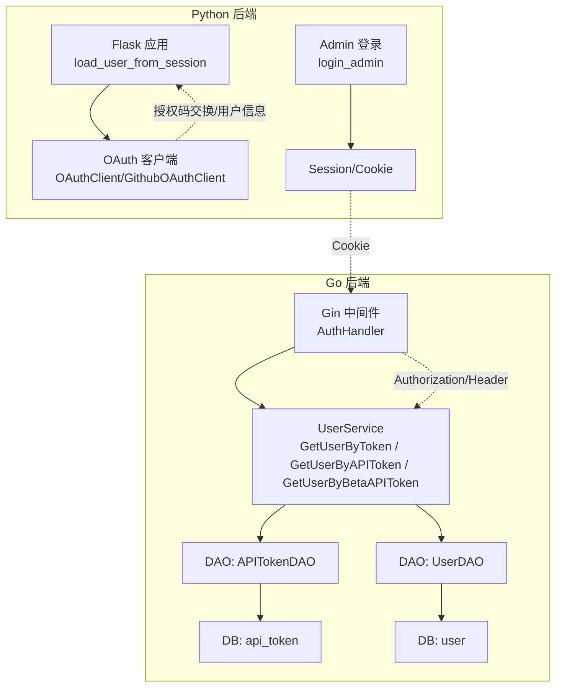
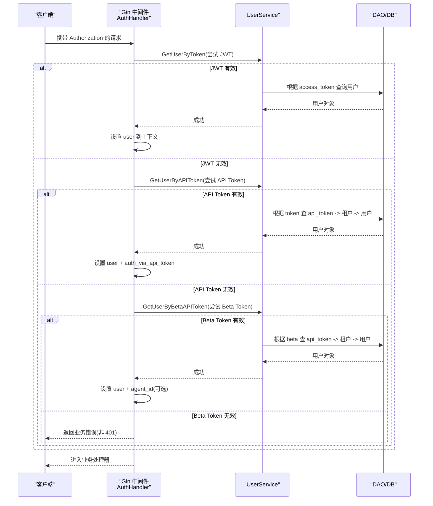
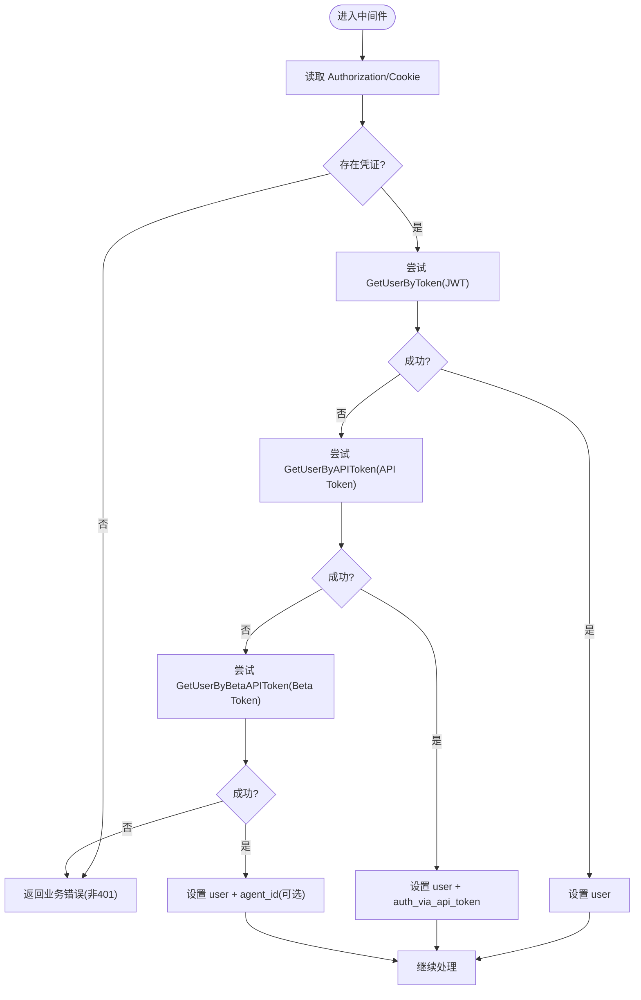
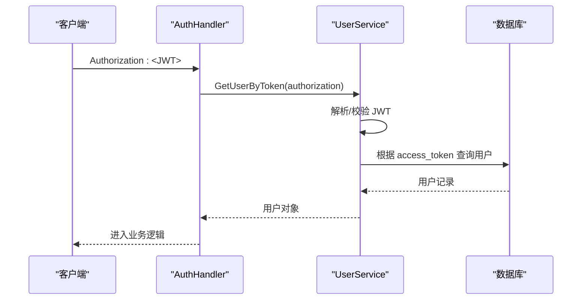
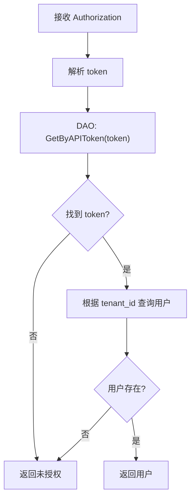
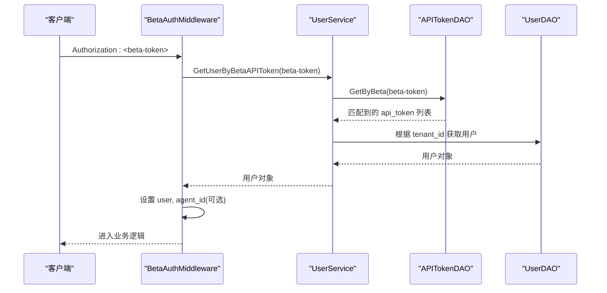
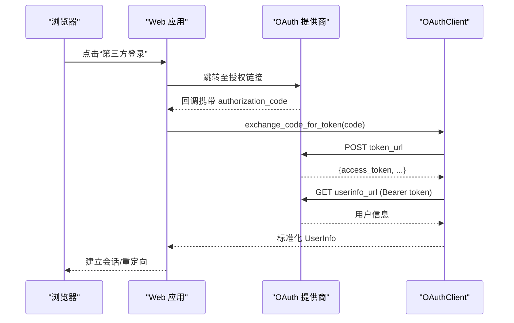
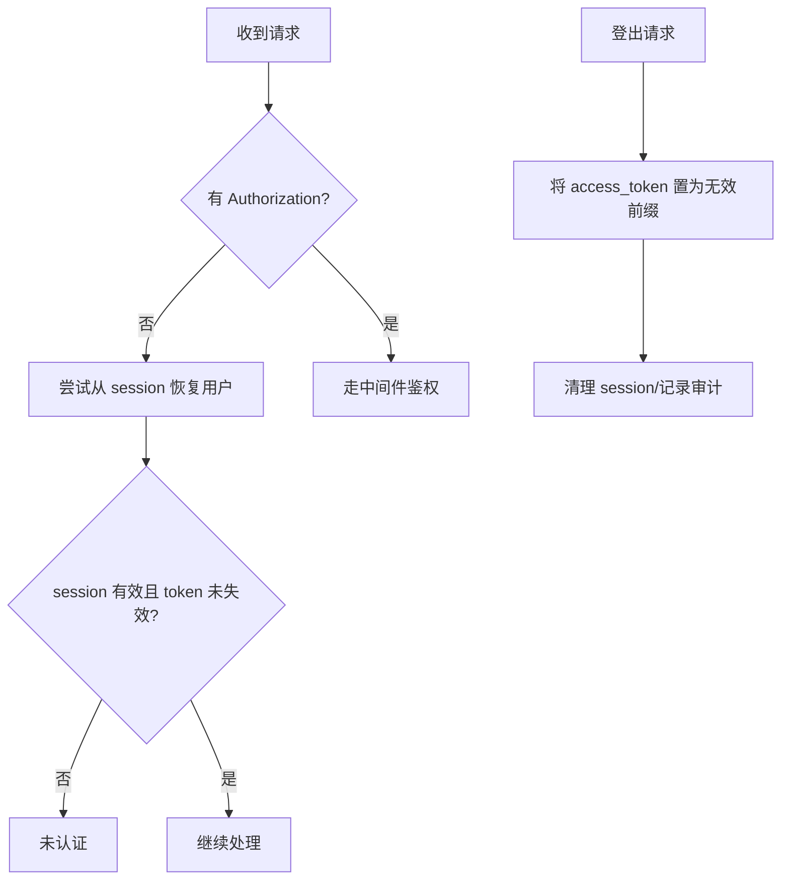
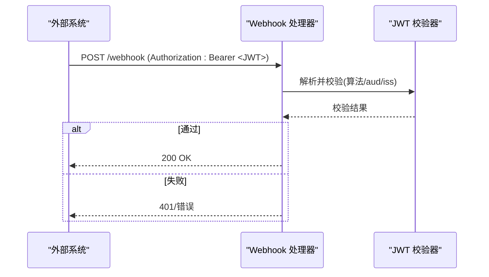
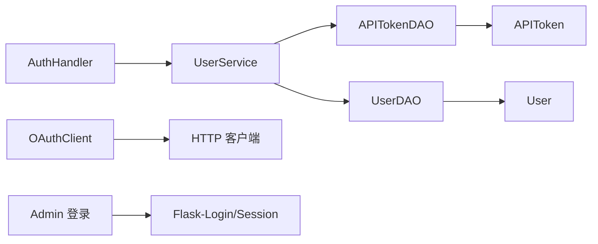

# 用户认证机制

<cite>
**本文引用的文件**
- [internal/handler/auth.go](file://internal/handler/auth.go)
- [internal/service/user.go](file://internal/service/user.go)
- [internal/dao/api_token.go](file://internal/dao/api_token.go)
- [internal/entity/api_token.go](file://internal/entity/api_token.go)
- [api/apps/auth/oauth.py](file://api/apps/auth/oauth.py)
- [api/apps/auth/github.py](file://api/apps/auth/github.py)
- [admin/server/auth.py](file://admin/server/auth.py)
- [api/apps/restful_apis/user_api.py](file://api/apps/restful_apis/user_api.py)
- [common/settings.py](file://common/settings.py)
- [api/apps/__init__.py](file://api/apps/__init__.py)
- [internal/handler/agent_webhook_security.go](file://internal/handler/agent_webhook_security.go)
- [api/apps/restful_apis/agent_api.py](file://api/apps/restful_apis/agent_api.py)
</cite>

## 目录
1. [简介](#简介)
2. [项目结构](#项目结构)
3. [核心组件](#核心组件)
4. [架构总览](#架构总览)
5. [详细组件分析](#详细组件分析)
6. [依赖关系分析](#依赖关系分析)
7. [性能考虑](#性能考虑)
8. [故障排查指南](#故障排查指南)
9. [结论](#结论)
10. [附录](#附录)

## 简介
本文件系统性说明 RAGFlow 的用户认证机制，覆盖以下主题：
- JWT 令牌认证（会话型）与 API Token 认证（无状态）
- OAuth/OIDC 第三方登录流程（含 GitHub、飞书等）
- 认证中间件的工作流程：请求拦截、令牌解析、用户信息提取、权限标记
- 会话管理、登出机制、令牌失效策略
- Beta API Token 的特殊处理逻辑与权限控制
- 配置项与安全最佳实践、常见问题定位

## 项目结构
认证相关代码横跨 Go 后端（Gin 中间件与服务层）、Python 前端/管理端（Flask 会话与 OAuth 客户端），以及 DAO/Entity 数据访问层。整体分层清晰：
- 网关/路由层：Gin 中间件统一鉴权入口
- 服务层：UserService 负责令牌校验、用户解析、登出
- 数据层：DAO/Entity 负责 API Token、用户、租户等持久化
- Python 侧：OAuth 客户端封装、管理员登录与会话加载

**图表来源**
- [internal/handler/auth.go:71-113](file://internal/handler/auth.go#L71-L113)
- [internal/service/user.go:592-622](file://internal/service/user.go#L592-L622)
- [internal/dao/api_token.go:52-70](file://internal/dao/api_token.go#L52-L70)
- [api/apps/auth/oauth.py:32-142](file://api/apps/auth/oauth.py#L32-L142)
- [api/apps/auth/github.py:21-87](file://api/apps/auth/github.py#L21-L87)
- [admin/server/auth.py:115-161](file://admin/server/auth.py#L115-L161)

**章节来源**
- [internal/handler/auth.go:71-113](file://internal/handler/auth.go#L71-L113)
- [internal/service/user.go:592-622](file://internal/service/user.go#L592-L622)
- [api/apps/auth/oauth.py:32-142](file://api/apps/auth/oauth.py#L32-L142)
- [api/apps/auth/github.py:21-87](file://api/apps/auth/github.py#L21-L87)
- [admin/server/auth.py:115-161](file://admin/server/auth.py#L115-L161)

## 核心组件
- 认证中间件（Go）
  - BetaAuthMiddleware：支持“Beta API Token”、“JWT 会话令牌”、“API Token”三种方式，按优先级解析并注入上下文
  - AuthMiddleware：常规鉴权，要求 Authorization，失败返回 401
- 用户服务（Go）
  - GetUserByToken：从 Authorization 中解析 JWT 形式的 access token，查库获取用户
  - GetUserByAPIToken：通过 API Token 表反查租户用户
  - GetUserByBetaAPIToken：通过 beta 字段匹配公共机器人/SDK 场景的令牌
  - Logout：将用户的 access_token 置为无效前缀以立即失效
- 数据模型（Go）
  - APIToken：包含 tenant_id、token、dialog_id、source、beta 等字段
- OAuth 客户端（Python）
  - OAuthClient：通用 OAuth 流程（生成授权链接、换取 token、拉取用户信息）
  - GithubOAuthClient：GitHub 专用实现，补充邮箱信息
- 管理端登录与会话（Python）
  - login_admin：管理员登录，写入 session，更新 access_token
  - load_user_from_session：从 Flask session 恢复用户，兼容登出后的失效检测

**章节来源**
- [internal/handler/auth.go:71-113](file://internal/handler/auth.go#L71-L113)
- [internal/service/user.go:592-622](file://internal/service/user.go#L592-L622)
- [internal/service/user.go:947-983](file://internal/service/user.go#L947-L983)
- [internal/service/user.go:1022-1057](file://internal/service/user.go#L1022-L1057)
- [internal/dao/api_token.go:52-70](file://internal/dao/api_token.go#L52-L70)
- [internal/entity/api_token.go:19-32](file://internal/entity/api_token.go#L19-L32)
- [api/apps/auth/oauth.py:32-142](file://api/apps/auth/oauth.py#L32-L142)
- [api/apps/auth/github.py:21-87](file://api/apps/auth/github.py#L21-L87)
- [admin/server/auth.py:115-161](file://admin/server/auth.py#L115-L161)
- [api/apps/restful_apis/user_api.py:292-327](file://api/apps/restful_apis/user_api.py#L292-L327)

## 架构总览
下图展示一次受保护请求的完整认证链路，包括中间件拦截、多种令牌验证、用户注入与后续业务处理。

**图表来源**
- [internal/handler/auth.go:71-113](file://internal/handler/auth.go#L71-L113)
- [internal/service/user.go:592-622](file://internal/service/user.go#L592-L622)
- [internal/service/user.go:947-983](file://internal/service/user.go#L947-L983)
- [internal/service/user.go:1022-1057](file://internal/service/user.go#L1022-L1057)
- [internal/dao/api_token.go:52-70](file://internal/dao/api_token.go#L52-L70)

## 详细组件分析

### 组件一：认证中间件（BetaAuthMiddleware / AuthMiddleware）
- 职责
  - 从 Authorization 或 Cookie 中提取凭证
  - 依次尝试：JWT 会话令牌 → API Token → Beta API Token
  - 在上下文中注入 user、auth_via_api_token、agent_id（Beta 场景）
- 关键点
  - Beta 端点失败时返回业务错误而非 HTTP 401，便于上层统一处理
  - 普通用户分支不强制要求 Bearer 前缀，由服务层内部剥离
  - 管理员路径使用独立中间件，未通过则返回 401

**图表来源**
- [internal/handler/auth.go:71-113](file://internal/handler/auth.go#L71-L113)

**章节来源**
- [internal/handler/auth.go:71-113](file://internal/handler/auth.go#L71-L113)

### 组件二：JWT 令牌认证（会话型）
- 流程
  - 从 Authorization 中解析 JWT 形式的 access token
  - 校验长度与格式后，根据 access_token 查询用户
- 安全要点
  - 使用统一的密钥进行签名/验签（由服务层获取）
  - 登出时将 access_token 置为无效前缀，使旧令牌立即失效

**图表来源**
- [internal/service/user.go:592-622](file://internal/service/user.go#L592-L622)
- [admin/server/auth.py:115-161](file://admin/server/auth.py#L115-L161)

**章节来源**
- [internal/service/user.go:592-622](file://internal/service/user.go#L592-L622)
- [admin/server/auth.py:115-161](file://admin/server/auth.py#L115-L161)

### 组件三：API Token 认证（无状态）
- 流程
  - 从 Authorization 中解析 token（支持带或不带 Bearer）
  - 通过 api_token 表查找对应租户，再反查用户
- 适用场景
  - 服务端对服务端调用、脚本/自动化任务

**图表来源**
- [internal/service/user.go:947-983](file://internal/service/user.go#L947-L983)
- [internal/dao/api_token.go:52-63](file://internal/dao/api_token.go#L52-L63)

**章节来源**
- [internal/service/user.go:947-983](file://internal/service/user.go#L947-L983)
- [internal/dao/api_token.go:52-63](file://internal/dao/api_token.go#L52-L63)

### 组件四：Beta API Token 认证（公共机器人/SDK）
- 特点
  - 通过 api_token.beta 字段匹配令牌
  - 可附带 dialog_id，用于识别关联的 Agent/机器人
  - 中间件会注入 agent_id 到上下文，供下游权限控制使用
- 安全限制
  - 拒绝空或空白 token
  - 若用户 access_token 为空，亦拒绝

**图表来源**
- [internal/service/user.go:1022-1057](file://internal/service/user.go#L1022-L1057)
- [internal/dao/api_token.go:65-70](file://internal/dao/api_token.go#L65-L70)
- [internal/handler/auth.go:101-108](file://internal/handler/auth.go#L101-L108)

**章节来源**
- [internal/service/user.go:1022-1057](file://internal/service/user.go#L1022-L1057)
- [internal/dao/api_token.go:65-70](file://internal/dao/api_token.go#L65-L70)
- [internal/handler/auth.go:101-108](file://internal/handler/auth.go#L101-L108)

### 组件五：OAuth/OIDC 第三方登录
- 通用流程
  - 生成授权链接（含 client_id、redirect_uri、scope、state）
  - 回调时用 code 换取 access_token
  - 使用 access_token 拉取用户信息并归一化
- GitHub 特化
  - 额外拉取邮箱信息，归一化为标准 UserInfo
- Python 侧集成
  - OAuthClient 提供同步/异步方法
  - 配置项从全局配置加载

**图表来源**
- [api/apps/auth/oauth.py:47-142](file://api/apps/auth/oauth.py#L47-L142)
- [api/apps/auth/github.py:36-87](file://api/apps/auth/github.py#L36-L87)

**章节来源**
- [api/apps/auth/oauth.py:47-142](file://api/apps/auth/oauth.py#L47-L142)
- [api/apps/auth/github.py:36-87](file://api/apps/auth/github.py#L36-L87)

### 组件六：会话管理与登出
- 会话恢复
  - 当无 Authorization 时，尝试从 Flask session 恢复用户
  - 若用户 access_token 被置为无效前缀，则视为未登录
- 登出
  - 将用户的 access_token 替换为无效值，确保旧令牌立即失效
  - 清理 session，记录审计日志

**图表来源**
- [api/apps/__init__.py:137-158](file://api/apps/__init__.py#L137-L158)
- [api/apps/restful_apis/user_api.py:292-327](file://api/apps/restful_apis/user_api.py#L292-L327)
- [internal/service/user.go:629-639](file://internal/service/user.go#L629-L639)

**章节来源**
- [api/apps/__init__.py:137-158](file://api/apps/__init__.py#L137-L158)
- [api/apps/restful_apis/user_api.py:292-327](file://api/apps/restful_apis/user_api.py#L292-L327)
- [internal/service/user.go:629-639](file://internal/service/user.go#L629-L639)

### 组件七：Webhook 的 JWT 校验（示例）
- 支持 HS256/ES256/ES384/ES512 等算法族
- 可从配置中指定 audience/issuer 进行严格校验
- 适用于外部系统向 Webhook 发送受保护的请求

**图表来源**
- [internal/handler/agent_webhook_security.go:422-458](file://internal/handler/agent_webhook_security.go#L422-L458)
- [api/apps/restful_apis/agent_api.py:2053-2082](file://api/apps/restful_apis/agent_api.py#L2053-L2082)

**章节来源**
- [internal/handler/agent_webhook_security.go:422-458](file://internal/handler/agent_webhook_security.go#L422-L458)
- [api/apps/restful_apis/agent_api.py:2053-2082](file://api/apps/restful_apis/agent_api.py#L2053-L2082)

## 依赖关系分析
- 中间件依赖 UserService，后者依赖 DAO 与实体模型
- OAuth 客户端依赖 HTTP 客户端与配置中心
- 管理端登录依赖 Flask-Login 与数据库

**图表来源**
- [internal/handler/auth.go:71-113](file://internal/handler/auth.go#L71-L113)
- [internal/service/user.go:592-622](file://internal/service/user.go#L592-L622)
- [internal/dao/api_token.go:52-70](file://internal/dao/api_token.go#L52-L70)
- [api/apps/auth/oauth.py:32-142](file://api/apps/auth/oauth.py#L32-L142)
- [admin/server/auth.py:115-161](file://admin/server/auth.py#L115-L161)

**章节来源**
- [internal/handler/auth.go:71-113](file://internal/handler/auth.go#L71-L113)
- [internal/service/user.go:592-622](file://internal/service/user.go#L592-L622)
- [internal/dao/api_token.go:52-70](file://internal/dao/api_token.go#L52-L70)
- [api/apps/auth/oauth.py:32-142](file://api/apps/auth/oauth.py#L32-L142)
- [admin/server/auth.py:115-161](file://admin/server/auth.py#L115-L161)

## 性能考虑
- 令牌解析尽量无状态化（API Token/Beta Token），减少会话存储压力
- 数据库查询应加索引：api_token.token、api_token.beta、user.access_token
- 避免在高频路径中进行多次网络调用；OAuth 回调缓存必要的 provider 元数据
- 合理设置超时与重试，防止第三方服务抖动影响认证体验
- 对 Beta Token 场景，优先命中本地缓存（如 Redis）以减少 DB 压力

[本节为通用建议，无需特定文件引用]

## 故障排查指南
- 常见错误与定位
  - “Missing Authorization header”：检查请求是否携带 Authorization
  - “Invalid access token”：确认 JWT 是否过期、密钥是否一致
  - “Invalid beta access token”：确认 beta 字段是否正确配置
  - “User has empty access_token in database”：检查用户是否已登出或被禁用
- 调试步骤
  - 打印 Authorization 原始值，确认 Bearer 前缀与空格
  - 核对服务端的 secret_key 是否与签发方一致
  - 检查 api_token 表中是否存在匹配的 token/beta 记录
  - 查看登出接口是否已将 access_token 置为无效前缀

**章节来源**
- [internal/handler/auth.go:116-163](file://internal/handler/auth.go#L116-L163)
- [internal/service/user.go:592-622](file://internal/service/user.go#L592-L622)
- [internal/service/user.go:947-983](file://internal/service/user.go#L947-L983)
- [internal/service/user.go:1022-1057](file://internal/service/user.go#L1022-L1057)
- [api/apps/restful_apis/user_api.py:292-327](file://api/apps/restful_apis/user_api.py#L292-L327)

## 结论
RAGFlow 的认证体系以中间件为核心，统一承载 JWT、API Token 与 Beta Token 的多模式鉴权，并通过服务层与数据层解耦实现高内聚、低耦合。配合 OAuth 第三方登录与管理端会话机制，覆盖了从用户登录到 API 调用的全生命周期。通过合理的配置与最佳实践，可在保证安全性的同时获得良好的性能与可维护性。

[本节为总结性内容，无需特定文件引用]

## 附录

### 认证配置示例
- 全局配置（Python）
  - 从配置中心加载 authentication、oauth 等模块
  - 支持启用/禁用密码登录、客户端认证开关、HTTP_APP_KEY 等
- OAuth 提供商配置
  - 定义 client_id、client_secret、authorization_url、token_url、userinfo_url、scope、redirect_uri
- Webhook JWT 配置
  - 指定 algorithm、secret、audience、issuer 等参数

**章节来源**
- [common/settings.py:381-390](file://common/settings.py#L381-L390)
- [api/apps/auth/oauth.py:32-61](file://api/apps/auth/oauth.py#L32-L61)
- [api/apps/restful_apis/agent_api.py:2053-2082](file://api/apps/restful_apis/agent_api.py#L2053-L2082)

### 安全最佳实践
- 使用强随机密钥签发 JWT，定期轮换
- 对 Beta Token 实施最小权限原则，仅授予必要能力
- 登出后立即失效令牌，避免重放攻击
- 对第三方回调进行 state 校验，防 CSRF
- 限制登录失败次数与锁定时间（企业安全设置）

**章节来源**
- [internal/service/user.go:629-639](file://internal/service/user.go#L629-L639)
- [api/apps/auth/oauth.py:47-61](file://api/apps/auth/oauth.py#L47-L61)
- [api/apps/restful_apis/user_api.py:292-327](file://api/apps/restful_apis/user_api.py#L292-L327)

### 性能优化建议
- 为 api_token.token、api_token.beta、user.access_token 建立索引
- 在高并发场景下，结合 Redis 缓存用户与令牌映射
- 对 OAuth 回调进行幂等处理，避免重复拉取用户信息
- 合理设置连接池大小与超时，避免认证瓶颈

[本节为通用建议，无需特定文件引用]