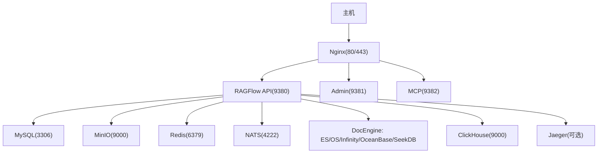
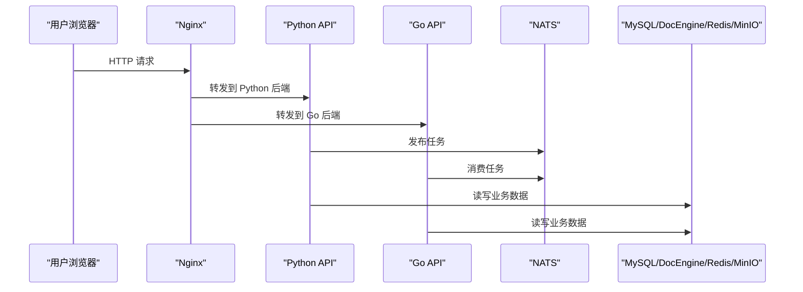
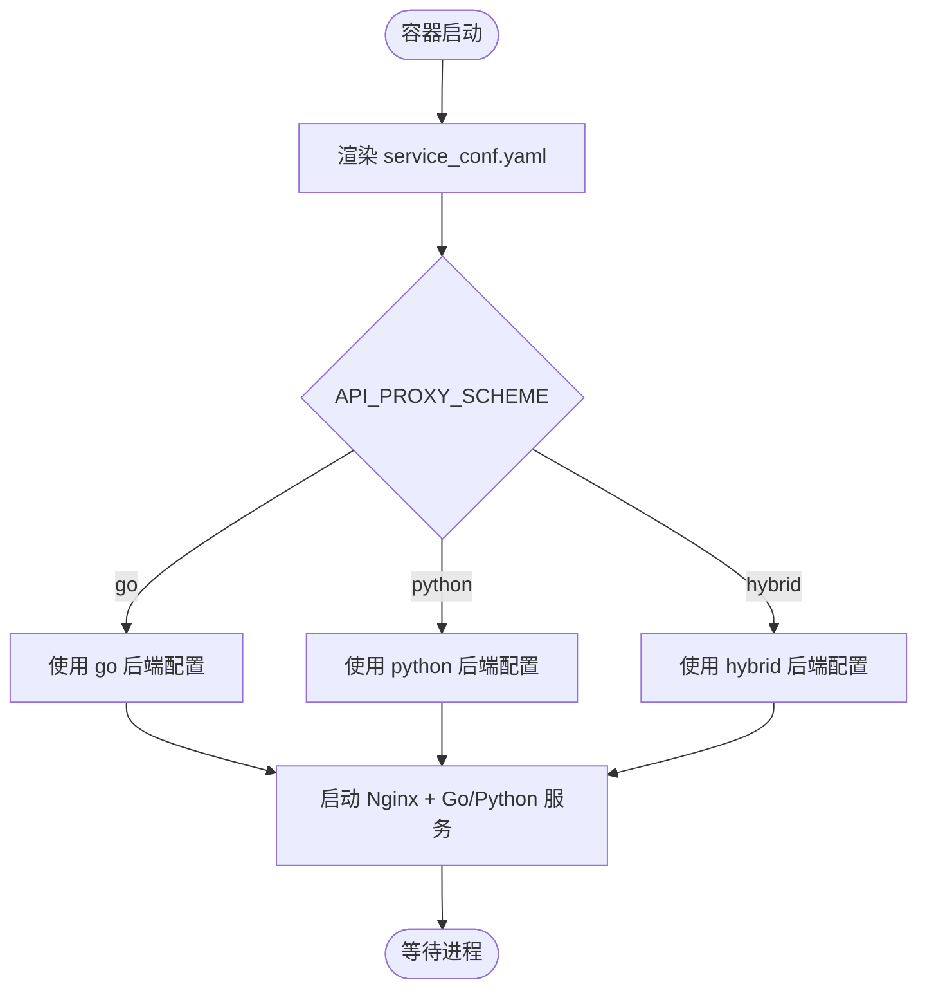
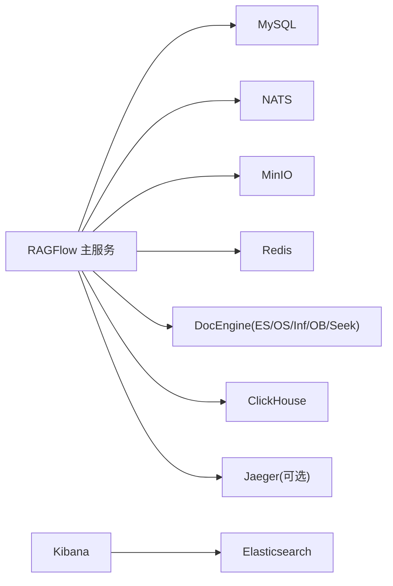

# Docker容器化部署

<cite>
**本文引用的文件**
- [docker/docker-compose.yml](file://docker/docker-compose.yml)
- [docker/docker-compose-base.yml](file://docker/docker-compose-base.yml)
- [docker/docker-compose-macos.yml](file://docker/docker-compose-macos.yml)
- [docker/README.md](file://docker/README.md)
- [docker/service_conf.yaml.template](file://docker/service_conf.yaml.template)
- [docker/.env-go](file://docker/.env-go)
- [docker/entrypoint.sh](file://docker/entrypoint.sh)
- [Dockerfile](file://Dockerfile)
</cite>

## 目录
1. [简介](#简介)
2. [项目结构](#项目结构)
3. [核心组件](#核心组件)
4. [架构总览](#架构总览)
5. [详细组件分析](#详细组件分析)
6. [依赖关系分析](#依赖关系分析)
7. [性能与资源建议](#性能与资源建议)
8. [故障排除指南](#故障排除指南)
9. [结论](#结论)
10. [附录：环境变量与端口速查](#附录环境变量与端口速查)

## 简介
本指南面向在本地和生产环境使用 Docker Compose 部署 RAGFlow 的用户，覆盖环境准备、依赖服务（MySQL、NATS、MinIO、Elasticsearch/OpenSearch/Infinity/OceanBase/SeekDB/Redis/ClickHouse 等）、主服务启动、CPU/GPU 版本差异、环境变量、端口映射、数据卷挂载、HTTPS 配置、完整命令示例与故障排除。文档严格基于仓库中的 docker 配置与脚本进行分析与说明。

## 项目结构
RAGFlow 的容器化部署由一组 Compose 文件与模板构成：
- docker-compose.yml：定义主服务（ragflow-cpu / ragflow-gpu）及入口参数、端口、卷、网络、依赖健康检查等。
- docker-compose-base.yml：定义所有依赖服务（ES/OS/Infinity/SereneDB/OceanBase/SeekDB/MySQL/MinIO/Redis/Jaeger/NATS/TEI/Kibana/ClickHouse），并通过 profiles 控制按需启用。
- docker/docker-compose-macos.yml：macOS 开发场景下的简化 compose（含平台与构建选项）。
- docker/service_conf.yaml.template：运行时服务配置模板，启动时由 entrypoint 将环境变量渲染为 service_conf.yaml。
- docker/.env-go：默认环境变量集合，包含数据库、存储、消息队列、嵌入服务、日志追踪、代理模式等关键开关。
- docker/entrypoint.sh：容器启动入口，负责渲染配置、选择 Nginx 后端策略、启动 Web/Admin/任务执行器/MCP 等进程。
- Dockerfile：生产镜像构建流程，包含前端构建、依赖安装、Nginx 配置注入、二进制拷贝与入口设置。

图表来源
- [docker/docker-compose.yml:43-50](file://docker/docker-compose.yml#L43-L50)
- [docker/docker-compose-base.yml:215-328](file://docker/docker-compose-base.yml#L215-L328)

章节来源
- [docker/docker-compose.yml:1-166](file://docker/docker-compose.yml#L1-L166)
- [docker/docker-compose-base.yml:1-449](file://docker/docker-compose-base.yml#L1-L449)
- [docker/docker-compose-macos.yml:1-48](file://docker/docker-compose-macos.yml#L1-L48)

## 核心组件
- 主服务（ragflow-cpu / ragflow-gpu）
  - 通过 profiles 区分 CPU/GPU 启动方式；GPU 版通过 deploy.resources.reservations.devices 声明 NVIDIA GPU 设备。
  - 暴露端口：Web(80/443)、API(9380)、Admin(9381)、MCP(9382)、Go 相关端口(9383/9384)。
  - 挂载日志目录与服务配置模板，加载 .env 环境变量。
- 依赖服务（按 profile 启用）
  - 元数据数据库：MySQL（默认）或外部 GaussDB。
  - 文档引擎：Elasticsearch、OpenSearch、Infinity、OceanBase、SeekDB（二选一或多选组合）。
  - 对象存储：MinIO（S3 兼容）。
  - 缓存/会话：Redis。
  - 消息队列：NATS（Go 后端默认启用）。
  - 可观测性：Jaeger（可选）。
  - 向量检索/嵌入：TEI（CPU/GPU 镜像不同，需单独启用 profile）。
  - 其他：Kibana（配合 ES）、ClickHouse（可选）。

章节来源
- [docker/docker-compose.yml:5-140](file://docker/docker-compose.yml#L5-L140)
- [docker/docker-compose-base.yml:2-416](file://docker/docker-compose-base.yml#L2-L416)
- [docker/.env-go:13-39](file://docker/.env-go#L13-L39)

## 架构总览
RAGFlow 采用“Web + API + 任务执行”的解耦架构，通过 Nginx 统一入口，根据 API_PROXY_SCHEME 动态切换 Python/Go/Hybrid 后端。任务执行通过 NATS 进行异步调度，持久化数据落至 MySQL/DocEngine/MinIO/Redis/ClickHouse 等。

图表来源
- [docker/entrypoint.sh:199-217](file://docker/entrypoint.sh#L199-L217)
- [docker/entrypoint.sh:306-365](file://docker/entrypoint.sh#L306-L365)
- [docker/docker-compose-base.yml:310-328](file://docker/docker-compose-base.yml#L310-L328)

## 详细组件分析

### 主服务（ragflow-cpu / ragflow-gpu）
- 启动参数
  - --enable-adminserver：启动管理端服务。
  - --init-model-provider-tables：初始化模型提供者表后退出（用于迁移）。
  - MCP 相关参数：--enable-mcpserver、--mcp-host、--mcp-port、--mcp-base-url、--mcp-script-path、--mcp-mode、--mcp-host-api-key 及传输开关。
- 端口映射
  - 80/443：Web 前端。
  - 9380：API。
  - 9381：Admin。
  - 9382：MCP。
  - 9383/9384：Go 服务端口（视部署模式）。
- 资源限制
  - ulimits nofile/nproc 提高文件句柄与进程数上限。
  - GPU 版通过 nvidia 驱动与 capabilities 声明设备。
- 数据卷
  - ./ragflow-logs:/ragflow/logs 持久化日志。
  - ./service_conf.yaml.template:/ragflow/conf/service_conf.yaml.template 注入配置模板。
  - ./entrypoint.sh:/ragflow/entrypoint.sh 覆盖入口脚本（可选）。
- 环境变量
  - SANDBOX_EXECUTOR_MANAGER_API_TOKEN：与沙箱管理器共享密钥。
  - env_file: .env 加载全部运行变量。

章节来源
- [docker/docker-compose.yml:5-65](file://docker/docker-compose.yml#L5-L65)
- [docker/docker-compose.yml:71-140](file://docker/docker-compose.yml#L71-L140)

### 依赖服务与 Profile 管理
- 元数据数据库
  - MySQL：默认内置，端口 EXPOSE_MYSQL_PORT，数据卷 mysql_data。
  - 外部 GaussDB：通过 GAUSSDB_METADATA_* 环境变量配置，并设置 METADATA_DB_PROFILE=gaussdb 以禁用内置 MySQL。
- 文档引擎（DOC_ENGINE）
  - elasticsearch/opensearch/infinity/oceanbase/seekdb/gaussdb（DocEngine）。
  - 各引擎通过独立 profile 启动，端口与凭据在 .env 中配置。
- 对象存储
  - MinIO：端口 MINIO_PORT 与 MINIO_CONSOLE_PORT，数据卷 minio_data。
- 缓存与会话
  - Redis：端口 REDIS_PORT，密码 REDIS_PASSWORD。
- 消息队列
  - NATS：端口 EXPOSE_NATS_PORT，启用 JetStream。
- 可观测性
  - Jaeger：OTLP 端口与 UI 端口，profile jaeger。
- 嵌入服务
  - TEI：CPU/GPU 镜像不同，分别对应 tei-cpu/tei-gpu profile。
- 其他
  - Kibana：配合 ES，端口 KIBANA_PORT。
  - ClickHouse：端口 CLICKHOUSE_TCP_PORT/CCLICKHOUSE_HTTP_PORT。

章节来源
- [docker/docker-compose-base.yml:2-416](file://docker/docker-compose-base.yml#L2-L416)
- [docker/.env-go:13-218](file://docker/.env-go#L13-L218)

### 配置渲染与后端路由
- 配置渲染
  - entrypoint 读取 service_conf.yaml.template，将 ${VAR:-default} 替换为实际值，生成 service_conf.yaml。
- Nginx 后端选择
  - 根据 API_PROXY_SCHEME 选择 ragflow.conf.golang / python / hybrid。
- 进程启动
  - 可选启动 Admin、Web（Nginx + Python/Go）、Data Sync、Task Executor、Ingestor、MCP Server。

图表来源
- [docker/entrypoint.sh:171-217](file://docker/entrypoint.sh#L171-L217)
- [docker/entrypoint.sh:293-365](file://docker/entrypoint.sh#L293-L365)

章节来源
- [docker/entrypoint.sh:171-217](file://docker/entrypoint.sh#L171-L217)
- [docker/entrypoint.sh:293-365](file://docker/entrypoint.sh#L293-L365)

### macOS 开发模式
- 使用 docker-compose-macos.yml，指定 platform linux/amd64 并支持从源码构建镜像。
- 挂载 Nginx 配置与日志目录，便于调试。

章节来源
- [docker/docker-compose-macos.yml:1-48](file://docker/docker-compose-macos.yml#L1-L48)

## 依赖关系分析
- 主服务依赖
  - MySQL：健康检查通过后启动（可选）。
  - NATS：健康检查通过后启动（可选）。
- 依赖服务间关系
  - Kibana 依赖 ES。
  - 各 DocEngine 相互独立，通过 DOC_ENGINE 选择其一。
  - TEI 作为嵌入服务，需显式启用 profile。
  - Jaeger 为可选可观测性组件。

图表来源
- [docker/docker-compose.yml:6-12](file://docker/docker-compose.yml#L6-L12)
- [docker/docker-compose-base.yml:365-384](file://docker/docker-compose-base.yml#L365-L384)

章节来源
- [docker/docker-compose.yml:6-12](file://docker/docker-compose.yml#L6-L12)
- [docker/docker-compose-base.yml:365-384](file://docker/docker-compose-base.yml#L365-L384)

## 性能与资源建议
- MEM_LIMIT：为各容器设置内存上限，避免 OOM。
- ulimits：提高 nofile/nproc 以支撑高并发。
- 文档引擎选择：大数据量与向量检索需求建议使用 Infinity 或 OpenSearch/Elasticsearch；OceanBase/SeekDB 适合特定生态。
- 嵌入服务：TEI GPU 镜像需要宿主机 NVIDIA 驱动与 Docker 运行时支持。
- 日志与磁盘：合理配置日志轮转与数据卷容量。

章节来源
- [docker/docker-compose-base.yml:26-31](file://docker/docker-compose-base.yml#L26-L31)
- [docker/docker-compose-base.yml:89-94](file://docker/docker-compose-base.yml#L89-L94)
- [docker/docker-compose-base.yml:129-133](file://docker/docker-compose-base.yml#L129-L133)
- [docker/.env-go:73-75](file://docker/.env-go#L73-L75)

## 故障排除指南
- 无法拉取镜像
  - 使用国内镜像源替换 RAGFLOW_IMAGE（见 .env 注释）。
- 端口冲突
  - 调整 EXPOSE_MYSQL_PORT、EXPOSE_NATS_PORT、EXPOSE_CLICKHOUSE_TCP_PORT、MINIO_PORT、REDIS_PORT、SVR_HTTP_PORT 等。
- 数据库连接失败
  - 检查 MYSQL_HOST/PORT/USER/PASSWORD、DOC_ENGINE 对应服务的 host/port/凭据。
  - 若使用 GaussDB 元数据库，确保 METADATA_DB_PROFILE=gaussdb 且 GAUSSDB_METADATA_* 正确。
- 文档引擎不可用
  - 确认 DOC_ENGINE 与对应 profile 已启用；检查服务健康检查与端口映射。
- 嵌入服务未启用
  - 启用 tei-cpu 或 tei-gpu profile，并确保 TEI_MODEL 与 TEI_HOST/PORT 正确。
- HTTPS 配置
  - 挂载证书并切换到 ragflow.https.conf；确保域名解析与端口开放。
- 日志定位
  - 查看 ./ragflow-logs 目录；必要时开启 DEBUG 级别日志。

章节来源
- [docker/.env-go:247-256](file://docker/.env-go#L247-L256)
- [docker/.env-go:142-218](file://docker/.env-go#L142-L218)
- [docker/README.md:272-342](file://docker/README.md#L272-L342)

## 结论
通过 docker-compose 与模板化配置，RAGFlow 提供了开箱即用的容器化部署方案。借助 profiles 与环境变量，用户可以灵活选择元数据库、文档引擎、对象存储、消息队列与可观测性组件，并在 CPU/GPU 环境下快速拉起服务。遵循本指南的环境准备、端口与卷配置、以及故障排除步骤，可在本地与生产环境中稳定部署 RAGFlow。

## 附录：环境变量与端口速查
- 关键环境变量
  - DOC_ENGINE、DB_TYPE、DEVICE、METADATA_DB_PROFILE、COMPOSE_PROFILES
  - ES/OS/Infinity/OceanBase/SeekDB/GaussDB 连接信息
  - MINIO_USER/PASSWORD、REDIS_PASSWORD、MYSQL_PASSWORD
  - SVR_HTTP_PORT、SVR_WEB_HTTP_PORT、SVR_WEB_HTTPS_PORT、ADMIN_SVR_HTTP_PORT、SVR_MCP_PORT
  - API_PROXY_SCHEME（go/python/hybrid）
  - TZ、HF_ENDPOINT、MAX_CONTENT_LENGTH、DOC_BULK_SIZE、EMBEDDING_BATCH_SIZE
- 常用端口
  - Web: 80/443；API: 9380；Admin: 9381；MCP: 9382
  - MySQL: 3306（宿主 EXPOSE_MYSQL_PORT）
  - MinIO: 9000/9001；Redis: 6379
  - ES: 1200；OS: 1201；Infinity: 23817/23820/5432
  - OceanBase/SeekDB: 2881；ClickHouse: 9000/8123
  - NATS: 4222；Jaeger: 4317/4318/16686

章节来源
- [docker/.env-go:13-237](file://docker/.env-go#L13-L237)
- [docker/docker-compose-base.yml:12-14](file://docker/docker-compose-base.yml#L12-L14)
- [docker/docker-compose-base.yml:46-48](file://docker/docker-compose-base.yml#L46-L48)
- [docker/docker-compose-base.yml:84-88](file://docker/docker-compose-base.yml#L84-L88)
- [docker/docker-compose-base.yml:138-140](file://docker/docker-compose-base.yml#L138-L140)
- [docker/docker-compose-base.yml:162-164](file://docker/docker-compose-base.yml#L162-L164)
- [docker/docker-compose-base.yml:234-236](file://docker/docker-compose-base.yml#L234-L236)
- [docker/docker-compose-base.yml:259-261](file://docker/docker-compose-base.yml#L259-L261)
- [docker/docker-compose-base.yml:282-284](file://docker/docker-compose-base.yml#L282-L284)
- [docker/docker-compose-base.yml:299-303](file://docker/docker-compose-base.yml#L299-L303)
- [docker/docker-compose-base.yml:314-316](file://docker/docker-compose-base.yml#L314-L316)
- [docker/docker-compose-base.yml:394-397](file://docker/docker-compose-base.yml#L394-L397)