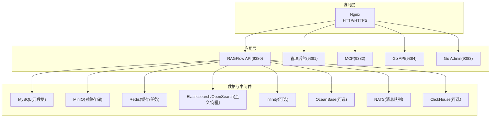
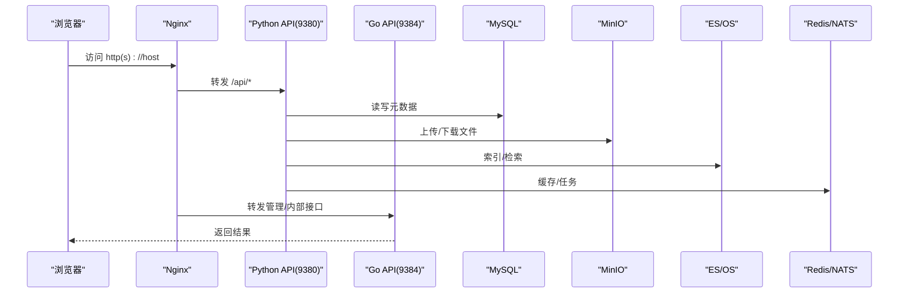
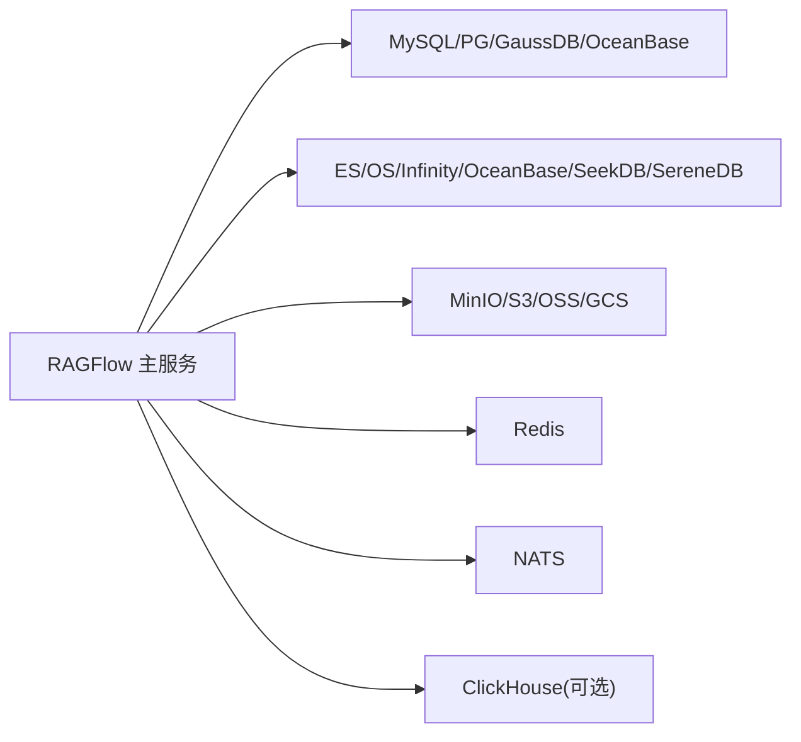

# 安装与部署

<cite>
**本文引用的文件**
- [README.md](file://README.md)
- [docker-compose.yml](file://docker/docker-compose.yml)
- [docker-compose-base.yml](file://docker/docker-compose-base.yml)
- [docker/README.md](file://docker/README.md)
- [.env-go](file://docker/.env-go)
- [service_conf.yaml](file://conf/service_conf.yaml)
- [Dockerfile](file://Dockerfile)
- [values.yaml](file://helm/values.yaml)
</cite>

## 目录
1. [简介](#简介)
2. [项目结构](#项目结构)
3. [核心组件](#核心组件)
4. [架构总览](#架构总览)
5. [详细组件分析](#详细组件分析)
6. [依赖关系分析](#依赖关系分析)
7. [性能考虑](#性能考虑)
8. [故障排除指南](#故障排除指南)
9. [结论](#结论)
10. [附录](#附录)

## 简介
本指南面向不同经验水平的用户，提供 RAGFlow 的完整安装与部署说明。重点覆盖：
- Docker Compose 容器化部署（本地开发、生产环境、云服务平台）
- 环境变量与服务间通信配置
- 存储后端（MinIO/S3/OSS/GCS 等）与数据库连接（MySQL/PostgreSQL/GaussDB/OceanBase/Infinity/OpenSearch/Elasticsearch）
- 启动主服务与验证
- 常见问题排查与性能优化建议

## 项目结构
RAGFlow 采用多语言混合架构：Go 与 Python 服务通过 Nginx 统一入口对外暴露 HTTP/HTTPS；依赖服务包括数据库、对象存储、缓存、搜索引擎/向量库、消息队列等，均由 Docker Compose 或 Helm 编排。



图表来源
- [docker-compose.yml:5-65](file://docker/docker-compose.yml#L5-L65)
- [docker-compose-base.yml:215-415](file://docker/docker-compose-base.yml#L215-L415)

章节来源
- [docker-compose.yml:1-166](file://docker/docker-compose.yml#L1-L166)
- [docker-compose-base.yml:1-449](file://docker/docker-compose-base.yml#L1-L449)

## 核心组件
- 主服务端口与路由
  - Web 前端与反向代理：Nginx（默认 80/443）
  - Python API：9380
  - Go API：9384
  - 管理后台：9381
  - MCP：9382
- 依赖服务
  - 元数据数据库：MySQL（默认），支持 PostgreSQL/GaussDB/OceanBase
  - 文档引擎：Elasticsearch/OpenSearch（默认），可选 Infinity/OceanBase/SeekDB/SereneDB
  - 对象存储：MinIO（默认），支持 S3/OSS/GCS
  - 缓存与任务：Redis
  - 消息队列：NATS
  - 分析/日志：ClickHouse（可选）
- 关键配置文件
  - docker/.env-go：环境变量集中定义
  - conf/service_conf.yaml：运行时服务配置（由模板生成）
  - docker-compose*.yml：服务编排与端口映射
  - helm/values.yaml：Kubernetes 部署参数

章节来源
- [.env-go:13-248](file://docker/.env-go#L13-L248)
- [service_conf.yaml:1-194](file://conf/service_conf.yaml#L1-L194)
- [docker/README.md:23-268](file://docker/README.md#L23-L268)

## 架构总览
RAGFlow 在容器内通过 Nginx 将请求分发到 Python/Go 服务，各服务根据 service_conf.yaml 连接对应的数据库、对象存储、缓存与搜索引擎。通过 .env 控制启用哪些依赖服务（如 Elasticsearch 或 Infinity）。



图表来源
- [docker-compose.yml:43-50](file://docker/docker-compose.yml#L43-L50)
- [docker-compose-base.yml:215-415](file://docker/docker-compose-base.yml#L215-L415)

## 详细组件分析

### 前置条件与环境准备
- 硬件要求：CPU≥4核，内存≥16GB，磁盘≥50GB
- 软件要求：Docker ≥24.0.0，Docker Compose ≥v2.26.1，Python ≥3.13（源码开发）
- Linux 内核参数：vm.max_map_count ≥ 262144（用于搜索引擎）
- 如需 GPU 加速 DeepDoc：需安装 NVIDIA 驱动并启用 GPU profile

章节来源
- [README.md:150-157](file://README.md#L150-L157)
- [README.md:162-184](file://README.md#L162-L184)

### 使用预构建镜像快速启动（推荐）
- 进入 docker 目录，选择 CPU 或 GPU profile 启动
- 首次启动会拉取依赖镜像并初始化数据库与存储
- 启动后查看日志确认服务就绪

```bash
cd ragflow/docker
docker compose -f docker-compose.yml up -d
# GPU 模式需在 .env 中设置 DEVICE=gpu 并使用 gpu profile
```

章节来源
- [README.md:190-211](file://README.md#L190-L211)
- [docker-compose.yml:5-65](file://docker/docker-compose.yml#L5-L65)

### 从源码启动（开发环境）
- 安装 uv 并同步 Python 依赖
- 使用 docker-compose-base.yml 拉起基础依赖
- 修改 hosts 解析容器名到 127.0.0.1
- 启动后端服务与前端开发服务器

```bash
uv sync --python 3.13
uv run python3 ragflow_deps/download_deps.py
docker compose -f docker-compose-base.yml up -d
# 添加 hosts 解析
echo "127.0.0.1 es01 infinity mysql minio redis sandbox-executor-manager" >> /etc/hosts
# 启动后端
source .venv/bin/activate
export PYTHONPATH=$(pwd)
bash docker/launch_backend_service.sh
# 启动前端
cd web && npm install && npm run dev
```

章节来源
- [README.md:320-386](file://README.md#L320-L386)

### 环境变量与系统配置
- 核心环境变量位于 docker/.env-go，涵盖：
  - 文档引擎：DOC_ENGINE（elasticsearch/infinity/opensearch/oceanbase/seekdb/gaussdb）
  - 元数据数据库：DB_TYPE（mysql/postgres/gaussdb/oceanbase）
  - 设备类型：DEVICE（cpu/gpu）
  - 各服务端口与密码：ES_PORT/MYSQL_PASSWORD/MINIO_PASSWORD/REDIS_PASSWORD 等
  - 外部服务地址：GAUSSDB_*、OCEANBASE_*、SEEKDB_*、SERENEDB_*
  - 嵌入服务：TEI_IMAGE_CPU/GPU、TEI_MODEL、TEI_HOST/PORT
  - 其他：HF_ENDPOINT、MAX_CONTENT_LENGTH、DOC_BULK_SIZE、EMBEDDING_BATCH_SIZE 等
- 运行时配置由 service_conf.yaml.template 生成，包含 MySQL/MinIO/ES/Infinity/OceanBase/Redis/NATS/ClickHouse/Otel 等连接信息

章节来源
- [.env-go:13-248](file://docker/.env-go#L13-L248)
- [docker/README.md:23-268](file://docker/README.md#L23-L268)
- [service_conf.yaml:1-194](file://conf/service_conf.yaml#L1-L194)

### 存储后端配置
- MinIO（默认）：通过 MINIO_USER/PASSWORD/HOST/PORT 配置
- 对象存储切换：可通过环境变量或 service_conf 配置 S3/OSS/GCS
  - S3：access_key、secret_key、endpoint_url、bucket、region、signature_version、addressing_style、prefix_path
  - OSS：access_key、secret_key、endpoint_url、region、bucket、prefix_path
  - GCS：bucket、prefix_path、endpoint_url
- 注意：若使用外部对象存储，请确保网络可达且凭据正确

章节来源
- [docker/README.md:199-238](file://docker/README.md#L199-L238)
- [service_conf.yaml:18-23](file://conf/service_conf.yaml#L18-L23)

### 数据库连接配置
- 元数据数据库（DB_TYPE）
  - MySQL：默认内置，设置 MYSQL_PASSWORD 即可
  - PostgreSQL/GaussDB/OceanBase：设置对应主机、端口、用户名、密码、数据库名
- 文档引擎（DOC_ENGINE）
  - Elasticsearch/OpenSearch：默认内置，设置 ELASTIC_PASSWORD/OPENSEARCH_PASSWORD
  - Infinity/OceanBase/SeekDB/SereneDB：按 .env 中的 HOST/PORT/USER/PASSWORD 配置
- 注意事项
  - 切换文档引擎前需停止所有容器并清理卷（谨慎操作）
  - GaussDB 作为 DocEngine 时不自动启动，需提前准备实例

章节来源
- [.env-go:14-21](file://docker/.env-go#L14-L21)
- [.env-go:142-167](file://docker/.env-go#L142-L167)
- [docker/README.md:27-36](file://docker/README.md#L27-L36)
- [README.md:278-299](file://README.md#L278-L299)

### 服务间通信与安全
- 容器网络：所有服务加入 ragflow 网络，通过服务名互相访问
- 端口映射：仅暴露必要端口到宿主机（Web/API/Admin/MCP/Go 端口）
- 认证与密钥：
  - 所有默认密码应在生产环境替换为强密码
  - 沙箱执行器与 RagFlow 之间通过共享令牌 SANDBOX_EXECUTOR_MANAGER_API_TOKEN 鉴权
- HTTPS：可挂载证书并切换到 HTTPS Nginx 配置

章节来源
- [docker-compose.yml:43-65](file://docker/docker-compose.yml#L43-L65)
- [docker-compose-base.yml:256-270](file://docker/docker-compose-base.yml#L256-L270)
- [docker/README.md:272-342](file://docker/README.md#L272-L342)

### 启动主服务与验证
- 启动后检查日志输出，确认服务监听地址
- 浏览器访问 http://IP（默认 80）或自定义端口
- 首次登录可在 UI 中配置默认 LLM（或在 service_conf 中预设）

章节来源
- [README.md:222-255](file://README.md#L222-L255)

### Kubernetes 部署（Helm）
- 使用 helm/values.yaml 配置全局镜像仓库、环境变量、服务资源与 Ingress
- 支持内置或外部依赖（MySQL/MinIO/Redis/ES/OS/Infinity）
- 可通过 values 覆盖 service_conf 与 llm_factories

章节来源
- [values.yaml:1-266](file://helm/values.yaml#L1-L266)

## 依赖关系分析
- 主服务依赖
  - 元数据：MySQL/PG/GaussDB/OceanBase
  - 文档检索：Elasticsearch/OpenSearch/Infinity/OceanBase/SeekDB/SereneDB
  - 对象存储：MinIO/S3/OSS/GCS
  - 缓存/任务：Redis
  - 消息队列：NATS
  - 分析：ClickHouse（可选）
- 编排关系
  - docker-compose-base.yml 定义所有依赖服务
  - docker-compose.yml 引入 base 并启动 RAGFlow 主服务（CPU/GPU profile）
  - Helm 模板将上述服务以 K8s 资源形式部署



图表来源
- [docker-compose-base.yml:215-415](file://docker/docker-compose-base.yml#L215-L415)
- [docker-compose.yml:5-65](file://docker/docker-compose.yml#L5-L65)

章节来源
- [docker-compose-base.yml:1-449](file://docker/docker-compose-base.yml#L1-L449)
- [docker-compose.yml:1-166](file://docker/docker-compose.yml#L1-L166)

## 性能考虑
- 文档处理批大小：DOC_BULK_SIZE（默认 4），增大可提升吞吐但增加内存占用
- 向量化批大小：EMBEDDING_BATCH_SIZE（默认 16），根据模型与显存调整
- 最大上传文件大小：MAX_CONTENT_LENGTH，需与 Nginx client_max_body_size 保持一致
- 资源限制：MEM_LIMIT 控制容器内存上限；GPU 场景需启用 nvidia 设备
- 搜索引擎调优：磁盘水位线、分片数、副本数等按数据规模调整
- 缓存与队列：合理设置 Redis 内存策略与 NATS 持久化策略

章节来源
- [.env-go:297-303](file://docker/.env-go#L297-L303)
- [docker/README.md:128-141](file://docker/README.md#L128-L141)
- [docker-compose-base.yml:15-26](file://docker/docker-compose-base.yml#L15-L26)

## 故障排除指南
- 无法访问服务
  - 检查端口是否被占用，确认 SVR_WEB_HTTP_PORT/SVR_HTTP_PORT 等映射
  - 查看容器日志：docker logs -f <container_name>
- 数据库连接失败
  - 核对 DB_TYPE 与对应服务的 HOST/PORT/USER/PASSWORD
  - 确认防火墙/安全组允许访问
- 对象存储不可用
  - 校验 S3/OSS/GCS 凭据与 endpoint_url、region、bucket
  - 检查网络连通性与域名解析
- 搜索引擎健康检查失败
  - 确认 STACK_VERSION 与镜像版本一致
  - 检查 xpack/security 或 plugins.security 相关配置
- 文件上传失败
  - MAX_CONTENT_LENGTH 与 Nginx client_max_body_size 不一致会导致截断
- 日志与追踪
  - 开启 OTEL/Jaeger 进行链路追踪，便于定位瓶颈

章节来源
- [docker/README.md:27-141](file://docker/README.md#L27-L141)
- [docker-compose-base.yml:31-38](file://docker/docker-compose-base.yml#L31-L38)
- [docker-compose-base.yml:277-293](file://docker/docker-compose-base.yml#L277-L293)

## 结论
通过 Docker Compose 或 Helm，RAGFlow 可以快速完成本地开发、测试与生产环境的部署。合理配置环境变量与 service_conf，选择合适的文档引擎与存储后端，结合批大小与资源限制进行性能调优，可获得稳定高效的 RAG 能力。遇到问题时，优先检查端口、网络、凭据与日志。

## 附录

### 常用命令速查
- 启动（CPU）：docker compose -f docker-compose.yml up -d
- 启动（GPU）：在 .env 设置 DEVICE=gpu 并启用 gpu profile
- 查看日志：docker logs -f docker-ragflow-cpu-1
- 切换文档引擎：停止容器 -> 修改 DOC_ENGINE -> 重启容器
- 构建镜像：参考 README 中的 docker build 命令

章节来源
- [README.md:190-211](file://README.md#L190-L211)
- [README.md:301-318](file://README.md#L301-L318)