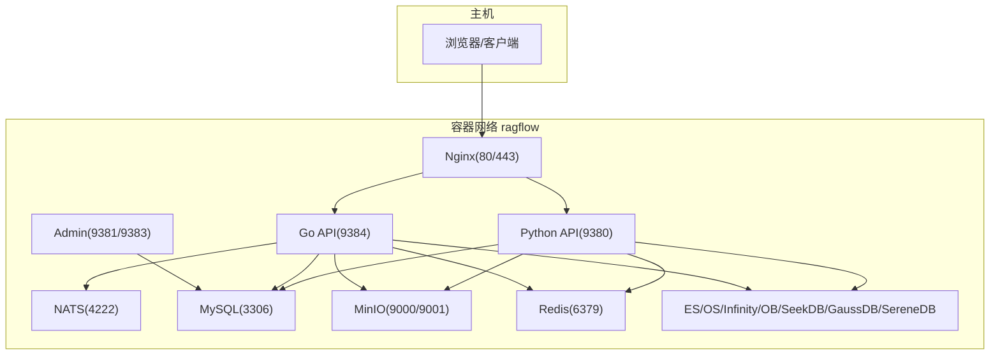
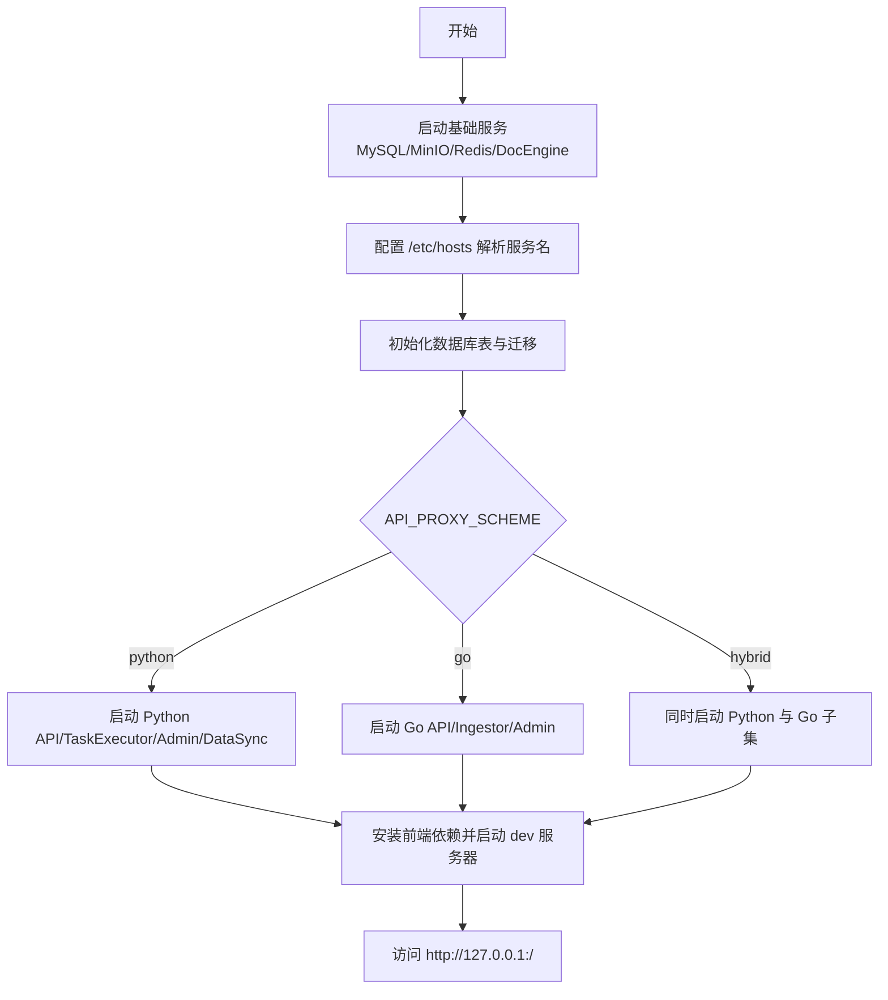
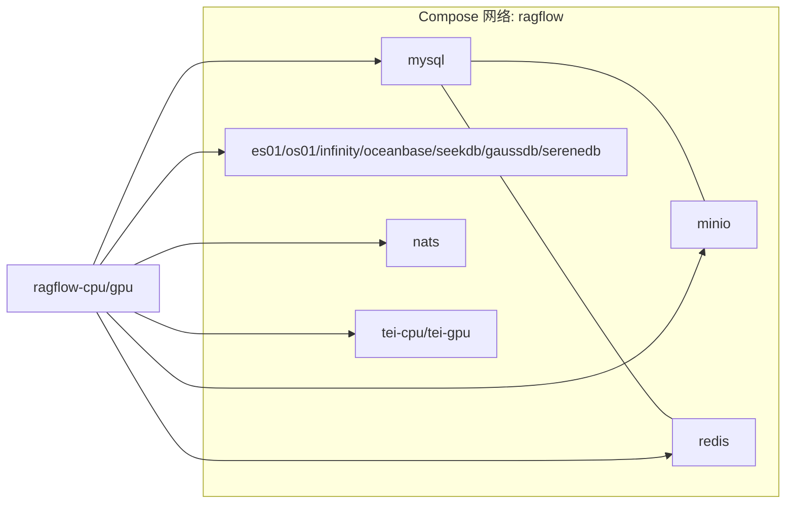
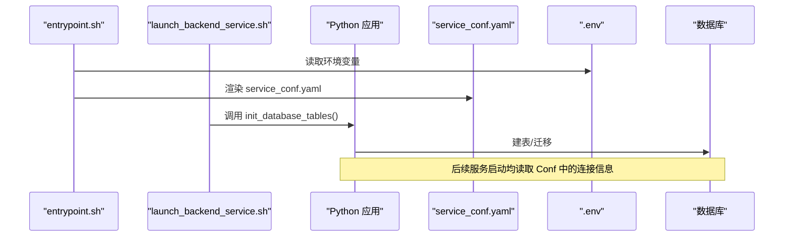
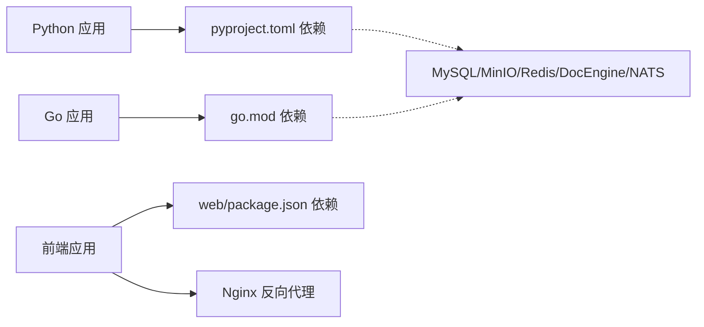

# 开发环境搭建

<cite>
**本文引用的文件**
- [README.md](file://README.md)
- [docker-compose.yml](file://docker/docker-compose.yml)
- [docker-compose-base.yml](file://docker/docker-compose-base.yml)
- [.env](file://docker/.env)
- [entrypoint.sh](file://docker/entrypoint.sh)
- [launch_backend_service.sh](file://docker/launch_backend_service.sh)
- [service_conf.yaml](file://conf/service_conf.yaml)
- [common/settings.py](file://common/settings.py)
- [pyproject.toml](file://pyproject.toml)
- [go.mod](file://go.mod)
- [internal/development.md](file://internal/development.md)
- [docs/develop/launch_ragflow_from_source.md](file://docs/develop/launch_ragflow_from_source.md)
- [docs/develop/build_docker_image.mdx](file://docs/develop/build_docker_image.mdx)
- [web/package.json](file://web/package.json)
</cite>

## 目录
1. [简介](#简介)
2. [项目结构](#项目结构)
3. [核心组件](#核心组件)
4. [架构总览](#架构总览)
5. [详细组件分析](#详细组件分析)
6. [依赖分析](#依赖分析)
7. [性能考虑](#性能考虑)
8. [故障排查指南](#故障排查指南)
9. [结论](#结论)
10. [附录](#附录)

## 简介
本指南面向希望在本地或容器环境中搭建 RAGFlow 开发环境的工程师，覆盖 Python 与 Go 双栈环境准备、IDE 推荐配置、依赖管理工具（uv、npm）设置、从源码启动服务、数据库初始化、环境变量与配置文件说明、Docker 多容器编排与服务间通信、以及常见环境问题排查。文档同时给出关键流程的可视化图示，帮助快速理解启动链路和组件关系。

## 项目结构
RAGFlow 采用前后端分离与多语言混合架构：
- 后端：Python 服务（API、任务执行器、数据同步等）与 Go 服务（API、Admin、Ingestor 等）并存，通过 Nginx 反向代理统一对外暴露端口；支持 python/go/hybrid 三种代理模式。
- 前端：基于 Vite + React 的前端工程，提供开发服务器与构建脚本。
- 基础设施：MySQL、MinIO、Redis、Elasticsearch/OpenSearch/Infinity/OceanBase/SeekDB/GaussDB/SereneDB 等存储与检索引擎，NATS 消息队列，ClickHouse 日志/指标等。
- 配置：集中式模板 service_conf.yaml.template 在容器启动时由 entrypoint.sh 根据环境变量渲染为 service_conf.yaml；.env 集中管理运行参数。



**图表来源**
- [docker-compose.yml:1-166](file://docker/docker-compose.yml#L1-L166)
- [docker-compose-base.yml:1-449](file://docker/docker-compose-base.yml#L1-L449)
- [entrypoint.sh:1-368](file://docker/entrypoint.sh#L1-L368)

**章节来源**
- [README.md:150-395](file://README.md#L150-L395)
- [docker-compose.yml:1-166](file://docker/docker-compose.yml#L1-L166)
- [docker-compose-base.yml:1-449](file://docker/docker-compose-base.yml#L1-L449)

## 核心组件
- 运行时入口与进程编排
  - 容器入口：entrypoint.sh 负责加载配置模板、选择 Nginx 策略、初始化数据库表、按需启动 Web/API/Admin/Ingestor/MCP 等进程。
  - 本地启动：launch_backend_service.sh 用于本地调试，自动加载 .env、初始化数据库、按 API_PROXY_SCHEME 决定启动 Python 或 Go 子进程，并带重试逻辑。
- 配置系统
  - 模板渲染：entrypoint.sh 将 service_conf.yaml.template 中的 ${VAR:-default} 替换为实际环境变量，生成最终 service_conf.yaml。
  - 运行时读取：common/settings.py 在应用启动时加载数据库、存储、检索引擎、LLM 默认模型、安全密钥等全局配置。
- 依赖与环境
  - Python：使用 uv 管理依赖与虚拟环境，pyproject.toml 声明依赖与工具链（ruff、pytest、coverage）。
  - Go：go.mod 声明 Go 依赖；internal/development.md 提供 CGO/ONNX Runtime 静态链接与构建说明。
- 前端
  - web/package.json 定义 dev/build/lint/format/test 等脚本，Node >= 18.20.4。

**章节来源**
- [entrypoint.sh:1-368](file://docker/entrypoint.sh#L1-L368)
- [launch_backend_service.sh:1-349](file://docker/launch_backend_service.sh#L1-L349)
- [common/settings.py:1-554](file://common/settings.py#L1-L554)
- [pyproject.toml:1-405](file://pyproject.toml#L1-L405)
- [go.mod:1-269](file://go.mod#L1-L269)
- [web/package.json:1-207](file://web/package.json#L1-L207)

## 架构总览
下图展示从浏览器到后端服务的请求路径，以及不同 API_PROXY_SCHEME 下的路由差异。

```mermaid
sequenceDiagram
participant U as "用户浏览器"
participant N as "Nginx"
participant P as "Python API"
participant G as "Go API"
participant DB as "MySQL/DocEngine"
participant MQ as "NATS/Redis"
participant ST as "对象存储(MinIO/S3)"
U->>N : HTTP 请求
alt API_PROXY_SCHEME=python
N->>P : 转发至 Python
P->>DB : 读写元数据/文档索引
P->>ST : 上传/下载文件
P->>MQ : 发布/消费任务
else API_PROXY_SCHEME=go
N->>G : 转发至 Go
G->>DB : 读写元数据/文档索引
G->>ST : 上传/下载文件
G->>MQ : 发布/消费任务
else API_PROXY_SCHEME=hybrid
N->>P : 部分路由到 Python
N->>G : 部分路由到 Go
P->>DB; P->>ST; P->>MQ
G->>DB; G->>ST; G->>MQ
end
```

**图表来源**
- [docker-compose.yml:1-166](file://docker/docker-compose.yml#L1-L166)
- [entrypoint.sh:199-217](file://docker/entrypoint.sh#L199-L217)
- [launch_backend_service.sh:133-164](file://docker/launch_backend_service.sh#L133-L164)

## 详细组件分析

### 环境准备与依赖管理
- Python 环境
  - 使用 uv 创建并激活虚拟环境，安装 pyproject.toml 中声明的依赖。
  - 如需测试，启用 test 分组依赖。
- Go 环境
  - 安装 Go 工具链与必要的 C/C++ 编译工具（CMake、clang-20、lld）。
  - 通过 download_go_deps.py 获取 ONNX Runtime 等静态库，确保 CGO_LDFLAGS 正确指向资源目录。
- 前端环境
  - Node.js 版本要求见 package.json engines；使用 npm 安装依赖并启动开发服务器。

**章节来源**
- [pyproject.toml:1-405](file://pyproject.toml#L1-L405)
- [internal/development.md:1-147](file://internal/development.md#L1-L147)
- [web/package.json:1-207](file://web/package.json#L1-L207)

### 从源码启动 RAGFlow（本地）
- 前置条件
  - 启动基础服务：MySQL、MinIO、Redis、Elasticsearch/OpenSearch/Infinity 等（依据 DOC_ENGINE 选择）。
  - 修改 hosts 解析，使容器内服务名映射到 127.0.0.1（本地调试）。
- 启动步骤
  - 初始化数据库表与迁移（entrypoint.sh 或 launch_backend_service.sh 内部调用）。
  - 根据 API_PROXY_SCHEME 选择启动 Python 或 Go 服务；必要时同时启动 Admin、Ingestor、Data Sync。
  - 前端在 web 目录下安装依赖后启动开发服务器，并将代理目标指向后端端口。



**图表来源**
- [docs/develop/launch_ragflow_from_source.md:29-152](file://docs/develop/launch_ragflow_from_source.md#L29-L152)
- [entrypoint.sh:256-368](file://docker/entrypoint.sh#L256-L368)
- [launch_backend_service.sh:221-349](file://docker/launch_backend_service.sh#L221-L349)

**章节来源**
- [docs/develop/launch_ragflow_from_source.md:29-152](file://docs/develop/launch_ragflow_from_source.md#L29-L152)
- [entrypoint.sh:199-368](file://docker/entrypoint.sh#L199-L368)
- [launch_backend_service.sh:1-349](file://docker/launch_backend_service.sh#L1-L349)

### Docker 开发环境搭建（多容器编排）
- 镜像与 Compose
  - 使用 docker-compose.yml 引入 docker-compose-base.yml，定义 ragflow-cpu/gpu 主服务及依赖服务。
  - 通过 profiles 控制是否拉起 ES/OS/Infinity/OB/SeekDB/GaussDB/SereneDB、Kibana、ClickHouse、NATS、TEI 等。
- 环境变量与配置
  - .env 集中管理所有外部依赖的连接信息、端口、密码、DOC_ENGINE、DB_TYPE、DEVICE、COMPOSE_PROFILES 等。
  - service_conf.yaml.template 在容器启动时被 entrypoint.sh 渲染为 service_conf.yaml，供后端读取。
- 服务间通信
  - 所有服务加入同一自定义网络 ragflow，通过服务名互相访问（如 mysql、minio、redis、es01、infinity 等）。
  - 端口映射仅对需要外部访问的服务进行（如 MySQL、MinIO Console、NATS、ClickHouse 等）。



**图表来源**
- [docker-compose.yml:1-166](file://docker/docker-compose.yml#L1-L166)
- [docker-compose-base.yml:1-449](file://docker/docker-compose-base.yml#L1-L449)
- [.env:1-464](file://docker/.env#L1-L464)

**章节来源**
- [docker-compose.yml:1-166](file://docker/docker-compose.yml#L1-L166)
- [docker-compose-base.yml:1-449](file://docker/docker-compose-base.yml#L1-L449)
- [.env:1-464](file://docker/.env#L1-L464)

### 数据库初始化与配置
- 初始化时机
  - 容器入口：entrypoint.sh 在启用 Webserver 时调用数据库初始化函数。
  - 本地脚本：launch_backend_service.sh 在启动 API 前执行 ensure_db_init 与 run_mysql_migrations。
- 配置来源
  - 模板渲染：service_conf.yaml.template 中的变量由 .env 注入，生成 service_conf.yaml。
  - 运行时读取：common/settings.py 根据 DOC_ENGINE/DB_TYPE 选择具体连接实现，并加载存储、检索、邮件等配置。



**图表来源**
- [entrypoint.sh:256-321](file://docker/entrypoint.sh#L256-L321)
- [launch_backend_service.sh:221-238](file://docker/launch_backend_service.sh#L221-L238)
- [common/settings.py:307-480](file://common/settings.py#L307-L480)

**章节来源**
- [entrypoint.sh:256-321](file://docker/entrypoint.sh#L256-L321)
- [launch_backend_service.sh:221-238](file://docker/launch_backend_service.sh#L221-L238)
- [common/settings.py:307-480](file://common/settings.py#L307-L480)

### 环境变量与配置文件要点
- 关键环境变量（示例）
  - DOC_ENGINE：选择文档检索引擎（elasticsearch/opensearch/infinity/oceanbase/seekdb/gaussdb/serenedb）。
  - DB_TYPE：业务元数据库类型（mysql/postgres/gaussdb/oceanbase）。
  - DEVICE：DeepDoc 推理设备（cpu/gpu）。
  - COMPOSE_PROFILES：组合 profile 控制拉起哪些依赖服务。
  - SVR_HTTP_PORT、SVR_WEB_HTTP_PORT、GO_HTTP_PORT、GO_ADMIN_PORT 等：对外端口映射。
  - HF_ENDPOINT：HuggingFace 镜像地址（可选）。
- 配置文件
  - conf/service_conf.yaml：运行时生效的配置（由模板渲染而来），包含 MySQL、MinIO、ES/OS/Infinity/OB 等连接信息。
  - docker/.env：集中管理所有可替换的环境变量。

**章节来源**
- [.env:1-464](file://docker/.env#L1-L464)
- [service_conf.yaml:1-194](file://conf/service_conf.yaml#L1-L194)
- [common/settings.py:147-480](file://common/settings.py#L147-L480)

### IDE 与开发工具推荐
- VS Code
  - Python：安装 Python 扩展，配置解释器为 .venv 下的 python；启用 ruff 作为 Linter/Formatter；配置 pytest 与 coverage。
  - Go：安装 Go 扩展，配置 go.mod 所在工作区；设置 CGO 环境变量以支持本地构建与调试。
  - 前端：安装 ESLint/Prettier 替代方案（oxlint/oxfmt 已在项目中配置），Vite 插件辅助开发。
- PyCharm
  - 配置解释器为 .venv；设置 PYTHONPATH 指向项目根；配置 Run/Debug 配置项以直接启动 api/ragflow_server.py 或 task_executor.py。
  - 集成 pytest、ruff、coverage 运行器。
- 代码质量与格式化
  - Python：ruff（pyproject.toml 已配置）；pytest（含严格标记与警告处理）。
  - Go：建议使用 golangci-lint（可按需添加）；CGO 构建需遵循 internal/development.md 的说明。
  - 前端：oxfmt/oxlint（package.json scripts 已定义）。

**章节来源**
- [pyproject.toml:307-405](file://pyproject.toml#L307-L405)
- [web/package.json:7-18](file://web/package.json#L7-L18)
- [internal/development.md:52-100](file://internal/development.md#L52-L100)

### 从源码构建 Docker 镜像
- 依赖预取：进入 ragflow_deps 目录，使用 uv 运行 download_deps.py 拉取共享依赖。
- 构建镜像：分别构建依赖镜像与应用镜像，或使用官方 Dockerfile 直接构建。
- macOS/ARM64：注意平台限制与依赖版本调整（如 xgboost、unixODBC）。

**章节来源**
- [docs/develop/build_docker_image.mdx:29-68](file://docs/develop/build_docker_image.mdx#L29-L68)
- [README.md:301-318](file://README.md#L301-L318)

## 依赖分析
- Python 依赖
  - 通过 pyproject.toml 声明，使用 uv 锁定版本与源（含阿里云镜像与显式 pypi 源）。
  - 包含大量第三方库（LLM、OCR、向量检索、存储、消息队列、测试框架等）。
- Go 依赖
  - go.mod 声明 Gin、GORM、Elasticsearch、NATS、MinIO、OpenTelemetry 等核心依赖。
  - 通过 replace 指令与静态链接解决特定依赖与 ONNX Runtime 问题。
- 前端依赖
  - package.json 定义 React、Ant Design、Tailwind、Vite、Storybook、Jest 等开发与运行时依赖。



**图表来源**
- [pyproject.toml:1-405](file://pyproject.toml#L1-L405)
- [go.mod:1-269](file://go.mod#L1-L269)
- [web/package.json:1-207](file://web/package.json#L1-L207)

**章节来源**
- [pyproject.toml:1-405](file://pyproject.toml#L1-L405)
- [go.mod:1-269](file://go.mod#L1-L269)
- [web/package.json:1-207](file://web/package.json#L1-L207)

## 性能考虑
- 内存与并发
  - 通过 MEM_LIMIT 限制容器内存；合理设置 DOC_BULK_SIZE、EMBEDDING_BATCH_SIZE 提升吞吐。
  - 任务执行器可通过 WS 或 consumer range 控制并行度。
- DeepDoc 与 GPU
  - 使用 DEVICE=gpu 并在 compose 中声明 nvidia 设备以启用 GPU 加速。
  - 若使用 TEI 嵌入服务，选择合适的模型与 profile（tei-cpu/tei-gpu）。
- 存储与检索
  - 根据数据规模选择合适 DocEngine（ES/OS/Infinity/OB/SeekDB/GaussDB/SereneDB）。
  - 调整各引擎的内存与磁盘水位线（如 ES 的 watermark 配置）。

[本节为通用指导，不直接分析具体文件]

## 故障排查指南
- 无法访问 HuggingFace
  - 设置 HF_ENDPOINT 指向国内镜像站点。
- jemalloc 缺失
  - 在 Linux/macOS 上安装 jemalloc，或通过系统包管理器安装对应库。
- 端口冲突
  - 检查 .env 中的 EXPOSE_* 与 SVR_* 端口是否与宿主机冲突，必要时调整映射。
- 数据库连接失败
  - 确认 DB_TYPE 与 DOC_ENGINE 对应的服务已启动且凭据正确；检查 service_conf.yaml 中的 host/port/password。
- 文档引擎切换
  - 切换 DOC_ENGINE 后需重启容器；注意 Infinity 在 Linux/arm64 尚未完全支持。
- Go 构建失败（缺少 ONNX Runtime）
  - 重新运行 download_go_deps.py，确保 CGO_LDFLAGS 指向正确的静态库路径；构建脚本会提前报错提示缺失。

**章节来源**
- [README.md:320-395](file://README.md#L320-L395)
- [internal/development.md:52-147](file://internal/development.md#L52-L147)
- [.env:1-464](file://docker/.env#L1-L464)
- [docker-compose-base.yml:1-449](file://docker/docker-compose-base.yml#L1-L449)

## 结论
通过本文档，您可以完成 RAGFlow 的开发环境搭建，包括 Python/Go 环境、IDE 配置、依赖管理、从源码与 Docker 两种方式启动服务、数据库初始化、环境变量与配置管理、以及常见问题排查。建议初次搭建优先使用 Docker Compose 一键拉起依赖，再逐步切换到源码调试模式以提升迭代效率。

## 附录
- 常用命令速查
  - 启动基础服务：docker compose -f docker/docker-compose-base.yml up -d
  - 本地启动后端：bash docker/launch_backend_service.sh
  - 启动前端：cd web && npm run dev
  - 构建镜像：参考 docs/develop/build_docker_image.mdx
- 关键端口
  - Web：SVR_WEB_HTTP_PORT（默认 80）
  - Python API：SVR_HTTP_PORT（默认 9380）
  - Go API：GO_HTTP_PORT（默认 9384）
  - Admin：ADMIN_SVR_HTTP_PORT（默认 9381）、GO_ADMIN_PORT（默认 9383）

[本节为补充信息，不直接分析具体文件]