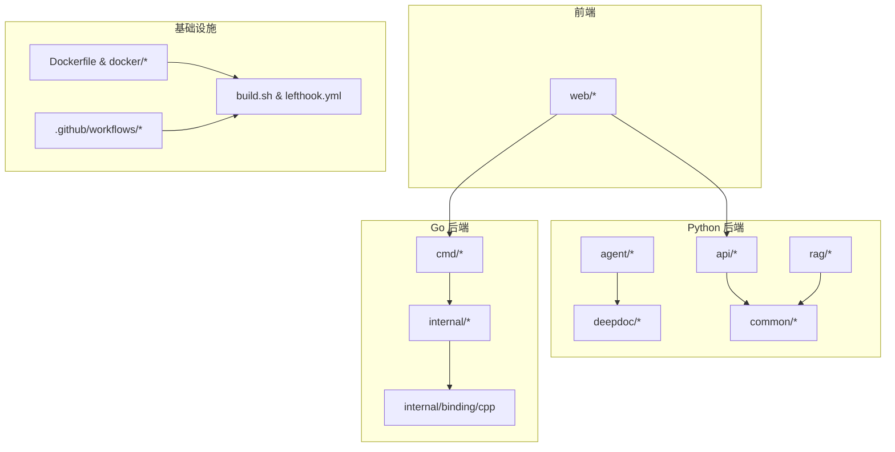
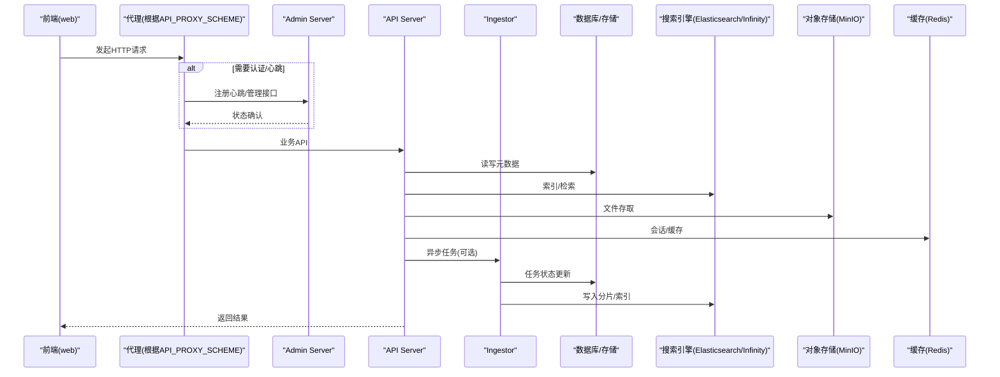
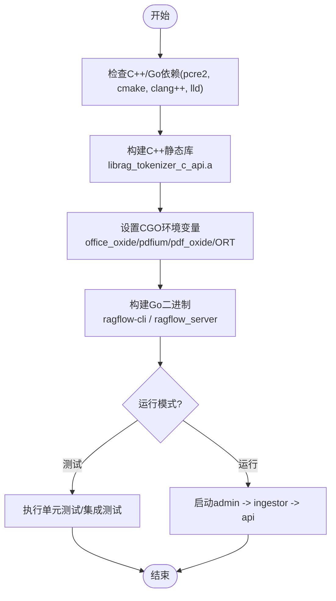
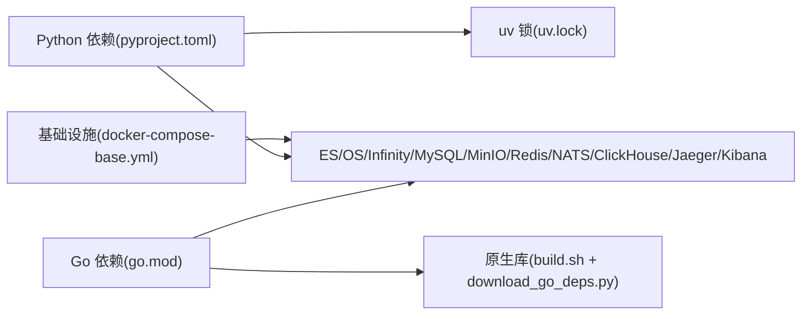

# 开发者指南

<cite>
**本文引用的文件**
- [README.md](file://README.md)
- [pyproject.toml](file://pyproject.toml)
- [go.mod](file://go.mod)
- [Dockerfile](file://Dockerfile)
- [build.sh](file://build.sh)
- [lefthook.yml](file://lefthook.yml)
- [docker-compose-base.yml](file://docker/docker-compose-base.yml)
- [web/package.json](file://web/package.json)
- [internal/development.md](file://internal/development.md)
- [.github/workflows/release.yml](file://.github/workflows/release.yml)
- [.github/workflows/sep-tests.yml](file://.github/workflows/sep-tests.yml)
</cite>

## 目录
1. [简介](#简介)
2. [项目结构](#项目结构)
3. [核心组件](#核心组件)
4. [架构总览](#架构总览)
5. [详细组件分析](#详细组件分析)
6. [依赖关系分析](#依赖关系分析)
7. [性能考虑](#性能考虑)
8. [故障排查指南](#故障排查指南)
9. [结论](#结论)
10. [附录](#附录)

## 简介
本指南面向希望参与 RAGFlow 后端与前端开发的工程师，提供从环境搭建、工具链配置、代码贡献流程、调试技巧到构建发布与新特性开发的全流程说明。RAGFlow 是一个开源的检索增强生成（RAG）引擎，支持多种数据源、文档解析、向量检索与智能体工作流，并提供 Python 与 Go 双后端实现以及基于 Vite 的前端工程。

## 项目结构
仓库采用多语言、多模块组织：
- Python 后端与工具：api、agent、deepdoc、rag、common、sdk/python 等
- Go 后端与原生绑定：cmd、internal（服务、路由、处理器、引擎、DAO、模型等）、binding/cpp
- 前端工程：web（Vite + React + TypeScript）
- 容器化与编排：Dockerfile、docker/*.yml、helm
- 构建与测试：build.sh、lefthook.yml、run_tests.py、test/*
- 配置与资源：conf、rag/res、docs

图表来源
- [Dockerfile:1-299](file://Dockerfile#L1-L299)
- [build.sh:1-800](file://build.sh#L1-L800)
- [lefthook.yml:1-106](file://lefthook.yml#L1-L106)
- [web/package.json:1-207](file://web/package.json#L1-L207)

章节来源
- [README.md:150-395](file://README.md#L150-L395)
- [pyproject.toml:1-405](file://pyproject.toml#L1-L405)
- [go.mod:1-269](file://go.mod#L1-L269)

## 核心组件
- 构建与运行脚本
  - build.sh：统一封装 C++ 静态库编译、Go 二进制构建、CGO 环境设置、测试与运行入口
  - Dockerfile：多阶段构建镜像，安装系统依赖、Node.js、uv、预置浏览器驱动与模型资源，并拷贝源码与前端产物
- 依赖管理
  - pyproject.toml：Python 依赖、测试配置、覆盖率、包名与版本约束
  - go.mod：Go 模块与依赖声明，包含替换与私有模块策略
- 本地开发前置服务
  - docker-compose-base.yml：Elasticsearch/OpenSearch、Infinity、MySQL、MinIO、Redis、NATS、ClickHouse、Jaeger、Kibana 等基础服务编排
- 前端工程
  - web/package.json：Vite 构建脚本、依赖与开发工具链（oxfmt/oxlint）

章节来源
- [build.sh:1-800](file://build.sh#L1-L800)
- [Dockerfile:1-299](file://Dockerfile#L1-L299)
- [pyproject.toml:1-405](file://pyproject.toml#L1-L405)
- [go.mod:1-269](file://go.mod#L1-L269)
- [docker-compose-base.yml:1-449](file://docker/docker-compose-base.yml#L1-L449)
- [web/package.json:1-207](file://web/package.json#L1-L207)

## 架构总览
RAGFlow 支持 Python 与 Go 两种后端代理模式（python/hybrid/go），前端通过 Vite 代理将请求转发至对应后端；Go 后端内嵌 DeepDoc 原生能力（ONNX Runtime 静态链接），并通过 admin/ingestor/api 三种进程协同工作。

图表来源
- [internal/development.md:147-197](file://internal/development.md#L147-L197)
- [docker-compose-base.yml:1-449](file://docker/docker-compose-base.yml#L1-L449)

## 详细组件分析

### 构建与运行（build.sh）
- 功能要点
  - 检测并安装 pcre2 等系统依赖
  - 构建 C++ 静态库（librag_tokenizer_c_api.a），并对 re2 符号重命名避免与 ONNX Runtime 冲突
  - 设置 CGO_CFLAGS/CGO_LDFLAGS，静态链接 office_oxide、pdfium、pdf_oxide 与 ONNX Runtime
  - 构建 ragflow-cli 与 ragflow_server 二进制
  - 提供 --test、--test-integration、--test-e2e、--test-manual、--clean、--run 等子命令
- 关键路径
  - 构建入口：build_go()
  - 原生库校验：check_office_oxide_deps()/check_pdfium_deps()/check_pdf_oxide_deps()
  - 运行入口：run()（先启动 admin，再 ingestor，最后 api）

图表来源
- [build.sh:124-421](file://build.sh#L124-L421)
- [build.sh:594-733](file://build.sh#L594-L733)

章节来源
- [build.sh:1-800](file://build.sh#L1-L800)

### 容器镜像构建（Dockerfile）
- 多阶段构建
  - base：安装系统依赖、Node.js、uv、Chrome/Chromedriver、MSSQL ODBC、Infinity 资源
  - builder：安装 Python/前端依赖并构建前端产物
  - production：拷贝源码、构建产物、配置 Nginx、设置入口脚本
- 关键点
  - 使用 uv.lock 锁定 Python 依赖
  - 前端构建启用缓存与最小化
  - 版本信息通过 git describe 注入 VERSION

章节来源
- [Dockerfile:1-299](file://Dockerfile#L1-L299)

### 本地开发环境（internal/development.md）
- 依赖准备
  - 安装 CMake、clang-20、lld、Go
  - 下载原生依赖：download_go_deps.py 与 download_deps.py
  - 设置 CGO 环境变量以支持 IDE 直接运行/调试
- 启动服务
  - 依赖：docker compose 启动必要服务（infinity/mysql/minio/redis/nats 等）
  - 顺序：先 admin，再 ingestor，最后 api
  - 前端：cd web && npm run dev（可配置 API_PROXY_SCHEME=hybrid）

章节来源
- [internal/development.md:1-197](file://internal/development.md#L1-L197)

### 代码质量与提交钩子（lefthook.yml）
- pre-commit
  - 自动修复：EOF、尾随空格、行尾混用、ruff check/format、gofmt
  - 检查：YAML/JSON、大小写冲突、合并冲突、符号链接
- CI-only web-checks
  - oxfmt/oxlint 仅用于 CI，本地不强制安装 Node 工具链

章节来源
- [lefthook.yml:1-106](file://lefthook.yml#L1-L106)

### 前端工程（web/package.json）
- 脚本
  - dev/build/lint/format/test/type-check 等
- 工具链
  - Vite、React、TypeScript、Tailwind、Storybook、Jest
  - 代码格式与检查：oxfmt、oxlint

章节来源
- [web/package.json:1-207](file://web/package.json#L1-L207)

## 依赖关系分析
- Python 依赖
  - 通过 pyproject.toml 声明，使用 uv 进行依赖管理与锁定（uv.lock）
  - 测试依赖独立分组（dependency-groups.test）
- Go 依赖
  - go.mod 声明主模块与依赖，包含 replace 指令与 GOPRIVATE 策略
  - 原生依赖通过 build.sh 与 download_go_deps.py 获取并静态链接
- 基础设施
  - docker-compose-base.yml 定义 Elasticsearch/OpenSearch、Infinity、MySQL、MinIO、Redis、NATS、ClickHouse、Jaeger、Kibana 等服务及其健康检查

图表来源
- [pyproject.toml:1-405](file://pyproject.toml#L1-L405)
- [go.mod:1-269](file://go.mod#L1-L269)
- [docker-compose-base.yml:1-449](file://docker/docker-compose-base.yml#L1-L449)

章节来源
- [pyproject.toml:1-405](file://pyproject.toml#L1-L405)
- [go.mod:1-269](file://go.mod#L1-L269)
- [docker-compose-base.yml:1-449](file://docker/docker-compose-base.yml#L1-L449)

## 性能考虑
- 构建优化
  - 使用 BuildKit 缓存 apt/npm/uv 层，减少重复构建时间
  - 前端构建启用 esbuild 最小化与 SourceMap 控制
- 运行时优化
  - 静态链接原生库避免动态加载开销
  - 合理配置内存限制与 ulimits（如 nofile）
  - 使用 Redis 做缓存、NATS 做消息队列以提升吞吐

[本节为通用指导，无需特定文件引用]

## 故障排查指南
- 构建失败
  - 缺少 pcre2 或 lld：按 build.sh 提示安装对应包
  - ORT 未静态链接：确保已执行 download_go_deps.py 且 CGO_LDFLAGS 包含 libonnxruntime.a
  - 符号冲突：确认 C++ 静态库已对 re2 符号重命名
- 运行失败
  - 启动顺序错误：必须先启动 admin，再 ingestor，最后 api
  - 端口冲突：CI 中通过端口预留机制避免冲突；本地需检查占用
  - 依赖服务不可用：通过 healthcheck 与日志定位 ES/Infinity/MySQL/MinIO/Redis 等
- 前端问题
  - 代理配置：根据 API_PROXY_SCHEME 调整 vite.config.ts 中的代理规则
  - 依赖安装：确保 Node >= 18.20.4，并使用 npm install

章节来源
- [build.sh:124-421](file://build.sh#L124-L421)
- [internal/development.md:147-197](file://internal/development.md#L147-L197)
- [docker-compose-base.yml:1-449](file://docker/docker-compose-base.yml#L1-L449)

## 结论
RAGFlow 提供了完善的开发工具链与自动化流水线，涵盖从依赖管理、代码质量检查、本地调试到构建发布的全生命周期。遵循本指南可快速搭建开发环境、高效协作与稳定发布。

[本节为总结性内容，无需特定文件引用]

## 附录

### 开发环境搭建步骤
- 系统要求
  - CPU ≥ 4核、内存 ≥ 16GB、磁盘 ≥ 50GB
  - Docker ≥ 24.0.0、Docker Compose ≥ v2.26.1
  - Python ≥ 3.13、Node.js ≥ 18.20.4
- 安装依赖
  - 安装 uv 并同步 Python 依赖：uv sync --python 3.13
  - 下载原生依赖：uv run python3 ragflow_deps/download_deps.py
  - 安装前端依赖：cd web && npm install
- 启动依赖服务
  - docker compose -f docker/docker-compose-base.yml up -d
- 启动后端
  - 先启动 admin：./bin/ragflow_server --admin
  - 再启动 ingestor：./bin/ragflow_server --ingestor
  - 最后启动 api：./bin/ragflow_server --api
- 启动前端
  - cd web && export API_PROXY_SCHEME=hybrid && npm run dev

章节来源
- [README.md:320-395](file://README.md#L320-L395)
- [internal/development.md:147-197](file://internal/development.md#L147-L197)

### 代码贡献流程
- Git 工作流
  - 分支策略：feature/*、fix/*、release/*
  - 提交前运行 lefthook 进行格式化与检查
- 代码审查
  - Pull Request 需通过 CI 检查（lefthook web-checks、单元测试、集成测试）
  - 审查关注点：可读性、性能、安全性、兼容性
- PR 规范
  - 标题清晰描述变更
  - 描述包含动机、方案、影响范围、测试覆盖
  - 关联 Issue 或需求编号

章节来源
- [lefthook.yml:1-106](file://lefthook.yml#L1-L106)
- [.github/workflows/sep-tests.yml:146-181](file://.github/workflows/sep-tests.yml#L146-L181)

### 调试技巧
- 后端调试
  - 使用 debugpy 或 IDE 直接运行/调试 Go/Python 进程
  - 查看服务日志：docker logs -f <container>
  - 使用 Jaeger 进行链路追踪（如需）
- 前端调试
  - 使用浏览器开发者工具与 Storybook 验证组件
  - 通过 vite 代理观察 API 请求与响应
- 依赖与服务
  - 通过 healthcheck 与端口映射检查服务状态
  - 使用 kubectl/docker 命令查看容器资源与日志

章节来源
- [docker-compose-base.yml:1-449](file://docker/docker-compose-base.yml#L1-L449)
- [web/package.json:1-207](file://web/package.json#L1-L207)

### 构建与发布流程
- 版本管理
  - 使用 git tag 标记版本（v*.*.*）
  - nightly 标签用于持续构建
- CI/CD 流水线
  - release.yml：触发条件（schedule/tag push），构建 CLI 与服务器二进制，推送 Docker 镜像与 SDK
  - sep-tests.yml：PR/推送时运行 lint、单元与集成测试，构建镜像并执行端到端测试
- 发布检查
  - 构建产物签名与校验和（SHA256SUMS）
  - 多平台交叉编译（linux/darwin/windows）
  - 发布到 Docker Hub 与 PyPI

章节来源
- [.github/workflows/release.yml:1-305](file://.github/workflows/release.yml#L1-L305)
- [.github/workflows/sep-tests.yml:1-800](file://.github/workflows/sep-tests.yml#L1-L800)

### 新特性开发指导
- 需求分析
  - 明确用户场景与验收标准
  - 评估技术可行性与影响范围
- 设计文档
  - 输出架构图、接口定义、数据模型变更
  - 制定回滚与兼容策略
- 代码实现
  - 遵循编码规范与测试先行原则
  - 使用 lefthook 保证代码质量
- 测试验证
  - 单元测试覆盖核心逻辑
  - 集成测试验证端到端流程
  - 性能测试评估瓶颈
- 上线与监控
  - 灰度发布与回滚预案
  - 监控指标与告警配置

[本节为通用指导，无需特定文件引用]

### 常见问题解答
- 为什么构建时报错“ONNX Runtime 静态库未链接”？
  - 确保已执行 download_go_deps.py 并正确设置 CGO_LDFLAGS
- 为什么启动后无法访问前端？
  - 检查代理配置与端口映射，确认依赖服务已就绪
- 为什么测试用例失败？
  - 检查 NLTK 数据、模型资源与环境变量配置

章节来源
- [internal/development.md:52-100](file://internal/development.md#L52-L100)
- [docker-compose-base.yml:1-449](file://docker/docker-compose-base.yml#L1-L449)