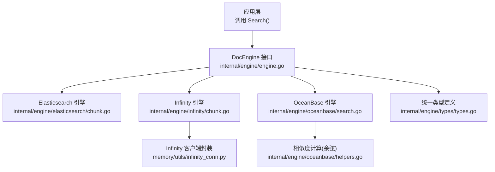
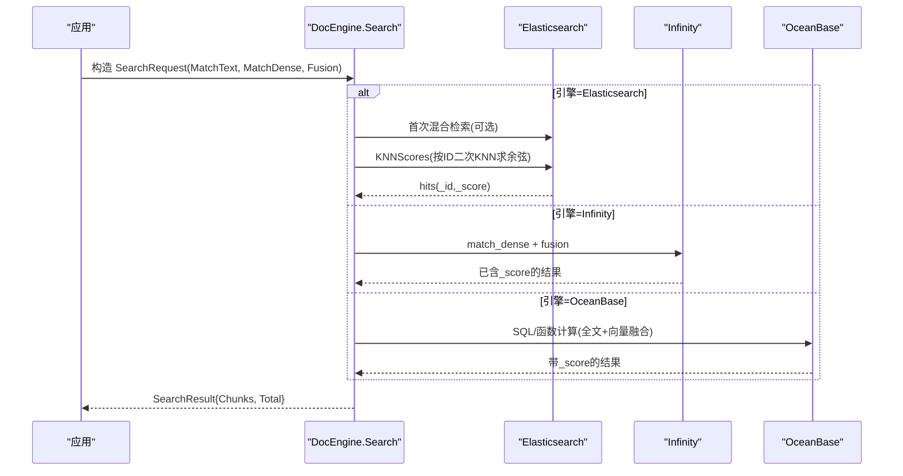
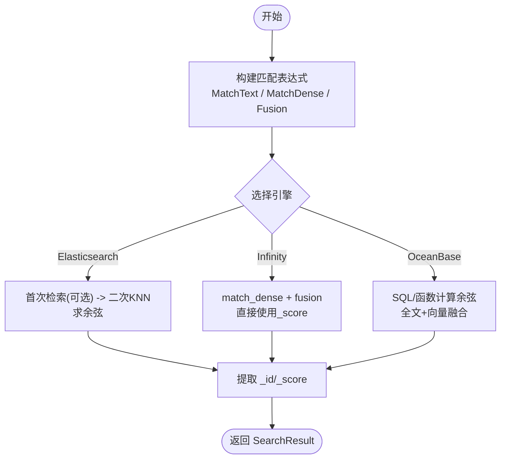
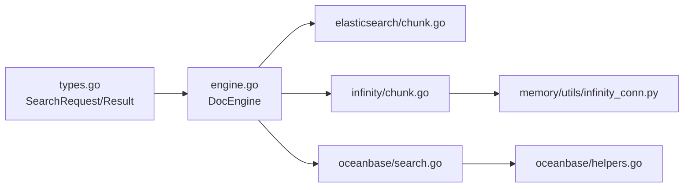

# 向量搜索

<cite>
**本文引用的文件**
- [internal/engine/engine.go](file://internal/engine/engine.go)
- [internal/engine/types/types.go](file://internal/engine/types/types.go)
- [internal/engine/elasticsearch/chunk.go](file://internal/engine/elasticsearch/chunk.go)
- [internal/engine/infinity/chunk.go](file://internal/engine/infinity/chunk.go)
- [internal/engine/oceanbase/search.go](file://internal/engine/oceanbase/search.go)
- [internal/engine/oceanbase/helpers.go](file://internal/engine/oceanbase/helpers.go)
- [memory/utils/infinity_conn.py](file://memory/utils/infinity_conn.py)
- [conf/service_conf.yaml](file://conf/service_conf.yaml)
- [docs/guides/search/search_settings.md](file://docs/guides/search/search_settings.md)
- [rag/benchmark.py](file://rag/benchmark.py)
- [rag/llm/rerank_model.py](file://rag/llm/rerank_model.py)
- [common/doc_store/gaussdb_conn_base.py](file://common/doc_store/gaussdb_conn_base.py)
</cite>

## 目录
1. [简介](#简介)
2. [项目结构](#项目结构)
3. [核心组件](#核心组件)
4. [架构总览](#架构总览)
5. [详细组件分析](#详细组件分析)
6. [依赖关系分析](#依赖关系分析)
7. [性能与优化](#性能与优化)
8. [故障排查指南](#故障排查指南)
9. [结论](#结论)
10. [附录：配置与使用示例](#附录：配置与使用示例)

## 简介
本文件面向RAGFlow中的向量检索子系统，系统性阐述向量嵌入生成、相似度计算（余弦相似度、欧几里得距离等）、KNN实现与多引擎（Elasticsearch、Infinity、OceanBase）的索引构建与查询优化策略。文档同时覆盖维度选择、批量处理、内存管理、评估指标与调优建议（top-k、相似度阈值、融合权重），并提供可操作的配置与使用指引。

## 项目结构
RAGFlow将“文档存储引擎”抽象为统一接口，支持多种后端（ES、Infinity、OceanBase等）。上层通过统一的SearchRequest/SearchResult进行检索，各引擎在内部实现各自的向量索引、KNN与评分提取逻辑。

**图示来源**
- [internal/engine/engine.go:29-94](file://internal/engine/engine.go#L29-L94)
- [internal/engine/elasticsearch/chunk.go:2456-2544](file://internal/engine/elasticsearch/chunk.go#L2456-L2544)
- [internal/engine/infinity/chunk.go:1906-1967](file://internal/engine/infinity/chunk.go#L1906-L1967)
- [internal/engine/oceanbase/search.go:33-86](file://internal/engine/oceanbase/search.go#L33-L86)
- [internal/engine/oceanbase/helpers.go:166-180](file://internal/engine/oceanbase/helpers.go#L166-L180)
- [memory/utils/infinity_conn.py:250-269](file://memory/utils/infinity_conn.py#L250-L269)
- [internal/engine/types/types.go:33-134](file://internal/engine/types/types.go#L33-L134)

**章节来源**
- [internal/engine/engine.go:29-94](file://internal/engine/engine.go#L29-L94)
- [internal/engine/types/types.go:33-134](file://internal/engine/types/types.go#L33-L134)

## 核心组件
- DocEngine 接口：统一封装分块CRUD、元数据操作、混合检索、SQL执行、KNN评分提取等能力。
- 统一请求/响应：SearchRequest/SearchResult 描述目标索引、分页、过滤、匹配表达式（文本、稠密向量、融合）、排序与特征。
- 引擎实现：
  - Elasticsearch：二次KNN召回以获取纯净余弦相似度分数。
  - Infinity：首路融合后直接复用_score，无需二次KNN。
  - OceanBase：基于SQL/函数计算余弦相似度并排序，支持全文+向量融合。

**章节来源**
- [internal/engine/engine.go:40-94](file://internal/engine/engine.go#L40-L94)
- [internal/engine/types/types.go:33-134](file://internal/engine/types/types.go#L33-L134)

## 架构总览
下图展示一次典型混合检索流程：上层构造匹配表达式（文本BM25 + 稠密向量KNN + Fusion），由具体引擎完成检索与评分，最终返回标准化结果。

**图示来源**
- [internal/engine/elasticsearch/chunk.go:2456-2544](file://internal/engine/elasticsearch/chunk.go#L2456-L2544)
- [internal/engine/infinity/chunk.go:1906-1967](file://internal/engine/infinity/chunk.go#L1906-L1967)
- [internal/engine/oceanbase/search.go:33-86](file://internal/engine/oceanbase/search.go#L33-L86)

## 详细组件分析

### 向量嵌入与维度选择
- 维度来源：由Embedding模型决定，通常与向量列名约定一致（如 q_{dim}_vec）。
- 维度校验：不同引擎对向量维度有约束，需确保写入与查询维度一致。
- 归一化：部分场景采用L2归一化使点积等价于余弦相似度，便于后续计算与融合。

实践要点
- 保持向量列名与维度一致，避免跨维度混用。
- 若使用点积近似余弦，先做L2归一化。
- 在导入阶段记录实际维度，便于运行时校验与日志诊断。

**章节来源**
- [internal/engine/types/types.go:119-127](file://internal/engine/types/types.go#L119-L127)
- [internal/ingestion/component/knowledge_compiler/tree/watershed.go:64-87](file://internal/ingestion/component/knowledge_compiler/tree/watershed.go#L64-L87)

### 相似度计算方法
- 余弦相似度：适用于归一化向量或需要方向相似性的场景；ES通过KNN返回余弦分数；OceanBase内置余弦计算。
- 欧几里得距离：适用于绝对距离敏感的场景；Infinity支持多种距离类型。
- 点积：当向量已L2归一化时等价于余弦，常用于高性能近似。

实现参考
- OceanBase：显式实现余弦相似度计算。
- Infinity：通过match_dense传入距离类型与topn，由底层计算。
- ES：二次KNN以获取纯净余弦分数。

**章节来源**
- [internal/engine/oceanbase/helpers.go:166-180](file://internal/engine/oceanbase/helpers.go#L166-L180)
- [memory/utils/infinity_conn.py:250-269](file://memory/utils/infinity_conn.py#L250-L269)
- [internal/engine/elasticsearch/chunk.go:2456-2544](file://internal/engine/elasticsearch/chunk.go#L2456-L2544)

### KNN算法与引擎差异
- Elasticsearch
  - 二次KNN：基于候选ID集合再次发起KNN查询，仅取_id与_score，得到更稳定的余弦相似度。
  - 优点：分数稳定、易与BM25融合；缺点：额外网络往返。
- Infinity
  - 单次融合：在match_dense中指定距离类型与topn，融合后_score已标准化，无需二次KNN。
  - 优点：低延迟；缺点：分数语义依赖底层实现。
- OceanBase
  - SQL/函数级计算：在查询侧计算余弦相似度并排序，支持全文+向量融合。
  - 优点：灵活可控；缺点：复杂查询可能影响性能。

**图示来源**
- [internal/engine/elasticsearch/chunk.go:2456-2544](file://internal/engine/elasticsearch/chunk.go#L2456-L2544)
- [internal/engine/infinity/chunk.go:1906-1967](file://internal/engine/infinity/chunk.go#L1906-L1967)
- [internal/engine/oceanbase/search.go:33-86](file://internal/engine/oceanbase/search.go#L33-L86)

**章节来源**
- [internal/engine/elasticsearch/chunk.go:2456-2544](file://internal/engine/elasticsearch/chunk.go#L2456-L2544)
- [internal/engine/infinity/chunk.go:1906-1967](file://internal/engine/infinity/chunk.go#L1906-L1967)
- [internal/engine/oceanbase/search.go:33-86](file://internal/engine/oceanbase/search.go#L33-L86)

### 混合检索与融合策略
- 融合方法：加权求和（weighted_sum）等，通过FusionExpr设置方法与参数。
- 权重控制：vector_similarity_weight 控制向量与全文的相对权重。
- 候选池：rerank_candidates 控制进入重排阶段的候选数量。

实践建议
- 关键词强相关场景提高全文权重；语义相近但表述不同提高向量权重。
- 根据业务需求调整TopN与融合权重，结合重排器提升相关性。

**章节来源**
- [internal/engine/types/types.go:129-134](file://internal/engine/types/types.go#L129-L134)
- [docs/guides/search/search_settings.md:41-63](file://docs/guides/search/search_settings.md#L41-L63)
- [rag/llm/rerank_model.py:64-91](file://rag/llm/rerank_model.py#L64-L91)

### 评估指标与调优指南
- 指标：NDCG@k、MAP@k、MRR@k 等，用于衡量排序质量。
- 调参：
  - top-k：增大提升召回但增加噪声；减小提升精确度但可能漏检。
  - 相似度阈值：提高阈值严格过滤，降低阈值放宽召回。
  - 向量权重：根据领域词汇密度与表达多样性调整。
- 重排：对候选集进行重排，进一步提升Top-N质量。

**章节来源**
- [rag/benchmark.py:212-231](file://rag/benchmark.py#L212-L231)
- [docs/guides/search/search_settings.md:34-63](file://docs/guides/search/search_settings.md#L34-L63)
- [rag/llm/rerank_model.py:64-91](file://rag/llm/rerank_model.py#L64-L91)

## 依赖关系分析
- 接口解耦：DocEngine屏蔽底层差异，上层仅依赖统一类型。
- 引擎内聚：每个引擎独立实现KNN与评分提取，便于替换与演进。
- 外部依赖：ES客户端、Infinity连接、OceanBase SQL执行路径。

**图示来源**
- [internal/engine/types/types.go:33-134](file://internal/engine/types/types.go#L33-L134)
- [internal/engine/engine.go:29-94](file://internal/engine/engine.go#L29-L94)
- [internal/engine/elasticsearch/chunk.go:2456-2544](file://internal/engine/elasticsearch/chunk.go#L2456-L2544)
- [internal/engine/infinity/chunk.go:1906-1967](file://internal/engine/infinity/chunk.go#L1906-L1967)
- [internal/engine/oceanbase/search.go:33-86](file://internal/engine/oceanbase/search.go#L33-L86)
- [internal/engine/oceanbase/helpers.go:166-180](file://internal/engine/oceanbase/helpers.go#L166-L180)
- [memory/utils/infinity_conn.py:250-269](file://memory/utils/infinity_conn.py#L250-L269)

**章节来源**
- [internal/engine/engine.go:29-94](file://internal/engine/engine.go#L29-L94)
- [internal/engine/types/types.go:33-134](file://internal/engine/types/types.go#L33-L134)

## 性能与优化
- 向量维度选择
  - 高维向量表达能力强但计算与存储开销大；低维更快但可能欠拟合。
  - 建议依据任务与模型特性选择，并在导入阶段验证维度一致性。
- 批量处理
  - 批量写入与查询可降低网络与序列化开销；注意批次大小与内存占用平衡。
- 内存管理
  - 避免一次性加载全量结果；使用分页与字段裁剪减少传输。
  - 对中间结果及时释放，防止OOM。
- 引擎特定优化
  - ES：合理设置num_candidates与k，利用filter缩小候选集。
  - Infinity：在match_dense中设置合适的distance_type与topn，充分利用融合_score。
  - OceanBase：利用SQL函数与索引，避免全表扫描；必要时拆分查询。

[本节提供通用指导，不直接分析具体代码文件]

## 故障排查指南
- 无结果或结果为空
  - 检查向量维度是否与索引一致；确认向量列存在且有效。
  - 检查过滤条件是否过严；适当放宽相似度阈值或扩大top-k。
- 分数异常或排序不稳定
  - ES：确认二次KNN是否成功返回_score；核对query_vector维度。
  - Infinity：确认match_dense的距离类型与topn设置；检查融合权重。
  - OceanBase：确认余弦计算未除零；检查向量有效性标记。
- 性能退化
  - 减少SelectFields；限制返回字段；使用分页。
  - 调整num_candidates/topn；合并多次查询。

**章节来源**
- [internal/engine/elasticsearch/chunk.go:2456-2544](file://internal/engine/elasticsearch/chunk.go#L2456-L2544)
- [internal/engine/infinity/chunk.go:1906-1967](file://internal/engine/infinity/chunk.go#L1906-L1967)
- [internal/engine/oceanbase/helpers.go:166-180](file://internal/engine/oceanbase/helpers.go#L166-L180)
- [common/doc_store/gaussdb_conn_base.py:1356-1379](file://common/doc_store/gaussdb_conn_base.py#L1356-L1379)

## 结论
RAGFlow通过DocEngine抽象实现了多引擎向量检索的统一接入，ES侧重稳定余弦分数，Infinity强调低延迟融合，OceanBase提供灵活的SQL级融合与计算。结合合理的维度选择、批量与内存管理、以及top-k与相似度阈值的调优，可在不同场景下取得良好的召回与排序效果。配合重排器与评估指标，可持续优化检索质量。

[本节为总结性内容，不直接分析具体代码文件]

## 附录：配置与使用示例
- 引擎配置（service_conf.yaml）
  - ES/OceanBase/Infinity 的连接信息、端口、认证等。
  - 示例键：es.hosts、infinity.uri、oceanbase.config.*。
- 检索参数
  - similarity_threshold：相似度阈值，控制过滤严格程度。
  - vector_similarity_weight：向量与全文的融合权重。
  - top_n/top_k：返回条数，影响召回与性能。
- 使用步骤（概念性）
  - 准备向量：根据模型输出确定维度，写入对应向量列。
  - 构造查询：组合MatchText、MatchDense与Fusion，设置top-k与阈值。
  - 执行检索：调用统一接口，解析Score与结果。
  - 评估与调优：基于NDCG/MAP/MRR等指标，调整阈值与权重。

**章节来源**
- [conf/service_conf.yaml:24-47](file://conf/service_conf.yaml#L24-L47)
- [docs/guides/search/search_settings.md:34-63](file://docs/guides/search/search_settings.md#L34-L63)