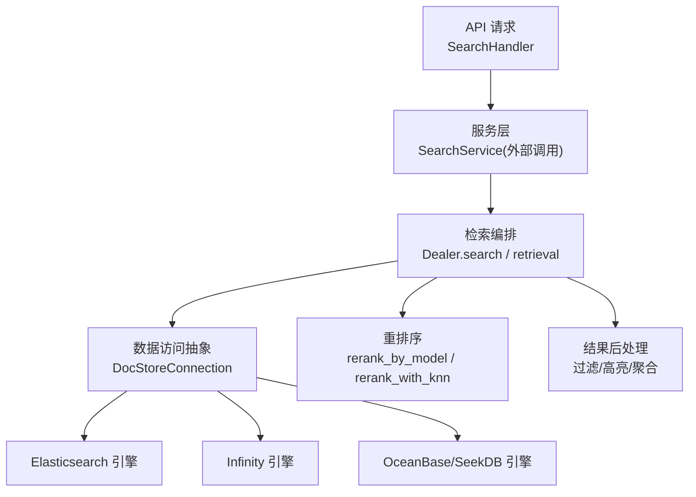
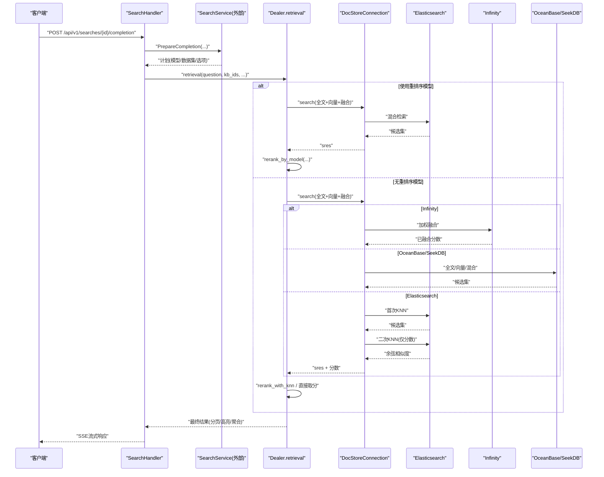
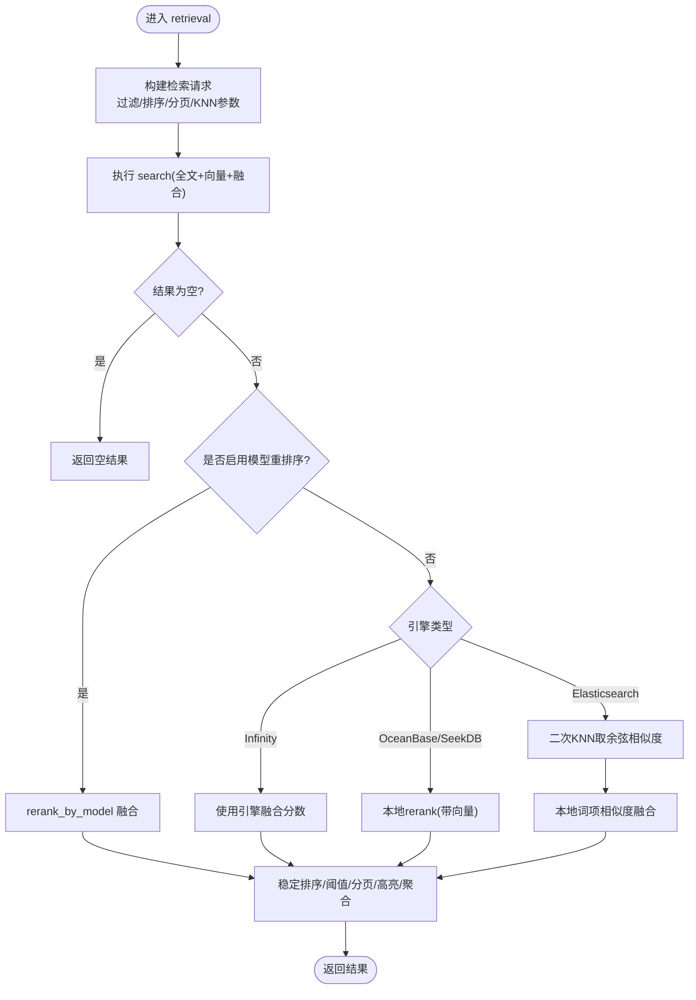
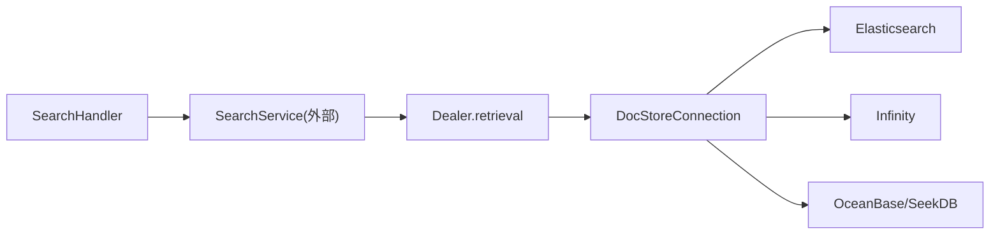

# 搜索与检索

<cite>
**本文引用的文件**
- [internal/engine/engine.go](file://internal/engine/engine.go)
- [internal/handler/search.go](file://internal/handler/search.go)
- [rag/nlp/search.py](file://rag/nlp/search.py)
- [internal/engine/elasticsearch/client.go](file://internal/engine/elasticsearch/client.go)
- [internal/engine/infinity/client.go](file://internal/engine/infinity/client.go)
- [internal/engine/oceanbase/client.go](file://internal/engine/oceanbase/client.go)
- [internal/dao/search.go](file://internal/dao/search.go)
</cite>

## 目录
1. [简介](#简介)
2. [项目结构](#项目结构)
3. [核心组件](#核心组件)
4. [架构总览](#架构总览)
5. [详细组件分析](#详细组件分析)
6. [依赖关系分析](#依赖关系分析)
7. [性能考虑](#性能考虑)
8. [故障排查指南](#故障排查指南)
9. [结论](#结论)
10. [附录](#附录)

## 简介
本文件面向RAGFlow中的“搜索与检索”子系统，系统性阐述向量搜索、全文搜索、混合搜索的实现原理与技术细节；解释重排序算法、相关性评分、结果过滤等优化技术；并覆盖查询重写、同义词扩展、语义理解等高级检索能力。文档同时对比Elasticsearch、Infinity、OceanBase（含SeekDB）三类搜索引擎的特点与适用场景，给出索引与查询优化、缓存策略等调优建议，并提供检索效果评估方法与A/B测试框架的使用指引。

## 项目结构
搜索与检索在代码中由Go服务层与Python检索层共同实现：
- Go侧提供统一的DocEngine接口与多引擎实现（Elasticsearch、Infinity、OceanBase/SeekDB），以及HTTP处理与编排逻辑。
- Python侧提供检索流程编排、混合检索表达式构建、重排序与引用生成等能力。

图示来源
- [internal/handler/search.go:30-52](file://internal/handler/search.go#L30-L52)
- [rag/nlp/search.py:178-314](file://rag/nlp/search.py#L178-L314)
- [rag/nlp/search.py:597-793](file://rag/nlp/search.py#L597-L793)
- [internal/engine/engine.go:40-94](file://internal/engine/engine.go#L40-L94)

章节来源
- [internal/engine/engine.go:29-94](file://internal/engine/engine.go#L29-L94)
- [internal/handler/search.go:30-52](file://internal/handler/search.go#L30-L52)
- [rag/nlp/search.py:178-314](file://rag/nlp/search.py#L178-L314)

## 核心组件
- DocEngine 接口：统一封装分片（Chunk）与元数据（Metadata）的CRUD、搜索、SQL执行、分页、PageRank支持、元数据下推过滤等能力，屏蔽底层引擎差异。
- 检索编排（Python Dealer）：负责将用户问题转换为全文匹配、向量匹配与融合表达式，组织过滤条件、排序、分页、高亮与聚合，并在不同引擎路径上选择最优的重排序策略。
- 搜索引擎实现：
  - Elasticsearch：通过客户端创建模板、建立索引映射，支持全文与向量KNN，二次KNN获取纯净余弦相似度用于本地融合。
  - Infinity：原生支持加权融合（weighted_sum），在引擎内完成向量与全文分数归一化与融合。
  - OceanBase/SeekDB：基于MySQL协议，支持全文、向量与可选的混合搜索DSL；根据版本与配置启用不同特性。
- HTTP 处理：SearchHandler 暴露搜索应用管理与流式补全接口，串联服务层与下游LLM/Ask服务。

章节来源
- [internal/engine/engine.go:40-94](file://internal/engine/engine.go#L40-L94)
- [rag/nlp/search.py:178-314](file://rag/nlp/search.py#L178-L314)
- [internal/engine/elasticsearch/client.go:42-120](file://internal/engine/elasticsearch/client.go#L42-L120)
- [internal/engine/infinity/client.go:119-189](file://internal/engine/infinity/client.go#L119-L189)
- [internal/engine/oceanbase/client.go:69-162](file://internal/engine/oceanbase/client.go#L69-L162)
- [internal/handler/search.go:30-52](file://internal/handler/search.go#L30-L52)

## 架构总览
下图展示一次检索请求从HTTP入口到多引擎执行的完整链路，包括混合检索、重排序与结果后处理。

图示来源
- [internal/handler/search.go:372-451](file://internal/handler/search.go#L372-L451)
- [rag/nlp/search.py:597-793](file://rag/nlp/search.py#L597-L793)
- [internal/engine/elasticsearch/client.go:42-120](file://internal/engine/elasticsearch/client.go#L42-L120)
- [internal/engine/infinity/client.go:119-189](file://internal/engine/infinity/client.go#L119-L189)
- [internal/engine/oceanbase/client.go:69-162](file://internal/engine/oceanbase/client.go#L69-L162)

## 详细组件分析

### 检索编排与混合检索（Python Dealer）
- 查询解析与过滤：
  - 从请求中提取kb_ids、doc_ids、must_not等过滤条件，构造过滤表达式。
  - 支持按chunk_order_int、page_num_int、top_int、create_timestamp_flt排序。
- 全文与向量检索：
  - 使用FulltextQueryer对问题进行全文匹配，必要时降低min_match以召回更多结果。
  - 通过embedding模型生成查询向量，构造MatchDenseExpr进行KNN检索。
- 融合策略：
  - Infinity/GaussDB：使用FusionExpr("weighted_sum")在引擎内融合全文与向量分数。
  - Elasticsearch：先返回候选集，再发起二次KNN只取余弦相似度，结合本地词项相似度计算最终得分。
  - OceanBase/SeekDB：若携带chunk向量则走本地rerank；否则依赖引擎返回分数。
- 重排序：
  - 支持模型重排序（cross-encoder类），将query与doc拼接为docs，得到[0,1]归一化分数，再与词项相似度加权融合。
  - 非模型路径：ES路径采用rerank_with_knn；Infinity路径直接使用引擎融合分数；OceanBase/SeekDB路径使用历史本地rerank。
- 结果后处理：
  - 稳定排序、阈值过滤、分页切片、高亮、聚合（按文档名）。
  - 删除保护：对父文档已删除的分片进行剪枝，避免返回无效内容。

图示来源
- [rag/nlp/search.py:178-314](file://rag/nlp/search.py#L178-L314)
- [rag/nlp/search.py:597-793](file://rag/nlp/search.py#L597-L793)

章节来源
- [rag/nlp/search.py:178-314](file://rag/nlp/search.py#L178-L314)
- [rag/nlp/search.py:597-793](file://rag/nlp/search.py#L597-L793)

### Elasticsearch 引擎
- 初始化与模板：
  - 创建Elasticsearch客户端，设置连接池与TLS。
  - 自动创建两类索引模板：分片索引（ragflow_*）与文档元数据索引（ragflow_doc_meta_*），优先级不同。
- 健康检查与关闭：
  - 提供Ping与Close方法，便于服务启动时探测可用性。
- 搜索特点：
  - 支持全文与向量KNN；主检索不传输chunk向量，二次KNN仅取余弦相似度，减少网络开销。
  - 支持PageRank（接口层标记）。

章节来源
- [internal/engine/elasticsearch/client.go:42-120](file://internal/engine/elasticsearch/client.go#L42-L120)
- [internal/engine/engine.go:86-94](file://internal/engine/engine.go#L86-L94)

### Infinity 引擎
- 连接池与超时：
  - 通过SDK连接池管理连接，默认最大打开连接数可配置，空闲连接上限受限，避免资源泄露。
  - 操作超时与Socket超时可控，提升稳定性。
- 搜索特点：
  - 原生支持加权融合（weighted_sum），在引擎内完成向量与全文分数归一化与融合，无需二次KNN。
  - 适合需要低延迟、高吞吐的混合检索场景。

章节来源
- [internal/engine/infinity/client.go:119-189](file://internal/engine/infinity/client.go#L119-L189)

### OceanBase/SeekDB 引擎
- 连接与版本检测：
  - 基于MySQL协议连接，设置读写超时、连接池大小与生命周期。
  - 检测OceanBase/SeekDB版本，决定是否启用混合搜索DSL与索引刷新能力。
- 搜索特点：
  - 支持全文、向量与可选混合搜索；根据配置决定优先使用全文或混合。
  - 当返回chunk向量时，可在应用层进行本地rerank；否则依赖引擎分数。

章节来源
- [internal/engine/oceanbase/client.go:69-162](file://internal/engine/oceanbase/client.go#L69-L162)

### HTTP 搜索接口与流式补全
- 列表/创建/更新/删除搜索应用：
  - 提供REST接口，包含权限校验、名称校验、分页与排序。
- 流式补全：
  - 准备补全计划后，通过SSE向客户端推送答案片段、标记、错误与最终结果。

章节来源
- [internal/handler/search.go:71-187](file://internal/handler/search.go#L71-L187)
- [internal/handler/search.go:372-451](file://internal/handler/search.go#L372-L451)

### 搜索应用数据访问（DAO）
- 提供搜索应用的CRUD、按租户ID/所有者ID筛选、关键词模糊匹配、软删除与详情查询等功能。
- 支持JOIN用户表以补充昵称与头像信息，便于前端展示。

章节来源
- [internal/dao/search.go:50-139](file://internal/dao/search.go#L50-L139)
- [internal/dao/search.go:151-178](file://internal/dao/search.go#L151-L178)
- [internal/dao/search.go:187-239](file://internal/dao/search.go#L187-L239)

## 依赖关系分析
- 接口解耦：DocEngine作为统一抽象，上层检索编排不感知具体引擎差异。
- 引擎差异：
  - Elasticsearch：二次KNN取余弦相似度，本地融合词项相似度。
  - Infinity：引擎内加权融合，减少往返。
  - OceanBase/SeekDB：根据版本与配置启用混合搜索，必要时本地rerank。
- 服务层耦合：SearchHandler依赖SearchService（外部）、AskService与ModelProviderService，形成清晰的职责边界。

图示来源
- [internal/handler/search.go:30-52](file://internal/handler/search.go#L30-L52)
- [rag/nlp/search.py:178-314](file://rag/nlp/search.py#L178-L314)
- [internal/engine/engine.go:40-94](file://internal/engine/engine.go#L40-L94)

章节来源
- [internal/engine/engine.go:40-94](file://internal/engine/engine.go#L40-L94)
- [internal/handler/search.go:30-52](file://internal/handler/search.go#L30-L52)
- [rag/nlp/search.py:178-314](file://rag/nlp/search.py#L178-L314)

## 性能考虑
- 索引优化
  - Elasticsearch：合理设计mapping与分词器，利用索引模板统一管理；控制shard与replica数量；对高频过滤字段建立keyword字段。
  - Infinity：调整连接池MaxOpen与MaxIdle，避免连接耗尽；合理使用权重融合减少额外计算。
  - OceanBase/SeekDB：开启混合搜索DSL（版本允许）以减少应用层计算；合理设置查询超时与连接池大小。
- 查询优化
  - 控制knn_top_k与knn_num_candidates平衡召回与延迟。
  - 使用must_not与精确过滤减少候选集规模。
  - 对无向量场景，优先全文检索并设置合理的min_match阈值。
- 缓存策略
  - 短生命周期缓存：如“文档存在性”缓存，避免重复DB查询导致连接池耗尽。
  - 结果缓存：对热点查询与固定参数组合做短期缓存（需考虑一致性）。
- 重排序成本
  - 模型重排序仅在必要路径启用；ES路径通过二次KNN避免传输chunk向量。
  - 对Infinity路径直接利用引擎融合分数，减少本地计算。

## 故障排查指南
- 连接与健康检查
  - Elasticsearch：检查Ping失败原因（认证、TLS、网络）。
  - Infinity：关注连接池耗尽异常，调整INFINITY_POOL_MAX_SIZE与MaxIdle。
  - OceanBase/SeekDB：检查版本兼容性、查询超时与连接池配置。
- 检索为空或结果质量差
  - 调整similarity_threshold与vector_similarity_weight。
  - 降低min_match以提升召回；扩大knn_top_k/knn_num_candidates。
  - 检查过滤条件是否过严（kb_ids/doc_ids/must_not）。
- 结果不一致或分页异常
  - 启用重排序时，确保rerank_candidates_count大于page*page_size。
  - 使用稳定排序保证分数相同情况下的确定性顺序。
- 删除分片残留
  - 系统会在检索前后对父文档已删除的分片进行剪枝；若仍出现，检查删除路径的一致性。

章节来源
- [internal/engine/elasticsearch/client.go:102-120](file://internal/engine/elasticsearch/client.go#L102-L120)
- [internal/engine/infinity/client.go:119-189](file://internal/engine/infinity/client.go#L119-L189)
- [internal/engine/oceanbase/client.go:136-162](file://internal/engine/oceanbase/client.go#L136-L162)
- [rag/nlp/search.py:617-637](file://rag/nlp/search.py#L617-L637)
- [rag/nlp/search.py:121-163](file://rag/nlp/search.py#L121-L163)

## 结论
RAGFlow的搜索与检索系统通过统一的DocEngine抽象与灵活的检索编排，实现了向量、全文与混合检索的统一接入与优化。针对不同引擎的特性（Elasticsearch的二次KNN、Infinity的原生融合、OceanBase/SeekDB的版本化混合能力），系统选择了最合适的重排序与融合策略，兼顾召回率与延迟。配合索引与查询优化、缓存策略以及严格的阈值与分页控制，能够在大规模知识库中提供稳定高效的检索体验。

## 附录

### 高级检索功能说明
- 查询重写与同义词扩展
  - 通过FulltextQueryer对问题进行分词与改写，必要时降低min_match提升召回。
  - 同义词与术语权重可通过NLP模块与配置扩展（参考nlp子模块）。
- 语义理解
  - 使用embedding模型将查询与分片映射至同一向量空间，结合词项相似度实现语义匹配。
  - 支持交叉编码器类重排序模型，进一步提升相关性。

### 搜索引擎对比与适用场景
- Elasticsearch
  - 优势：生态成熟、全文能力强、二次KNN灵活。
  - 适用：复杂全文检索、需要精细控制打分与过滤的场景。
- Infinity
  - 优势：原生加权融合、低延迟、高吞吐。
  - 适用：对实时性要求高的混合检索场景。
- OceanBase/SeekDB
  - 优势：SQL兼容、版本化混合搜索、可扩展性强。
  - 适用：企业级数据库一体化场景，需与事务型业务共存。

### 检索效果评估与A/B测试
- 评估指标
  - 召回率（Recall@K）、准确率（Precision@K）、NDCG、MRR等。
  - 结合人工标注与自动化指标，评估不同权重与阈值的效果。
- A/B测试框架
  - 在检索编排层引入实验开关，对不同分组使用不同的vector_similarity_weight、similarity_threshold、knn_top_k等参数。
  - 通过日志与埋点记录关键指标（延迟、QPS、点击率、转化率），定期对比分析。