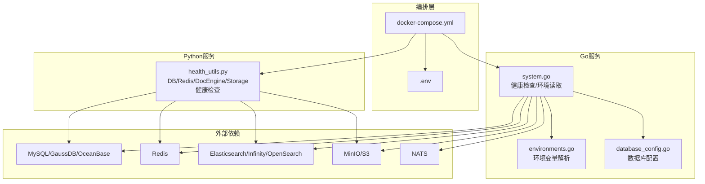
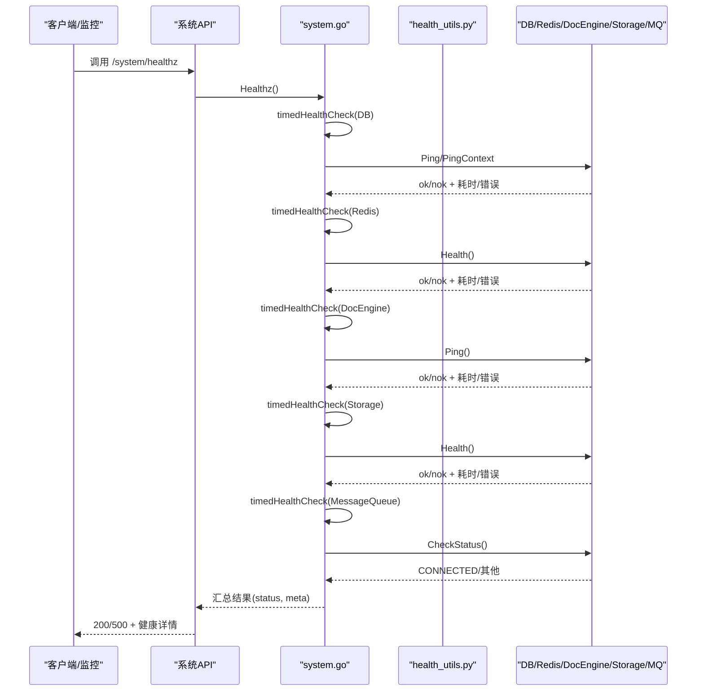
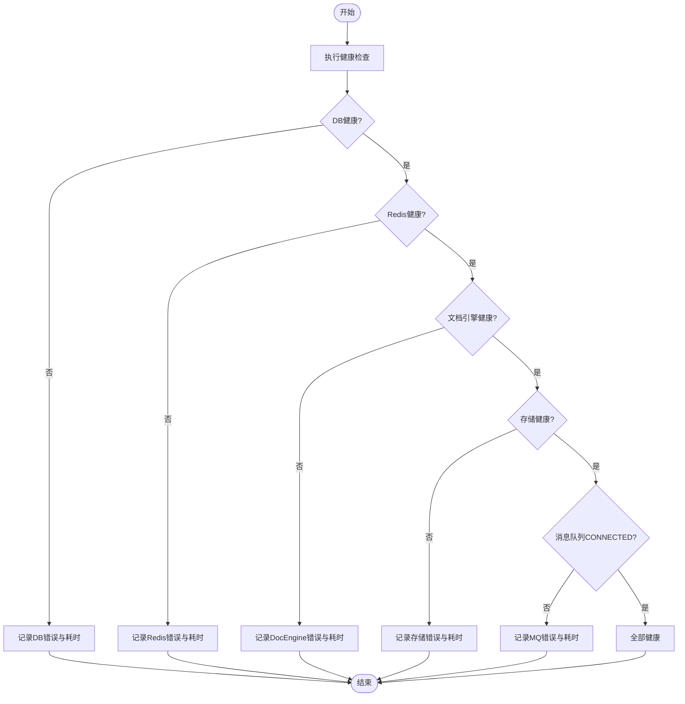
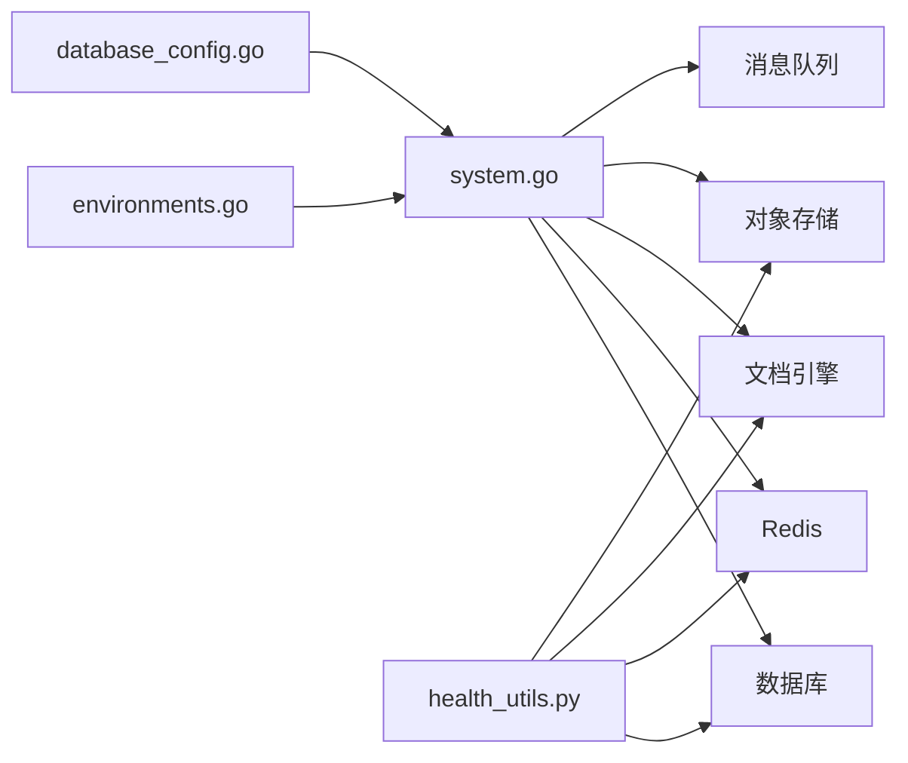

# 常见问题解答

<cite>
**本文引用的文件**
- [docker-compose.yml](file://docker/docker-compose.yml)
- [.env](file://docker/.env)
- [system.go](file://internal/service/system.go)
- [health_utils.py](file://api/utils/health_utils.py)
- [environments.go](file://internal/server/config/environments.go)
- [database_config.go](file://internal/server/config/database_config.go)
- [config.py](file://admin/server/config.py)
- [agent_dbcheck.go](file://internal/service/agent_dbcheck.go)
- [error_code.go](file://internal/common/error_code.go)
- [errors.go](file://internal/harness/graph/errors/errors.go)
- [test_api_utils.py](file://test/unit_test/api/utils/test_api_utils.py)
- [faq.mdx](file://docs/faq.mdx)
</cite>

## 目录
1. [简介](#简介)
2. [项目结构](#项目结构)
3. [核心组件](#核心组件)
4. [架构总览](#架构总览)
5. [详细组件分析](#详细组件分析)
6. [依赖关系分析](#依赖关系分析)
7. [性能注意事项](#性能注意事项)
8. [故障排查指南](#故障排查指南)
9. [结论](#结论)
10. [附录](#附录)

## 简介
本FAQ聚焦RAGFlow在“安装部署、运行环境、配置错误”三类典型问题上的诊断与解决，覆盖Docker容器启动失败、端口冲突、网络配置错误、内存不足、模型加载失败、依赖缺失、数据库连接失败、API密钥配置错误、环境变量设置不当等。文档同时提供系统健康检查方法与自动修复机制的使用指南，帮助快速定位并恢复服务。

## 项目结构
RAGFlow采用多语言混合架构：Go后端负责系统服务、健康检查、配置与环境变量管理；Python后端提供业务API与健康探针；Docker Compose编排MySQL、Redis、对象存储、搜索引擎/向量库、消息队列等依赖；.env集中管理端口、密码、引擎类型等关键参数。

**图示来源**
- [docker-compose.yml:1-166](file://docker/docker-compose.yml#L1-L166)
- [.env:1-464](file://docker/.env#L1-L464)
- [system.go:300-399](file://internal/service/system.go#L300-L399)
- [health_utils.py:44-80](file://api/utils/health_utils.py#L44-L80)
- [environments.go:165-212](file://internal/server/config/environments.go#L165-L212)
- [database_config.go:43-57](file://internal/server/config/database_config.go#L43-L57)

**章节来源**
- [docker-compose.yml:1-166](file://docker/docker-compose.yml#L1-L166)
- [.env:1-464](file://docker/.env#L1-L464)

## 核心组件
- 健康检查与系统状态
  - Go侧通过定时健康检查探测DB、Redis、文档引擎、存储、消息队列，汇总状态并返回整体ok/nok。
  - Python侧提供轻量级健康探针，覆盖DB、Redis、文档引擎、存储、MinIO/S3、任务执行器等。
- 配置与环境变量
  - 环境变量优先于配置文件；支持DOC_ENGINE、DB_TYPE、DEVICE、STORAGE_IMPL等关键开关。
  - 数据库类型（mysql/oceanbase）及连接参数由配置模块统一解析与校验。
- 错误码与响应
  - 统一的错误码映射到HTTP状态码；未映射的返回码会降级为500并记录告警日志。

**章节来源**
- [system.go:300-399](file://internal/service/system.go#L300-L399)
- [health_utils.py:44-80](file://api/utils/health_utils.py#L44-L80)
- [environments.go:165-212](file://internal/server/config/environments.go#L165-L212)
- [database_config.go:43-57](file://internal/server/config/database_config.go#L43-L57)
- [error_code.go:36-67](file://internal/common/error_code.go#L36-L67)
- [test_api_utils.py:115-149](file://test/unit_test/api/utils/test_api_utils.py#L115-L149)

## 架构总览
下图展示健康检查从请求入口到各依赖的探测流程，以及异常时的元数据收集。

**图示来源**
- [system.go:300-399](file://internal/service/system.go#L300-L399)
- [health_utils.py:454-489](file://api/utils/health_utils.py#L454-L489)

## 详细组件分析

### 安装部署问题
- Docker容器启动失败
  - 现象：容器反复重启或无法进入就绪状态。
  - 诊断：查看容器日志；确认依赖服务（MySQL/Redis/DocEngine/Storage/MQ）是否健康；核对端口映射与网络。
  - 处理：根据健康检查结果逐项修复；必要时重置容器与卷。
  - 参考：健康检查实现与依赖探测逻辑。
- 端口冲突
  - 现象：服务无法绑定端口或外部访问失败。
  - 诊断：检查.env中SVR_WEB_HTTP_PORT、SVR_HTTP_PORT、ADMIN_SVR_HTTP_PORT、EXPOSE_*等端口是否与宿主机冲突。
  - 处理：调整.env中的端口映射后重启；避免重复端口。
  - 参考：Compose端口映射与环境变量定义。
- 网络配置错误
  - 现象：容器间无法通信或外部不可达。
  - 诊断：确认COMPOSE_PROFILES、服务名、端口暴露；验证防火墙/安全组；使用健康接口验证连通性。
  - 处理：修正网络策略与服务发现；确保内部端口与外部映射一致。

**章节来源**
- [docker-compose.yml:43-65](file://docker/docker-compose.yml#L43-L65)
- [.env:229-239](file://docker/.env#L229-L239)
- [system.go:300-399](file://internal/service/system.go#L300-L399)

### 运行环境问题
- 内存不足
  - 现象：解析卡住、OOM、进程被杀。
  - 诊断：观察MEM_LIMIT、设备类型DEVICE；查看任务执行器心跳与日志。
  - 处理：增大MEM_LIMIT；降低批大小EMBEDDING_BATCH_SIZE/DOC_BULK_SIZE；切换更小的模型或增加资源。
  - 参考：FAQ中关于内存与解析卡顿的处理建议。
- 模型加载失败
  - 现象：首次加载Ollama/本地模型超时或失败。
  - 诊断：检查模型服务可达性与资源；确认HF镜像源可用。
  - 处理：更换更小模型；配置HF_ENDPOINT；将模型预下载到指定目录并挂载。
  - 参考：FAQ中关于Huggingface与模型加载的建议。
- 依赖缺失
  - 现象：Tika无法启动、缺少必要文件或依赖。
  - 诊断：检查Java环境、Nginx配置、DeepDoc资源路径。
  - 处理：安装Java；补齐缺失配置；按FAQ指引修复。

**章节来源**
- [faq.mdx:163-229](file://docs/faq.mdx#L163-L229)
- [health_utils.py:436-451](file://api/utils/health_utils.py#L436-L451)

### 配置错误
- 数据库连接失败
  - 现象：DB健康检查失败、查询超时。
  - 诊断：检查DB_TYPE、连接参数（host/port/user/password）、最大包大小；使用健康接口查看错误信息。
  - 处理：修正.env或service_conf；对外部数据库确保白名单与网络可达；必要时调整max_allowed_packet。
  - 参考：数据库配置解析与导出、健康检查实现。
- API密钥配置错误
  - 现象：调用外部模型/OCR/检索服务鉴权失败。
  - 诊断：核对密钥、端点、协议；查看健康接口与日志。
  - 处理：更新密钥与端点；确认HTTPS/证书校验配置。
- 环境变量设置不当
  - 现象：服务行为异常或功能未启用。
  - 诊断：列出当前环境变量（DOC_ENGINE、DB_TYPE、DEVICE、STORAGE_IMPL等），确认优先级与默认值。
  - 处理：按需求修改.env并重启；注意COMPOSE_PROFILES联动。

**章节来源**
- [database_config.go:43-57](file://internal/server/config/database_config.go#L43-L57)
- [environments.go:165-212](file://internal/server/config/environments.go#L165-L212)
- [health_utils.py:44-80](file://api/utils/health_utils.py#L44-L80)
- [.env:21-38](file://docker/.env#L21-L38)

### 系统健康检查与自动修复
- 健康检查方法
  - 调用系统健康接口获取DB、Redis、文档引擎、存储、消息队列的状态与耗时；若任一组件不健康，整体status为nok并附带_meta详情。
  - Python侧提供细粒度探针，便于定位具体依赖问题。
- 自动修复机制
  - 任务执行器心跳检测：通过Redis维护任务执行器列表与最近心跳，长时间无心跳视为不可用，可触发重试或调度迁移。
  - 工作进程回收：可通过MAX_TASKS_PER_WORKER限制单进程完成任务数后自动重启，释放GPU/CUDA碎片，缓解长期运行的内存泄漏风险。
  - 队列清理：当任务堆积时，可按版本清理Redis任务组并重建，随后重启相关容器以恢复流水线。

**图示来源**
- [system.go:300-399](file://internal/service/system.go#L300-L399)
- [health_utils.py:454-489](file://api/utils/health_utils.py#L454-L489)

**章节来源**
- [health_utils.py:436-451](file://api/utils/health_utils.py#L436-L451)
- [.env:441-452](file://docker/.env#L441-L452)
- [faq.mdx:264-328](file://docs/faq.mdx#L264-L328)

## 依赖关系分析
- 组件耦合
  - system.go聚合DB/Redis/DocEngine/Storage/MQ健康检查，强依赖各组件初始化成功。
  - health_utils.py提供Python侧健康探针，与Go侧互补。
  - environments.go与database_config.go共同决定运行时行为与连接参数。
- 外部依赖
  - 文档引擎可为Elasticsearch、Infinity、OpenSearch、OceanBase、SeekDB、GaussDB等，需按.env选择对应profile与端口。
  - 存储支持MinIO/S3兼容；消息队列使用NATS。
- 潜在循环依赖
  - 健康检查均为单向探测，未发现循环依赖。

**图示来源**
- [system.go:300-399](file://internal/service/system.go#L300-L399)
- [health_utils.py:44-80](file://api/utils/health_utils.py#L44-L80)
- [environments.go:165-212](file://internal/server/config/environments.go#L165-L212)
- [database_config.go:43-57](file://internal/server/config/database_config.go#L43-L57)

**章节来源**
- [system.go:300-399](file://internal/service/system.go#L300-L399)
- [health_utils.py:44-80](file://api/utils/health_utils.py#L44-L80)

## 性能注意事项
- 批大小与并发
  - DOC_BULK_SIZE与EMBEDDING_BATCH_SIZE影响吞吐与内存占用，应根据硬件调优。
- 模型与推理
  - 使用更快的LLM/Embedding服务；减少TopN与不必要上下文；仅在需要时使用重排序。
- 任务执行器
  - MAX_TASKS_PER_WORKER控制工作进程生命周期，避免CUDA/ONNX碎片累积导致内存增长。
- 日志级别
  - LOG_LEVELS可按模块细化，生产环境建议INFO及以上。

**章节来源**
- [.env:307-313](file://docker/.env#L307-L313)
- [.env:441-452](file://docker/.env#L441-L452)
- [faq.mdx:622-638](file://docs/faq.mdx#L622-L638)

## 故障排查指南
- 通用步骤
  1) 查看系统健康接口，定位不健康的组件与错误摘要。
  2) 检查.env中端口、密码、引擎类型、设备类型等关键配置。
  3) 核对容器网络与端口映射，确保内外可达。
  4) 针对具体组件（DB/Redis/DocEngine/Storage/MQ）进行连通性测试与日志分析。
  5) 如任务堆积，按版本清理Redis任务组并重建，再重启相关容器。
- 常见错误与修复
  - 数据库连接失败：修正DB_TYPE与连接参数；调整max_allowed_packet；确认网络与认证。
  - 模型加载失败：配置HF_ENDPOINT或使用镜像站；预下载模型并挂载；增加内存或换小模型。
  - 端口冲突：调整SVR_*与EXPOSE_*端口；避免与宿主机冲突。
  - 网络异常：检查防火墙/安全组；确认服务名与端口；使用健康接口验证。
  - 权限/认证错误：核对API密钥与端点；确认HTTPS与证书校验。
- 自动修复与自愈
  - 任务执行器心跳缺失时，调度器可重新分配任务；工作进程达到阈值自动重启释放资源；队列堆积时可清理并重建。

**章节来源**
- [system.go:300-399](file://internal/service/system.go#L300-L399)
- [health_utils.py:436-451](file://api/utils/health_utils.py#L436-L451)
- [faq.mdx:264-328](file://docs/faq.mdx#L264-L328)
- [error_code.go:36-67](file://internal/common/error_code.go#L36-L67)
- [test_api_utils.py:115-149](file://test/unit_test/api/utils/test_api_utils.py#L115-L149)

## 结论
通过系统化的健康检查、清晰的环境变量与配置管理、以及内置的自动修复机制，RAGFlow能够快速定位并恢复大多数安装部署、运行环境与配置错误类问题。建议在生产环境中结合健康接口与日志进行持续监控，并根据负载与硬件条件调优批大小、并发与模型资源。

## 附录
- 常用命令与位置
  - 日志位置：ragflow/docker/ragflow-logs/*.log
  - 健康接口：/api/v1/system/healthz（Go）与Python侧健康探针
  - 环境变量：docker/.env
  - 编排文件：docker/docker-compose.yml
- 参考链接
  - FAQ文档：docs/faq.mdx
  - HTTP API参考：references/http_api_reference.md
  - Python API参考：references/python_api_reference.md