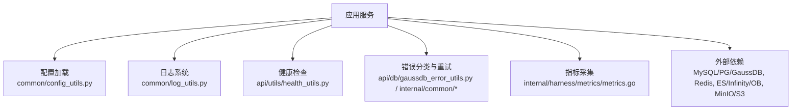
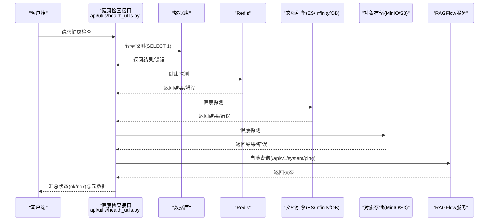
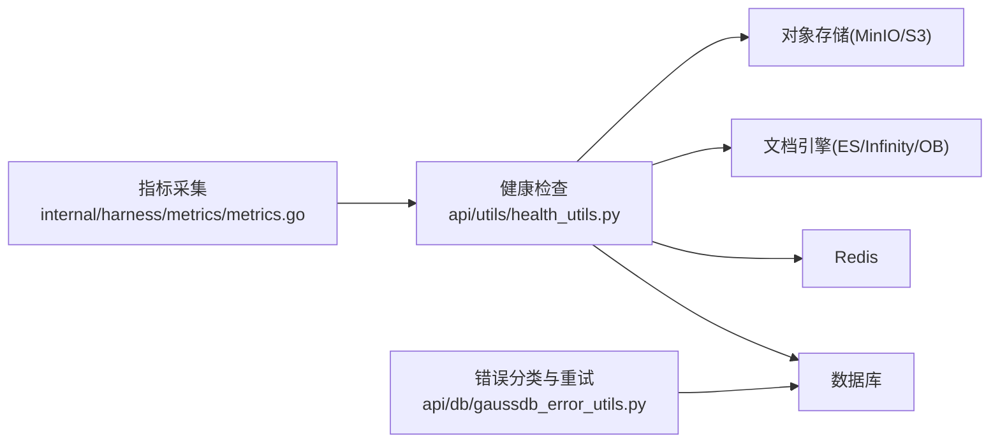

# 故障排除与FAQ

<cite>
**本文引用的文件**
- [common/config_utils.py](file://common/config_utils.py)
- [common/log_utils.py](file://common/log_utils.py)
- [api/utils/health_utils.py](file://api/utils/health_utils.py)
- [conf/service_conf.yaml](file://conf/service_conf.yaml)
- [internal/admin/service.go](file://internal/admin/service.go)
- [internal/harness/graph/errors/errors.go](file://internal/harness/graph/errors/errors.go)
- [internal/harness/metrics/metrics.go](file://internal/harness/metrics/metrics.go)
- [internal/common/retry_test.go](file://internal/common/retry_test.go)
- [internal/agent/sandbox/http.go](file://internal/agent/sandbox/http.go)
- [api/db/gaussdb_error_utils.py](file://api/db/gaussdb_error_utils.py)
</cite>

## 目录
1. [简介](#简介)
2. [项目结构](#项目结构)
3. [核心组件](#核心组件)
4. [架构总览](#架构总览)
5. [详细组件分析](#详细组件分析)
6. [依赖关系分析](#依赖关系分析)
7. [性能注意事项](#性能注意事项)
8. [故障排查指南](#故障排查指南)
9. [结论](#结论)
10. [附录](#附录)

## 简介
本指南聚焦于RAGFlow在部署、配置、运行过程中的常见问题与解决方案，覆盖安装部署、配置错误、性能问题、网络连接等典型场景。文档提供系统健康检查与自动修复机制的使用方法，并给出日志分析、性能监控、网络调试等诊断技术建议，以及性能调优与社区支持渠道指引。

## 项目结构
RAGFlow的故障排除相关能力主要分布在以下位置：
- 配置加载与覆盖：通过YAML配置文件与本地覆盖文件合并加载，支持敏感信息脱敏显示与动态更新。
- 日志体系：统一初始化日志输出到文件与标准输出，支持按包名设置日志级别。
- 健康检查：对数据库、Redis、文档引擎、对象存储、MinIO/S3、任务执行器等关键组件进行连通性与延迟检测。
- 错误分类与重试：针对GaussDB连接与事务冲突的错误进行分类，配合通用重试策略实现自动恢复。
- 指标与可观测性：收集执行过程指标（如步骤数、节点执行数、恢复错误数等），便于定位瓶颈。

图表来源
- [common/config_utils.py:28-77](file://common/config_utils.py#L28-L77)
- [common/log_utils.py:27-73](file://common/log_utils.py#L27-L73)
- [api/utils/health_utils.py:44-489](file://api/utils/health_utils.py#L44-L489)
- [api/db/gaussdb_error_utils.py:27-175](file://api/db/gaussdb_error_utils.py#L27-L175)
- [internal/harness/metrics/metrics.go:37-75](file://internal/harness/metrics/metrics.go#L37-L75)

章节来源
- [common/config_utils.py:28-77](file://common/config_utils.py#L28-L77)
- [common/log_utils.py:27-73](file://common/log_utils.py#L27-L73)
- [api/utils/health_utils.py:44-489](file://api/utils/health_utils.py#L44-L489)
- [api/db/gaussdb_error_utils.py:27-175](file://api/db/gaussdb_error_utils.py#L27-L175)
- [internal/harness/metrics/metrics.go:37-75](file://internal/harness/metrics/metrics.go#L37-L75)

## 核心组件
- 配置加载与覆盖：支持全局配置与本地覆盖，读取YAML并合并；提供敏感字段脱敏展示与运行时更新能力。
- 日志系统：统一初始化日志轮转与级别控制，支持运行时调整包级日志级别。
- 健康检查：对数据库、缓存、文档引擎、对象存储等进行连通性与延迟检测，汇总整体状态。
- 错误分类与重试：识别连接异常与可重试事务错误，结合退避与抖动策略提升稳定性。
- 指标采集：记录图执行、工具调用、检查点、恢复错误等指标，辅助性能分析与容量规划。

章节来源
- [common/config_utils.py:28-77](file://common/config_utils.py#L28-L77)
- [common/log_utils.py:27-73](file://common/log_utils.py#L27-L73)
- [api/utils/health_utils.py:44-489](file://api/utils/health_utils.py#L44-L489)
- [api/db/gaussdb_error_utils.py:27-175](file://api/db/gaussdb_error_utils.py#L27-L175)
- [internal/harness/metrics/metrics.go:37-75](file://internal/harness/metrics/metrics.go#L37-L75)

## 架构总览
下图展示了健康检查流程与各依赖组件的交互关系，包括数据库、缓存、文档引擎、对象存储与服务进程自检。

图表来源
- [api/utils/health_utils.py:44-489](file://api/utils/health_utils.py#L44-L489)

章节来源
- [api/utils/health_utils.py:44-489](file://api/utils/health_utils.py#L44-L489)

## 详细组件分析

### 配置加载与覆盖
- 功能要点：
  - 从全局配置文件与本地覆盖文件合并加载，确保灵活定制。
  - 支持敏感字段（密码、密钥等）脱敏显示，避免泄露。
  - 提供运行时更新配置的能力，便于热更新。
- 常见问题：
  - 配置文件路径或格式错误导致加载失败。
  - 本地覆盖未生效（路径或权限问题）。
  - 敏感信息未正确脱敏导致日志泄露。
- 诊断方法：
  - 使用配置显示函数查看当前生效的配置项（已脱敏）。
  - 检查配置文件路径与权限，确认本地覆盖文件存在且可读。
  - 审查日志中关于配置加载的错误信息。

章节来源
- [common/config_utils.py:28-77](file://common/config_utils.py#L28-L77)
- [common/config_utils.py:80-113](file://common/config_utils.py#L80-L113)
- [common/config_utils.py:149-158](file://common/config_utils.py#L149-L158)

### 日志系统与级别控制
- 功能要点：
  - 统一初始化日志到文件与标准输出，支持轮转与备份。
  - 支持通过环境变量为不同包设置日志级别，便于按需降噪。
  - 提供运行时修改包级日志级别的能力。
- 常见问题：
  - 日志文件过大或无法写入。
  - 日志级别过高导致噪音过多或过低导致信息不足。
- 诊断方法：
  - 检查日志路径与磁盘空间，确认轮转策略有效。
  - 通过运行时接口调整包级日志级别，观察输出变化。

章节来源
- [common/log_utils.py:27-73](file://common/log_utils.py#L27-L73)
- [common/log_utils.py:76-91](file://common/log_utils.py#L76-L91)

### 健康检查与自动修复
- 功能要点：
  - 对数据库、Redis、文档引擎、对象存储进行连通性与延迟检测。
  - 汇总各组件状态，返回整体健康情况与元数据。
  - 支持MinIO/S3的HTTPS与证书校验配置。
- 常见问题：
  - 某组件不可用导致整体健康状态降级。
  - 高延迟影响健康判定阈值。
- 诊断方法：
  - 查看健康检查返回的元数据，定位具体组件与错误信息。
  - 根据延迟与连接状态调整资源配置或网络策略。

章节来源
- [api/utils/health_utils.py:44-489](file://api/utils/health_utils.py#L44-L489)

### 错误分类与重试机制
- 功能要点：
  - 基于SQLSTATE与文本匹配识别连接异常与可重试事务错误。
  - 提供通用重试策略（指数退避、抖动、上下文取消感知）。
  - 多策略组合以应对网络、临时错误、超时与资源限制。
- 常见问题：
  - 连接中断或服务器关闭导致操作失败。
  - 并发更新引发死锁或序列化失败。
- 诊断方法：
  - 捕获并分类错误，判断是否可重试。
  - 结合重试回调与指标观察重试次数与成功率。

章节来源
- [api/db/gaussdb_error_utils.py:27-175](file://api/db/gaussdb_error_utils.py#L27-L175)
- [internal/common/retry_test.go:12-96](file://internal/common/retry_test.go#L12-L96)
- [internal/agent/sandbox/http.go:175-204](file://internal/agent/sandbox/http.go#L175-L204)

### 指标采集与可观测性
- 功能要点：
  - 收集图执行步骤、节点执行数、恢复错误数、中断次数等指标。
  - 提供工具调用成功率与重试率、检查点保存与恢复统计。
- 常见问题：
  - 指标缺失或采样比例过低导致难以定位问题。
- 诊断方法：
  - 启用并导出指标，结合告警规则设定阈值。
  - 关联重试与错误分类结果，分析失败根因。

章节来源
- [internal/harness/metrics/metrics.go:37-75](file://internal/harness/metrics/metrics.go#L37-L75)

## 依赖关系分析
健康检查与错误处理模块对外部依赖具有强耦合性，需确保依赖服务可用与配置正确。

图表来源
- [api/utils/health_utils.py:44-489](file://api/utils/health_utils.py#L44-L489)
- [api/db/gaussdb_error_utils.py:27-175](file://api/db/gaussdb_error_utils.py#L27-L175)
- [internal/harness/metrics/metrics.go:37-75](file://internal/harness/metrics/metrics.go#L37-L75)

章节来源
- [api/utils/health_utils.py:44-489](file://api/utils/health_utils.py#L44-L489)
- [api/db/gaussdb_error_utils.py:27-175](file://api/db/gaussdb_error_utils.py#L27-L175)
- [internal/harness/metrics/metrics.go:37-75](file://internal/harness/metrics/metrics.go#L37-L75)

## 性能注意事项
- 配置优化：
  - 合理设置数据库连接池大小与超时时间，避免连接耗尽。
  - 调整文档引擎搜索参数（如混合检索权重）以提升召回与速度。
- 缓存策略：
  - 利用Redis缓存热点数据，降低后端压力。
  - 关注缓存命中率与过期策略，避免雪崩。
- 重试与退避：
  - 使用指数退避与抖动减少瞬时拥塞。
  - 区分可重试与不可重试错误，避免无效重试。
- 监控与告警：
  - 基于指标设置阈值告警（如延迟、QPS、慢查询）。
  - 定期回顾指标趋势，发现潜在瓶颈。

[本节为通用指导，不直接分析具体文件]

## 故障排查指南

### 安装部署问题
- 症状：服务启动失败或端口占用。
- 可能原因：
  - 配置文件中的主机或端口不正确。
  - 依赖服务（数据库、缓存、对象存储）未就绪。
- 处理方法：
  - 检查配置文件中的服务地址与端口。
  - 使用健康检查接口验证各组件连通性。
  - 查看日志中的启动错误信息。

章节来源
- [conf/service_conf.yaml:1-194](file://conf/service_conf.yaml#L1-L194)
- [api/utils/health_utils.py:44-489](file://api/utils/health_utils.py#L44-L489)

### 配置错误
- 症状：功能异常或鉴权失败。
- 可能原因：
  - YAML格式错误或键名拼写错误。
  - 本地覆盖未生效或权限不足。
  - 敏感信息未正确配置或解密失败。
- 处理方法：
  - 使用配置显示功能核对当前生效配置。
  - 检查本地覆盖文件路径与权限。
  - 确认加密模块与私钥配置正确。

章节来源
- [common/config_utils.py:28-77](file://common/config_utils.py#L28-L77)
- [common/config_utils.py:80-113](file://common/config_utils.py#L80-L113)
- [common/config_utils.py:124-147](file://common/config_utils.py#L124-L147)

### 性能问题
- 症状：响应缓慢或吞吐下降。
- 可能原因：
  - 数据库连接池过小或慢查询增多。
  - 文档引擎索引或检索参数不当。
  - 重试风暴或缓存穿透。
- 处理方法：
  - 调整连接池大小与超时参数。
  - 优化检索参数与索引结构。
  - 启用合理的重试策略与缓存预热。

章节来源
- [api/utils/health_utils.py:241-309](file://api/utils/health_utils.py#L241-L309)
- [internal/harness/metrics/metrics.go:37-75](file://internal/harness/metrics/metrics.go#L37-L75)

### 网络连接问题
- 症状：连接超时或中断。
- 可能原因：
  - 防火墙或代理阻止通信。
  - 证书校验失败（HTTPS）。
  - 服务端关闭或重启。
- 处理方法：
  - 检查网络策略与证书配置。
  - 使用健康检查接口定位断点。
  - 启用重试与退避策略。

章节来源
- [api/utils/health_utils.py:352-405](file://api/utils/health_utils.py#L352-L405)
- [internal/agent/sandbox/http.go:175-204](file://internal/agent/sandbox/http.go#L175-L204)

### 日志分析与调试
- 方法：
  - 查看日志文件路径与级别，必要时提高特定包的日志级别。
  - 关注健康检查与错误分类相关的日志条目。
  - 结合指标与重试回调分析失败模式。
- 工具：
  - 日志轮转与备份，避免磁盘占满。
  - 运行时调整日志级别，快速定位问题。

章节来源
- [common/log_utils.py:27-73](file://common/log_utils.py#L27-L73)
- [common/log_utils.py:76-91](file://common/log_utils.py#L76-L91)

### 系统健康检查与自动修复
- 方法：
  - 定期调用健康检查接口，获取各组件状态与延迟。
  - 对不可用组件进行自动重试或切换。
  - 基于指标设置告警，及时通知运维。
- 工具：
  - 健康检查聚合结果与元数据。
  - 重试策略与错误分类，实现自愈。

章节来源
- [api/utils/health_utils.py:44-489](file://api/utils/health_utils.py#L44-L489)
- [internal/harness/graph/errors/errors.go:107-163](file://internal/harness/graph/errors/errors.go#L107-L163)

### 性能调优指南
- 资源配置优化：
  - 调整数据库连接池大小、超时与最大包大小。
  - 合理设置对象存储与缓存的参数。
- 数据库调优：
  - 优化慢查询与索引。
  - 使用事务重试处理并发冲突。
- 缓存策略：
  - 设置合适的TTL与预热策略。
  - 监控命中率与内存使用。

章节来源
- [conf/service_conf.yaml:9-65](file://conf/service_conf.yaml#L9-L65)
- [api/db/gaussdb_error_utils.py:46-60](file://api/db/gaussdb_error_utils.py#L46-L60)

### 社区支持与反馈流程
- 渠道：
  - 查阅官方文档与FAQ。
  - 提交Issue并提供日志、配置与健康检查结果。
  - 参与社区讨论与贡献代码。
- 流程：
  - 复现问题并最小化示例。
  - 附上环境信息与版本信息。
  - 遵循模板提交反馈。

[本节为通用指导，不直接分析具体文件]

## 结论
通过统一的配置管理、日志体系、健康检查、错误分类与重试机制，以及完善的指标采集，RAGFlow提供了强大的故障排除与自愈能力。建议在部署与运行过程中充分利用这些能力，结合监控与告警，快速定位与解决问题，保障系统稳定与高性能。

[本节为总结，不直接分析具体文件]

## 附录
- 常用命令与接口：
  - 健康检查接口：调用健康检查聚合函数，获取整体状态与元数据。
  - 配置显示：查看当前生效配置（已脱敏）。
  - 日志级别：运行时调整包级日志级别。
- 参考文件：
  - 配置加载与覆盖：[common/config_utils.py](file://common/config_utils.py)
  - 日志系统：[common/log_utils.py](file://common/log_utils.py)
  - 健康检查：[api/utils/health_utils.py](file://api/utils/health_utils.py)
  - 错误分类与重试：[api/db/gaussdb_error_utils.py](file://api/db/gaussdb_error_utils.py), [internal/common/retry_test.go](file://internal/common/retry_test.go)
  - 指标采集：[internal/harness/metrics/metrics.go](file://internal/harness/metrics/metrics.go)

[本节为附录，不直接分析具体文件]