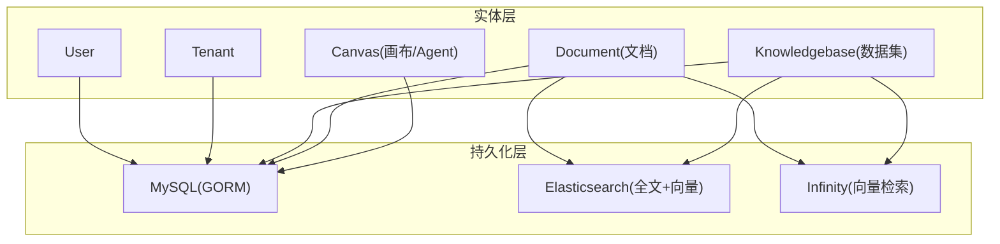
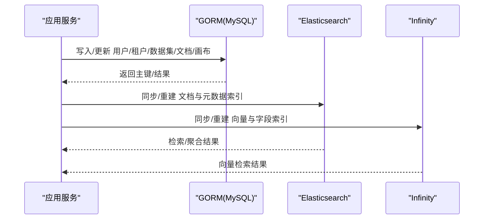
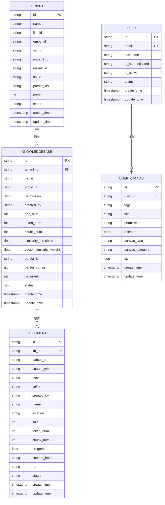
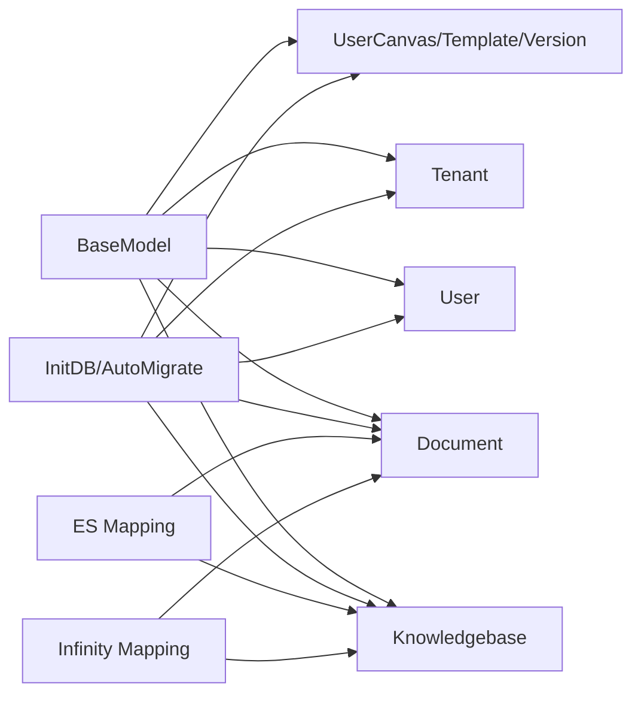

# 数据模型设计

<cite>
**本文引用的文件**
- [base.go](file://internal/entity/base.go)
- [user.go](file://internal/entity/user.go)
- [tenant.go](file://internal/entity/tenant.go)
- [dataset.go](file://internal/entity/dataset.go)
- [document.go](file://internal/entity/document.go)
- [canvas.go](file://internal/entity/canvas.go)
- [database.go](file://internal/dao/database.go)
- [mapping.json](file://conf/mapping.json)
- [doc_meta_es_mapping.json](file://conf/doc_meta_es_mapping.json)
- [infinity_mapping.json](file://conf/infinity_mapping.json)
</cite>

## 目录
1. [简介](#简介)
2. [项目结构](#项目结构)
3. [核心组件](#核心组件)
4. [架构总览](#架构总览)
5. [详细组件分析](#详细组件分析)
6. [依赖关系分析](#依赖关系分析)
7. [性能考量](#性能考量)
8. [故障排查指南](#故障排查指南)
9. [结论](#结论)
10. [附录](#附录)

## 简介
本文件面向RAGFlow的数据模型设计，系统性梳理用户、租户、数据集（知识库）、文档、分块、Agent画布等核心实体及其关系；说明MySQL关系型存储、Elasticsearch全文检索与向量索引、Infinity向量数据库的存储策略与使用场景；给出数据迁移、版本管理与向后兼容策略；并提供数据访问模式与查询优化建议，帮助开发者高效操作与管理数据。

## 项目结构
- 实体定义位于 internal/entity，采用GORM模型，统一继承 BaseModel，提供创建/更新时间自动注入与JSON字段支持。
- 数据库初始化与迁移逻辑位于 internal/dao/database.go，负责连接MySQL、执行AutoMigrate与手动迁移、以及运行时表保障。
- 搜索引擎映射配置位于 conf/mapping.json（Elasticsearch）与 conf/doc_meta_es_mapping.json（文档元数据），以及 conf/infinity_mapping.json（Infinity向量库）。

图表来源
- [database.go:69-188](file://internal/dao/database.go#L69-L188)
- [mapping.json:1-212](file://conf/mapping.json#L1-L212)
- [doc_meta_es_mapping.json:1-30](file://conf/doc_meta_es_mapping.json#L1-L30)
- [infinity_mapping.json:1-100](file://conf/infinity_mapping.json#L1-L100)

章节来源
- [database.go:69-188](file://internal/dao/database.go#L69-L188)
- [base.go:27-187](file://internal/entity/base.go#L27-L187)

## 核心组件
- 基础模型 BaseModel：统一时间戳字段（create_time/create_date/update_time/update_date）与JSON类型（JSONMap/JSONSlice），在创建/更新时自动填充时间戳，并兼容SQL JSON列。
- 用户 User：标识、认证信息、偏好设置、登录渠道、状态等。
- 租户 Tenant：多租户隔离与LLM/ASR/OCR/TTS等能力绑定，含配额Credit与状态。
- 数据集 Knowledgebase：知识集合，包含相似度阈值、权重、解析器、Pipeline、统计计数、任务ID等。
- 文档 Document：归属数据集，记录解析配置、来源、大小、Token/Chunk计数、进度、哈希、后缀、运行状态等。
- 画布 Canvas：用户级Agent画布、模板与版本管理，DSL以JSON存储。

章节来源
- [base.go:27-187](file://internal/entity/base.go#L27-L187)
- [user.go:21-46](file://internal/entity/user.go#L21-L46)
- [tenant.go:19-48](file://internal/entity/tenant.go#L19-L48)
- [dataset.go:111-161](file://internal/entity/dataset.go#L111-L161)
- [document.go:21-85](file://internal/entity/document.go#L21-L85)
- [canvas.go:19-73](file://internal/entity/canvas.go#L19-L73)

## 架构总览
RAGFlow采用“关系型主存 + 搜索引擎索引”的多引擎混合架构：
- MySQL：承载用户、租户、数据集、文档、画布等强一致业务数据，通过GORM进行CRUD与迁移。
- Elasticsearch：用于文档与元数据的全文检索、过滤、排序与向量相似度检索（dense_vector），并通过动态模板匹配不同维度向量。
- Infinity：作为向量数据库，承载高维向量与相关字段，提供高性能相似检索与二次索引能力。

图表来源
- [database.go:69-188](file://internal/dao/database.go#L69-L188)
- [mapping.json:159-201](file://conf/mapping.json#L159-L201)
- [infinity_mapping.json:1-100](file://conf/infinity_mapping.json#L1-L100)

## 详细组件分析

### 用户 User
- 主要字段
  - id：主键，32位字符串
  - access_token：可选，带索引
  - nickname：必填，长度限制，索引
  - email：唯一约束，索引
  - language/color_schema/timezone：可选，默认值，索引
  - last_login_time：可选，索引
  - is_authenticated/is_active/is_anonymous/status：状态位，默认值，索引
  - login_channel/is_superuser：可选，索引
  - BaseModel：create_time/create_date/update_time/update_date
- 约束与索引
  - email唯一索引；nickname、access_token、语言/主题/时区、登录时间等建立索引以提升查询效率。
- 存储位置
  - MySQL user 表

章节来源
- [user.go:21-46](file://internal/entity/user.go#L21-L46)
- [base.go:27-187](file://internal/entity/base.go#L27-L187)

### 租户 Tenant
- 主要字段
  - id：主键
  - name/public_key：可选，索引
  - llm_id/embd_id/asr_id/img2txt_id/rerank_id/tts_id：全局模型能力绑定
  - tenant_llm_id/tenant_embd_id/...：租户级覆盖能力
  - parser_ids：解析器列表
  - ocr_id/tenant_ocr_id：可选OCR能力
  - credit：配额
  - status：状态
  - BaseModel
- 约束与索引
  - 各能力ID均建索引，便于按能力筛选租户
- 存储位置
  - MySQL tenant 表

章节来源
- [tenant.go:19-48](file://internal/entity/tenant.go#L19-L48)
- [base.go:27-187](file://internal/entity/base.go#L27-L187)

### 数据集 Knowledgebase
- 主要字段
  - id：主键
  - tenant_id/created_by：权限与归属
  - name/language/description/avatar：基本信息
  - embd_id/tenant_embd_id：嵌入模型
  - permission：me/team
  - doc_num/token_num/chunk_num：统计
  - similarity_threshold/vector_similarity_weight：检索参数
  - parser_id/pipeline_id/parser_config：解析与流水线配置
  - pagerank：页面权重
  - 各类任务ID与完成时间：GraphRAG/Raptor/Mindmap/Wiki/Skill/Structure/Timeline/Session等
  - status：状态
  - BaseModel
- 约束与索引
  - tenant_id、created_by、parser_id、pipeline_id、status等建索引
- 存储位置
  - MySQL knowledgebase 表
  - 同时向ES/Infinity同步元数据与向量，用于检索

章节来源
- [dataset.go:111-161](file://internal/entity/dataset.go#L111-L161)
- [base.go:27-187](file://internal/entity/base.go#L27-L187)

### 文档 Document
- 主要字段
  - id：主键
  - kb_id：所属数据集
  - parser_id/pipeline_id/parser_config：解析配置
  - source_type/type/suffix：来源与类型
  - created_by/name/location/size：元信息
  - token_num/chunk_num/progress/progress_msg/process_begin_at/process_duration：处理进度
  - content_hash：内容去重
  - run/status：运行与状态
  - BaseModel
- 约束与索引
  - kb_id、parser_id、source_type、type、suffix、content_hash、run、status等建索引
- 存储位置
  - MySQL document 表
  - 同步至ES（全文与向量）与Infinity（向量）

章节来源
- [document.go:21-85](file://internal/entity/document.go#L21-L85)
- [base.go:27-187](file://internal/entity/base.go#L27-L187)

### 画布/Agent Canvas
- 主要字段
  - UserCanvas：id、avatar、user_id、tags/title/permission/release/description/canvas_type/canvas_category/dsl
  - CanvasTemplate：模板标题/描述/类型/分类/DSL
  - UserCanvasVersion：版本控制，关联user_canvas_id
- 约束与索引
  - user_id、tags、permission、release、canvas_category等建索引
- 存储位置
  - MySQL user_canvas、canvas_template、user_canvas_version 表

章节来源
- [canvas.go:19-73](file://internal/entity/canvas.go#L19-L73)
- [base.go:27-187](file://internal/entity/base.go#L27-L187)

### 分块 Chunk（概念性）
- 说明：分块是文档解析后的最小检索单元，通常不直接以独立关系表形式暴露于上述Go实体中，而是通过ES/Infinity中的字段（如doc_id/kb_id/content/向量字段等）体现。其生命周期由文档解析流程驱动，并在索引中维护父子/兄弟关系与排序字段。
- 存储位置
  - Elasticsearch：全文与向量索引
  - Infinity：向量与辅助字段索引

章节来源
- [mapping.json:159-201](file://conf/mapping.json#L159-L201)
- [infinity_mapping.json:1-100](file://conf/infinity_mapping.json#L1-L100)

### 实体关系图（ERD）

图表来源
- [user.go:21-46](file://internal/entity/user.go#L21-L46)
- [tenant.go:19-48](file://internal/entity/tenant.go#L19-L48)
- [dataset.go:111-161](file://internal/entity/dataset.go#L111-L161)
- [document.go:21-85](file://internal/entity/document.go#L21-L85)
- [canvas.go:19-73](file://internal/entity/canvas.go#L19-L73)

## 依赖关系分析
- GORM模型依赖BaseModel统一时间戳与JSON能力
- 数据库初始化集中管理所有实体表的自动迁移与运行时表保障
- 搜索引擎映射与向量维度通过配置文件声明，确保写入与检索一致性

图表来源
- [base.go:27-187](file://internal/entity/base.go#L27-L187)
- [database.go:69-188](file://internal/dao/database.go#L69-L188)
- [mapping.json:1-212](file://conf/mapping.json#L1-L212)
- [infinity_mapping.json:1-100](file://conf/infinity_mapping.json#L1-L100)

章节来源
- [database.go:69-188](file://internal/dao/database.go#L69-L188)
- [base.go:27-187](file://internal/entity/base.go#L27-L187)

## 性能考量
- MySQL
  - 合理索引：对高频过滤字段（如kb_id、tenant_id、status、source_type、type、suffix、content_hash）建立索引
  - 连接池：最大空闲/打开连接数与生命周期已在初始化中配置
- Elasticsearch
  - 动态模板：*_int/*_flt/*_kwd/*_tks/*_ltks/*_vec等自动映射，减少重复配置
  - 向量维度：支持512/768/1024/1536维度的dense_vector，余弦相似度
  - 刷新间隔：1s，兼顾写入吞吐与检索实时性
- Infinity
  - 字段级索引：secondary index用于低基数字段（如kb_id、available_int）
  - 文本分析：rag-coarse/rag-fine等多粒度分析器
  - 向量与标量分离：提升检索性能

章节来源
- [database.go:103-112](file://internal/dao/database.go#L103-L112)
- [mapping.json:2-16](file://conf/mapping.json#L2-L16)
- [mapping.json:159-201](file://conf/mapping.json#L159-L201)
- [infinity_mapping.json:1-100](file://conf/infinity_mapping.json#L1-L100)

## 故障排查指南
- 迁移冲突
  - 重复索引/列/表：已做错误码识别与忽略，避免重复迁移失败
  - NULL值约束：对已有行NULL值导致的变更跳过，需人工评估
- 常见问题定位
  - 检查InitDB日志确认数据库连接与迁移是否成功
  - 核对ES/Infinity映射是否与写入字段一致（尤其是向量维度与分析器）
  - 关注文档/数据集的状态字段与进度字段，排查解析卡住或失败

章节来源
- [database.go:259-296](file://internal/dao/database.go#L259-L296)

## 结论
RAGFlow的数据模型以MySQL为核心，结合Elasticsearch与Infinity实现全文检索与向量检索，形成“强一致业务数据 + 高性能检索索引”的混合架构。通过统一的BaseModel与集中式迁移管理，保证数据一致性与可演进性。建议在新增字段时同步考虑MySQL索引、ES/Infinity映射与查询路径，确保端到端性能与兼容性。

## 附录

### 数据存储策略与使用场景
- MySQL
  - 用途：用户、租户、数据集、文档、画布等结构化业务数据
  - 优势：事务、外键、强一致
- Elasticsearch
  - 用途：文档全文检索、元数据过滤、向量相似度检索
  - 特点：动态映射、多分析器、dense_vector
- Infinity
  - 用途：向量检索与辅助字段索引
  - 特点：二级索引、多粒度分析器、高吞吐

章节来源
- [mapping.json:1-212](file://conf/mapping.json#L1-L212)
- [doc_meta_es_mapping.json:1-30](file://conf/doc_meta_es_mapping.json#L1-L30)
- [infinity_mapping.json:1-100](file://conf/infinity_mapping.json#L1-L100)

### 数据迁移策略、版本管理与向后兼容
- 自动迁移：启动时对所有实体执行AutoMigrate，忽略重复索引/列/表错误
- 手动迁移：复杂变更通过RunMigrations执行
- 运行时表保障：即使未启用迁移，也会确保Go侧运行时表存在
- 向后兼容：BaseModel时间字段可空，JSONMap/JSONSlice兼容旧数据；迁移中对非法NULL值变更跳过，避免破坏现有数据

章节来源
- [database.go:114-188](file://internal/dao/database.go#L114-L188)
- [database.go:259-296](file://internal/dao/database.go#L259-L296)
- [base.go:27-187](file://internal/entity/base.go#L27-L187)

### 数据访问模式与查询优化建议
- 常见访问模式
  - 按租户/数据集过滤文档列表：利用kb_id、tenant_id、status索引
  - 全文检索：基于ES的text字段与分析器组合
  - 向量检索：基于dense_vector字段与余弦相似度
  - 画布/模板检索：基于tags、canvas_category、release等索引
- 优化建议
  - 为高频过滤字段添加合适索引（MySQL）
  - 控制ES刷新间隔与分片副本数，平衡写入与检索
  - 选择合适向量维度与分析器，避免过度索引
  - 对大对象（如DSL、parser_config）使用JSON列，按需展开查询

章节来源
- [mapping.json:159-201](file://conf/mapping.json#L159-L201)
- [infinity_mapping.json:1-100](file://conf/infinity_mapping.json#L1-L100)
- [document.go:21-85](file://internal/entity/document.go#L21-L85)
- [dataset.go:111-161](file://internal/entity/dataset.go#L111-L161)