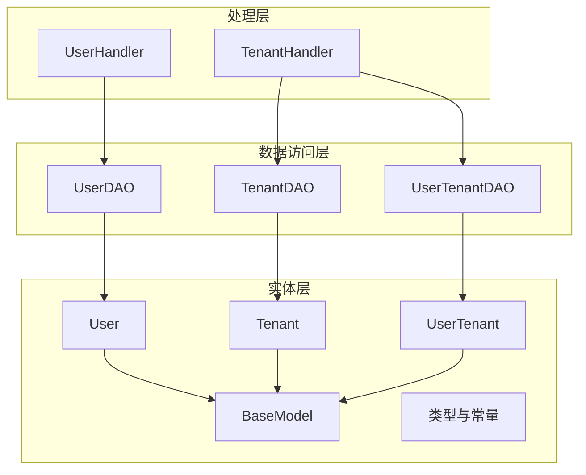
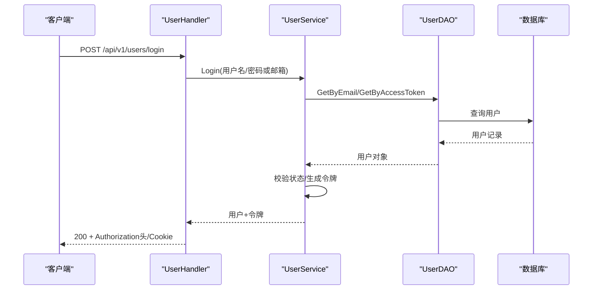
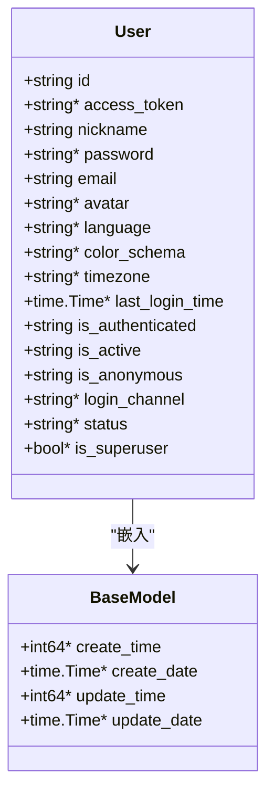
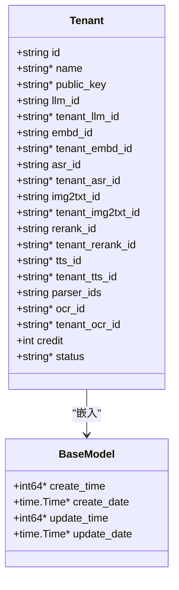
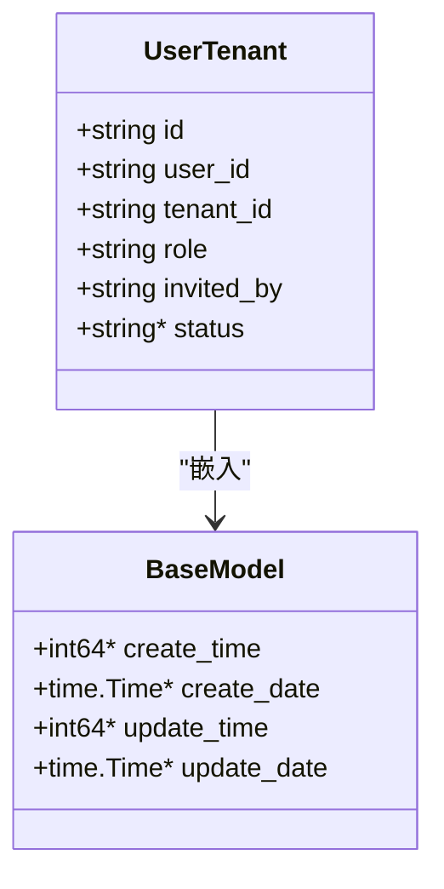
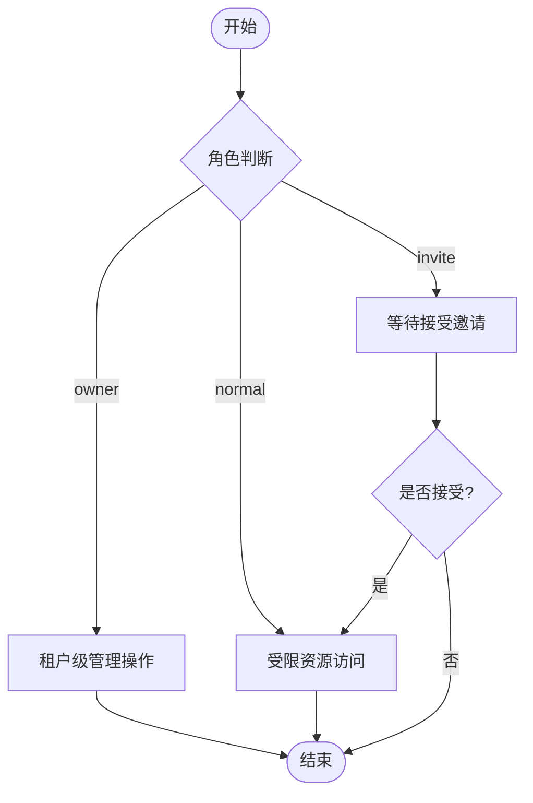
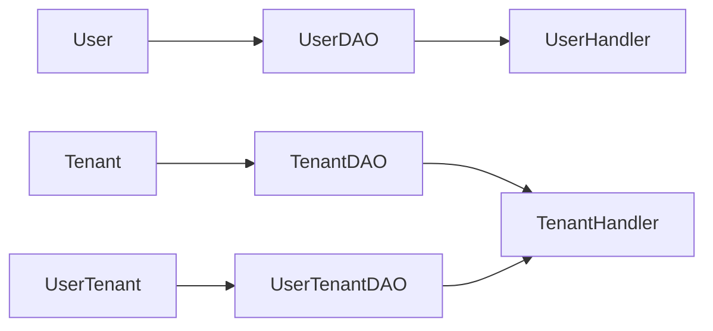

# 用户与租户模型

<cite>
**本文引用的文件**
- [internal/entity/user.go](file://internal/entity/user.go)
- [internal/entity/tenant.go](file://internal/entity/tenant.go)
- [internal/entity/user_tenant.go](file://internal/entity/user_tenant.go)
- [internal/entity/base.go](file://internal/entity/base.go)
- [internal/entity/types.go](file://internal/entity/types.go)
- [internal/dao/user.go](file://internal/dao/user.go)
- [internal/dao/tenant.go](file://internal/dao/tenant.go)
- [internal/dao/user_tenant.go](file://internal/dao/user_tenant.go)
- [internal/handler/user.go](file://internal/handler/user.go)
- [internal/handler/tenant.go](file://internal/handler/tenant.go)
</cite>

## 目录
1. [简介](#简介)
2. [项目结构](#项目结构)
3. [核心组件](#核心组件)
4. [架构总览](#架构总览)
5. [详细组件分析](#详细组件分析)
6. [依赖关系分析](#依赖关系分析)
7. [性能考虑](#性能考虑)
8. [故障排查指南](#故障排查指南)
9. [结论](#结论)
10. [附录](#附录)

## 简介
本文件聚焦于 RAGFlow 中的“用户”和“租户”数据模型，系统阐述：
- 用户实体（User）的字段定义、认证信息、状态与权限相关属性。
- 租户（Tenant）概念、多租户隔离机制、租户配置项与资源配额。
- 用户与租户的多对多关系映射（UserTenant），以及角色与访问控制策略。
- 数据库表结构设计、索引优化建议、数据验证规则。
- 用户管理与租户管理的常见 CRUD 操作示例与查询模式。
- 安全与合规注意事项。

## 项目结构
围绕用户与租户的数据模型与访问层，主要涉及以下模块：
- 实体层（entity）：定义 User、Tenant、UserTenant 及通用 BaseModel、类型常量等。
- 数据访问层（dao）：封装对 user、tenant、user_tenant 表的增删改查与复杂查询。
- 处理层（handler）：对外暴露 HTTP API，完成鉴权、参数校验、调用服务层并返回结果。

图表来源
- [internal/entity/user.go:21-45](file://internal/entity/user.go#L21-L45)
- [internal/entity/tenant.go:19-47](file://internal/entity/tenant.go#L19-L47)
- [internal/entity/user_tenant.go:19-33](file://internal/entity/user_tenant.go#L19-L33)
- [internal/entity/base.go:27-34](file://internal/entity/base.go#L27-L34)
- [internal/entity/types.go:21-42](file://internal/entity/types.go#L21-L42)
- [internal/dao/user.go:26-143](file://internal/dao/user.go#L26-L143)
- [internal/dao/tenant.go:26-130](file://internal/dao/tenant.go#L26-L130)
- [internal/dao/user_tenant.go:28-205](file://internal/dao/user_tenant.go#L28-L205)
- [internal/handler/user.go:37-739](file://internal/handler/user.go#L37-L739)
- [internal/handler/tenant.go:32-605](file://internal/handler/tenant.go#L32-L605)

章节来源
- [internal/entity/user.go:21-45](file://internal/entity/user.go#L21-L45)
- [internal/entity/tenant.go:19-47](file://internal/entity/tenant.go#L19-L47)
- [internal/entity/user_tenant.go:19-33](file://internal/entity/user_tenant.go#L19-L33)
- [internal/entity/base.go:27-34](file://internal/entity/base.go#L27-L34)
- [internal/entity/types.go:21-42](file://internal/entity/types.go#L21-L42)
- [internal/dao/user.go:26-143](file://internal/dao/user.go#L26-L143)
- [internal/dao/tenant.go:26-130](file://internal/dao/tenant.go#L26-L130)
- [internal/dao/user_tenant.go:28-205](file://internal/dao/user_tenant.go#L28-L205)
- [internal/handler/user.go:37-739](file://internal/handler/user.go#L37-L739)
- [internal/handler/tenant.go:32-605](file://internal/handler/tenant.go#L32-L605)

## 核心组件
- 用户（User）：标识、登录凭证、个人信息、认证状态、语言与时区偏好等。
- 租户（Tenant）：租户标识、名称、公钥、各类模型 ID（LLM/Embedding/ASR/Img2Txt/Rerank/TTS/OCR）、解析器集合、信用额度、状态等。
- 用户-租户关系（UserTenant）：用户与租户的关联、角色、邀请人、状态。
- 基础模型（BaseModel）：统一的创建/更新时间戳注入与 JSON 类型支持。
- 类型与常量（types.go）：模型类型位掩码与校验状态等。

章节来源
- [internal/entity/user.go:21-45](file://internal/entity/user.go#L21-L45)
- [internal/entity/tenant.go:19-47](file://internal/entity/tenant.go#L19-L47)
- [internal/entity/user_tenant.go:19-33](file://internal/entity/user_tenant.go#L19-L33)
- [internal/entity/base.go:27-34](file://internal/entity/base.go#L27-L34)
- [internal/entity/types.go:21-42](file://internal/entity/types.go#L21-L42)

## 架构总览
用户与租户在系统中的交互流程如下：
- 用户注册/登录：Handler 接收请求，Service 校验并持久化，生成访问令牌并返回。
- 租户信息查询：通过当前用户获取其所属租户（owner/normal）及租户配置。
- 成员管理：邀请、接受邀请、列出成员、移除成员等操作均基于 UserTenant 关系维护。

图表来源
- [internal/handler/user.go:124-201](file://internal/handler/user.go#L124-L201)
- [internal/dao/user.go:69-88](file://internal/dao/user.go#L69-L88)

章节来源
- [internal/handler/user.go:124-201](file://internal/handler/user.go#L124-L201)
- [internal/dao/user.go:69-88](file://internal/dao/user.go#L69-L88)

## 详细组件分析

### 用户实体（User）
- 主键与唯一性：id（主键）、email（唯一）。
- 认证与状态：access_token（可空）、password（可空）、is_authenticated、is_active、is_anonymous、status、last_login_time、login_channel。
- 个人偏好：nickname、avatar、language、color_schema、timezone。
- 超级用户标记：is_superuser。
- 审计时间：继承 BaseModel 的 create/update 时间戳。

图表来源
- [internal/entity/user.go:21-45](file://internal/entity/user.go#L21-L45)
- [internal/entity/base.go:27-34](file://internal/entity/base.go#L27-L34)

章节来源
- [internal/entity/user.go:21-45](file://internal/entity/user.go#L21-L45)
- [internal/entity/base.go:27-34](file://internal/entity/base.go#L27-L34)

### 租户实体（Tenant）
- 标识与名称：id（主键）、name（可空）。
- 公钥：public_key（可空）。
- 模型配置：llm_id、embd_id、asr_id、img2txt_id、rerank_id、tts_id、ocr_id；以及对应的 tenant_*_id 覆盖字段（可空）。
- 解析器集合：parser_ids。
- 资源配额：credit（默认值）。
- 状态：status（默认有效）。
- 审计时间：继承 BaseModel。

图表来源
- [internal/entity/tenant.go:19-47](file://internal/entity/tenant.go#L19-L47)
- [internal/entity/base.go:27-34](file://internal/entity/base.go#L27-L34)

章节来源
- [internal/entity/tenant.go:19-47](file://internal/entity/tenant.go#L19-L47)
- [internal/entity/base.go:27-34](file://internal/entity/base.go#L27-L34)

### 用户-租户关系（UserTenant）
- 主键与外键：id（主键）、user_id、tenant_id。
- 角色：role（如 owner、normal、invite 等）。
- 邀请人：invited_by。
- 状态：status（默认有效）。
- 审计时间：继承 BaseModel。

图表来源
- [internal/entity/user_tenant.go:19-33](file://internal/entity/user_tenant.go#L19-L33)
- [internal/entity/base.go:27-34](file://internal/entity/base.go#L27-L34)

章节来源
- [internal/entity/user_tenant.go:19-33](file://internal/entity/user_tenant.go#L19-L33)
- [internal/entity/base.go:27-34](file://internal/entity/base.go#L27-L34)

### 多对多关系与访问控制
- 关系建模：User 与 Tenant 通过 UserTenant 建立多对多关系。
- 角色语义：
  - owner：租户拥有者，具备租户级管理权限。
  - normal：普通成员，具备受限权限。
  - invite：待接受的邀请状态。
- 访问控制策略：
  - 查询当前用户所属租户列表时，过滤出状态为有效且角色为 normal 的租户。
  - 查询当前用户的“所有者租户”时，过滤出角色为 owner 的租户。
  - 成员列表排除 owner，仅展示普通成员。
  - 更新角色时，需确保存在活跃的成员关系。

图表来源
- [internal/dao/tenant.go:34-91](file://internal/dao/tenant.go#L34-L91)
- [internal/dao/user_tenant.go:138-163](file://internal/dao/user_tenant.go#L138-L163)
- [internal/dao/user_tenant.go:191-204](file://internal/dao/user_tenant.go#L191-L204)

章节来源
- [internal/dao/tenant.go:34-91](file://internal/dao/tenant.go#L34-L91)
- [internal/dao/user_tenant.go:138-163](file://internal/dao/user_tenant.go#L138-L163)
- [internal/dao/user_tenant.go:191-204](file://internal/dao/user_tenant.go#L191-L204)

### 数据库表结构与索引优化
- 表名映射：
  - user -> user
  - tenant -> tenant
  - user_tenant -> user_tenant
- 关键字段与约束：
  - user.email 唯一索引。
  - user.access_token、user.nickname、user.language、user.color_schema、user.timezone、user.last_login_time、user.is_authenticated、user.is_active、user.is_anonymous、user.login_channel、user.status 均有索引。
  - tenant.id 主键；tenant.name、tenant.public_key、tenant.llm_id、tenant.tenant_llm_id、tenant.embd_id、tenant.tenant_embd_id、tenant.asr_id、tenant.tenant_asr_id、tenant.img2txt_id、tenant.tenant_img2txt_id、tenant.rerank_id、tenant.tenant_rerank_id、tenant.tts_id、tenant.tenant_tts_id、tenant.parser_ids、tenant.ocr_id、tenant.tenant_ocr_id 有索引。
  - user_tenant.user_id、user_tenant.tenant_id、user_tenant.role、user_tenant.invited_by 有索引。
- 软删除与状态：
  - user.status、tenant.status、user_tenant.status 用于软删除与有效性控制。
- 审计时间：
  - BaseModel 自动注入 create_time/create_date/update_time/update_date。

章节来源
- [internal/entity/user.go:21-45](file://internal/entity/user.go#L21-L45)
- [internal/entity/tenant.go:19-47](file://internal/entity/tenant.go#L19-L47)
- [internal/entity/user_tenant.go:19-33](file://internal/entity/user_tenant.go#L19-L33)
- [internal/entity/base.go:27-34](file://internal/entity/base.go#L27-L34)

### 数据验证规则
- 必填字段：
  - user.email 非空且唯一。
  - tenant.llm_id、embd_id、asr_id、img2txt_id、rerank_id、parser_ids 非空。
- 可选字段：
  - 各 tenant_*_id 覆盖字段可空，用于租户级覆盖默认模型。
- 状态枚举：
  - status 使用字符串表示有效/无效（例如 "1"/"0"）。
- 角色限制：
  - user_tenant.role 限定为 owner/normal/invite 等受控值。
- 时间戳：
  - BaseModel 自动填充，避免业务层遗漏。

章节来源
- [internal/entity/user.go:21-45](file://internal/entity/user.go#L21-L45)
- [internal/entity/tenant.go:19-47](file://internal/entity/tenant.go#L19-L47)
- [internal/entity/user_tenant.go:19-33](file://internal/entity/user_tenant.go#L19-L33)
- [internal/entity/base.go:27-34](file://internal/entity/base.go#L27-L34)

### 用户管理 CRUD 与查询模式
- 创建用户：
  - 接口：POST /api/v1/users
  - 行为：注册新用户，生成 access_token，设置 Cookie，返回用户资料。
- 登录：
  - 接口：POST /api/v1/users/login、POST /v1/user/login（邮箱登录）
  - 行为：校验凭据，生成签名令牌，设置 Authorization 头与 Cookie。
- 获取用户信息：
  - 接口：GET /api/v1/users/{id}、GET /v1/user/info
  - 行为：根据 ID 或当前认证用户返回资料。
- 更新设置/修改密码：
  - 接口：PATCH /api/v1/users/me、POST /v1/user/setting/password
  - 行为：更新用户设置或密码。
- 登出：
  - 接口：POST /v1/user/logout
  - 行为：清除 Cookie，使令牌失效。
- 常用查询：
  - 按邮箱查找用户、按访问令牌查找用户、分页列出用户、软删除/硬删除。

章节来源
- [internal/handler/user.go:77-201](file://internal/handler/user.go#L77-L201)
- [internal/handler/user.go:203-285](file://internal/handler/user.go#L203-L285)
- [internal/handler/user.go:287-474](file://internal/handler/user.go#L287-L474)
- [internal/dao/user.go:34-143](file://internal/dao/user.go#L34-L143)

### 租户管理 CRUD 与查询模式
- 获取租户信息：
  - 接口：GET /v1/user/tenant_info
  - 行为：返回当前用户的“所有者租户”配置。
- 列出租户：
  - 接口：GET /v1/tenant/list
  - 行为：返回当前用户加入的所有租户（包含角色）。
- 设置默认模型：
  - 接口：POST /v1/tenant/models、POST /v1/tenant/default_models
  - 行为：设置租户默认模型选择。
- 元数据存储与分块存储：
  - 接口：POST/DELETE /v1/tenant/metadata_store、POST/DELETE /v1/tenant/chunk_store
  - 行为：创建/删除租户元数据存储与知识库分块存储。
- 成员管理：
  - 接口：GET/POST/DELETE /api/v1/tenants/{tenant_id}/users
  - 行为：列出成员、邀请成员、移除成员。
- 接受邀请：
  - 接口：PATCH /api/v1/tenants/{tenant_id}
  - 行为：将邀请状态转为正常成员。

章节来源
- [internal/handler/tenant.go:122-173](file://internal/handler/tenant.go#L122-L173)
- [internal/handler/tenant.go:48-120](file://internal/handler/tenant.go#L48-L120)
- [internal/handler/tenant.go:175-323](file://internal/handler/tenant.go#L175-L323)
- [internal/handler/tenant.go:479-605](file://internal/handler/tenant.go#L479-L605)
- [internal/dao/tenant.go:34-130](file://internal/dao/tenant.go#L34-L130)
- [internal/dao/user_tenant.go:138-205](file://internal/dao/user_tenant.go#L138-L205)

### 权限与角色
- 角色体系：
  - owner：租户拥有者，具备租户级管理权限。
  - normal：普通成员，具备受限权限。
  - invite：待接受邀请，尚未获得正式权限。
- 权限继承与访问控制：
  - 通过 UserTenant.role 决定用户在租户内的权限范围。
  - 查询租户列表时，区分 owner 与 normal 租户。
  - 成员列表排除 owner，仅展示普通成员。
  - 更新角色时需校验活跃成员关系。

章节来源
- [internal/dao/tenant.go:34-91](file://internal/dao/tenant.go#L34-L91)
- [internal/dao/user_tenant.go:138-163](file://internal/dao/user_tenant.go#L138-L163)
- [internal/dao/user_tenant.go:191-204](file://internal/dao/user_tenant.go#L191-L204)

## 依赖关系分析
- 实体依赖：
  - User、Tenant、UserTenant 均嵌入 BaseModel，统一审计时间。
  - types.go 提供模型类型位掩码与校验状态，供租户模型配置使用。
- DAO 依赖：
  - UserDAO 依赖 entity.User。
  - TenantDAO 依赖 entity.Tenant，并通过 JOIN user_tenant 获取角色信息。
  - UserTenantDAO 依赖 entity.UserTenant，并提供成员统计、成员列表、角色更新等方法。
- Handler 依赖：
  - UserHandler 调用 UserService（未在本节展开）进行业务编排。
  - TenantHandler 调用 TenantService 与 DatasetService 进行租户与知识库操作。

图表来源
- [internal/entity/user.go:21-45](file://internal/entity/user.go#L21-L45)
- [internal/entity/tenant.go:19-47](file://internal/entity/tenant.go#L19-L47)
- [internal/entity/user_tenant.go:19-33](file://internal/entity/user_tenant.go#L19-L33)
- [internal/dao/user.go:26-143](file://internal/dao/user.go#L26-L143)
- [internal/dao/tenant.go:26-130](file://internal/dao/tenant.go#L26-L130)
- [internal/dao/user_tenant.go:28-205](file://internal/dao/user_tenant.go#L28-L205)
- [internal/handler/user.go:37-739](file://internal/handler/user.go#L37-L739)
- [internal/handler/tenant.go:32-605](file://internal/handler/tenant.go#L32-L605)

章节来源
- [internal/dao/user.go:26-143](file://internal/dao/user.go#L26-L143)
- [internal/dao/tenant.go:26-130](file://internal/dao/tenant.go#L26-L130)
- [internal/dao/user_tenant.go:28-205](file://internal/dao/user_tenant.go#L28-L205)
- [internal/handler/user.go:37-739](file://internal/handler/user.go#L37-L739)
- [internal/handler/tenant.go:32-605](file://internal/handler/tenant.go#L32-L605)

## 性能考虑
- 索引设计：
  - 高频查询字段已加索引（如 email、access_token、user_id、tenant_id、role）。
  - 建议在复合查询场景下增加联合索引（如 user_id + status、tenant_id + status）。
- 查询优化：
  - 使用 Pluck/Select 减少不必要字段加载。
  - 分页查询时使用 Offset/Limit 控制返回量。
- 软删除：
  - 通过 status 字段实现软删除，避免物理删除带来的数据丢失风险。
- 时间戳注入：
  - BaseModel 自动注入审计时间，减少业务层负担。

章节来源
- [internal/dao/user.go:100-143](file://internal/dao/user.go#L100-L143)
- [internal/dao/tenant.go:108-130](file://internal/dao/tenant.go#L108-L130)
- [internal/dao/user_tenant.go:75-83](file://internal/dao/user_tenant.go#L75-L83)
- [internal/entity/base.go:66-120](file://internal/entity/base.go#L66-L120)

## 故障排查指南
- 登录失败：
  - 检查凭据是否正确、用户状态是否有效。
  - 查看日志中是否出现令牌生成失败或密钥获取失败。
- 租户信息为空：
  - 确认当前用户是否存在有效的 owner 租户关系。
  - 检查 user_tenant.status 与 tenant.status 是否为有效值。
- 成员列表为空：
  - 确认用户是否为 owner，成员列表会排除 owner。
  - 检查 user_tenant.role 是否为 normal 且状态有效。
- 角色更新失败：
  - 检查是否存在活跃的成员关系（status=1）。
  - 若 RowsAffected=0，说明无匹配记录。

章节来源
- [internal/handler/user.go:124-201](file://internal/handler/user.go#L124-L201)
- [internal/dao/tenant.go:80-91](file://internal/dao/tenant.go#L80-L91)
- [internal/dao/user_tenant.go:138-163](file://internal/dao/user_tenant.go#L138-L163)
- [internal/dao/user_tenant.go:191-204](file://internal/dao/user_tenant.go#L191-L204)

## 结论
本模型以 User、Tenant、UserTenant 为核心，结合 BaseModel 与类型常量，构建了清晰的多租户隔离与权限控制体系。通过 DAO 层的精细查询与 Handler 层的规范 API，实现了用户与租户的全生命周期管理。建议在后续迭代中继续优化索引、完善数据验证与错误处理，以提升系统的稳定性与可维护性。

## 附录
- 模型类型位掩码：
  - chat、embedding、speech2text、image2text、rerank、tts、ocr。
- 校验状态：
  - success、fail、unknown。

章节来源
- [internal/entity/types.go:21-42](file://internal/entity/types.go#L21-L42)
- [internal/entity/types.go:143-150](file://internal/entity/types.go#L143-L150)