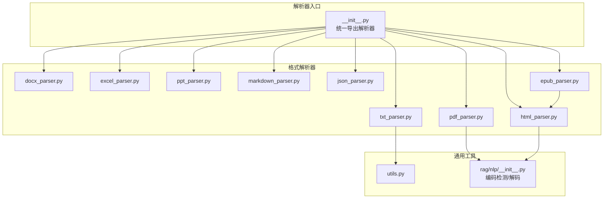
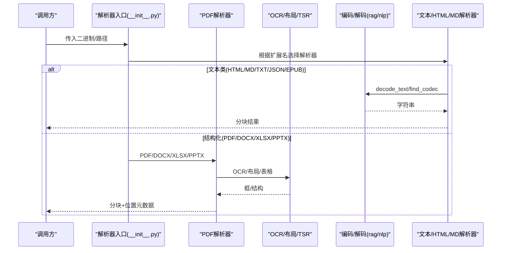
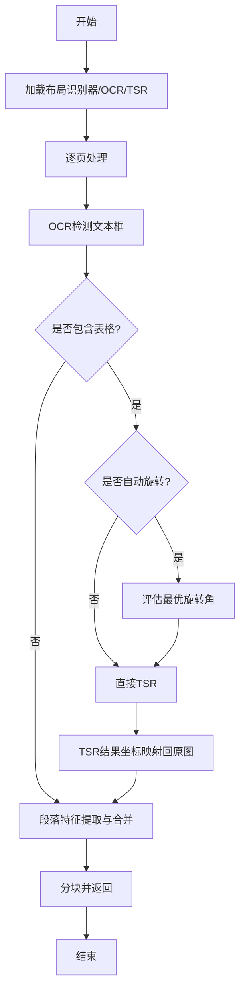
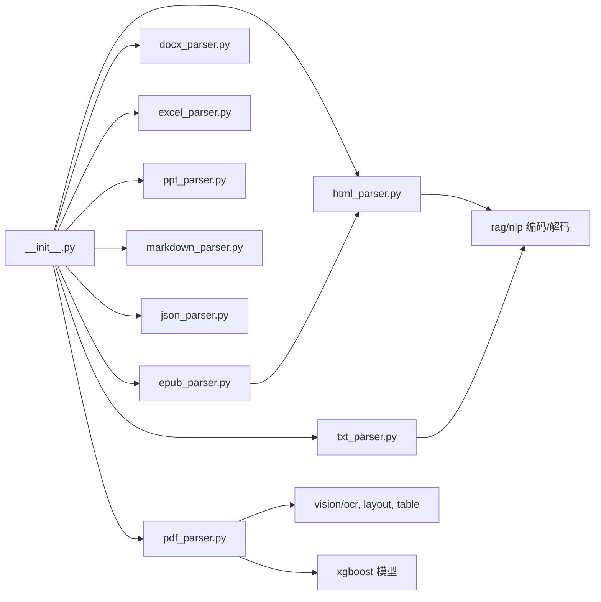

# 多格式文档解析

<cite>
**本文引用的文件**
- [deepdoc/parser/__init__.py](file://deepdoc/parser/__init__.py)
- [deepdoc/parser/pdf_parser.py](file://deepdoc/parser/pdf_parser.py)
- [deepdoc/parser/docx_parser.py](file://deepdoc/parser/docx_parser.py)
- [deepdoc/parser/excel_parser.py](file://deepdoc/parser/excel_parser.py)
- [deepdoc/parser/ppt_parser.py](file://deepdoc/parser/ppt_parser.py)
- [deepdoc/parser/txt_parser.py](file://deepdoc/parser/txt_parser.py)
- [deepdoc/parser/html_parser.py](file://deepdoc/parser/html_parser.py)
- [deepdoc/parser/markdown_parser.py](file://deepdoc/parser/markdown_parser.py)
- [deepdoc/parser/json_parser.py](file://deepdoc/parser/json_parser.py)
- [deepdoc/parser/epub_parser.py](file://deepdoc/parser/epub_parser.py)
- [deepdoc/parser/utils.py](file://deepdoc/parser/utils.py)
- [rag/nlp/__init__.py](file://rag/nlp/__init__.py)
</cite>

## 目录
1. [简介](#简介)
2. [项目结构](#项目结构)
3. [核心组件](#核心组件)
4. [架构总览](#架构总览)
5. [详细组件分析](#详细组件分析)
6. [依赖关系分析](#依赖关系分析)
7. [性能考量](#性能考量)
8. [故障排查指南](#故障排查指南)
9. [结论](#结论)
10. [附录](#附录)

## 简介
本文件系统性梳理 RAGFlow 的多格式文档解析能力，覆盖 PDF、Word、Excel、PPT、文本、HTML、Markdown、JSON、EPUB 等格式的解析原理、实现细节、配置选项与性能特点。重点说明：
- 文件格式检测机制与编码识别（含 BOM、chardet、回退策略）
- 字符集处理与乱码防护
- 各格式解析器的架构、处理流程与关键算法
- 统一输出格式设计与跨格式差异处理
- 使用示例、参数配置与最佳实践

## 项目结构
RAGFlow 的解析器集中在 deepdoc/parser 目录下，每个格式一个独立模块；公共工具与编码解码在 rag/nlp 中提供；入口通过 deepdoc/parser/__init__.py 统一导出各类解析器。

**图表来源**
- [deepdoc/parser/__init__.py:17-41](file://deepdoc/parser/__init__.py#L17-L41)
- [deepdoc/parser/pdf_parser.py:17-46](file://deepdoc/parser/pdf_parser.py#L17-L46)
- [deepdoc/parser/html_parser.py:18-24](file://deepdoc/parser/html_parser.py#L18-L24)
- [deepdoc/parser/txt_parser.py:20-27](file://deepdoc/parser/txt_parser.py#L20-L27)
- [deepdoc/parser/epub_parser.py:23-32](file://deepdoc/parser/epub_parser.py#L23-L32)
- [rag/nlp/__init__.py:154-197](file://rag/nlp/__init__.py#L154-L197)

**章节来源**
- [deepdoc/parser/__init__.py:17-41](file://deepdoc/parser/__init__.py#L17-L41)

## 核心组件
- PDF 解析器：布局识别、OCR、表格结构识别、旋转校正、段落合并、乱码检测
- Word 解析器：段落与图片提取、表格结构化
- Excel 解析器：多引擎加载（openpyxl/pandas/calamine）、CSV 兼容、分块 HTML/Markdown 输出、图片锚点信息
- PPT 解析器：形状排序、文本/列表/表格/分组提取
- 文本解析器：分隔符切分、段落合并、按 token 预算分块
- HTML 解析器：DOM 遍历、标题映射、表格拆分、硬换行保留、token 级分块
- Markdown 解析器：元素抽取（标题、代码块、列表、引用、正文）、表格保护、分隔符切分
- JSON 解析器：JSON/JSONL 自动识别、结构保持的分块
- EPUB 解析器：OPF spine 顺序读取 XHTML，委托 HTML 解析器

**章节来源**
- [deepdoc/parser/pdf_parser.py:56-101](file://deepdoc/parser/pdf_parser.py#L56-L101)
- [deepdoc/parser/docx_parser.py:33-182](file://deepdoc/parser/docx_parser.py#L33-L182)
- [deepdoc/parser/excel_parser.py:29-315](file://deepdoc/parser/excel_parser.py#L29-L315)
- [deepdoc/parser/ppt_parser.py:22-99](file://deepdoc/parser/ppt_parser.py#L22-L99)
- [deepdoc/parser/txt_parser.py:30-64](file://deepdoc/parser/txt_parser.py#L30-L64)
- [deepdoc/parser/html_parser.py:37-76](file://deepdoc/parser/html_parser.py#L37-L76)
- [deepdoc/parser/markdown_parser.py:32-157](file://deepdoc/parser/markdown_parser.py#L32-L157)
- [deepdoc/parser/json_parser.py:27-192](file://deepdoc/parser/json_parser.py#L27-L192)
- [deepdoc/parser/epub_parser.py:35-137](file://deepdoc/parser/epub_parser.py#L35-L137)

## 架构总览
解析流程总体分为：输入接入 → 格式检测/编码识别 → 专用解析器 → 统一分块/元数据 → 下游消费（检索/索引）。

**图表来源**
- [deepdoc/parser/__init__.py:17-41](file://deepdoc/parser/__init__.py#L17-L41)
- [deepdoc/parser/pdf_parser.py:56-101](file://deepdoc/parser/pdf_parser.py#L56-L101)
- [deepdoc/parser/html_parser.py:37-44](file://deepdoc/parser/html_parser.py#L37-L44)
- [rag/nlp/__init__.py:154-197](file://rag/nlp/__init__.py#L154-L197)

## 详细组件分析

### PDF 解析器
- 架构要点
  - 初始化 OCR、布局识别器（ONNX/Ascend）、表格结构识别器、XGBoost 段落拼接模型
  - 支持并行设备限制、页面范围控制、列数估计
- 处理流程
  - 页面图像裁剪 → 布局识别 → OCR 文本框 → 表格区域定位 → 可选自动旋转评估 → 表格结构识别 → 框对齐与标签注入（行列/表头/跨列）→ 段落合并与分块
- 关键技术
  - 乱码检测：CID 占位符、私有区字符、子集字体前缀、ASCII 符号占比、CJK 比例
  - 词间空格恢复：基于几何间距与 CJK 模式跳过
  - 表格方向评估：四角度 OCR 置信度评分，阈值判定是否旋转
  - 坐标映射：将旋转后坐标映射回原图空间
- 配置项与环境变量
  - LAYOUT_RECOGNIZER_TYPE：onnx/ascend
  - TABLE_AUTO_ROTATE：true/false（默认 true）
  - PARALLEL_DEVICES：并行设备数
- 性能特点
  - OCR/布局/TSR 为计算密集；可结合设备并行与缩放因子 ZM 平衡精度与速度
  - 小模型 XGBoost 用于段落拼接，CPU 运行

**图表来源**
- [deepdoc/parser/pdf_parser.py:56-101](file://deepdoc/parser/pdf_parser.py#L56-L101)
- [deepdoc/parser/pdf_parser.py:367-456](file://deepdoc/parser/pdf_parser.py#L367-L456)
- [deepdoc/parser/pdf_parser.py:470-641](file://deepdoc/parser/pdf_parser.py#L470-L641)
- [deepdoc/parser/pdf_parser.py:775-800](file://deepdoc/parser/pdf_parser.py#L775-L800)

**章节来源**
- [deepdoc/parser/pdf_parser.py:56-101](file://deepdoc/parser/pdf_parser.py#L56-L101)
- [deepdoc/parser/pdf_parser.py:196-365](file://deepdoc/parser/pdf_parser.py#L196-L365)
- [deepdoc/parser/pdf_parser.py:367-456](file://deepdoc/parser/pdf_parser.py#L367-L456)
- [deepdoc/parser/pdf_parser.py:470-641](file://deepdoc/parser/pdf_parser.py#L470-L641)
- [deepdoc/parser/pdf_parser.py:642-773](file://deepdoc/parser/pdf_parser.py#L642-L773)
- [deepdoc/parser/pdf_parser.py:775-800](file://deepdoc/parser/pdf_parser.py#L775-L800)

### Word (DOCX) 解析器
- 架构要点
  - 使用 python-docx 解析段落与表格；图片以 LazyImage 包装
- 处理流程
  - 遍历段落 → 收集 runs → 按分页标记聚合 → 表格内容转结构化行 → 组合为键值对片段
- 关键点
  - 图片异常容错（损坏/不支持格式）
  - 表格单元格类型推断（日期/数字/英文/名称等），生成“字段: 值”形式

**章节来源**
- [deepdoc/parser/docx_parser.py:33-182](file://deepdoc/parser/docx_parser.py#L33-L182)

### Excel 解析器
- 架构要点
  - 多引擎加载：openpyxl → pandas → calamine；非 Excel 时尝试 CSV 转换
  - 清洗非法字符、估算实际行数、支持图片锚点信息
- 处理流程
  - 读取工作簿 → 逐 sheet 迭代 → 表头行作为键 → 数据行转为“键: 值”片段
  - html() 方法按 chunk_rows 切分表格为 HTML 片段；markdown() 输出 Markdown 表格
- 配置项
  - chunk_rows：表格分块行数（默认 256）

**章节来源**
- [deepdoc/parser/excel_parser.py:29-315](file://deepdoc/parser/excel_parser.py#L29-L315)

### PPT 解析器
- 架构要点
  - 基于 python-pptx；形状按 top/left 排序保证阅读顺序
- 处理流程
  - 遍历幻灯片 → 提取文本/列表/表格/分组 → 忽略空内容 → 拼接为每页文本

**章节来源**
- [deepdoc/parser/ppt_parser.py:22-99](file://deepdoc/parser/ppt_parser.py#L22-L99)

### 文本解析器
- 架构要点
  - 使用统一分隔符编译与匹配；段落合并策略 OVER_CAP；支持保留分隔符
- 处理流程
  - 获取文本 → 标准化换行 → 按分隔符切分 → 合并段落 → 按 token 预算分块

**章节来源**
- [deepdoc/parser/txt_parser.py:30-64](file://deepdoc/parser/txt_parser.py#L30-L64)

### HTML 解析器
- 架构要点
  - BeautifulSoup DOM 遍历；删除 style/script/注释；标题映射为 Markdown 风格
  - 表格按 token 预算拆分；硬换行   用特殊哨兵保留并在折叠后还原
- 处理流程
  - 递归读取节点 → 合并块文本 → 超大块按原子切分 → 分块输出

**章节来源**
- [deepdoc/parser/html_parser.py:37-320](file://deepdoc/parser/html_parser.py#L37-L320)

### Markdown 解析器
- 架构要点
  - 元素级抽取：标题、代码块、列表、引用、正文；表格保护（避免误删代码块中的表格）
  - 支持分隔符切分并将孤立标题合并到下一段
- 处理流程
  - 归一化换行 → 识别受保护区域 → 按分隔符或元素边界切分 → 输出带/不带元信息的片段

**章节来源**
- [deepdoc/parser/markdown_parser.py:32-568](file://deepdoc/parser/markdown_parser.py#L32-L568)

### JSON 解析器
- 架构要点
  - 自动识别 JSON 与 JSONL；保持结构分块；支持将数组转换为字典索引
- 处理流程
  - 解码文本 → 判断格式 → 递归分割为不超过阈值的片段 → 过滤空片段

**章节来源**
- [deepdoc/parser/json_parser.py:27-192](file://deepdoc/parser/json_parser.py#L27-L192)

### EPUB 解析器
- 架构要点
  - 解压 ZIP → 解析 container.xml 与 OPF → 按 spine 顺序读取 XHTML → 委托 HTML 解析器
  - 失败时回退为按文件名排序的 XHTML/HTML 列表
- 处理流程
  - 打开包 → 获取内容项 → 逐个解析为 HTML 片段 → 汇总

**章节来源**
- [deepdoc/parser/epub_parser.py:35-137](file://deepdoc/parser/epub_parser.py#L35-L137)

## 依赖关系分析
- 解析器入口集中导出，便于上层按扩展名路由
- PDF 强依赖视觉组件（OCR/布局/TSR）与机器学习模型（XGBoost）
- 文本类解析器依赖 rag/nlp 的编码检测与解码
- EPUB 复用 HTML 解析器，体现组件复用

**图表来源**
- [deepdoc/parser/__init__.py:17-41](file://deepdoc/parser/__init__.py#L17-L41)
- [deepdoc/parser/pdf_parser.py:17-46](file://deepdoc/parser/pdf_parser.py#L17-L46)
- [deepdoc/parser/html_parser.py:18-24](file://deepdoc/parser/html_parser.py#L18-L24)
- [deepdoc/parser/txt_parser.py:20-27](file://deepdoc/parser/txt_parser.py#L20-L27)
- [deepdoc/parser/epub_parser.py:23-32](file://deepdoc/parser/epub_parser.py#L23-L32)

**章节来源**
- [deepdoc/parser/__init__.py:17-41](file://deepdoc/parser/__init__.py#L17-L41)

## 性能考量
- PDF
  - OCR/布局/TSR 为瓶颈；可通过缩放因子 ZM、并行设备数、关闭自动旋转优化吞吐
  - 表格旋转评估仅在启用时执行，建议对大量无旋转表格的场景关闭
- Excel
  - 大文件优先使用 openpyxl 流式读取；pandas/calamine 作为回退
  - 表格分块 chunk_rows 可调，避免单块过大
- HTML/Markdown/文本
  - 分块基于 token 预算；合理设置 chunk_token_num 以适配下游模型上下文窗口
- 编码识别
  - 优先 UTF-8 快速路径；其次 chardet；最后多编码回退链，确保鲁棒性

[本节为通用指导，不直接分析具体文件]

## 故障排查指南
- 编码错误/乱码
  - 现象：中文显示为问号或 ASCII 符号
  - 排查：确认 find_codec 与 decode_text 是否正确识别；检查 PDF 子集字体导致的乱码检测
  - 参考：编码检测与解码逻辑、PDF 乱码检测
- PDF 表格方向错误
  - 现象：表格文字倒置或侧向
  - 排查：开启 TABLE_AUTO_ROTATE；检查 OCR 置信度评分；必要时手动调整阈值
- Excel 无法打开
  - 现象：openpyxl 报错
  - 排查：尝试 pandas.read_excel；如仍失败，尝试 calamine；或回退 CSV 转换
- HTML 换行丢失
  - 现象：  被折叠
  - 排查：确认 _HARD_BREAK 哨兵与折叠逻辑；确保 chunk 合并未破坏断行

**章节来源**
- [rag/nlp/__init__.py:154-197](file://rag/nlp/__init__.py#L154-L197)
- [deepdoc/parser/pdf_parser.py:196-365](file://deepdoc/parser/pdf_parser.py#L196-L365)
- [deepdoc/parser/pdf_parser.py:367-456](file://deepdoc/parser/pdf_parser.py#L367-L456)
- [deepdoc/parser/excel_parser.py:41-76](file://deepdoc/parser/excel_parser.py#L41-L76)
- [deepdoc/parser/html_parser.py:161-177](file://deepdoc/parser/html_parser.py#L161-L177)

## 结论
RAGFlow 的多格式解析体系以“专用解析器 + 统一分块”为核心，兼顾高精度与可扩展性。PDF 通过 OCR/布局/TSR 与乱码检测保障复杂版面质量；Office 系列通过结构化提取与表格处理提升可读性；文本类格式通过灵活的编码识别与分隔符/元素切分满足多样化场景。通过环境变量与参数调优，可在不同硬件与数据分布下取得良好性能与稳定性。

[本节为总结性内容，不直接分析具体文件]

## 附录

### 使用示例与最佳实践
- PDF
  - 设置 LAYOUT_RECOGNIZER_TYPE=onnx|ascend；PARALLEL_DEVICES>1 加速
  - 对无旋转表格较多的文档，设置 TABLE_AUTO_ROTATE=false 提升速度
  - 参考：初始化与参数
- Excel
  - 大表使用 chunk_rows=256 或更小，避免单块过大
  - 若 openpyxl 失败，自动回退 pandas/calamine；必要时先转为 CSV
  - 参考：加载与分块
- HTML/Markdown/文本
  - 合理设置 chunk_token_num，使分块大小适配下游模型
  - HTML 中如需保留硬换行，注意   的处理
  - 参考：分块与折叠
- JSON
  - JSONL 自动识别；大对象按结构保持分块
  - 参考：格式识别与分块
- EPUB
  - 依赖 OPF spine 顺序；若 OPF 缺失，回退按文件名排序
  - 参考：spine 解析与回退

**章节来源**
- [deepdoc/parser/pdf_parser.py:56-101](file://deepdoc/parser/pdf_parser.py#L56-L101)
- [deepdoc/parser/excel_parser.py:214-267](file://deepdoc/parser/excel_parser.py#L214-L267)
- [deepdoc/parser/html_parser.py:293-320](file://deepdoc/parser/html_parser.py#L293-L320)
- [deepdoc/parser/markdown_parser.py:335-417](file://deepdoc/parser/markdown_parser.py#L335-L417)
- [deepdoc/parser/json_parser.py:33-40](file://deepdoc/parser/json_parser.py#L33-L40)
- [deepdoc/parser/epub_parser.py:73-137](file://deepdoc/parser/epub_parser.py#L73-L137)