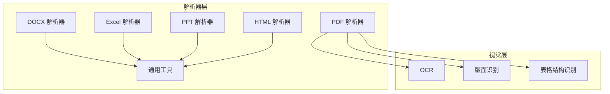
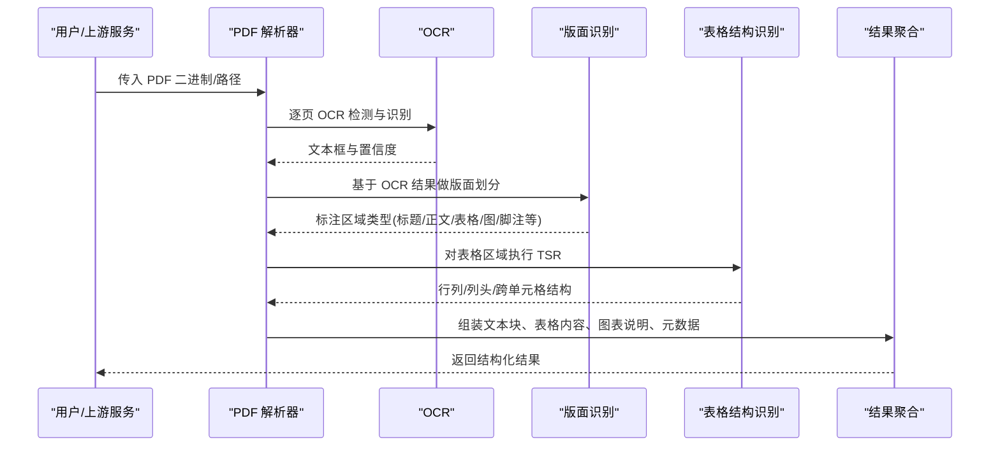
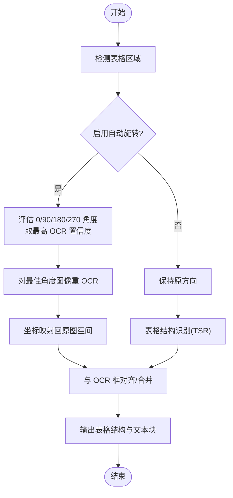
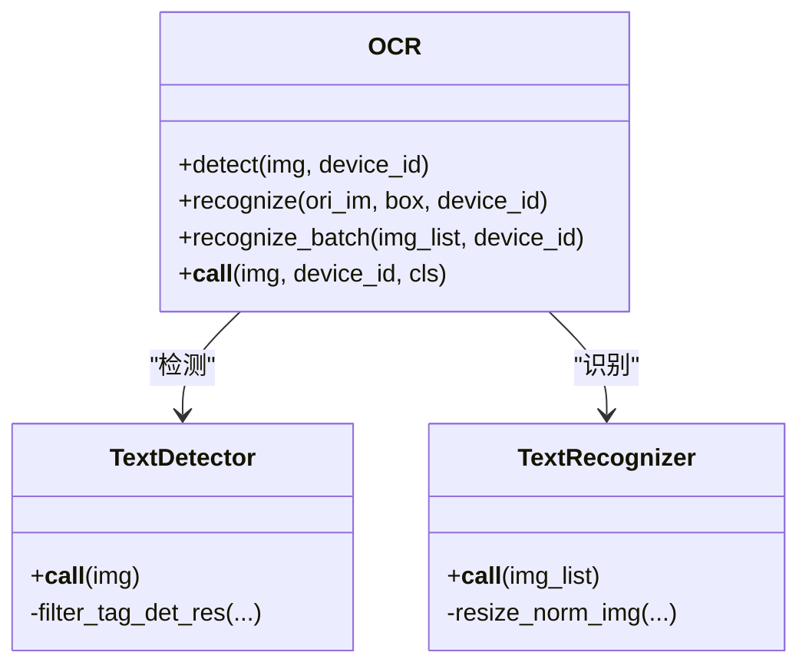
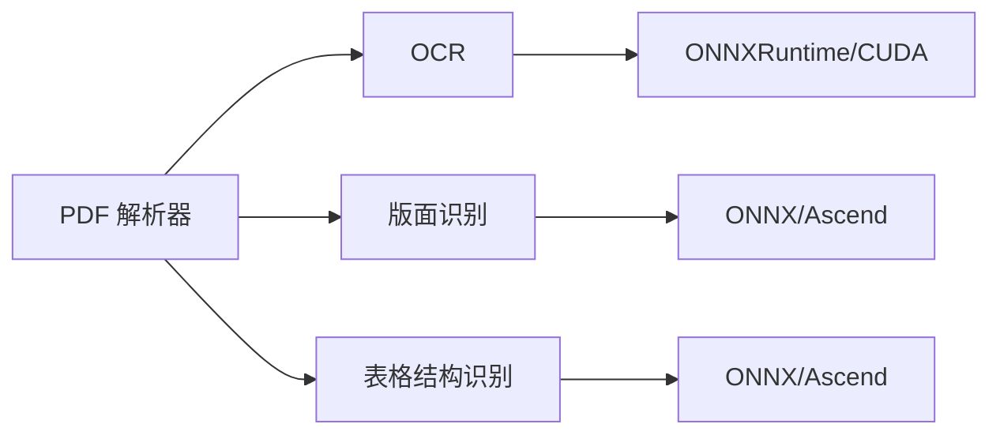

# 文档处理系统

<cite>
**本文引用的文件**
- [deepdoc/README.md](file://deepdoc/README.md)
- [deepdoc/parser/__init__.py](file://deepdoc/parser/__init__.py)
- [deepdoc/parser/pdf_parser.py](file://deepdoc/parser/pdf_parser.py)
- [deepdoc/parser/docx_parser.py](file://deepdoc/parser/docx_parser.py)
- [deepdoc/parser/excel_parser.py](file://deepdoc/parser/excel_parser.py)
- [deepdoc/parser/ppt_parser.py](file://deepdoc/parser/ppt_parser.py)
- [deepdoc/parser/html_parser.py](file://deepdoc/parser/html_parser.py)
- [deepdoc/parser/utils.py](file://deepdoc/parser/utils.py)
- [deepdoc/vision/ocr.py](file://deepdoc/vision/ocr.py)
- [deepdoc/vision/layout_recognizer.py](file://deepdoc/vision/layout_recognizer.py)
- [deepdoc/vision/table_structure_recognizer.py](file://deepdoc/vision/table_structure_recognizer.py)
</cite>

## 目录
1. [简介](#简介)
2. [项目结构](#项目结构)
3. [核心组件](#核心组件)
4. [架构总览](#架构总览)
5. [详细组件分析](#详细组件分析)
6. [依赖关系分析](#依赖关系分析)
7. [性能考虑](#性能考虑)
8. [故障排查指南](#故障排查指南)
9. [结论](#结论)
10. [附录](#附录)

## 简介
本系统提供多格式文档解析能力，覆盖 PDF、Word、Excel、PPT、HTML、Markdown、TXT、JSON、EPUB 等。其核心由“视觉识别（OCR/版面/表格）+ 多格式解析器”构成：通过 OCR 提取文本与位置信息，利用版面识别将页面划分为标题、正文、图表、表格、页眉页脚等区域；对表格进行结构识别并转换为自然语言或 HTML；结合模板与规则完成智能分块、元数据抽取与结构化输出。PDF 解析最为复杂，支持自动旋转校正、乱码检测、跨页合并、段落拼接等高级能力。

## 项目结构
- 解析器入口统一暴露于 deepdoc/parser 包，按文件格式拆分实现，便于扩展与维护。
- 视觉能力集中在 deepdoc/vision，包含 OCR、版面识别、表格结构识别三大模块。
- 工具与辅助函数位于 deepdoc/parser/utils.py，如 PDF 大纲提取。

**图示来源**
- [deepdoc/parser/__init__.py:17-27](file://deepdoc/parser/__init__.py#L17-L27)
- [deepdoc/vision/ocr.py:514-558](file://deepdoc/vision/ocr.py#L514-L558)
- [deepdoc/vision/layout_recognizer.py:33-67](file://deepdoc/vision/layout_recognizer.py#L33-L67)
- [deepdoc/vision/table_structure_recognizer.py:30-51](file://deepdoc/vision/table_structure_recognizer.py#L30-L51)

**章节来源**
- [deepdoc/parser/__init__.py:17-27](file://deepdoc/parser/__init__.py#L17-L27)
- [deepdoc/README.md:133-145](file://deepdoc/README.md#L133-L145)

## 核心组件
- 多格式解析器：PDF、DOCX、Excel、PPT、HTML、Markdown、TXT、JSON、EPUB 等，均提供统一的调用接口。
- 视觉引擎：
  - OCR：文本检测与识别，支持 GPU/CPU 推理与批处理。
  - 版面识别：将页面划分为 Text/Title/Figure/Table/Header/Footer/Reference/Equation 等区域。
  - 表格结构识别：识别行列、列头、投影行头、跨单元格，并生成 HTML 或自然语言描述。
- 工具与配置：PDF 大纲提取、编码探测、模型缓存与并行设备控制等。

**章节来源**
- [deepdoc/parser/__init__.py:17-27](file://deepdoc/parser/__init__.py#L17-L27)
- [deepdoc/vision/ocr.py:514-558](file://deepdoc/vision/ocr.py#L514-L558)
- [deepdoc/vision/layout_recognizer.py:33-67](file://deepdoc/vision/layout_recognizer.py#L33-L67)
- [deepdoc/vision/table_structure_recognizer.py:30-51](file://deepdoc/vision/table_structure_recognizer.py#L30-L51)
- [deepdoc/parser/utils.py:38-53](file://deepdoc/parser/utils.py#L38-L53)

## 架构总览
下图展示了从输入到输出的端到端流程：不同格式文件进入对应解析器，PDF 走 OCR+版面+TSR 管线，其他格式直接结构化提取；最终产出带位置信息的文本块、表格内容、图表说明及元数据。

**图示来源**
- [deepdoc/parser/pdf_parser.py:56-90](file://deepdoc/parser/pdf_parser.py#L56-L90)
- [deepdoc/vision/ocr.py:627-729](file://deepdoc/vision/ocr.py#L627-L729)
- [deepdoc/vision/layout_recognizer.py:68-168](file://deepdoc/vision/layout_recognizer.py#L68-L168)
- [deepdoc/vision/table_structure_recognizer.py:53-110](file://deepdoc/vision/table_structure_recognizer.py#L53-L110)

## 详细组件分析

### PDF 解析器（RAGFlowPdfParser）
- 初始化阶段加载 OCR、布局识别器（ONNX/Ascend）、表格结构识别器与 XGBoost 模型用于段落拼接。
- 关键能力：
  - 自动表格旋转校正：评估 0°/90°/180°/270° 的 OCR 置信度，选择最佳角度后重 OCR 并映射回原坐标。
  - 乱码检测：基于字符范围、CID 占位符、子集字体前缀与 ASCII 符号比例判断页面是否乱码。
  - 段落拼接：使用特征向量（间距、标点、词法、布局类型等）与 XGBoost 决定上下行是否拼接。
  - 表格处理：裁剪表格图像、TSR 识别行列与跨单元格、对齐边界、与 OCR 框匹配，生成结构化表格内容。
  - 文本块组织：根据版面标签与几何关系排序、去噪、合并，输出带页号与矩形位置的文本块。

**图示来源**
- [deepdoc/parser/pdf_parser.py:367-456](file://deepdoc/parser/pdf_parser.py#L367-L456)
- [deepdoc/parser/pdf_parser.py:470-597](file://deepdoc/parser/pdf_parser.py#L470-L597)
- [deepdoc/parser/pdf_parser.py:642-773](file://deepdoc/parser/pdf_parser.py#L642-L773)

**章节来源**
- [deepdoc/parser/pdf_parser.py:56-101](file://deepdoc/parser/pdf_parser.py#L56-L101)
- [deepdoc/parser/pdf_parser.py:131-174](file://deepdoc/parser/pdf_parser.py#L131-L174)
- [deepdoc/parser/pdf_parser.py:201-365](file://deepdoc/parser/pdf_parser.py#L201-L365)
- [deepdoc/parser/pdf_parser.py:367-456](file://deepdoc/parser/pdf_parser.py#L367-L456)
- [deepdoc/parser/pdf_parser.py:470-597](file://deepdoc/parser/pdf_parser.py#L470-L597)
- [deepdoc/parser/pdf_parser.py:642-773](file://deepdoc/parser/pdf_parser.py#L642-L773)

### DOCX 解析器（RAGFlowDocxParser）
- 遍历段落与 runs，按页切分，保留样式信息。
- 图片提取：从 XML 中定位嵌入图片，兼容异常流与损坏图片的回退策略。
- 表格处理：将表格转为 DataFrame，按列值类型推断表头与数据行，生成“键: 值”形式的行片段，便于后续分块。

**章节来源**
- [deepdoc/parser/docx_parser.py:33-71](file://deepdoc/parser/docx_parser.py#L33-L71)
- [deepdoc/parser/docx_parser.py:73-158](file://deepdoc/parser/docx_parser.py#L73-L158)
- [deepdoc/parser/docx_parser.py:160-182](file://deepdoc/parser/docx_parser.py#L160-L182)

### Excel 解析器（RAGFlowExcelParser）
- 多后端读取：优先 openpyxl，失败回退 pandas，再回退 calamine；同时支持 CSV 转 Workbook。
- 工作表清洗：去除非法字符，估算实际数据行数，避免扫描超大空白区域。
- 输出：
  - html()：按 sheet 与 chunk_rows 切分表格为 HTML 片段，附带位置元数据。
  - __call__()：将每行转为“列名: 值”的自然语言片段，附加 sheet 名称作为上下文。
  - markdown()：导出为 Markdown 表格。

**章节来源**
- [deepdoc/parser/excel_parser.py:29-77](file://deepdoc/parser/excel_parser.py#L29-L77)
- [deepdoc/parser/excel_parser.py:78-117](file://deepdoc/parser/excel_parser.py#L78-L117)
- [deepdoc/parser/excel_parser.py:119-212](file://deepdoc/parser/excel_parser.py#L119-L212)
- [deepdoc/parser/excel_parser.py:214-315](file://deepdoc/parser/excel_parser.py#L214-L315)

### PPT 解析器（RAGFlowPptParser）
- 按幻灯片顺序遍历形状，递归提取文本与表格内容。
- 列表项识别：根据 bullet 标记生成层级缩进文本。
- 分组形状：展开组内形状并按位置排序，保证阅读顺序合理。

**章节来源**
- [deepdoc/parser/ppt_parser.py:22-100](file://deepdoc/parser/ppt_parser.py#L22-L100)

### HTML 解析器（RAGFlowHtmlParser）
- 清理脚本与样式，移除注释，构建 DOM 树。
- 递归遍历节点，保留硬换行语义，合并相邻块，分离表格。
- 分块策略：按 token 预算切分超长块，CJK 无空格文本按字符粒度切分，确保不破坏词义。

**章节来源**
- [deepdoc/parser/html_parser.py:37-76](file://deepdoc/parser/html_parser.py#L37-L76)
- [deepdoc/parser/html_parser.py:78-104](file://deepdoc/parser/html_parser.py#L78-L104)
- [deepdoc/parser/html_parser.py:106-177](file://deepdoc/parser/html_parser.py#L106-L177)
- [deepdoc/parser/html_parser.py:179-319](file://deepdoc/parser/html_parser.py#L179-L319)

### 视觉组件

#### OCR（TextDetector + TextRecognizer + OCR）
- 检测：DB 文本检测，动态/固定输入尺寸自适应，NMS 过滤小框。
- 识别：CTC 解码，支持多种归一化策略；批量推理并按宽高比排序加速。
- 设备：自动选择 CPU/GPU，支持多卡并行与显存限制、arena 收缩策略。

**图示来源**
- [deepdoc/vision/ocr.py:514-558](file://deepdoc/vision/ocr.py#L514-L558)
- [deepdoc/vision/ocr.py:379-508](file://deepdoc/vision/ocr.py#L379-L508)
- [deepdoc/vision/ocr.py:129-373](file://deepdoc/vision/ocr.py#L129-L373)

**章节来源**
- [deepdoc/vision/ocr.py:514-558](file://deepdoc/vision/ocr.py#L514-L558)
- [deepdoc/vision/ocr.py:627-729](file://deepdoc/vision/ocr.py#L627-L729)

#### 版面识别（LayoutRecognizer / AscendLayoutRecognizer）
- 标签体系：Text/Title/Figure/Table/Header/Footer/Reference/Equation 等。
- 流程：批量推理 → 过滤低置信垃圾布局 → 与 OCR 框匹配 → 标注 layout_type/layoutno → 生成 page_layout。
- 支持 ONNX 与 Ascend 两种后端，统一输出。

**章节来源**
- [deepdoc/vision/layout_recognizer.py:33-67](file://deepdoc/vision/layout_recognizer.py#L33-L67)
- [deepdoc/vision/layout_recognizer.py:68-168](file://deepdoc/vision/layout_recognizer.py#L68-L168)
- [deepdoc/vision/layout_recognizer.py:266-489](file://deepdoc/vision/layout_recognizer.py#L266-L489)

#### 表格结构识别（TableStructureRecognizer）
- 标签：table/column/row/column header/projected row header/spanning cell。
- 对齐：行左右对齐、列上下对齐，提升结构稳定性。
- 构造：按行/列聚类，识别跨单元格，生成 HTML 或自然语言描述；自动识别表头行并传播列名。

**章节来源**
- [deepdoc/vision/table_structure_recognizer.py:30-110](file://deepdoc/vision/table_structure_recognizer.py#L30-L110)
- [deepdoc/vision/table_structure_recognizer.py:155-353](file://deepdoc/vision/table_structure_recognizer.py#L155-L353)
- [deepdoc/vision/table_structure_recognizer.py:355-579](file://deepdoc/vision/table_structure_recognizer.py#L355-L579)

## 依赖关系分析
- 解析器与视觉组件解耦：解析器负责格式特定逻辑，视觉组件提供通用能力。
- 模型加载与缓存：OCR/版面/TSR 模型通过本地目录或远程仓库下载，支持多设备并行与内存优化。
- 环境变量驱动：如 TABLE_AUTO_ROTATE、LAYOUT_RECOGNIZER_TYPE、TABLE_STRUCTURE_RECOGNIZER_TYPE、OCR_* 线程/显存参数等。

**图示来源**
- [deepdoc/parser/pdf_parser.py:56-90](file://deepdoc/parser/pdf_parser.py#L56-L90)
- [deepdoc/vision/ocr.py:70-126](file://deepdoc/vision/ocr.py#L70-L126)
- [deepdoc/vision/layout_recognizer.py:48-67](file://deepdoc/vision/layout_recognizer.py#L48-L67)
- [deepdoc/vision/table_structure_recognizer.py:53-64](file://deepdoc/vision/table_structure_recognizer.py#L53-L64)

**章节来源**
- [deepdoc/parser/pdf_parser.py:56-90](file://deepdoc/parser/pdf_parser.py#L56-L90)
- [deepdoc/vision/ocr.py:70-126](file://deepdoc/vision/ocr.py#L70-L126)
- [deepdoc/vision/layout_recognizer.py:48-67](file://deepdoc/vision/layout_recognizer.py#L48-L67)
- [deepdoc/vision/table_structure_recognizer.py:53-64](file://deepdoc/vision/table_structure_recognizer.py#L53-L64)

## 性能考虑
- 并行与设备：
  - OCR 支持多设备并行与 GPU 显存限制、arena 收缩，减少内存占用。
  - 版面/TSR 支持 ONNX 与 Ascend 后端，可按需切换。
- 预处理优化：
  - PDF 表格自动旋转减少误识，提高整体准确率。
  - HTML 解析按 token 预算切分，避免超大块导致分块失败。
- I/O 与缓存：
  - 模型文件本地缓存，避免重复下载。
  - 解析器内部缓存（如 PPT 形状排序缓存）。

[本节为通用指导，无需具体文件引用]

## 故障排查指南
- 模型未找到或下载失败：检查本地 rag/res/deepdoc 目录与网络镜像设置（HF_ENDPOINT），必要时手动放置模型。
- 表格识别为空或错乱：确认已启用自动旋转（默认开启），检查 TABLE_AUTO_ROTATE 与 OCR 置信度阈值；查看日志中的角度评估与重 OCR 步骤。
- PDF 文本乱码：启用乱码检测逻辑，若判定为乱码页面，建议回退至 OCR 路径；检查字体子集与 CID 占位符。
- Excel 读取失败：尝试不同后端（openpyxl → pandas → calamine），或确认是否为 CSV；检查非法字符清洗。
- HTML 分块异常：调整 chunk_token_num，关注超长原子块的字符窗口回退逻辑。

**章节来源**
- [deepdoc/parser/pdf_parser.py:201-365](file://deepdoc/parser/pdf_parser.py#L201-L365)
- [deepdoc/parser/pdf_parser.py:367-456](file://deepdoc/parser/pdf_parser.py#L367-L456)
- [deepdoc/parser/excel_parser.py:29-77](file://deepdoc/parser/excel_parser.py#L29-L77)
- [deepdoc/parser/html_parser.py:245-291](file://deepdoc/parser/html_parser.py#L245-L291)

## 结论
本系统以“视觉识别 + 多格式解析器”为核心，实现了从原始文档到结构化知识片段的完整流水线。PDF 解析具备强大的鲁棒性（自动旋转、乱码检测、段落拼接、表格重构），其他格式解析器则专注于各自领域的结构化提取。通过可插拔的视觉后端与环境变量控制，系统可在不同硬件与部署环境下稳定运行。

[本节为总结性内容，无需具体文件引用]

## 附录

### 自定义解析器开发指南
- 接口规范：
  - 在 deepdoc/parser 下新增解析器类，实现 __call__(fnm, ...) 方法，返回该格式对应的结构化内容（文本块、表格、图片等）。
  - 在 deepdoc/parser/__init__.py 中注册新解析器，以便统一调度。
- 实现示例要点：
  - 输入支持字符串路径与二进制流。
  - 输出尽量携带位置元数据（如页号、行列、坐标），便于下游分块与检索。
  - 对异常输入（损坏文件、缺失资源）进行容错与日志记录。
- 测试方法：
  - 单元测试：构造最小样例输入，断言输出结构与关键字段。
  - 集成测试：使用真实文档验证端到端效果，对比基准输出。
  - 性能测试：统计解析耗时、内存峰值，评估并行与缓存效果。

[本节为概念性指导，无需具体文件引用]