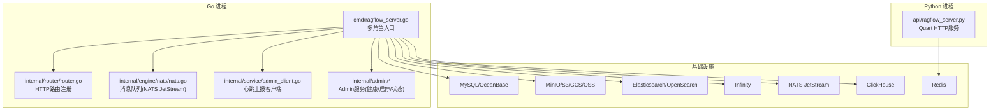
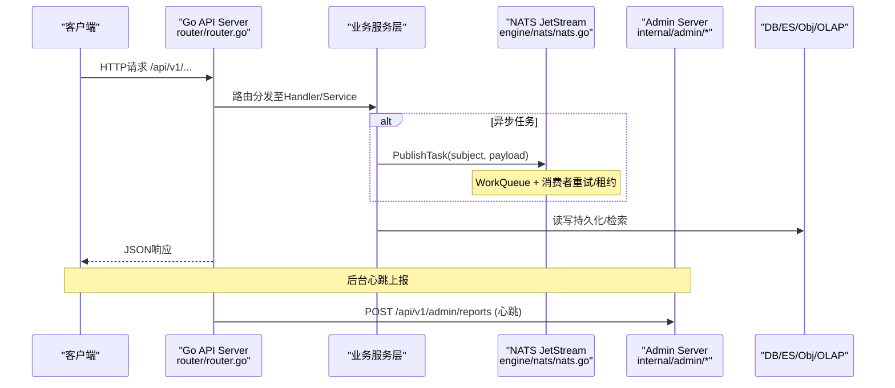
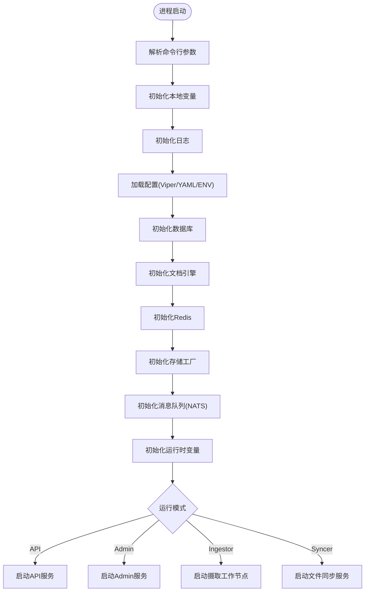
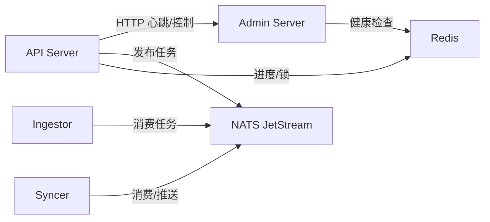
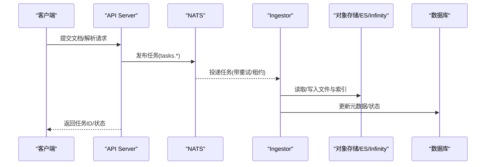
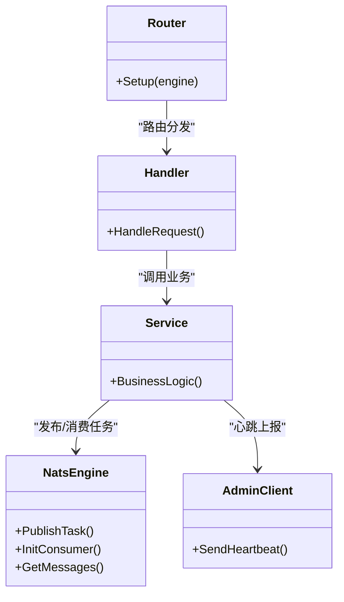
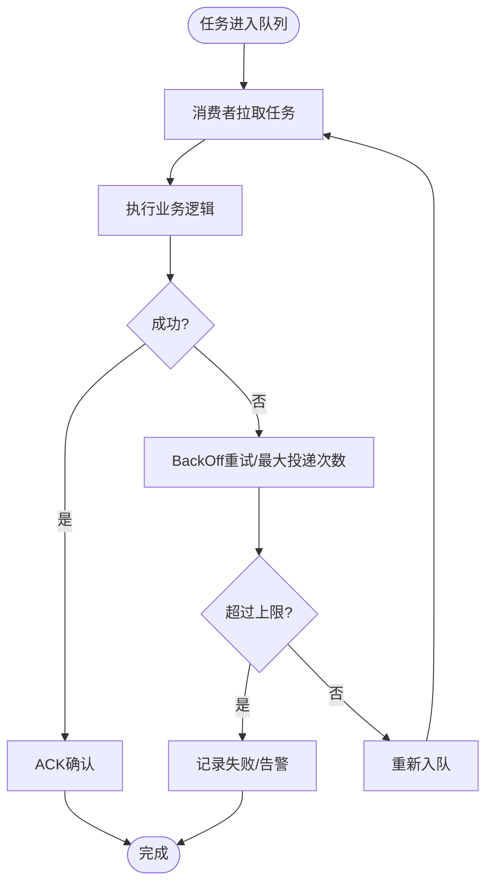
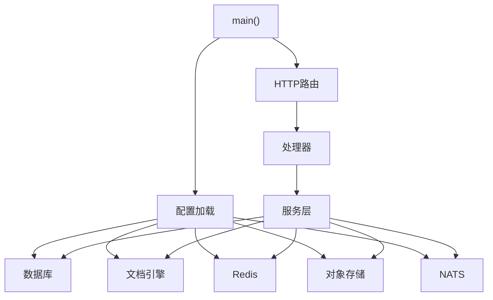

# 微服务架构设计

<cite>
**本文引用的文件**
- [cmd/ragflow_server.go](file://cmd/ragflow_server.go)
- [api/ragflow_server.py](file://api/ragflow_server.py)
- [internal/server/config.go](file://internal/server/config.go)
- [conf/service_conf.yaml](file://conf/service_conf.yaml)
- [internal/router/router.go](file://internal/router/router.go)
- [internal/engine/nats/nats.go](file://internal/engine/nats/nats.go)
- [internal/service/admin_client.go](file://internal/service/admin_client.go)
- [internal/admin/handler.go](file://internal/admin/handler.go)
- [internal/admin/service.go](file://internal/admin/service.go)
</cite>

## 目录
1. [简介](#简介)
2. [项目结构](#项目结构)
3. [核心组件](#核心组件)
4. [架构总览](#架构总览)
5. [详细组件分析](#详细组件分析)
6. [依赖关系分析](#依赖关系分析)
7. [性能考量](#性能考量)
8. [故障排查指南](#故障排查指南)
9. [结论](#结论)
10. [附录](#附录)

## 简介
本文件面向RAGFlow的分布式微服务架构，重点说明Python API服务与Go核心服务的职责划分、服务间通信机制、数据流转模式，以及启动流程、配置管理、依赖注入等关键技术点。同时覆盖服务发现（基于心跳上报）、负载均衡（消息队列消费者并发）、故障转移（重试与租约）等分布式特性，并给出解耦原则（接口定义、消息格式、错误处理策略）与架构图表，帮助开发者理解系统的分布式设计思路。

## 项目结构
RAGFlow采用“多进程、多角色”的微服务模式：
- Go主进程通过命令行参数切换不同角色：API服务器、Admin服务器、Ingestor（文档摄取工作节点）、Syncer（文件同步服务）。
- Python侧提供独立的Quart HTTP服务，作为兼容路径或扩展入口，并通过Redis进行任务协调。
- 统一配置由Viper加载YAML与环境变量；基础设施包括MySQL、对象存储、Elasticsearch/OpenSearch、Infinity、NATS、ClickHouse、Redis等。

图表来源
- [cmd/ragflow_server.go:228-431](file://cmd/ragflow_server.go#L228-L431)
- [internal/router/router.go:140-746](file://internal/router/router.go#L140-L746)
- [internal/engine/nats/nats.go:60-131](file://internal/engine/nats/nats.go#L60-L131)
- [internal/service/admin_client.go:62-168](file://internal/service/admin_client.go#L62-L168)
- [api/ragflow_server.py:141-236](file://api/ragflow_server.py#L141-L236)

章节来源
- [cmd/ragflow_server.go:228-431](file://cmd/ragflow_server.go#L228-L431)
- [api/ragflow_server.py:141-236](file://api/ragflow_server.py#L141-L236)
- [internal/server/config.go:39-165](file://internal/server/config.go#L39-L165)
- [conf/service_conf.yaml:1-194](file://conf/service_conf.yaml#L1-L194)

## 核心组件
- 多角色Go服务入口：支持--api/--admin/--ingestor/--syncer四种模式，统一初始化日志、配置、数据库、文档引擎、缓存、消息队列、运行时变量，再按模式启动对应服务。
- HTTP路由层：集中注册RESTful API，包含用户、租户、文档、数据集、搜索、聊天、MCP、插件、模型等模块。
- 消息队列引擎：基于NATS JetStream实现任务发布/消费、流式知识编译、KV键值存储、消费者租约与重试。
- 心跳与服务治理：各子服务周期性向Admin上报心跳，Admin可查询/控制服务生命周期与健康状态。
- 配置中心：Viper统一读取service_conf.yaml与环境变量，解析数据库、存储、缓存、队列、分析、追踪、默认模型、OAuth等配置。
- Python API服务：独立Quart进程，负责部分历史能力与通道集成，使用Redis做进度更新与分布式锁。

章节来源
- [cmd/ragflow_server.go:228-431](file://cmd/ragflow_server.go#L228-L431)
- [internal/router/router.go:140-746](file://internal/router/router.go#L140-L746)
- [internal/engine/nats/nats.go:60-313](file://internal/engine/nats/nats.go#L60-L313)
- [internal/service/admin_client.go:62-168](file://internal/service/admin_client.go#L62-L168)
- [internal/server/config.go:39-165](file://internal/server/config.go#L39-L165)
- [api/ragflow_server.py:141-236](file://api/ragflow_server.py#L141-L236)

## 架构总览
下图展示从请求到处理的端到端调用链，涵盖API路由、服务层、消息队列、外部存储与分析引擎。

图表来源
- [internal/router/router.go:140-746](file://internal/router/router.go#L140-L746)
- [internal/engine/nats/nats.go:106-131](file://internal/engine/nats/nats.go#L106-L131)
- [internal/service/admin_client.go:89-168](file://internal/service/admin_client.go#L89-L168)

## 详细组件分析

### 启动流程与配置管理
- 启动入口：解析命令行参数，选择运行模式；初始化本地变量、日志、全局配置；初始化数据库、文档引擎、Redis、存储工厂、消息队列；根据模式启动对应服务。
- 配置加载：Viper优先读取指定配置文件，否则查找service_conf.yaml与环境变量；依次解析通用、数据库、文档引擎、存储、缓存、队列、分析、日志、SMTP、默认模型、OAuth等配置项。
- 环境变量覆盖：通过前缀RAGFLOW_与环境键替换规则自动映射到配置项。

图表来源
- [cmd/ragflow_server.go:228-431](file://cmd/ragflow_server.go#L228-L431)
- [internal/server/config.go:39-165](file://internal/server/config.go#L39-L165)

章节来源
- [cmd/ragflow_server.go:228-431](file://cmd/ragflow_server.go#L228-L431)
- [internal/server/config.go:39-165](file://internal/server/config.go#L39-L165)
- [conf/service_conf.yaml:1-194](file://conf/service_conf.yaml#L1-L194)

### 服务间通信机制
- 同步HTTP：API/Admin之间通过HTTP REST交互，如心跳上报、服务启停、状态查询。
- 异步消息：NATS JetStream作为任务总线，支持WorkQueue语义、消费者重试、租约与KV存储，用于摄取、编译、同步等长耗时任务。
- Redis：Python侧使用Redis做分布式锁与进度更新；Go侧也使用Redis进行健康检查与状态同步。

图表来源
- [internal/service/admin_client.go:89-168](file://internal/service/admin_client.go#L89-L168)
- [internal/engine/nats/nats.go:106-313](file://internal/engine/nats/nats.go#L106-L313)
- [api/ragflow_server.py:87-112](file://api/ragflow_server.py#L87-L112)

章节来源
- [internal/service/admin_client.go:89-168](file://internal/service/admin_client.go#L89-L168)
- [internal/engine/nats/nats.go:106-313](file://internal/engine/nats/nats.go#L106-L313)
- [api/ragflow_server.py:87-112](file://api/ragflow_server.py#L87-L112)

### 数据流转模式
- 文档摄取：API接收上传/解析请求后，将任务发布到NATS；Ingestor消费任务，执行解析、分块、嵌入、索引写入ES/Infinity等；结果回写数据库与对象存储。
- 知识编译：数据集级编译任务通过NATS通知与MySQL调度结合，消费者拉取任务并产出结构化产物，写入导航树与制品库。
- 文件同步：Syncer监听变更，将源文件同步到RAGFlow对象存储，并触发后续入库流程。

图表来源
- [internal/engine/nats/nats.go:106-131](file://internal/engine/nats/nats.go#L106-L131)
- [cmd/ragflow_server.go:551-648](file://cmd/ragflow_server.go#L551-L648)

章节来源
- [cmd/ragflow_server.go:551-648](file://cmd/ragflow_server.go#L551-L648)
- [internal/engine/nats/nats.go:106-131](file://internal/engine/nats/nats.go#L106-L131)

### 依赖注入与解耦设计
- 依赖注入：Go服务在启动时构造服务层实例（用户、文档、数据集、聊天、搜索、文件、记忆、MCP、模型提供者等），并注入到Handler与Router中，形成清晰的层次解耦。
- 接口定义：消息以JSON序列化传输，包含任务类型、标识、上下文与扩展字段；心跳消息包含服务名、类型、版本、时间戳与集群信息。
- 错误处理：HTTP层统一返回code/message；消息消费采用显式ACK/NACK/InProgress，配合BackOff重试与最大投递次数；未初始化引擎方法返回明确错误而非panic。

图表来源
- [internal/router/router.go:140-746](file://internal/router/router.go#L140-L746)
- [internal/engine/nats/nats.go:106-313](file://internal/engine/nats/nats.go#L106-L313)
- [internal/service/admin_client.go:89-168](file://internal/service/admin_client.go#L89-L168)

章节来源
- [internal/router/router.go:140-746](file://internal/router/router.go#L140-L746)
- [internal/engine/nats/nats.go:106-313](file://internal/engine/nats/nats.go#L106-L313)
- [internal/service/admin_client.go:89-168](file://internal/service/admin_client.go#L89-L168)

### 服务发现、负载均衡与故障转移
- 服务发现：通过Admin心跳上报机制，各服务周期性POST心跳到Admin，Admin维护服务实例清单与状态。
- 负载均衡：NATS消费者组与工作队列语义天然支持水平扩展；多个Ingestor实例共享同一主题，Broker保证单条消息仅被一个消费者处理。
- 故障转移：消费者配置了AckWait与BackOff重试，任务失败会按退避策略重投；知识编译使用KV租约确保同一任务仅由一个持有者执行；未就绪引擎方法返回错误，避免崩溃传播。

图表来源
- [internal/engine/nats/nats.go:214-258](file://internal/engine/nats/nats.go#L214-L258)
- [internal/engine/nats/nats.go:259-313](file://internal/engine/nats/nats.go#L259-L313)

章节来源
- [internal/engine/nats/nats.go:214-258](file://internal/engine/nats/nats.go#L214-L258)
- [internal/engine/nats/nats.go:259-313](file://internal/engine/nats/nats.go#L259-L313)

## 依赖关系分析
- 启动依赖：日志→配置→数据库→文档引擎→缓存→存储→消息队列→运行时变量→HTTP服务。
- 运行时依赖：API路由→Handler→Service→NATS/Redis/DB/ES/Obj/OLAP；Admin心跳→Admin服务；Python服务→Redis。
- 外部依赖：MySQL/OceanBase、MinIO/S3/GCS/OSS、Elasticsearch/OpenSearch、Infinity、NATS、ClickHouse、Redis。

图表来源
- [cmd/ragflow_server.go:228-431](file://cmd/ragflow_server.go#L228-L431)
- [internal/server/config.go:39-165](file://internal/server/config.go#L39-L165)

章节来源
- [cmd/ragflow_server.go:228-431](file://cmd/ragflow_server.go#L228-L431)
- [internal/server/config.go:39-165](file://internal/server/config.go#L39-L165)

## 性能考量
- 消息队列：NATS JetStream使用WorkQueue与显式ACK，支持高吞吐与可靠投递；消费者MaxAckPending与BackOff平衡吞吐与稳定性。
- 并发控制：Ingestor支持最大并发工作线程与编译器池大小；Syncer支持最大并发同步数。
- 资源隔离：日志分级与滚动、配置热更新、优雅关闭（超时控制）。
- 外部依赖：连接超时、重试与熔断建议（可在上层封装）；对象存储与搜索引擎的连接池与批处理优化。

[本节为通用指导，不直接分析具体文件]

## 故障排查指南
- 心跳失败：检查Admin配置(host/port)、网络连通性、许可证校验码；查看心跳客户端日志与Admin端报告接口。
- 消息堆积：查看NATS流与消费者状态（pending/waiting/ack_pending/redelivered），调整消费者并发与重试策略。
- 任务重复执行：确认消费者是否已ACK；检查租约与CAS保护；核对任务ID与状态机转换。
- 启动失败：逐项检查数据库、文档引擎、Redis、存储、消息队列初始化返回值；关注未正确初始化的引擎方法错误。

章节来源
- [internal/service/admin_client.go:89-168](file://internal/service/admin_client.go#L89-L168)
- [internal/engine/nats/nats.go:133-169](file://internal/engine/nats/nats.go#L133-L169)
- [internal/engine/nats/nats.go:214-258](file://internal/engine/nats/nats.go#L214-L258)
- [internal/admin/handler.go:488-581](file://internal/admin/handler.go#L488-L581)
- [internal/admin/service.go:1136-1260](file://internal/admin/service.go#L1136-L1260)

## 结论
RAGFlow通过Go多角色服务与Python扩展服务协同，结合NATS消息队列与多种基础设施，实现了高内聚、低耦合的分布式架构。统一的配置管理、清晰的路由与服务分层、健壮的消息重试与租约机制，使得系统在可扩展性与可靠性方面具备良好基础。建议在部署中合理设置消费者并发、重试策略与监控指标，并结合Admin心跳与服务状态接口进行运维治理。

[本节为总结，不直接分析具体文件]

## 附录
- 配置示例：service_conf.yaml定义了各组件连接信息与默认模型等关键参数。
- 路由清单：Go侧集中注册了大量RESTful接口，覆盖用户、租户、文档、数据集、搜索、聊天、MCP、插件、模型等。
- 消息协议：任务与心跳消息采用JSON格式，包含必要标识与扩展字段，便于跨语言与版本演进。

章节来源
- [conf/service_conf.yaml:1-194](file://conf/service_conf.yaml#L1-L194)
- [internal/router/router.go:140-746](file://internal/router/router.go#L140-L746)
- [internal/service/admin_client.go:89-168](file://internal/service/admin_client.go#L89-L168)