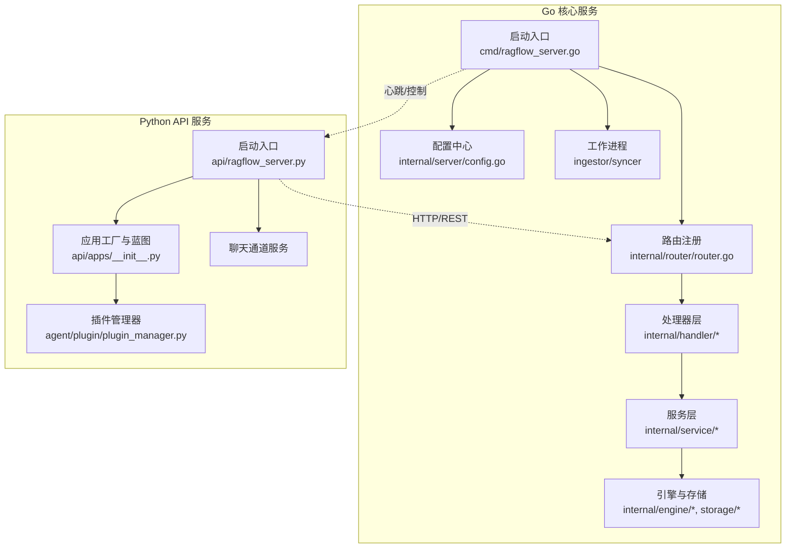
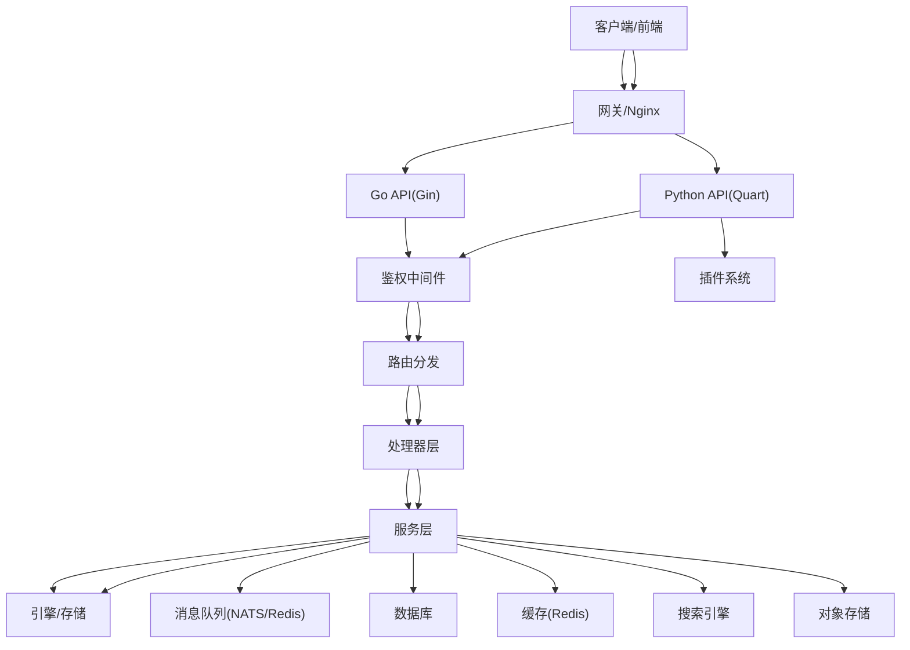
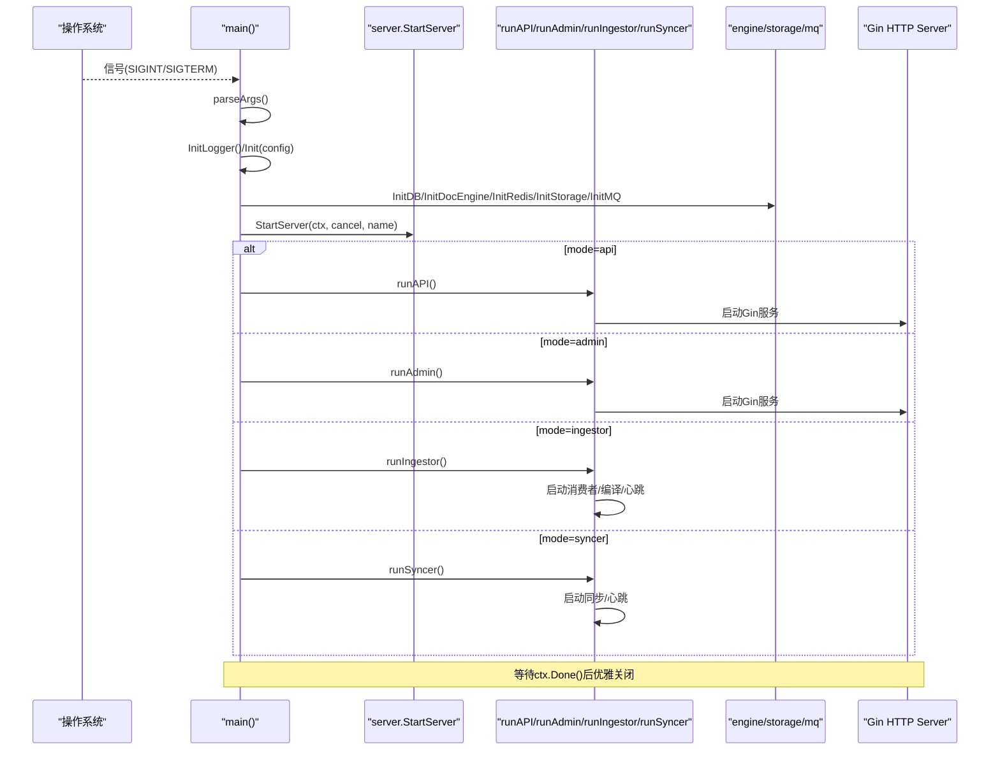
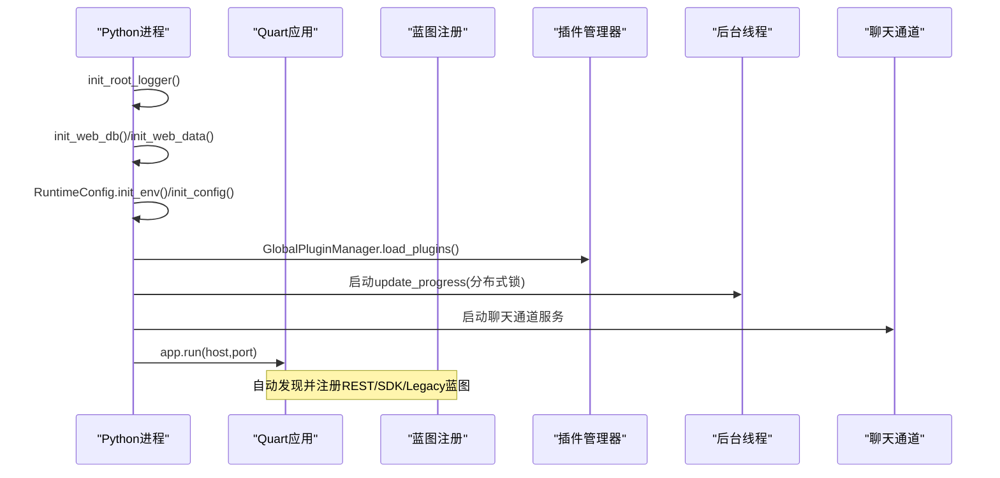
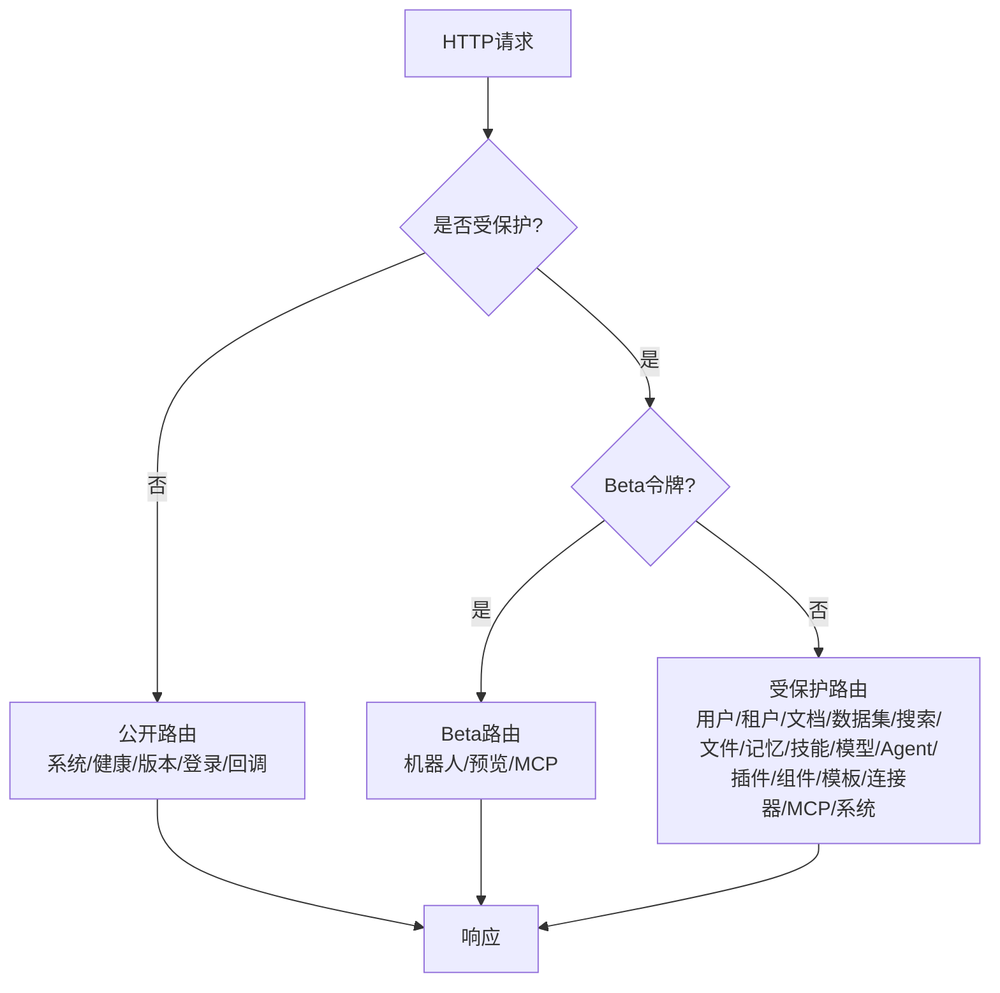
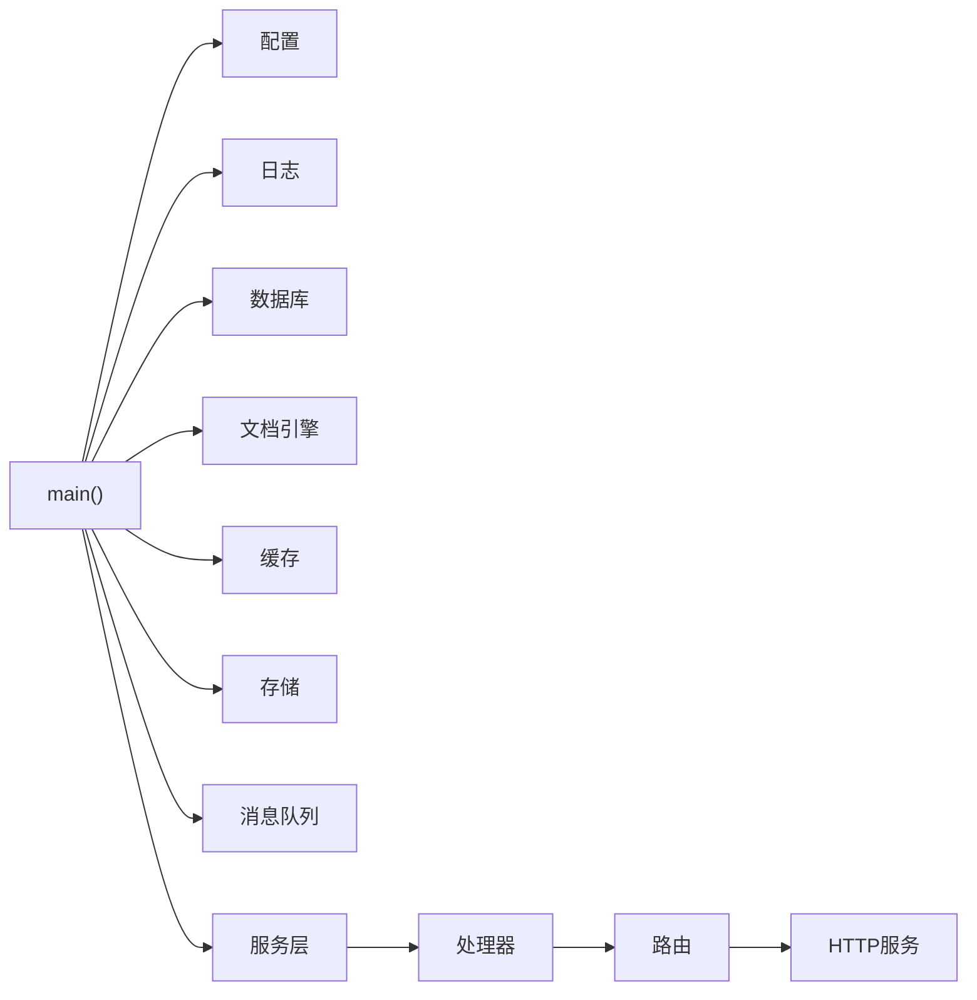

# 核心架构设计

<cite>
**本文引用的文件**
- [cmd/ragflow_server.go](file://cmd/ragflow_server.go)
- [internal/router/router.go](file://internal/router/router.go)
- [internal/server/config.go](file://internal/server/config.go)
- [conf/service_conf.yaml](file://conf/service_conf.yaml)
- [api/ragflow_server.py](file://api/ragflow_server.py)
- [api/apps/__init__.py](file://api/apps/__init__.py)
- [agent/plugin/plugin_manager.py](file://agent/plugin/plugin_manager.py)
- [internal/handler/error.go](file://internal/handler/error.go)
- [internal/common/error_code.go](file://internal/common/error_code.go)
</cite>

## 目录
1. [简介](#简介)
2. [项目结构](#项目结构)
3. [核心组件](#核心组件)
4. [架构总览](#架构总览)
5. [详细组件分析](#详细组件分析)
6. [依赖关系分析](#依赖关系分析)
7. [性能考量](#性能考量)
8. [故障排查指南](#故障排查指南)
9. [结论](#结论)
10. [附录](#附录)

## 简介
本文件系统性阐述 RAGFlow 的核心架构设计，覆盖微服务形态、分层架构、组件通信机制、路由与请求处理流程、中间件与错误处理策略，以及扩展性设计（插件架构、动态组件加载、配置驱动）。重点解释 Python API 服务与 Go 核心服务的职责划分和数据流转，帮助开发者快速理解系统的设计思路与实现细节。

## 项目结构
RAGFlow 采用“Go 核心服务 + Python API 服务”的双进程架构：
- Go 核心服务：提供高性能 HTTP API、路由注册、鉴权中间件、服务层编排、消息队列与存储引擎集成、后台工作进程（Ingestor/Syncer）等。
- Python API 服务：基于 Quart 的异步 HTTP 服务，负责 RESTful/SDK/Legacy API 的动态发现与注册、认证会话管理、后台任务进度更新、聊天通道服务等。

**图表来源**
- [cmd/ragflow_server.go:228-432](file://cmd/ragflow_server.go#L228-L432)
- [internal/router/router.go:140-746](file://internal/router/router.go#L140-L746)
- [internal/server/config.go:39-165](file://internal/server/config.go#L39-L165)
- [api/ragflow_server.py:141-236](file://api/ragflow_server.py#L141-L236)
- [api/apps/__init__.py:78-398](file://api/apps/__init__.py#L78-L398)

**章节来源**
- [cmd/ragflow_server.go:228-432](file://cmd/ragflow_server.go#L228-L432)
- [api/ragflow_server.py:141-236](file://api/ragflow_server.py#L141-L236)

## 核心组件
- 启动与生命周期管理
  - Go 侧：统一入口解析参数、初始化日志、配置、数据库、文档引擎、缓存、消息队列、变量；按模式启动 API/Admin/Ingestor/Syncer；优雅关闭。
  - Python 侧：初始化日志、数据库表、运行时配置、全局插件、信号处理、后台进度线程、聊天通道服务、Quart 服务器。
- 配置驱动
  - 通过 Viper 读取 YAML 与环境变量，支持多引擎（MySQL/OceanBase、Elasticsearch/Infinity/OceanBase、MinIO/S3/OSS/GCS、Redis、NATS、ClickHouse、OpenTelemetry），并导出各子系统配置。
- 路由与中间件
  - Go Gin：分组路由（公开/Beta令牌/受保护）、统一日志、健康检查、NoRoute 处理、鉴权中间件。
  - Python Quart：CORS、Schema、自定义 JSON 编码器、统一错误处理、登录装饰器、蓝图自动发现与注册。
- 服务层与处理器
  - Go：Handler 接收请求，Service 编排业务逻辑，DAO/Engine 访问数据与搜索引擎，Storage 抽象对象存储。
  - Python：Blueprint 路由到具体视图函数，使用装饰器进行鉴权与权限校验。
- 插件与扩展
  - Python 插件管理器从 embedded_plugins 目录动态加载 LLM 工具插件，暴露工具清单供前端或 Agent 使用。
  - Go 组件目录与注册表用于管线与组件能力发现（如 /components 接口）。
- 工作进程与消息队列
  - Ingestor：解析与知识编译、内存提取消费、Nav 树写入、心跳上报。
  - Syncer：文件同步任务，心跳上报。
  - 消息队列：NATS/Redis 作为任务分发与状态同步通道。

**章节来源**
- [cmd/ragflow_server.go:228-432](file://cmd/ragflow_server.go#L228-L432)
- [internal/server/config.go:39-165](file://internal/server/config.go#L39-L165)
- [internal/router/router.go:140-746](file://internal/router/router.go#L140-L746)
- [api/ragflow_server.py:141-236](file://api/ragflow_server.py#L141-L236)
- [api/apps/__init__.py:78-398](file://api/apps/__init__.py#L78-L398)
- [agent/plugin/plugin_manager.py:11-44](file://agent/plugin/plugin_manager.py#L11-L44)

## 架构总览
RAGFlow 采用“前后端分离 + 多语言服务”的微服务化分层架构：
- 接入层：Nginx/网关（外部部署）→ Go Gin 与 Python Quart 双入口。
- 路由与鉴权：Go 侧集中式路由与中间件；Python 侧装饰器与蓝图。
- 业务层：Go Service 编排复杂流程（检索增强、Agent、知识库编译）；Python 服务侧重 API 适配与交互。
- 数据层：DB（MySQL/OceanBase）、搜索引擎（ES/Infinity/OceanBase）、对象存储（S3/MinIO/OSS/GCS）、缓存（Redis）、消息队列（NATS/Redis）、分析引擎（ClickHouse）。
- 扩展层：插件体系（LLM 工具）、组件目录（管线/组件）、配置驱动（YAML+环境变量）。

**图表来源**
- [internal/router/router.go:140-746](file://internal/router/router.go#L140-L746)
- [api/apps/__init__.py:78-398](file://api/apps/__init__.py#L78-L398)
- [internal/server/config.go:39-165](file://internal/server/config.go#L39-L165)

## 详细组件分析

### Go 核心服务启动与生命周期
- 参数解析与模式选择：--api/--admin/--ingestor/--syncer，支持 --config、--port、--debug、--name 等。
- 初始化顺序：本地变量 → 日志 → 配置 → 数据库 → 文档引擎 → Redis → 存储工厂 → 消息队列 → 运行时变量 → 启动 EE 钩子。
- 模式分支：
  - API：初始化分词器、查询构建器、服务层与处理器、注册路由、启动 HTTP 服务。
  - Admin：独立管理面板服务。
  - Ingestor：启动解析与编译流水线、设置 Nav/Memory 服务、心跳上报、优雅停止。
  - Syncer：文件同步服务、心跳上报、优雅停止。

**图表来源**
- [cmd/ragflow_server.go:228-432](file://cmd/ragflow_server.go#L228-L432)
- [cmd/ragflow_server.go:434-518](file://cmd/ragflow_server.go#L434-L518)
- [cmd/ragflow_server.go:551-648](file://cmd/ragflow_server.go#L551-L648)
- [cmd/ragflow_server.go:650-694](file://cmd/ragflow_server.go#L650-L694)
- [cmd/ragflow_server.go:696-726](file://cmd/ragflow_server.go#L696-L726)

**章节来源**
- [cmd/ragflow_server.go:228-432](file://cmd/ragflow_server.go#L228-L432)

### Python API 服务启动与生命周期
- 初始化：根日志、数据库表、运行时配置、全局插件、信号处理。
- 后台线程：每 6 秒轮询更新文档处理进度（分布式锁保证单实例执行）。
- 聊天通道：在独立线程中启动，支持多渠道接入。
- 服务器：Quart 应用，CORS、Schema、超时配置、错误处理、蓝图自动注册。

**图表来源**
- [api/ragflow_server.py:141-236](file://api/ragflow_server.py#L141-L236)
- [api/apps/__init__.py:78-398](file://api/apps/__init__.py#L78-L398)
- [agent/plugin/plugin_manager.py:11-44](file://agent/plugin/plugin_manager.py#L11-L44)

**章节来源**
- [api/ragflow_server.py:141-236](file://api/ragflow_server.py#L141-L236)
- [api/apps/__init__.py:78-398](file://api/apps/__init__.py#L78-L398)

### 路由管理与请求处理流程
- Go Gin 路由：
  - 公开组：系统信息、版本、健康检查、管道模板、搜索机器人详情、邮箱登录、OAuth回调、Dify检索健康检查。
  - Beta 令牌组：搜索机器人问答、补全、思维导图、文档预览、MCP 服务端点。
  - 受保护组：用户、租户、文档、数据集、搜索、文件、记忆、技能、提供者、模型、Agent、插件、组件、编译模板、连接器、MCP、系统变量/Tokens、聊天频道、Langfuse、Dify检索。
  - 中间件：X-API-Source 标记、统一日志、鉴权中间件。
  - NoRoute：兼容 Python 行为，返回标准 JSON 错误。
- Python Quart 路由：
  - 蓝图自动发现：restful_apis、sdk、legacy 页面，分别挂载到 /api/v1/、/v1/<page>/、/v1/。
  - 认证：支持 JWT、API Token、Beta Token、Session 回退；统一 401/404/异常处理。

**图表来源**
- [internal/router/router.go:140-746](file://internal/router/router.go#L140-L746)
- [api/apps/__init__.py:78-398](file://api/apps/__init__.py#L78-L398)

**章节来源**
- [internal/router/router.go:140-746](file://internal/router/router.go#L140-L746)
- [api/apps/__init__.py:78-398](file://api/apps/__init__.py#L78-L398)

### 中间件机制
- Go 侧：
  - 日志中间件：记录方法、路径、查询、远程地址、User-Agent。
  - 鉴权中间件：校验 JWT/API Token/Beta Token，失败返回统一错误码。
  - 健康检查：/health、/system/healthz。
- Python 侧：
  - CORS、Schema、自定义 JSON 编码器。
  - 登录装饰器：支持多种认证类型，未认证抛出统一异常。
  - 错误处理：404、401、模型异常统一封装为 JSON。

**章节来源**
- [internal/router/router.go:140-155](file://internal/router/router.go#L140-L155)
- [internal/handler/error.go:30-70](file://internal/handler/error.go#L30-L70)
- [api/apps/__init__.py:78-101](file://api/apps/__init__.py#L78-L101)
- [api/apps/__init__.py:252-297](file://api/apps/__init__.py#L252-L297)
- [api/apps/__init__.py:401-443](file://api/apps/__init__.py#L401-L443)

### 错误处理策略
- Go 侧：
  - 内部错误：记录原始错误并返回通用消息，避免泄露实现细节。
  - 未定义路由：兼容 Python 行为，特定路径返回 MethodNotAllowed 语义。
  - 错误码映射：将领域错误映射为标准 ErrorCode，统一 {code,message} 契约。
- Python 侧：
  - 统一错误处理器：404、401、模型异常均返回结构化 JSON。
  - 认证失败：根据认证类型返回不同提示。

**章节来源**
- [internal/handler/error.go:30-88](file://internal/handler/error.go#L30-L88)
- [internal/common/error_code.go:21-118](file://internal/common/error_code.go#L21-L118)
- [api/apps/__init__.py:401-443](file://api/apps/__init__.py#L401-L443)

### 配置驱动与多引擎支持
- 配置来源：YAML 文件（service_conf.yaml）与环境变量（前缀 RAGFLOW_），支持热重载与打印全部配置。
- 引擎类型：
  - 数据库：MySQL/OceanBase
  - 文档引擎：Elasticsearch/Infinity/OceanBase/SeekDB
  - 存储：MinIO/S3/OSS/GCS
  - 缓存：Redis
  - 消息队列：NATS
  - 分析引擎：ClickHouse
  - 追踪：OpenTelemetry
- 默认模型与 OAuth、SMTP、计费等均可配置。

**章节来源**
- [internal/server/config.go:39-165](file://internal/server/config.go#L39-L165)
- [conf/service_conf.yaml:1-194](file://conf/service_conf.yaml#L1-L194)

### 插件架构与动态组件加载
- Python 插件管理器：
  - 从 embedded_plugins 目录加载插件，识别 LLM 工具类型，维护名称到插件实例的映射。
  - 提供获取所有工具、按名称获取、批量获取等接口。
- Go 组件目录：
  - 通过 /components 接口暴露运行时组件目录，支持分类过滤（ingestion/agent/shared）。

**章节来源**
- [agent/plugin/plugin_manager.py:11-44](file://agent/plugin/plugin_manager.py#L11-L44)
- [internal/router/router.go:610-615](file://internal/router/router.go#L610-L615)

## 依赖关系分析
- 启动依赖链：
  - main → 配置 → 日志 → 数据库 → 文档引擎 → 缓存 → 存储 → 消息队列 → 服务层 → 路由 → HTTP 服务。
- 模块耦合：
  - Router 依赖 Handler，Handler 依赖 Service，Service 依赖 DAO/Engine/Storage。
  - Python 应用依赖 Blueprint，Blueprint 依赖认证与错误处理。
- 外部依赖：
  - 数据库、搜索引擎、对象存储、缓存、消息队列、分析引擎、追踪系统。

**图表来源**
- [cmd/ragflow_server.go:228-432](file://cmd/ragflow_server.go#L228-L432)
- [internal/router/router.go:140-746](file://internal/router/router.go#L140-L746)

**章节来源**
- [cmd/ragflow_server.go:228-432](file://cmd/ragflow_server.go#L228-L432)
- [internal/router/router.go:140-746](file://internal/router/router.go#L140-L746)

## 性能考量
- 并发与资源：
  - Ingestor 支持最大并发工作线程数，限制编译器池大小，避免过度消耗 CPU。
  - Python 后台进度更新使用分布式锁，确保多实例下仅一个实例执行。
- 超时与重试：
  - Python 设置响应体与请求体超时，适配慢速 LLM 后端。
  - Go 侧连接超时默认值，可配置。
- 缓存与队列：
  - Redis 缓存与 NATS/Redis 消息队列提升吞吐与解耦。
- 日志与追踪：
  - 结构化日志与 OpenTelemetry 支持性能分析与问题定位。

[本节提供一般性指导，不直接分析具体文件]

## 故障排查指南
- 启动失败：
  - 检查配置文件路径与环境变量是否正确。
  - 确认数据库、搜索引擎、存储、缓存、消息队列可达。
- 路由 404：
  - Go 侧 NoRoute 会记录请求详情并返回标准 JSON；Python 侧 404 处理器也会返回结构化错误。
- 认证失败：
  - 检查 Authorization 头格式（Bearer 或 Token）、JWT 有效性、API Token/Beta Token 是否存在且有效。
- 任务冲突：
  -  ingestion-task 状态转换冲突会映射为冲突错误码，需检查任务状态机。

**章节来源**
- [internal/handler/error.go:30-88](file://internal/handler/error.go#L30-L88)
- [internal/common/error_code.go:21-118](file://internal/common/error_code.go#L21-L118)
- [api/apps/__init__.py:401-443](file://api/apps/__init__.py#L401-L443)

## 结论
RAGFlow 通过 Go 核心服务与 Python API 服务的协同，实现了高内聚、低耦合的分层架构。Go 侧专注于高性能路由、中间件、服务编排与基础设施集成；Python 侧提供灵活的 API 适配、插件生态与交互体验。配置驱动与插件体系使系统具备强大的扩展能力，适合大规模 RAG 应用场景。

[本节总结整体设计，不直接分析具体文件]

## 附录
- 关键入口与模块路径参考：
  - Go 启动入口：[cmd/ragflow_server.go](file://cmd/ragflow_server.go)
  - Go 路由注册：[internal/router/router.go](file://internal/router/router.go)
  - Go 配置中心：[internal/server/config.go](file://internal/server/config.go)
  - Python 启动入口：[api/ragflow_server.py](file://api/ragflow_server.py)
  - Python 应用工厂：[api/apps/__init__.py](file://api/apps/__init__.py)
  - Python 插件管理器：[agent/plugin/plugin_manager.py](file://agent/plugin/plugin_manager.py)
  - Go 错误处理：[internal/handler/error.go](file://internal/handler/error.go)
  - Go 错误码定义：[internal/common/error_code.go](file://internal/common/error_code.go)
  - 配置文件示例：[conf/service_conf.yaml](file://conf/service_conf.yaml)

[本节列出参考文件，不直接分析具体文件]