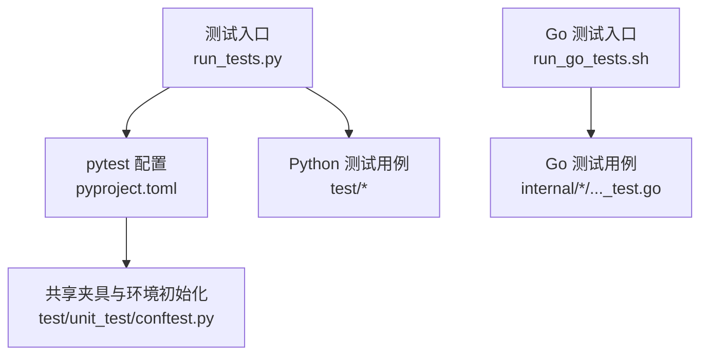
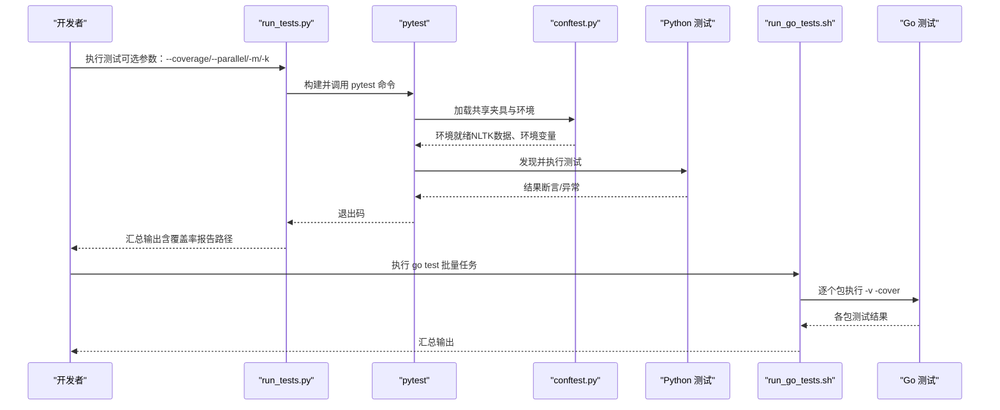
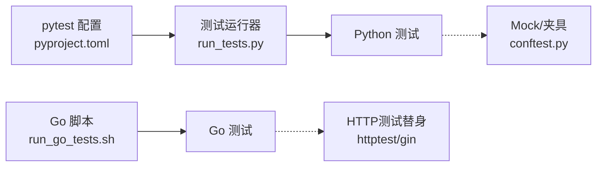

# 单元测试

<cite>
**本文引用的文件**
- [run_tests.py](file://run_tests.py)
- [pyproject.toml](file://pyproject.toml)
- [test/unit_test/conftest.py](file://test/unit_test/conftest.py)
- [agent/sandbox/executor_manager/tests/conftest.py](file://agent/sandbox/executor_manager/tests/conftest.py)
- [run_go_tests.sh](file://run_go_tests.sh)
- [internal/common/constants_test.go](file://internal/common/constants_test.go)
- [internal/handler/auth_test.go](file://internal/handler/auth_test.go)
</cite>

## 目录
1. [简介](#简介)
2. [项目结构](#项目结构)
3. [核心组件](#核心组件)
4. [架构总览](#架构总览)
5. [详细组件分析](#详细组件分析)
6. [依赖关系分析](#依赖关系分析)
7. [性能考虑](#性能考虑)
8. [故障排查指南](#故障排查指南)
9. [结论](#结论)
10. [附录](#附录)

## 简介
本文件面向RAGFlow项目的Python与Go代码的单元测试编写规范与实践，覆盖测试组织、命名约定、断言方法、Mock隔离外部依赖（数据库、API等）、测试数据准备与清理策略（fixture与数据工厂）、异步与并发测试处理，以及高质量单元测试的可维护性与执行效率保障。文档基于仓库现有测试基础设施与示例实现进行提炼，确保可落地、可复用。

## 项目结构
RAGFlow在根目录提供统一的测试入口与配置：
- Python侧通过pytest运行，测试用例位于test目录下，默认扫描testpaths为test，匹配test_*.py；同时支持标记（markers）与关键字过滤（-k）。
- Go侧通过脚本批量执行go test，覆盖internal下多个包。

图表来源
- [run_tests.py:182-235](file://run_tests.py#L182-L235)
- [pyproject.toml:315-353](file://pyproject.toml#L315-L353)
- [test/unit_test/conftest.py:30-68](file://test/unit_test/conftest.py#L30-L68)
- [run_go_tests.sh:4-27](file://run_go_tests.sh#L4-L27)

章节来源
- [run_tests.py:113-235](file://run_tests.py#L113-L235)
- [pyproject.toml:315-353](file://pyproject.toml#L315-L353)
- [run_go_tests.sh:1-31](file://run_go_tests.sh#L1-L31)

## 核心组件
- Python测试运行器：封装pytest命令构建、覆盖率、并行、标记、关键字过滤、彩色输出等能力，统一入口便于CI与本地开发。
- pytest全局配置：定义测试路径、收集规则、标记、异步模式、警告策略、覆盖率统计范围与报告输出。
- 共享夹具与环境：自动准备NLTK数据、设置环境变量、重置限流器等，保证测试可重复与隔离。
- Go测试脚本：按包遍历执行go test，开启详细输出与覆盖率统计。

章节来源
- [run_tests.py:113-235](file://run_tests.py#L113-L235)
- [pyproject.toml:315-353](file://pyproject.toml#L315-L353)
- [test/unit_test/conftest.py:30-68](file://test/unit_test/conftest.py#L30-L68)
- [agent/sandbox/executor_manager/tests/conftest.py:20-52](file://agent/sandbox/executor_manager/tests/conftest.py#L20-L52)
- [run_go_tests.sh:4-27](file://run_go_tests.sh#L4-L27)

## 架构总览
下图展示从命令行到测试执行的端到端流程，包括Python与Go两条链路。

图表来源
- [run_tests.py:182-235](file://run_tests.py#L182-L235)
- [pyproject.toml:315-353](file://pyproject.toml#L315-L353)
- [test/unit_test/conftest.py:30-68](file://test/unit_test/conftest.py#L30-L68)
- [run_go_tests.sh:4-27](file://run_go_tests.sh#L4-L27)

## 详细组件分析

### Python测试框架与规范（pytest）
- 测试组织与命名
  - 测试目录：test（由pytest配置指定），子目录可按模块划分（如test/unit_test、test/integration等）。
  - 文件命名：test_*.py；类名建议以Test开头；函数名以test_开头，遵循pytest默认收集规则。
  - 标记（markers）：使用p0/p1/p2/p3优先级、smoke、auth、asyncio等标记，便于选择性执行与分层测试。
- 断言与可读性
  - 使用assert进行断言，结合pytest丰富的失败信息（变量值、表达式展开）。
  - 对HTTP/JSON响应，建议使用结构化对象或字典键断言，避免字符串模糊匹配。
- Mock与隔离
  - 使用unittest.mock或pytest-mock对数据库、网络请求、第三方SDK等进行替换，确保测试无副作用且快速稳定。
  - 针对限流器、认证中间件等状态型组件，使用autouse fixture在每个测试前后重置状态。
- 测试数据准备与清理
  - 使用conftest.py集中管理共享夹具与环境变量，例如自动下载并缓存NLTK数据、注入必要环境变量。
  - 对需要持久化数据的测试，使用事务回滚或临时数据库；对文件系统操作，使用临时目录并在teardown中清理。
- 异步与并发
  - 启用pytest-asyncio的auto模式，配合@mark.asyncio或async def测试函数。
  - 使用pytest-xdist进行并行执行，注意测试间资源隔离（如DB、Redis、文件锁）。
- 覆盖率与质量门禁
  - 通过--cov统计common等核心目录覆盖率，生成HTML与终端报告；可在CI中设置fail_under阈值。

章节来源
- [pyproject.toml:315-353](file://pyproject.toml#L315-L353)
- [test/unit_test/conftest.py:30-68](file://test/unit_test/conftest.py#L30-L68)
- [agent/sandbox/executor_manager/tests/conftest.py:20-52](file://agent/sandbox/executor_manager/tests/conftest.py#L20-L52)

### Go测试框架与最佳实践（testing）
- 测试组织与命名
  - 测试文件以*_test.go命名，放在对应包内；测试函数以TestXxx(t *testing.T)。
  - 使用Table-Driven Tests组织多组输入输出，提升可读性与覆盖率。
- 断言与错误处理
  - 使用t.Errorf/t.Fatalf输出期望与实际差异；对关键契约（如常量、协议字段）进行精确断言。
- Mock与隔离
  - 使用httptest.NewRecorder与gin.CreateTestContext模拟HTTP请求与中间件行为，无需启动真实服务。
  - 对数据库/缓存等外部依赖，通过接口抽象与测试替身替换，避免真实IO。
- 并发与基准
  - 使用t.Parallel()进行并发测试，注意共享资源隔离；使用BenchmarkXxx进行性能回归检测。
- 覆盖率
  - 通过go test -cover统计覆盖率，结合脚本批量执行多个包。

章节来源
- [internal/common/constants_test.go:17-41](file://internal/common/constants_test.go#L17-L41)
- [internal/handler/auth_test.go:17-69](file://internal/handler/auth_test.go#L17-L69)
- [run_go_tests.sh:4-27](file://run_go_tests.sh#L4-L27)

### 测试数据准备与清理策略
- Fixture与数据工厂
  - 将常用测试数据构造逻辑封装为fixture或工厂函数，减少重复代码，提高一致性。
  - 对复杂对象（如DSL、解析结果）使用JSON/YAML fixtures，便于版本管理与可视化比对。
- 环境隔离
  - 通过monkeypatch或环境变量注入控制外部行为（如限流阈值、令牌、超时）。
  - 对沙箱/执行器相关测试，使用autouse fixture重置限流器与清理敏感环境变量。
- 清理策略
  - 使用yield+finally或pytest的setup/teardown机制确保资源释放；对临时文件与数据库记录进行清理。

章节来源
- [agent/sandbox/executor_manager/tests/conftest.py:39-52](file://agent/sandbox/executor_manager/tests/conftest.py#L39-L52)
- [test/unit_test/conftest.py:30-68](file://test/unit_test/conftest.py#L30-L68)

### 异步测试与并发测试
- Python异步
  - 启用asyncio_mode=auto，直接编写async def测试；必要时使用pytest-asyncio的装饰器。
  - 对涉及事件循环的组件，确保在fixture中正确初始化与关闭。
- 并发执行
  - 使用pytest-xdist的-n选项并行执行，注意测试幂等性与资源竞争；对共享状态使用隔离或锁。
- Go并发
  - 使用t.Parallel()并行测试，避免共享可变状态；对goroutine泄漏进行监控。

章节来源
- [pyproject.toml:335-337](file://pyproject.toml#L335-L337)
- [run_tests.py:214-224](file://run_tests.py#L214-L224)

### 高质量单元测试的实践要点
- 单一职责：每个测试只验证一个行为分支或边界条件。
- 明确预期：断言具体、可解释，包含错误消息与上下文。
- 可重复：不依赖外部状态，或使用可控的替身与固定种子。
- 高效：避免慢IO，优先内存计算与轻量Mock；合理分组与标记以缩短反馈周期。
- 可维护：抽取公共逻辑到fixture/工具函数，保持测试文件简洁。

## 依赖关系分析
测试执行的关键依赖如下：
- Python：pytest、pytest-asyncio、pytest-xdist、pytest-cov、hypothesis等；通过pyproject.toml统一管理。
- Go：标准库testing与http/httptest；通过脚本批量执行。

图表来源
- [pyproject.toml:315-353](file://pyproject.toml#L315-L353)
- [run_tests.py:182-235](file://run_tests.py#L182-L235)
- [test/unit_test/conftest.py:30-68](file://test/unit_test/conftest.py#L30-L68)
- [run_go_tests.sh:4-27](file://run_go_tests.sh#L4-L27)
- [internal/handler/auth_test.go:17-69](file://internal/handler/auth_test.go#L17-L69)

章节来源
- [pyproject.toml:195-212](file://pyproject.toml#L195-L212)
- [run_go_tests.sh:4-27](file://run_go_tests.sh#L4-L27)

## 性能考虑
- 并行执行：Python侧使用pytest-xdist并行；Go侧可通过-p或并行测试提升吞吐。
- 覆盖率开关：仅在必要阶段开启覆盖率，避免影响执行速度。
- 数据预热：对NLTK等重型依赖，采用本地缓存与按需下载，减少冷启动开销。
- 测试分组：通过markers与-k筛选快速回归集，长耗时用例单独执行。

[本节为通用指导，不直接分析具体文件]

## 故障排查指南
- NLTK数据缺失
  - 现象：导入tokenizer时报LookupError。
  - 解决：确保conftest已预置nltk_data路径并下载所需资源；检查环境变量与权限。
- 限流器导致测试失败
  - 现象：沙箱/执行器测试出现429或配额耗尽。
  - 解决：使用autouse fixture重置限流器，并通过环境变量调整阈值。
- 认证中间件分支未覆盖
  - 现象：缺少Authorization头时行为不符合预期。
  - 解决：使用httptest与gin测试上下文构造请求，断言中止与响应码。

章节来源
- [test/unit_test/conftest.py:30-68](file://test/unit_test/conftest.py#L30-L68)
- [agent/sandbox/executor_manager/tests/conftest.py:39-52](file://agent/sandbox/executor_manager/tests/conftest.py#L39-L52)
- [internal/handler/auth_test.go:30-69](file://internal/handler/auth_test.go#L30-L69)

## 结论
RAGFlow的测试体系以pytest为核心，辅以统一的运行器与共享夹具，结合Go的标准testing与httptest，形成跨语言、可扩展、易维护的单元测试生态。通过合理的组织、命名、Mock策略、数据准备与清理、异步与并发处理，以及覆盖率与质量门禁，能够显著提升代码质量与交付效率。建议在新增功能时同步补充测试，并遵循本文规范保持一致性。

## 附录
- 常用命令
  - Python：python run_tests.py --coverage --parallel -m unit -k "test_xxx"
  - Go：./run_go_tests.sh
- 推荐实践清单
  - 使用标记区分优先级与类型（unit/integration/smoke）
  - 所有外部依赖必须Mock或替换为测试替身
  - 测试数据集中管理，避免硬编码散落各处
  - 异步测试显式声明，避免隐式事件循环问题
  - 覆盖率与静态检查纳入CI流水线

[本节为通用指导，不直接分析具体文件]