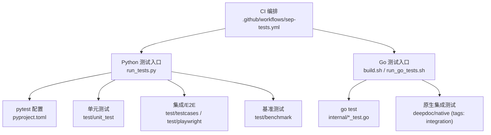
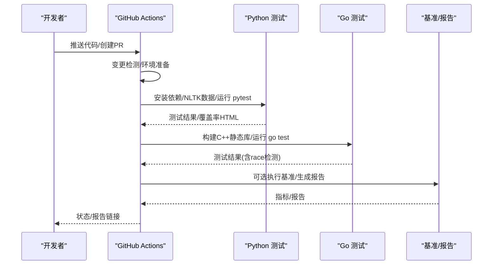
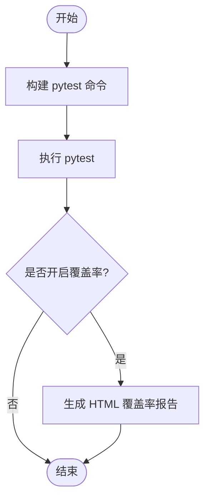
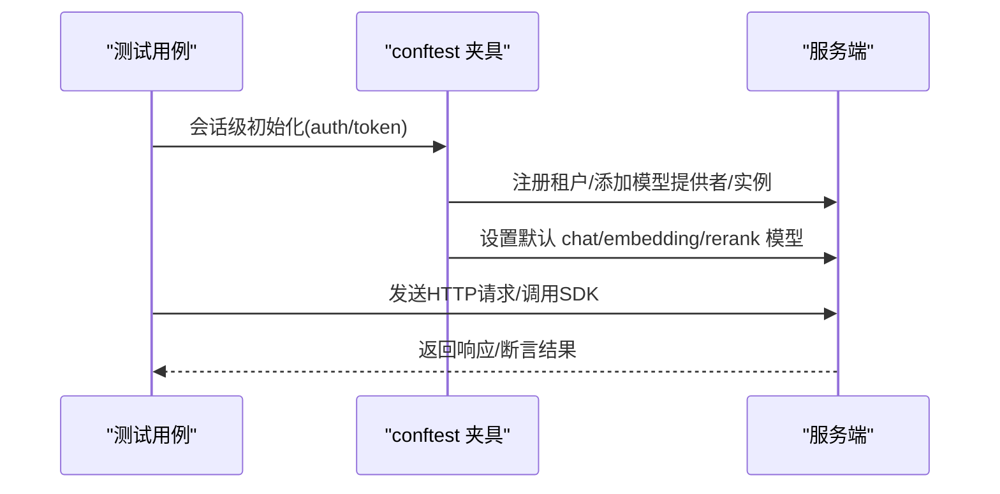
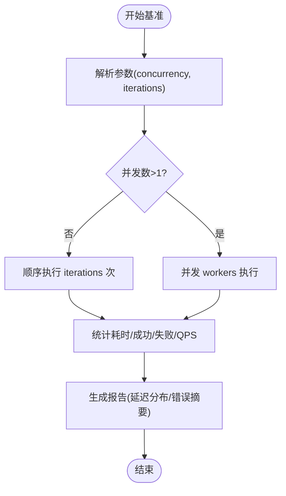
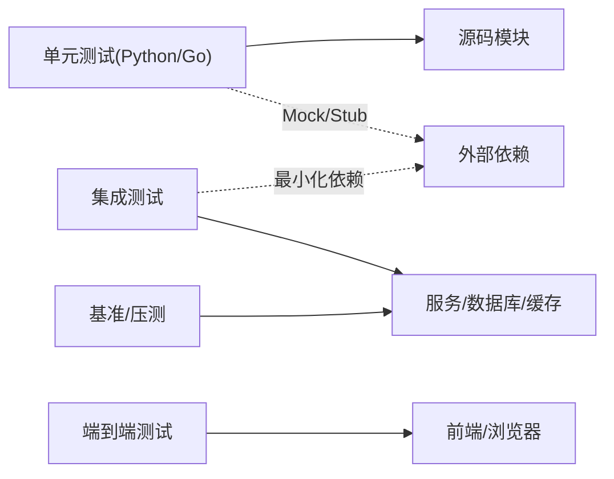

# 测试策略

<cite>
**本文引用的文件**
- [run_tests.py](file://run_tests.py)
- [pyproject.toml](file://pyproject.toml)
- [build.sh](file://build.sh)
- [run_go_tests.sh](file://run_go_tests.sh)
- [internal/cli/benchmark.go](file://internal/cli/benchmark.go)
- [internal/cli/response.go](file://internal/cli/response.go)
- [test/testcases/conftest.py](file://test/testcases/conftest.py)
- [test/unit_test/conftest.py](file://test/unit_test/conftest.py)
- [test/unit_test/rag/svr/task_executor_refactor/conftest.py](file://test/unit_test/rag/svr/task_executor_refactor/conftest.py)
- [test/unit_test/common/test_misc_utils.py](file://test/unit_test/common/test_misc_utils.py)
- [test/benchmark/report.py](file://test/benchmark/report.py)
- [.github/workflows/sep-tests.yml](file:.github/workflows/sep-tests.yml)
</cite>

## 目录
1. [简介](#简介)
2. [项目结构](#项目结构)
3. [核心组件](#核心组件)
4. [架构总览](#架构总览)
5. [详细组件分析](#详细组件分析)
6. [依赖关系分析](#依赖关系分析)
7. [性能考量](#性能考量)
8. [故障排查指南](#故障排查指南)
9. [结论](#结论)
10. [附录](#附录)

## 简介
本测试策略面向 RAGFlow 的混合技术栈（Python + Go），覆盖单元测试、集成测试、端到端测试与性能/稳定性测试，明确测试金字塔分层、工具选型与配置、Mock/Stub 隔离外部依赖的方法、基准/负载/稳定性测试实践、测试数据与环境管理，以及持续集成中的自动化流程与报告生成。目标是让不同背景的贡献者都能快速理解并执行一致的测试流程。

## 项目结构
RAGFlow 的测试体系按语言与层次组织：
- Python 侧
  - 单元测试：位于 test/unit_test，使用 pytest，支持覆盖率、并行、标记筛选等。
  - 集成/端到端：位于 test/testcases（REST/SDK/Web 接口）、test/playwright（浏览器 E2E）。
  - 基准测试：位于 test/benchmark，提供 CLI 与报告生成。
  - 统一入口：run_tests.py 封装 pytest 命令与选项。
- Go 侧
  - 单元测试：internal/* 下的 *_test.go，通过 go test 运行，支持 build tags 分级。
  - 原生 DeepDoc 集成测试：由构建脚本触发，带 race detector 的并发用例。
  - 基准能力：internal/cli/benchmark.go 提供并发/迭代压测与 QPS 统计。
- CI/CD
  - GitHub Actions 工作流 .github/workflows/sep-tests.yml 负责环境准备、变更检测、分阶段执行与产物归档。

**图示来源**
- [run_tests.py:182-235](file://run_tests.py#L182-L235)
- [pyproject.toml:315-353](file://pyproject.toml#L315-L353)
- [build.sh:647-687](file://build.sh#L647-L687)
- [run_go_tests.sh:1-31](file://run_go_tests.sh#L1-L31)
- [.github/workflows/sep-tests.yml:183-368](file:.github/workflows/sep-tests.yml#L183-L368)

**章节来源**
- [run_tests.py:113-235](file://run_tests.py#L113-L235)
- [pyproject.toml:195-353](file://pyproject.toml#L195-L353)
- [build.sh:647-687](file://build.sh#L647-L687)
- [run_go_tests.sh:1-31](file://run_go_tests.sh#L1-L31)
- [.github/workflows/sep-tests.yml:183-368](file:.github/workflows/sep-tests.yml#L183-L368)

## 核心组件
- Python 测试运行器
  - 统一入口 run_tests.py 封装 pytest 参数：覆盖率、并行、标记筛选、关键字过滤、配置文件加载等。
  - 默认目标为 test/unit_test，可通过命令行指定文件或目录。
- Pytest 配置
  - pyproject.toml 定义测试路径、收集规则、标记（p0-p3、smoke、auth、asyncio）、警告策略、异步模式、覆盖率源与排除项。
- Go 测试与分级
  - build.sh 提供 --test-integration、--test-e2e、--test-manual 等标签化运行；原生 DeepDoc 测试启用 race detector。
  - run_go_tests.sh 遍历 internal 包逐个执行 go test 并输出覆盖率。
- 基准与压测
  - internal/cli/benchmark.go 实现单并发/多并发基准，统计耗时、QPS、成功/失败计数。
  - test/benchmark/report.py 汇总指标并生成可读报告。
- 测试夹具与 Mock/Stub
  - test/testcases/conftest.py 注入 LLM/外部模块桩，自动注册租户模型实例，设置默认模型。
  - test/unit_test/conftest.py 自动准备 NLTK 数据，避免资源缺失导致测试失败。
  - task_executor_refactor conftest 提供 RecordingContext、资源清理等通用夹具。

**章节来源**
- [run_tests.py:182-235](file://run_tests.py#L182-L235)
- [pyproject.toml:315-353](file://pyproject.toml#L315-L353)
- [build.sh:647-687](file://build.sh#L647-L687)
- [run_go_tests.sh:1-31](file://run_go_tests.sh#L1-L31)
- [internal/cli/benchmark.go:36-168](file://internal/cli/benchmark.go#L36-L168)
- [test/benchmark/report.py:83-103](file://test/benchmark/report.py#L83-L103)
- [test/testcases/conftest.py:94-337](file://test/testcases/conftest.py#L94-L337)
- [test/unit_test/conftest.py:17-68](file://test/unit_test/conftest.py#L17-L68)
- [test/unit_test/rag/svr/task_executor_refactor/conftest.py:202-245](file://test/unit_test/rag/svr/task_executor_refactor/conftest.py#L202-L245)

## 架构总览
下图展示从代码提交到测试执行的流水线，涵盖 Python 与 Go 两条路径，以及基准与报告环节。

**图示来源**
- [.github/workflows/sep-tests.yml:183-368](file:.github/workflows/sep-tests.yml#L183-L368)
- [build.sh:647-687](file://build.sh#L647-L687)
- [run_tests.py:237-283](file://run_tests.py#L237-L283)

## 详细组件分析

### 单元测试（Python）
- 执行方式
  - 通过 run_tests.py 调用 pytest，支持覆盖率、并行、标记筛选、关键字过滤。
  - 默认扫描 test/unit_test，可指定子目录或文件。
- 关键配置
  - pyproject.toml 中定义 markers（p0-p3、smoke、auth、asyncio）、异步模式、警告策略、覆盖率源与排除项。
- 典型场景
  - 装饰器行为验证（如 once() 仅执行一次且异常后允许重试）。
  - 资源清理：确保事件循环、套接字、未等待协程在测试后正确释放。

**图示来源**
- [run_tests.py:182-235](file://run_tests.py#L182-L235)
- [run_tests.py:237-283](file://run_tests.py#L237-L283)
- [pyproject.toml:315-353](file://pyproject.toml#L315-L353)

**章节来源**
- [run_tests.py:182-283](file://run_tests.py#L182-L283)
- [pyproject.toml:315-353](file://pyproject.toml#L315-L353)
- [test/unit_test/common/test_misc_utils.py:541-576](file://test/unit_test/common/test_misc_utils.py#L541-L576)
- [test/unit_test/rag/svr/task_executor_refactor/conftest.py:202-245](file://test/unit_test/rag/svr/task_executor_refactor/conftest.py#L202-L245)

### 单元测试（Go）
- 执行方式
  - 通过 build.sh 的 --test/--test-integration/--test-e2e/--test-manual 等标签控制测试范围。
  - run_go_tests.sh 遍历 internal 包执行 go test，输出覆盖率。
- 原生集成测试
  - 使用 cgo/static/integration/fetch_testdata 标签，支持 race detector 并发测试。
- 建议
  - 对涉及 CGO 的包优先使用 build.sh 提供的标签化入口，保证依赖一致。

**章节来源**
- [build.sh:647-687](file://build.sh#L647-L687)
- [run_go_tests.sh:1-31](file://run_go_tests.sh#L1-L31)

### 集成测试与端到端测试
- REST/SDK/Web 集成测试
  - test/testcases 下按 API 类型组织，conftest.py 自动完成租户初始化、模型提供者/实例注册、默认模型设置。
  - 支持 --level 选择测试级别（p1/p2/p3），便于在 PR 与定时任务中差异化执行。
- 浏览器 E2E
  - test/playwright 提供认证与业务流用例，配合 helpers 与 fixtures 复用登录、选择器等逻辑。
- 数据与环境
  - 通过环境变量 HOST_ADDRESS、API_PROXY_SCHEME 等切换后端代理（Go/Python/Web）。
  - CI 中动态分配端口、启动 compose 服务，确保多实例并行不冲突。

**图示来源**
- [test/testcases/conftest.py:130-337](file://test/testcases/conftest.py#L130-L337)
- [.github/workflows/sep-tests.yml:540-799](file:.github/workflows/sep-tests.yml#L540-L799)

**章节来源**
- [test/testcases/conftest.py:94-337](file://test/testcases/conftest.py#L94-L337)
- [.github/workflows/sep-tests.yml:540-799](file:.github/workflows/sep-tests.yml#L540-L799)

### Mock 与 Stub 策略
- Python
  - 通过 monkeypatch/sys.modules 替换第三方模块（如 rag.llm、common.*），避免真实网络/模型调用。
  - 使用 pytest-mock 或 unittest.mock 进行方法级 Mock；异步场景使用 AsyncMock。
  - 资源清理夹具确保事件循环、套接字、未 await 协程被正确关闭，防止 ResourceWarning。
- Go
  - 使用标准 testing 包与 mock 库（如 testify/mock）隔离外部依赖；对 CGO 依赖通过 build tags 控制。
- 最佳实践
  - 将 Stub 集中在 conftest 或测试包内，避免污染生产代码。
  - 对外部依赖的契约变化，应在集成层补充回归用例。

**章节来源**
- [test/testcases/conftest.py:22-92](file://test/testcases/conftest.py#L22-L92)
- [test/unit_test/rag/svr/task_executor_refactor/conftest.py:202-245](file://test/unit_test/rag/svr/task_executor_refactor/conftest.py#L202-L245)

### 性能测试与压力测试
- 基准测试（Benchmark）
  - internal/cli/benchmark.go 支持单并发与多并发执行，统计 Duration、QPS、Success/Failure。
  - 输出格式兼容多种响应类型，便于统一度量。
- 负载与稳定性
  - 通过调整 concurrency/iterations 模拟高负载；结合 CI 的并行 runner 做稳定性回归。
  - test/benchmark/report.py 汇总延迟分布（avg/min/p50/p90/p95）与错误信息，生成可读报告。
- 建议
  - 将基准纳入 nightly 任务，跟踪趋势；对关键路径增加阈值告警。

**图示来源**
- [internal/cli/benchmark.go:36-168](file://internal/cli/benchmark.go#L36-L168)
- [internal/cli/response.go:668-721](file://internal/cli/response.go#L668-L721)
- [test/benchmark/report.py:83-103](file://test/benchmark/report.py#L83-L103)

**章节来源**
- [internal/cli/benchmark.go:36-168](file://internal/cli/benchmark.go#L36-L168)
- [internal/cli/response.go:668-721](file://internal/cli/response.go#L668-L721)
- [test/benchmark/report.py:83-103](file://test/benchmark/report.py#L83-L103)

### 测试数据管理与环境搭建
- 测试数据
  - NLTK 数据：test/unit_test/conftest.py 自动下载/复用 punkt_tab、punkt、wordnet，避免 CI 网络限制。
  - 固定样本：fixtures 目录存放 JSON 等样例数据，用于稳定断言。
- 环境搭建
  - CI 中根据变更检测决定运行集；动态分配端口避免冲突；compose profiles 控制服务组合。
  - 环境变量 API_PROXY_SCHEME 切换后端代理（Go/Python/Web），HOST_ADDRESS 指向服务地址。
- 本地开发
  - 使用 uv sync 安装依赖；run_tests.py 便捷执行；必要时手动 provision NLTK 数据。

**章节来源**
- [test/unit_test/conftest.py:17-68](file://test/unit_test/conftest.py#L17-L68)
- [.github/workflows/sep-tests.yml:183-368](file:.github/workflows/sep-tests.yml#L183-L368)
- [.github/workflows/sep-tests.yml:540-799](file:.github/workflows/sep-tests.yml#L540-L799)

### 持续集成中的自动化测试与报告
- 变更检测
  - 根据 diff 判断是否运行 Go/Python/Web 测试，并决定是否包含 native deepdoc 测试。
- 执行矩阵
  - 并行执行 Go 与 Python 测试；Go 侧先构建 C++ 静态库再运行测试，避免链接失败。
- 产物与报告
  - Python：pytest 输出 + coverage HTML；Go：go test 输出；基准：report.py 生成指标。
  - CI 步骤记录日志与退出码，便于定位失败原因。

**章节来源**
- [.github/workflows/sep-tests.yml:183-368](file:.github/workflows/sep-tests.yml#L183-L368)
- [.github/workflows/sep-tests.yml:405-494](file:.github/workflows/sep-tests.yml#L405-L494)

## 依赖关系分析
- 测试与源码耦合
  - Python 测试通过 pytest 收集规则与 conftest 夹具与源码解耦；Go 测试通过包粒度与 build tags 控制耦合面。
- 外部依赖隔离
  - 通过 Stub/Mock 屏蔽 LLM、存储、网络等外部系统；集成测试仅在受控环境中连接真实服务。
- 潜在循环依赖
  - 测试夹具应避免反向导入生产模块的全局状态；使用局部 patch 与上下文管理降低耦合。

[此图为概念性依赖图，无需“图示来源”]

## 性能考量
- 测试执行效率
  - Python：使用 pytest-xdist 并行；合理划分标记（p1/p2/p3）减少不必要用例。
  - Go：利用 go test 的并行度与 race detector 发现并发问题；对慢用例拆分。
- 资源占用
  - 严格清理事件循环、套接字、goroutine；避免内存泄漏导致的长时任务退化。
- 基准设计
  - 区分吞吐（QPS）与时延（P95/P99）；关注错误率与资源水位（CPU/内存/IO）。

[本节为通用指导，无需“章节来源”]

## 故障排查指南
- 常见问题
  - NLTK 数据缺失：确认 conftest 已下载/复用；CI 中检查权限与镜像缓存。
  - 端口冲突：CI 使用动态偏移与守护网络锁；本地需清理残留容器与端口占用。
  - 模型未绑定：集成测试 conftest 会尝试注册提供者/实例；若已存在则跳过并继续。
  - Go 链接失败：确保先构建 C++ 静态库再运行 go test。
- 定位方法
  - 使用 pytest -v 与 --tb=short 查看堆栈；Go 使用 -race 与 -v 输出。
  - 基准失败时检查 report 中的错误摘要与延迟分布。

**章节来源**
- [test/unit_test/conftest.py:17-68](file://test/unit_test/conftest.py#L17-L68)
- [.github/workflows/sep-tests.yml:540-799](file:.github/workflows/sep-tests.yml#L540-L799)
- [test/testcases/conftest.py:205-337](file://test/testcases/conftest.py#L205-L337)
- [build.sh:647-687](file://build.sh#L647-L687)

## 结论
RAGFlow 的测试体系以 pytest 与 go test 为核心，辅以标签化分级、丰富的夹具与 Mock 机制，以及完善的 CI 编排与基准报告。建议在以下方面持续改进：
- 扩大基准覆盖的关键路径，建立趋势监控与阈值告警。
- 完善端到端用例的场景覆盖，尤其是跨通道与复杂工作流。
- 强化测试数据版本化管理与快照对比，提升回归稳定性。

[本节为总结，无需“章节来源”]

## 附录
- 常用命令
  - Python 单元测试：python run_tests.py [--coverage] [--parallel] [-m <markers>] [-k <keyword>]
  - Go 测试：./build.sh --test 或 ./build.sh --test-integration
  - 基准测试：参考 internal/cli/benchmark.go 与 test/benchmark/report.py
- 参考文件
  - 测试入口与配置：run_tests.py、pyproject.toml
  - Go 测试与原生集成：build.sh、run_go_tests.sh
  - 基准与报告：internal/cli/benchmark.go、internal/cli/response.go、test/benchmark/report.py
  - 夹具与数据：test/testcases/conftest.py、test/unit_test/conftest.py
  - CI 编排：.github/workflows/sep-tests.yml

[本节为索引，无需“章节来源”]