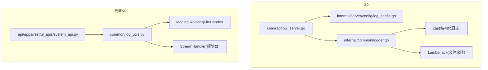
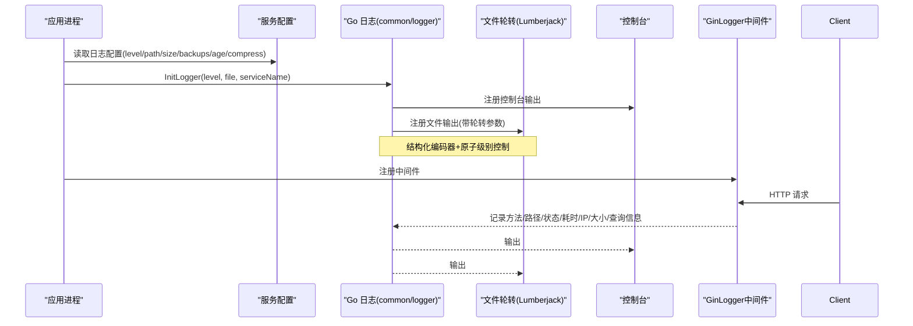
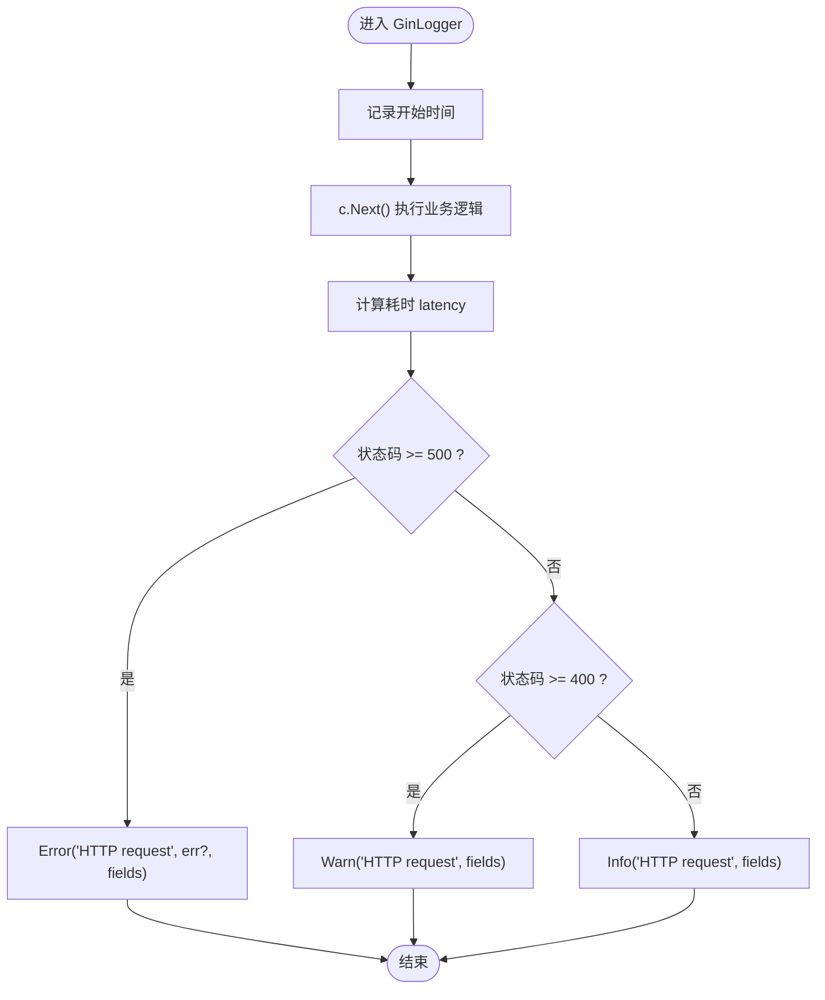
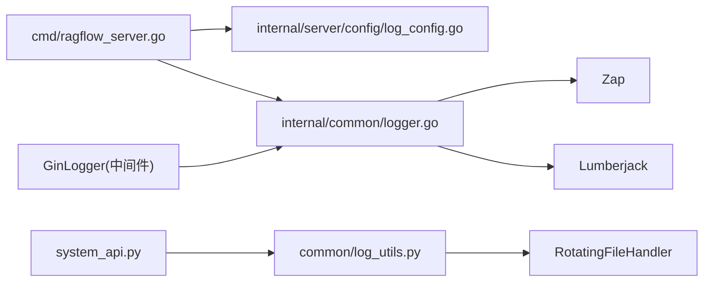

# 日志系统

<cite>
**本文引用的文件**
- [internal/common/logger.go](file://internal/common/logger.go)
- [internal/server/config/log_config.go](file://internal/server/config/log_config.go)
- [cmd/ragflow_server.go](file://cmd/ragflow_server.go)
- [common/log_utils.py](file://common/log_utils.py)
- [api/apps/restful_apis/system_api.py](file://api/apps/restful_apis/system_api.py)
</cite>

## 目录
1. [简介](#简介)
2. [项目结构](#项目结构)
3. [核心组件](#核心组件)
4. [架构总览](#架构总览)
5. [详细组件分析](#详细组件分析)
6. [依赖关系分析](#依赖关系分析)
7. [性能考虑](#性能考虑)
8. [故障排查指南](#故障排查指南)
9. [结论](#结论)
10. [附录](#附录)

## 简介
本文件系统性说明 RAGFlow 的日志系统，覆盖 Go 与 Python 双语言实现：
- Go 侧基于 Zap 的结构化日志，支持动态级别、控制台与文件双写、按大小/数量/天数轮转（Lumberjack），以及统一的 HTTP 请求访问日志中间件。
- Python 侧使用标准库 logging + RotatingFileHandler，提供进程级日志文件轮转、控制台输出、按包名设置日志级别的能力，并暴露运行时修改日志级别的接口。

文档同时给出日志格式规范、字段定义、错误堆栈记录方式、查询与分析建议及性能优化要点。

## 项目结构
Go 日志相关的关键位置：
- 初始化与全局 Logger 管理：internal/common/logger.go
- 配置解析与默认值：internal/server/config/log_config.go
- 服务启动时初始化与重配：cmd/ragflow_server.go
Python 日志相关的关键位置：
- 根日志器初始化与轮转：common/log_utils.py
- 运行时调整日志级别 API：api/apps/restful_apis/system_api.py

图表来源
- [cmd/ragflow_server.go:250-360](file://cmd/ragflow_server.go#L250-L360)
- [internal/server/config/log_config.go:38-103](file://internal/server/config/log_config.go#L38-L103)
- [internal/common/logger.go:91-173](file://internal/common/logger.go#L91-L173)
- [common/log_utils.py:27-73](file://common/log_utils.py#L27-L73)
- [api/apps/restful_apis/system_api.py:447-462](file://api/apps/restful_apis/system_api.py#L447-L462)

章节来源
- [cmd/ragflow_server.go:250-360](file://cmd/ragflow_server.go#L250-L360)
- [internal/server/config/log_config.go:38-103](file://internal/server/config/log_config.go#L38-L103)
- [internal/common/logger.go:91-173](file://internal/common/logger.go#L91-L173)
- [common/log_utils.py:27-73](file://common/log_utils.py#L27-L73)
- [api/apps/restful_apis/system_api.py:447-462](file://api/apps/restful_apis/system_api.py#L447-L462)

## 核心组件
- Go 日志核心
  - 全局 Logger/Sugar：统一入口，支持 Info/Warn/Error/Fatal/Debug 等层级；支持运行时切换级别。
  - 编码器与字段：时间戳、级别、服务名、调用者、消息、堆栈等键名固定，便于集中采集。
  - 文件输出：通过 Lumberjack 实现按大小、备份数、保留天数的轮转，可压缩。
  - HTTP 中间件：GinLogger 记录每次请求的方法、路径、状态码、耗时、客户端 IP、响应体大小、是否含查询串及其长度，不记录敏感 Query 明文。
- Python 日志核心
  - 根日志器：RotatingFileHandler 按大小与备份数轮转，同时输出到控制台。
  - 包级日志级别：支持通过环境变量或运行时接口为特定包设置级别。
  - 异常辅助：log_exception 统一记录异常堆栈并透传。

章节来源
- [internal/common/logger.go:65-173](file://internal/common/logger.go#L65-L173)
- [internal/common/logger.go:242-314](file://internal/common/logger.go#L242-L314)
- [common/log_utils.py:27-105](file://common/log_utils.py#L27-L105)

## 架构总览
Go 端日志在应用启动时完成初始化，随后所有模块通过 common 包提供的统一函数写入日志；HTTP 请求经 GinLogger 中间件统一记录访问日志。Python 端在进程启动时初始化根日志器，业务代码通过标准 logging 写入，API 层暴露运行时调整日志级别的接口。

图表来源
- [cmd/ragflow_server.go:250-360](file://cmd/ragflow_server.go#L250-L360)
- [internal/server/config/log_config.go:38-103](file://internal/server/config/log_config.go#L38-L103)
- [internal/common/logger.go:91-173](file://internal/common/logger.go#L91-L173)
- [internal/common/logger.go:242-314](file://internal/common/logger.go#L242-L314)

## 详细组件分析

### Go 日志初始化与级别管理
- 级别解析与映射：支持 debug/info/warn(warning)/error/fatal/panic，未知级别回退至 info。
- 运行时级别：提供 GetLogLevel/SetLogLevel/IsDebugEnabled，支持热更新。
- 编码器字段：
  - timestamp：固定时间格式“YYYY-MM-DD HH:mm:ss.sss±HH:MM”，毫秒精度与时区偏移。
  - level：小写级别字符串。
  - service：服务名称。
  - caller：短调用者路径。
  - msg：消息。
  - stacktrace：错误堆栈键名。
- 文件轮转：MaxSize(MB)、MaxBackups(个数)、MaxAge(天数)，默认分别为 100/10/30；Compress 由调用方传入。

章节来源
- [internal/common/logger.go:65-127](file://internal/common/logger.go#L65-L127)
- [internal/common/logger.go:129-173](file://internal/common/logger.go#L129-L173)
- [internal/common/logger.go:222-240](file://internal/common/logger.go#L222-L240)

### Go 日志文件轮转配置
- 配置来源：service_conf.yaml 的 log.* 项（level/format/path/max_size/max_backups/max_age/compress）。
- 默认值：当未显式设置时，内部会赋予合理默认值；Path 为空时使用各二进制内置文件名。
- 行为：达到 MaxSize 触发轮转，保留最多 MaxBackups 个历史文件，超过 MaxAge 清理旧文件；可选 gzip 压缩。

章节来源
- [internal/server/config/log_config.go:38-103](file://internal/server/config/log_config.go#L38-L103)
- [internal/common/logger.go:129-151](file://internal/common/logger.go#L129-L151)

### Go HTTP 请求日志中间件（GinLogger）
- 记录字段：status、method、path、latency、client_ip、size、has_query、query_len。
- 安全策略：不记录原始 Query 字符串，仅记录是否存在及长度，避免泄露 OAuth/SAML/签名等敏感参数。
- 级别选择：5xx → Error（附带错误字段），4xx → Warn，其他 → Info。
- 错误处理：若存在 c.Errors，非 5xx 以字符串 error 字段附加；5xx 走 Error(msg, err, fields...) 统一结构化。

图表来源
- [internal/common/logger.go:242-314](file://internal/common/logger.go#L242-L314)

章节来源
- [internal/common/logger.go:242-314](file://internal/common/logger.go#L242-L314)

### Python 日志初始化与轮转
- 根日志器：RotatingFileHandler 按 10MB 切分，保留 5 个备份；同时输出到控制台。
- 包级级别：通过环境变量 LOG_LEVELS 或运行时 set_log_level 为指定包设置级别，默认 root=INFO，peewee/pdfminer=WARNING。
- 异常辅助：log_exception 记录完整堆栈并抛出。

章节来源
- [common/log_utils.py:27-73](file://common/log_utils.py#L27-L73)
- [common/log_utils.py:76-105](file://common/log_utils.py#L76-L105)

### Python 运行时调整日志级别
- 提供 REST 接口接收 pkg_name 与 level，调用 set_log_level 动态生效。
- 用于线上快速降低噪音或提升某模块详细度，无需重启。

章节来源
- [api/apps/restful_apis/system_api.py:447-462](file://api/apps/restful_apis/system_api.py#L447-L462)

### 启动流程中的日志初始化与重配
- 首次临时初始化：根据命令行参数决定级别与文件名。
- 加载配置后：从 service_conf.yaml 读取 log.* 配置，必要时重新初始化以应用新的级别与轮转参数。
- 服务名与日志文件：按模式生成 serverName，并据此命名日志文件。

章节来源
- [cmd/ragflow_server.go:250-360](file://cmd/ragflow_server.go#L250-L360)

## 依赖关系分析
- Go 侧
  - cmd/ragflow_server.go 依赖 internal/server/config/log_config.go 解析配置，再调用 internal/common/logger.go 初始化全局 Logger。
  - internal/common/logger.go 依赖 Zap（结构化日志）与 Lumberjack（文件轮转）。
  - GinLogger 作为 Gin 中间件被路由层挂载，统一输出访问日志。
- Python 侧
  - common/log_utils.py 提供统一初始化与工具函数，业务模块直接 import logging 使用。
  - api/apps/restful_apis/system_api.py 暴露运行时调整日志级别的 HTTP 接口。

图表来源
- [cmd/ragflow_server.go:250-360](file://cmd/ragflow_server.go#L250-L360)
- [internal/server/config/log_config.go:38-103](file://internal/server/config/log_config.go#L38-L103)
- [internal/common/logger.go:91-173](file://internal/common/logger.go#L91-L173)
- [common/log_utils.py:27-73](file://common/log_utils.py#L27-L73)
- [api/apps/restful_apis/system_api.py:447-462](file://api/apps/restful_apis/system_api.py#L447-L462)

章节来源
- [cmd/ragflow_server.go:250-360](file://cmd/ragflow_server.go#L250-L360)
- [internal/server/config/log_config.go:38-103](file://internal/server/config/log_config.go#L38-L103)
- [internal/common/logger.go:91-173](file://internal/common/logger.go#L91-L173)
- [common/log_utils.py:27-73](file://common/log_utils.py#L27-L73)
- [api/apps/restful_apis/system_api.py:447-462](file://api/apps/restful_apis/system_api.py#L447-L462)

## 性能考虑
- 日志级别
  - 生产环境建议使用 info 或 warn；仅在定位问题时临时调至 debug。
  - Go 支持运行时 SetLogLevel，可在线切换，减少重启成本。
- 输出目标
  - 同时输出到控制台与文件时，注意磁盘 IO；在高吞吐场景可适当增大轮转文件大小与备份数，减少频繁落盘。
- 结构化字段
  - 避免在高频路径中记录过大字段（如完整请求体/响应体）；HTTP 中间件已规避记录 Query 明文。
- 轮转策略
  - MaxSize 与 MaxBackups 需结合磁盘容量与合规要求评估；MaxAge 确保长期运行下的空间回收。
- Python 包级级别
  - 对第三方库（如 peewee/pdfminer）默认 WARNING，避免噪声；可按需单独调低。

[本节为通用指导，不直接分析具体文件]

## 故障排查指南
- 无法写入日志文件
  - 检查 logs 目录权限与磁盘空间；确认 Path 与 Filename 配置正确。
  - 确认 Lumberjack 轮转参数（MaxSize/MaxBackups/MaxAge）合理。
- 日志级别不生效
  - Go：确认 InitLogger 已按最终配置重新初始化；可通过 GetLogLevel 校验当前级别。
  - Python：确认 set_log_level 调用成功，或通过 get_log_levels 查看当前包级别。
- HTTP 访问日志缺失
  - 确认 GinLogger 中间件已注册到路由链；检查状态码分支是否符合预期。
- 敏感信息泄露风险
  - 确认未记录 Query 明文；如需记录，请自行脱敏后再写入。
- 异常堆栈未输出
  - Go：使用 Error(msg, err, fields...) 以便自动附带结构化错误；必要时开启 Debug 级别。
  - Python：使用 log_exception 记录完整堆栈。

章节来源
- [internal/common/logger.go:182-240](file://internal/common/logger.go#L182-L240)
- [internal/common/logger.go:242-314](file://internal/common/logger.go#L242-L314)
- [common/log_utils.py:76-105](file://common/log_utils.py#L76-L105)

## 结论
本项目在 Go 与 Python 两端提供了完善且一致的日志能力：Go 侧采用高性能结构化日志与灵活的轮转策略，并提供安全的 HTTP 访问日志中间件；Python 侧通过标准库实现稳定可靠的文件轮转与包级级别控制，并支持运行时调整。配合合理的级别与轮转配置，可在保证可观测性的同时兼顾性能与存储成本。

[本节为总结性内容，不直接分析具体文件]

## 附录

### 日志格式规范（Go）
- 时间戳：YYYY-MM-DD HH:mm:ss.sss±HH:MM（毫秒精度与时区偏移）
- 级别：小写字符串（debug/info/warn/error/fatal/panic）
- 服务名：service
- 调用者：caller（短路径）
- 消息：msg
- 堆栈：stacktrace（错误时附带）
- HTTP 访问日志关键字段：status、method、path、latency、client_ip、size、has_query、query_len

章节来源
- [internal/common/logger.go:108-127](file://internal/common/logger.go#L108-L127)
- [internal/common/logger.go:269-278](file://internal/common/logger.go#L269-L278)

### 日志格式规范（Python）
- 默认格式：包含时间、级别、进程号与消息
- 文件轮转：单文件最大 10MB，保留 5 个备份
- 包级级别：可通过环境变量或运行时接口设置

章节来源
- [common/log_utils.py:27-73](file://common/log_utils.py#L27-L73)

### 常用过滤条件与查询建议
- 按级别过滤：level=error 或 level=warn
- 按状态码过滤：status>=500 或 status>=400
- 按路径过滤：path=/api/v1/...
- 按耗时过滤：latency > 阈值（秒）
- 按客户端 IP 过滤：client_ip 精确匹配或前缀匹配
- 按服务名过滤：service=api_server_* 或 admin_server_*
- 排除 Query 明文：利用 has_query/query_len 判断是否有查询参数，但不记录其内容

[本节为通用实践建议，不直接分析具体文件]