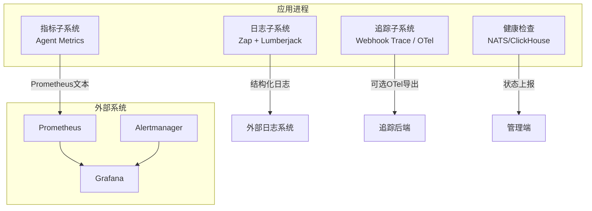
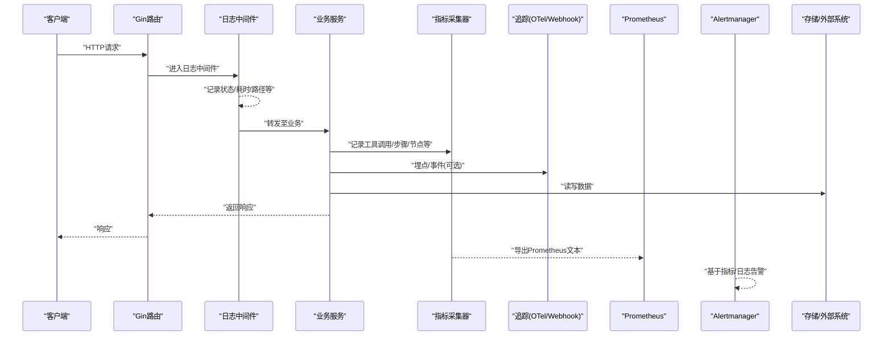
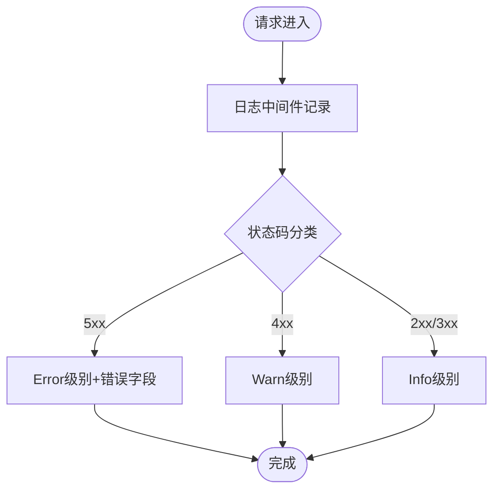
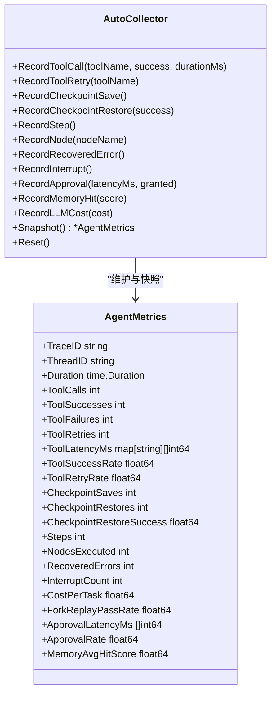
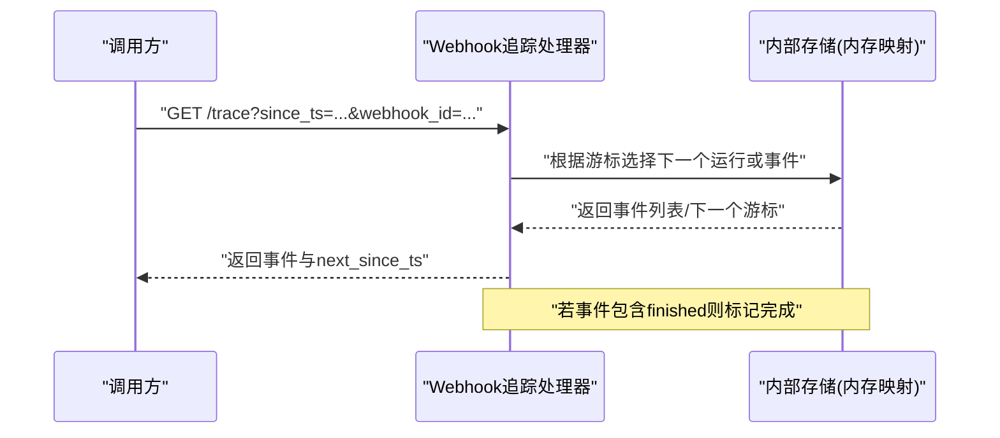
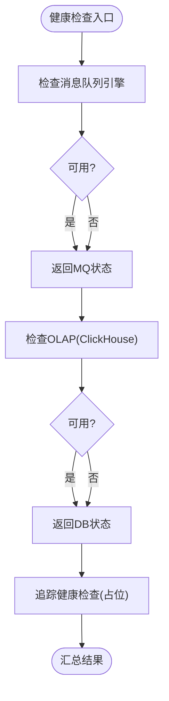
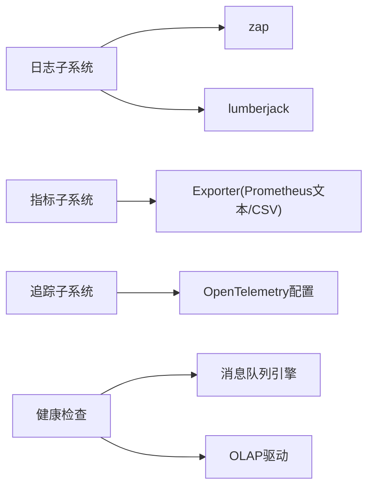

# 监控与日志

<cite>
**本文引用的文件**
- [internal/common/logger.go](file://internal/common/logger.go)
- [internal/server/config/log_config.go](file://internal/server/config/log_config.go)
- [internal/server/config/open_telemetry_config.go](file://internal/server/config/open_telemetry_config.go)
- [internal/harness/metrics/metrics.go](file://internal/harness/metrics/metrics.go)
- [internal/harness/metrics/exporter.go](file://internal/harness/metrics/exporter.go)
- [internal/handler/agent_webhook_trace.go](file://internal/handler/agent_webhook_trace.go)
- [internal/admin/service.go](file://internal/admin/service.go)
- [web/src/pages/admin/monitoring.tsx](file://web/src/pages/admin/monitoring.tsx)
</cite>

## 目录
1. [简介](#简介)
2. [项目结构](#项目结构)
3. [核心组件](#核心组件)
4. [架构总览](#架构总览)
5. [详细组件分析](#详细组件分析)
6. [依赖关系分析](#依赖关系分析)
7. [性能考量](#性能考量)
8. [故障排查指南](#故障排查指南)
9. [结论](#结论)
10. [附录](#附录)

## 简介
本文件面向RAGFlow的监控与日志系统，系统性说明日志收集、格式化、存储与分析流程；定义并解释性能监控指标（系统资源使用、API响应时间、错误率等）的定义与采集方法；覆盖健康检查机制、告警规则配置、监控面板展示；阐述分布式追踪的实现（请求链路跟踪、性能瓶颈分析）；提供监控数据导出与集成方法（Prometheus、Grafana对接），以及日志分析与故障诊断的最佳实践。

## 项目结构
本项目在Go侧实现了统一的日志、指标与追踪能力：
- 日志子系统：基于zap的结构化日志，支持控制台与可轮转文件输出，提供HTTP访问日志中间件。
- 指标子系统：针对Agent执行过程的关键指标采集与聚合，并提供Prometheus文本格式与CSV导出。
- 追踪子系统：Webhook事件追踪与OpenTelemetry配置项，便于接入外部追踪后端。
- 健康检查：服务就绪性检查（消息队列、OLAP等）。
- 前端监控面板：通过内嵌iframe展示告警页面。

图表来源
- [internal/common/logger.go:91-173](file://internal/common/logger.go#L91-L173)
- [internal/harness/metrics/exporter.go:19-65](file://internal/harness/metrics/exporter.go#L19-L65)
- [internal/server/config/open_telemetry_config.go:37-88](file://internal/server/config/open_telemetry_config.go#L37-L88)
- [internal/admin/service.go:1218-1260](file://internal/admin/service.go#L1218-L1260)

章节来源
- [internal/common/logger.go:91-173](file://internal/common/logger.go#L91-L173)
- [internal/server/config/log_config.go:21-46](file://internal/server/config/log_config.go#L21-L46)
- [internal/harness/metrics/metrics.go:15-73](file://internal/harness/metrics/metrics.go#L15-L73)
- [internal/harness/metrics/exporter.go:19-79](file://internal/harness/metrics/exporter.go#L19-L79)
- [internal/server/config/open_telemetry_config.go:37-88](file://internal/server/config/open_telemetry_config.go#L37-L88)
- [internal/admin/service.go:1218-1260](file://internal/admin/service.go#L1218-L1260)
- [web/src/pages/admin/monitoring.tsx:4-15](file://web/src/pages/admin/monitoring.tsx#L4-L15)

## 核心组件
- 日志子系统
  - 统一初始化：支持级别控制、JSON格式、控制台与轮转文件双写、按大小/数量/天数轮转与压缩。
  - HTTP访问日志：基于Gin中间件，记录状态码、方法、路径、耗时、客户端IP、响应体大小、是否含查询串及长度，避免记录敏感查询参数。
  - 运行时日志级别切换：支持动态调整日志级别。
- 指标子系统
  - Agent执行指标：工具调用次数/成功率/重试率、检查点保存/恢复、步骤与节点执行计数、中断次数、成本估算、审批延迟等。
  - 指标导出：Prometheus文本格式与单行CSV，便于接入Prometheus或批处理分析。
- 追踪子系统
  - Webhook事件追踪：以游标方式增量拉取事件，支持“finished”结束标记，事件带时间戳用于排序与过滤。
  - OpenTelemetry配置：主机、端口、安全传输、采样率、标准输出开关、启用开关。
- 健康检查
  - 消息队列引擎存活检查、OLAP（ClickHouse）状态检查、追踪模块状态占位。
- 前端监控面板
  - 内嵌Alertmanager告警页面，便于运维快速查看告警。

章节来源
- [internal/common/logger.go:91-173](file://internal/common/logger.go#L91-L173)
- [internal/common/logger.go:242-312](file://internal/common/logger.go#L242-L312)
- [internal/server/config/log_config.go:21-46](file://internal/server/config/log_config.go#L21-L46)
- [internal/harness/metrics/metrics.go:15-73](file://internal/harness/metrics/metrics.go#L15-L73)
- [internal/harness/metrics/exporter.go:19-79](file://internal/harness/metrics/exporter.go#L19-L79)
- [internal/handler/agent_webhook_trace.go:30-44](file://internal/handler/agent_webhook_trace.go#L30-L44)
- [internal/server/config/open_telemetry_config.go:37-88](file://internal/server/config/open_telemetry_config.go#L37-L88)
- [internal/admin/service.go:1218-1260](file://internal/admin/service.go#L1218-L1260)
- [web/src/pages/admin/monitoring.tsx:4-15](file://web/src/pages/admin/monitoring.tsx#L4-L15)

## 架构总览
下图展示了从请求进入到日志、指标、追踪与健康检查的整体交互。

图表来源
- [internal/common/logger.go:242-312](file://internal/common/logger.go#L242-L312)
- [internal/harness/metrics/metrics.go:137-304](file://internal/harness/metrics/metrics.go#L137-L304)
- [internal/harness/metrics/exporter.go:19-65](file://internal/harness/metrics/exporter.go#L19-L65)
- [internal/server/config/open_telemetry_config.go:37-88](file://internal/server/config/open_telemetry_config.go#L37-L88)

## 详细组件分析

### 日志子系统
- 日志初始化与输出
  - 支持控制台与文件双写；文件采用轮转策略（大小、数量、天数、压缩）。
  - JSON格式字段包含时间、级别、服务名、调用位置、消息、堆栈等。
- HTTP访问日志
  - 中间件自动记录每次请求的状态码、方法、路径、耗时、客户端IP、响应大小、是否含查询串及长度。
  - 对5xx错误附加错误信息；对4xx及以上使用Warn级别；其他为Info。
  - 不记录原始查询串以避免泄露敏感信息。
- 日志级别与运行时控制
  - 支持运行时动态设置日志级别，便于问题定位时临时提升详细度。

图表来源
- [internal/common/logger.go:242-312](file://internal/common/logger.go#L242-L312)

章节来源
- [internal/common/logger.go:91-173](file://internal/common/logger.go#L91-L173)
- [internal/common/logger.go:242-312](file://internal/common/logger.go#L242-L312)
- [internal/server/config/log_config.go:21-46](file://internal/server/config/log_config.go#L21-L46)

### 指标子系统（Agent执行指标）
- 指标定义
  - 工具调用：总调用数、成功数、失败数、重试次数、成功率、重试率、各工具耗时直方图。
  - 检查点：保存次数、恢复次数、恢复成功率。
  - 执行：步骤数、节点执行数、恢复的错误数、中断次数。
  - 其他：任务成本估算、审批延迟、内存检索命中率等。
- 采集方式
  - 通过AutoCollector实现Graph回调接口，在步骤开始/结束、节点开始/结束、检查点保存/加载、中断等时机自动记录。
  - 提供Snapshot快照与Reset重置能力。
- 导出与集成
  - Prometheus文本格式：暴露计数器与仪表盘指标，便于Prometheus抓取。
  - CSV导出：单行CSV便于离线分析或写入时序数据库。

图表来源
- [internal/harness/metrics/metrics.go:15-73](file://internal/harness/metrics/metrics.go#L15-L73)
- [internal/harness/metrics/metrics.go:137-304](file://internal/harness/metrics/metrics.go#L137-L304)

章节来源
- [internal/harness/metrics/metrics.go:15-73](file://internal/harness/metrics/metrics.go#L15-L73)
- [internal/harness/metrics/metrics.go:137-304](file://internal/harness/metrics/metrics.go#L137-L304)
- [internal/harness/metrics/exporter.go:19-79](file://internal/harness/metrics/exporter.go#L19-L79)

### 追踪子系统（Webhook事件与OpenTelemetry）
- Webhook事件追踪
  - 以游标（since_ts）增量拉取事件，支持按webhook_id精确查询。
  - 事件携带时间戳，用于排序与过滤；当出现“finished”事件时标记完成。
  - 使用HMAC生成不可猜测的webhook_id，防止越权访问。
- OpenTelemetry配置
  - 支持主机、端口、安全传输、采样率、标准输出开关、启用开关。
  - 可通过配置项控制是否启用与如何连接外部追踪后端。

图表来源
- [internal/handler/agent_webhook_trace.go:46-83](file://internal/handler/agent_webhook_trace.go#L46-L83)
- [internal/handler/agent_webhook_trace.go:128-145](file://internal/handler/agent_webhook_trace.go#L128-L145)
- [internal/server/config/open_telemetry_config.go:37-88](file://internal/server/config/open_telemetry_config.go#L37-L88)

章节来源
- [internal/handler/agent_webhook_trace.go:30-44](file://internal/handler/agent_webhook_trace.go#L30-L44)
- [internal/handler/agent_webhook_trace.go:46-83](file://internal/handler/agent_webhook_trace.go#L46-L83)
- [internal/handler/agent_webhook_trace.go:128-145](file://internal/handler/agent_webhook_trace.go#L128-L145)
- [internal/server/config/open_telemetry_config.go:37-88](file://internal/server/config/open_telemetry_config.go#L37-L88)

### 健康检查机制
- 消息队列引擎（NATS）存活检查：获取消息队列引擎状态并返回服务名与状态。
- OLAP（ClickHouse）状态检查：驱动层提供Status接口，返回超时或正常状态。
- 追踪健康检查：当前为未知状态占位，预留扩展。

图表来源
- [internal/admin/service.go:1218-1260](file://internal/admin/service.go#L1218-L1260)

章节来源
- [internal/admin/service.go:1218-1260](file://internal/admin/service.go#L1218-L1260)

### 监控面板与告警
- 前端监控面板
  - 通过内嵌iframe直接展示Alertmanager告警页面，便于集中查看告警。
- 告警规则建议
  - 基于Prometheus指标：如工具失败率、步骤异常、中断频率、成本突增等。
  - 基于日志：如5xx比例、错误关键字、慢请求阈值等。
  - 结合Webhook追踪：长尾任务、未完成事件、频繁重试等。

章节来源
- [web/src/pages/admin/monitoring.tsx:4-15](file://web/src/pages/admin/monitoring.tsx#L4-L15)

## 依赖关系分析
- 日志子系统依赖zap与lumberjack，提供结构化日志与轮转文件。
- 指标子系统独立于Prometheus客户端，仅输出文本格式，降低耦合。
- 追踪子系统提供Webhook事件追踪与OTel配置项，便于接入外部追踪后端。
- 健康检查依赖消息队列与OLAP驱动，提供运行时可用性判断。

图表来源
- [internal/common/logger.go:91-173](file://internal/common/logger.go#L91-L173)
- [internal/harness/metrics/exporter.go:19-65](file://internal/harness/metrics/exporter.go#L19-L65)
- [internal/server/config/open_telemetry_config.go:37-88](file://internal/server/config/open_telemetry_config.go#L37-L88)
- [internal/admin/service.go:1218-1260](file://internal/admin/service.go#L1218-L1260)

章节来源
- [internal/common/logger.go:91-173](file://internal/common/logger.go#L91-L173)
- [internal/harness/metrics/exporter.go:19-65](file://internal/harness/metrics/exporter.go#L19-L65)
- [internal/server/config/open_telemetry_config.go:37-88](file://internal/server/config/open_telemetry_config.go#L37-L88)
- [internal/admin/service.go:1218-1260](file://internal/admin/service.go#L1218-L1260)

## 性能考量
- 日志
  - 使用JSON格式与结构化字段，便于高效解析与索引。
  - 文件轮转避免磁盘占用过大；合理设置MaxSize、MaxBackups、MaxAge。
  - 避免记录敏感查询参数，减少隐私风险与日志体积。
- 指标
  - 指标采集在回调中轻量记录，Snapshot按需计算比率，降低运行时开销。
  - 导出为Prometheus文本格式，适合高频抓取；CSV用于离线分析。
- 追踪
  - Webhook事件以游标增量拉取，避免全量扫描；finished标记便于快速结束。
  - OTel采样率可调，平衡观测粒度与开销。
- 健康检查
  - 定期探测关键依赖（消息队列、OLAP），及时发现问题。

[本节为通用指导，无需特定文件引用]

## 故障排查指南
- 日志分析
  - 关注5xx错误与对应错误字段；利用Gin中间件记录的status、method、path、latency进行定位。
  - 通过运行时日志级别切换提升详细度，复现问题后恢复默认级别。
- 指标分析
  - 工具失败率升高：检查下游依赖、重试策略与限流。
  - 步骤/节点执行数异常：检查图执行逻辑与中断情况。
  - 成本突增：结合LLM成本记录，优化调用策略。
- 追踪分析
  - 使用Webhook追踪拉取事件，观察长时间未结束的任务与频繁重试。
  - 结合OTel配置，将追踪数据导出到外部系统进行链路分析。
- 健康检查
  - 消息队列或OLAP不可用：检查连接配置与网络连通性。
  - 追踪健康检查为占位：待实现后纳入统一健康检查。

章节来源
- [internal/common/logger.go:242-312](file://internal/common/logger.go#L242-L312)
- [internal/harness/metrics/metrics.go:137-304](file://internal/harness/metrics/metrics.go#L137-L304)
- [internal/handler/agent_webhook_trace.go:128-145](file://internal/handler/agent_webhook_trace.go#L128-L145)
- [internal/admin/service.go:1218-1260](file://internal/admin/service.go#L1218-L1260)

## 结论
RAGFlow的监控与日志体系围绕结构化日志、轻量指标与可扩展追踪构建，兼顾生产环境的稳定性与可观测性。通过日志中间件、指标导出与Webhook追踪，配合健康检查与前端的告警面板，形成完整的可观测闭环。建议在生产环境中启用日志轮转、合理配置指标导出与告警规则，并结合OTel进行分布式链路追踪，以实现高效的故障定位与性能优化。

[本节为总结，无需特定文件引用]

## 附录
- 日志配置项
  - level：日志级别（debug/info/warn/error/fatal/panic）
  - format：日志格式（json/text，text保留）
  - path：日志文件路径（默认logs）
  - max_size：单文件大小（MB，默认100）
  - max_backups：保留备份数（默认10）
  - max_age：保留天数（默认30）
  - compress：是否压缩（默认false）
- 指标导出
  - Prometheus文本：工具调用、成功率、重试率、检查点、步骤、节点、中断等
  - CSV：单行CSV便于离线分析
- 追踪配置
  - host/port/secure：外部追踪后端地址与安全
  - sample_ratio：采样率
  - stdout：是否输出到标准输出
  - enable：是否启用

章节来源
- [internal/server/config/log_config.go:21-46](file://internal/server/config/log_config.go#L21-L46)
- [internal/harness/metrics/exporter.go:19-79](file://internal/harness/metrics/exporter.go#L19-L79)
- [internal/server/config/open_telemetry_config.go:37-88](file://internal/server/config/open_telemetry_config.go#L37-L88)