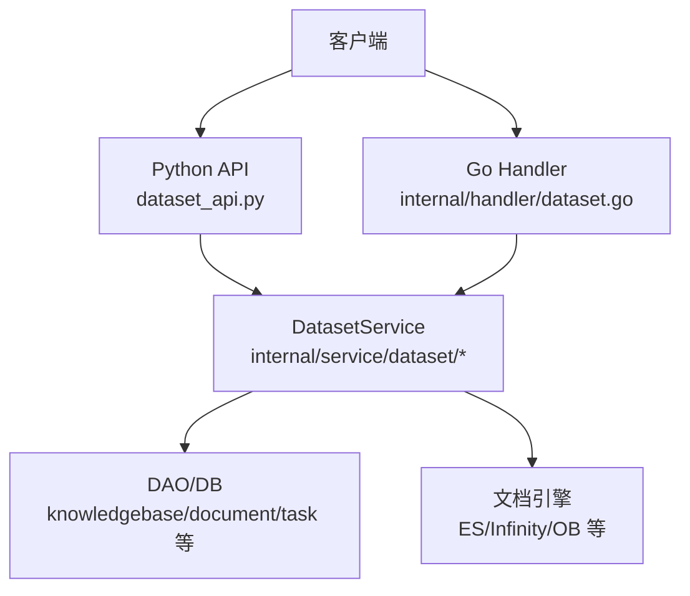
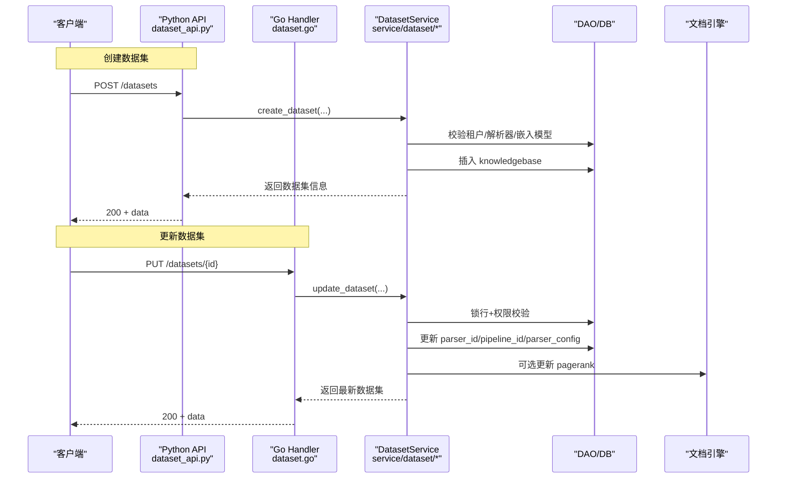
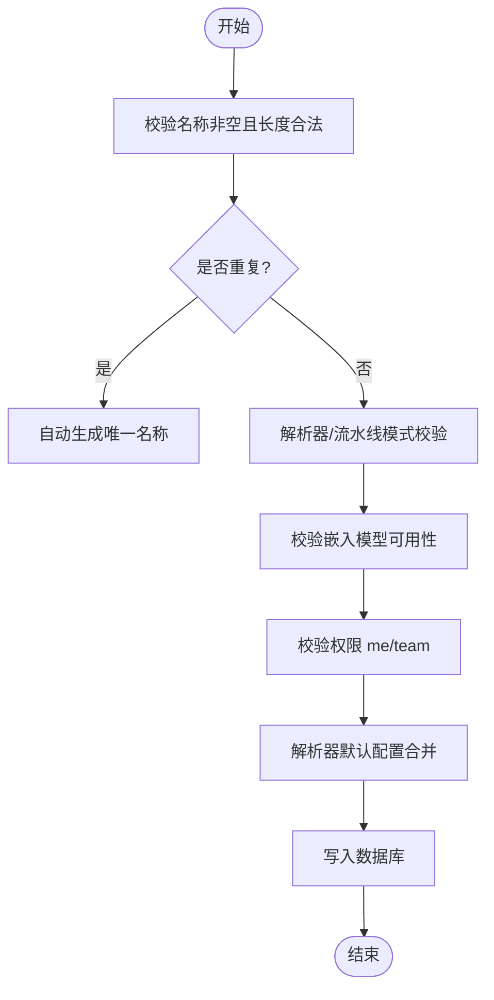
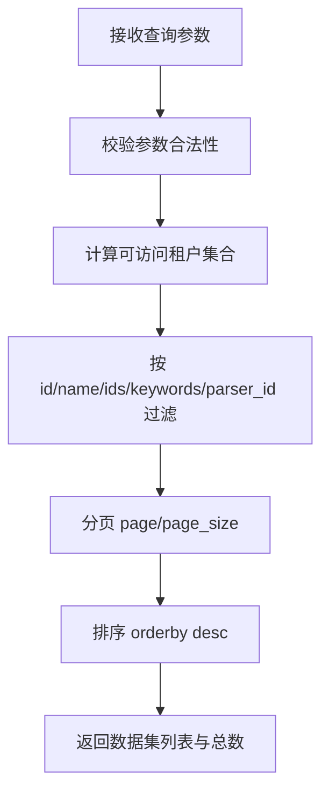
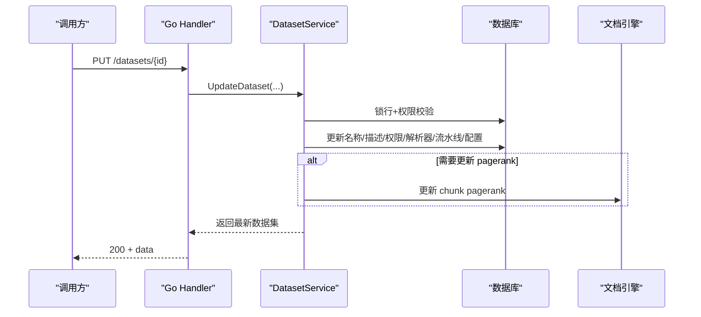
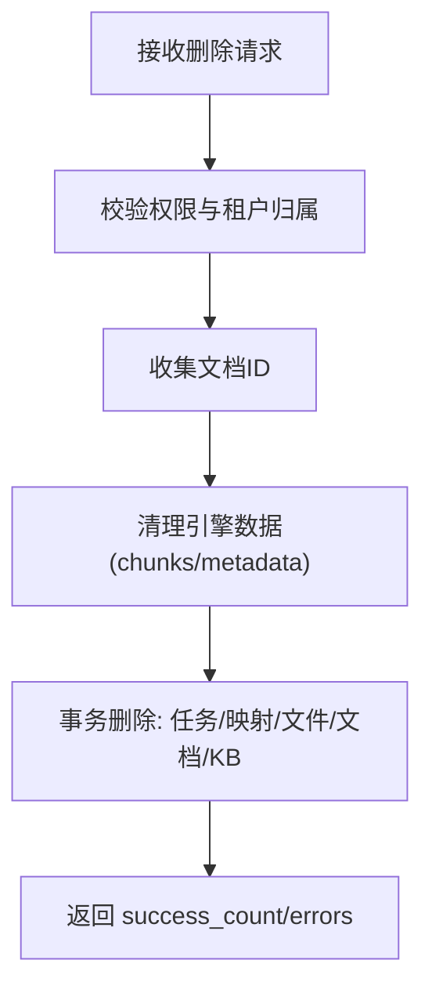
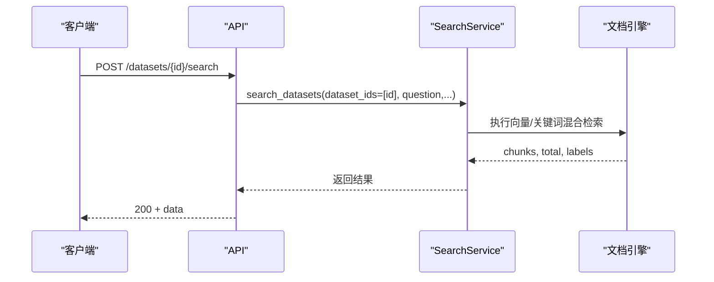
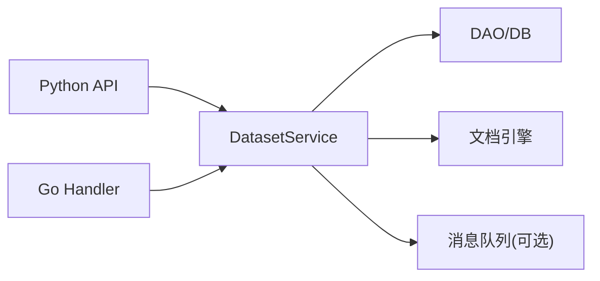

# 数据集管理

<cite>
**本文引用的文件**
- [dataset_api.py](file://api/apps/restful_apis/dataset_api.py)
- [dataset.go](file://internal/handler/dataset.go)
- [crud.go](file://internal/service/dataset/crud.go)
- [update.go](file://internal/service/dataset/update.go)
- [service.go](file://internal/service/dataset/service.go)
- [permission.go](file://internal/service/dataset/permission.go)
- [dataset.go](file://internal/entity/dataset.go)
</cite>

## 目录
1. [简介](#简介)
2. [项目结构](#项目结构)
3. [核心组件](#核心组件)
4. [架构总览](#架构总览)
5. [详细组件分析](#详细组件分析)
6. [依赖关系分析](#依赖关系分析)
7. [性能考虑](#性能考虑)
8. [故障排查指南](#故障排查指南)
9. [结论](#结论)
10. [附录](#附录)

## 简介
本文件面向“数据集管理”功能，覆盖创建、查询、更新、删除等全生命周期操作；详细说明配置项（名称、描述、权限、解析器与流水线、嵌入模型、分页排序过滤）；说明批量操作、搜索检索、标签管理、知识图谱与结构化产物；并给出权限控制、多租户隔离、错误处理与重试机制等企业级特性。文档同时提供流程图与时序图，帮助读者快速理解数据流与控制流。

## 项目结构
数据集管理的后端由三层组成：
- API 层（Python）：定义 REST 路由、参数校验、鉴权与审计日志记录，调用服务层完成业务逻辑。
- Handler 层（Go）：提供 Go 侧的 REST 处理器，负责请求解析、参数校验、统一响应封装，并委托服务层。
- Service 层（Go）：实现数据集的 CRUD、权限校验、解析器/流水线配置合并、分页查询、删除清理、索引更新等核心逻辑。

图表来源
- [dataset_api.py:86-438](file://api/apps/restful_apis/dataset_api.py#L86-L438)
- [dataset.go:72-229](file://internal/handler/dataset.go#L72-L229)
- [service.go:10-41](file://internal/service/dataset/service.go#L10-L41)

章节来源
- [dataset_api.py:86-438](file://api/apps/restful_apis/dataset_api.py#L86-L438)
- [dataset.go:72-229](file://internal/handler/dataset.go#L72-L229)
- [service.go:10-41](file://internal/service/dataset/service.go#L10-L41)

## 核心组件
- Python API（dataset_api.py）
  - 提供 /datasets 的增删改查、搜索、标签、知识图谱、Wiki 产物等接口。
  - 使用 Pydantic 模型进行请求体校验，统一返回格式，记录审计日志。
- Go Handler（internal/handler/dataset.go）
  - 提供同构的 Go 端 REST 处理器，严格校验查询参数与请求体，支持分页、排序、过滤。
  - 将请求委派给 DatasetService。
- DatasetService（internal/service/dataset/*）
  - 创建：校验名称、权限、解析器/流水线模式、嵌入模型可用性，生成唯一名称，持久化并返回。
  - 读取：按用户权限过滤，支持 id/name/ids 过滤、分页、排序、关键词与解析器过滤。
  - 更新：支持名称、头像、描述、语言、权限、解析器/流水线切换、parser_config 合并、pagerank 更新、连接器关联。
  - 删除：批量删除，先清理引擎数据，再事务性删除任务、文档、文件、知识库记录。
  - 权限：基于租户与 permission 字段（me/team）的多租户访问控制。
- 实体模型（internal/entity/dataset.go）
  - Knowledgebase 实体包含名称、权限、解析器、流水线、parser_config、嵌入模型、状态、各类任务 ID 等字段。

章节来源
- [dataset_api.py:86-438](file://api/apps/restful_apis/dataset_api.py#L86-L438)
- [dataset.go:72-229](file://internal/handler/dataset.go#L72-L229)
- [crud.go:19-164](file://internal/service/dataset/crud.go#L19-L164)
- [update.go:31-367](file://internal/service/dataset/update.go#L31-L367)
- [dataset.go:112-156](file://internal/entity/dataset.go#L112-L156)

## 架构总览
下图展示从客户端到数据库/引擎的完整调用链，涵盖创建与更新两个典型流程。

图表来源
- [dataset_api.py:86-174](file://api/apps/restful_apis/dataset_api.py#L86-L174)
- [dataset.go:231-264](file://internal/handler/dataset.go#L231-L264)
- [crud.go:19-164](file://internal/service/dataset/crud.go#L19-L164)
- [update.go:31-367](file://internal/service/dataset/update.go#L31-L367)

## 详细组件分析

### 创建数据集
- 入口
  - Python：POST /datasets，使用 CreateDatasetReq 校验 name、avatar、description、embedding_model、permission、chunk_method、parser_config。
  - Go：CreateDataset 处理器校验 JSON body 与必填字段，委托服务层。
- 关键逻辑
  - 名称去重：若同名已存在，自动追加 (1)、(2)... 直至唯一。
  - 解析器/流水线互斥：内置解析器与自定义流水线不可同时设置；根据模式清空不相关字段。
  - 嵌入模型：可指定或继承租户默认；校验可用性与解析模型 ID。
  - 权限：默认 me，仅当为 me/team 时通过。
  - 解析配置：根据解析器/流水线加载默认参数，应用租户 LLM 作用域配置。
  - 持久化：写入 knowledgebase，返回数据集信息。
- 错误处理
  - 非法输入、重复名称、模型不可用、权限不足等均有明确错误码与消息。

图表来源
- [crud.go:19-164](file://internal/service/dataset/crud.go#L19-L164)
- [dataset_api.py:86-174](file://api/apps/restful_apis/dataset_api.py#L86-L174)
- [dataset.go:231-264](file://internal/handler/dataset.go#L231-L264)

章节来源
- [crud.go:19-164](file://internal/service/dataset/crud.go#L19-L164)
- [dataset_api.py:86-174](file://api/apps/restful_apis/dataset_api.py#L86-L174)
- [dataset.go:231-264](file://internal/handler/dataset.go#L231-L264)

### 查询数据集（列表/详情/过滤/分页/排序）
- 列表接口
  - Python：GET /datasets，支持 id、ids、name、page、page_size、orderby、desc、filter 类型等。
  - Go：ListDatasets 严格限制允许的参数集，解析 page/page_size/orderby/desc/ext，并调用服务层。
- 服务层逻辑
  - 权限过滤：仅返回当前用户可访问的数据集（基于 tenant 与 permission）。
  - 过滤：支持 id/name/ids 过滤；ext 中可传入 keywords、owner_ids、parser_id。
  - 分页与排序：默认 page=1、page_size=30，orderby 支持 create_time/update_time，desc 默认 true。
  - 返回列表项包含名称、权限、统计数、解析器、嵌入模型显示名等。
- 详情接口
  - GET /datasets/{id}：返回数据集详情，包括 size、connectors 等。

图表来源
- [dataset_api.py:342-438](file://api/apps/restful_apis/dataset_api.py#L342-L438)
- [dataset.go:72-229](file://internal/handler/dataset.go#L72-L229)
- [crud.go:340-480](file://internal/service/dataset/crud.go#L340-L480)

章节来源
- [dataset_api.py:342-438](file://api/apps/restful_apis/dataset_api.py#L342-L438)
- [dataset.go:72-229](file://internal/handler/dataset.go#L72-L229)
- [crud.go:340-480](file://internal/service/dataset/crud.go#L340-L480)

### 更新数据集（名称/描述/权限/解析器/流水线/配置/pagerank）
- 入口
  - Python：PUT /datasets/{id}，支持 name、avatar、description、embedding_model、permission、chunk_method、parser_config、pagerank 等。
  - Go：UpdateDataset 处理器校验 JSON 与白名单字段，委托服务层。
- 关键逻辑
  - 名称唯一性：更新时检查大小写无关的唯一性。
  - 解析器/流水线：二者互斥；切换解析器时自动合并默认 parser_config；切换流水线时同样合并默认配置。
  - 嵌入模型：可覆盖，需校验可用性与解析模型 ID。
  - 权限：仅数据集所有者可修改权限。
  - Pagerank：仅在文档引擎支持时允许设置，并异步更新索引中的 chunk pagerank。
  - 连接器：可批量关联/更新连接器，并在事务内提交后发布同步任务。
- 事务与一致性
  - 使用行级锁保证并发安全；在事务中完成 DB 更新与连接器关联；失败回滚。

图表来源
- [update.go:31-367](file://internal/service/dataset/update.go#L31-L367)
- [dataset.go:377-439](file://internal/handler/dataset.go#L377-L439)
- [dataset_api.py:246-339](file://api/apps/restful_apis/dataset_api.py#L246-L339)

章节来源
- [update.go:31-367](file://internal/service/dataset/update.go#L31-L367)
- [dataset.go:377-439](file://internal/handler/dataset.go#L377-L439)
- [dataset_api.py:246-339](file://api/apps/restful_apis/dataset_api.py#L246-L339)

### 删除数据集（批量/全部）
- 入口
  - Python：DELETE /datasets，支持 ids 数组或 delete_all。
  - Go：DeleteDatasets 校验额外字段与重复 id，委托服务层。
- 关键逻辑
  - 权限校验：仅允许删除属于当前租户的数据集。
  - 批量删除：收集所有文档 ID，先清理引擎数据（chunks/metadata），再事务性删除任务、映射、文件、文档、知识库记录。
  - 结果：返回成功计数与错误列表。

图表来源
- [crud.go:220-338](file://internal/service/dataset/crud.go#L220-L338)
- [dataset_api.py:177-243](file://api/apps/restful_apis/dataset_api.py#L177-L243)
- [dataset.go:576-636](file://internal/handler/dataset.go#L576-L636)

章节来源
- [crud.go:220-338](file://internal/service/dataset/crud.go#L220-L338)
- [dataset_api.py:177-243](file://api/apps/restful_apis/dataset_api.py#L177-L243)
- [dataset.go:576-636](file://internal/handler/dataset.go#L576-L636)

### 搜索与检索（单数据集/多数据集）
- 入口
  - Python：POST /datasets/search（多数据集）、POST /datasets/{id}/search（单数据集）。
  - 参数：question、doc_ids、knn_top_k、knn_num_candidates、page/page_size、similarity_threshold、vector_similarity_weight、use_kg、cross_languages、keyword、meta_data_filter、include_knowledge_compilation。
- 行为
  - 将 dataset_id 注入为 dataset_ids，调用服务层执行检索，返回 chunks、total、labels。
  - 未找到分片时返回友好提示。

图表来源
- [dataset_api.py:541-595](file://api/apps/restful_apis/dataset_api.py#L541-L595)

章节来源
- [dataset_api.py:541-595](file://api/apps/restful_apis/dataset_api.py#L541-L595)

### 标签管理（列出/删除/重命名）
- 列出：GET /datasets/{id}/tags
- 删除：DELETE /datasets/{id}/tags，请求体 tags 字符串数组
- 重命名：PUT /datasets/{id}/tags，from_tag/to_tag 字符串
- 行为：均经服务层校验与执行，返回统一结果。

章节来源
- [dataset_api.py:475-538](file://api/apps/restful_apis/dataset_api.py#L475-L538)

### 知识图谱与结构化产物（Wiki/Graph/Mindmap/Timeline/Session）
- 知识图谱：GET /datasets/{id}/graph，返回 graph/mind_map 等结构化内容。
- Wiki 产物：
  - HEAD /datasets/{id}/artifacts：探测是否存在任何 Wiki 页面。
  - GET /datasets/{id}/artifacts：分页列出页面，支持 page_type/topic/keywords。
  - GET /datasets/{id}/artifacts/topics：分页列出主题。
  - GET /datasets/{id}/artifacts/graph：增量子图，支持 node/keywords/top_n。
  - GET /datasets/{id}/artifacts/structure：按 kind 返回数据集范围的结构图（graph/mindmap/timeline/session_essence/session_graph）。

章节来源
- [dataset_api.py:598-800](file://api/apps/restful_apis/dataset_api.py#L598-L800)

### 权限控制与多租户隔离
- 权限字段
  - permission：me（仅创建者）/team（团队共享）。
- 访问控制
  - 列表/详情/更新/删除均基于用户所属租户与数据集 permission 判断。
  - 更新权限仅限数据集所有者。
- 多租户
  - 所有查询与写入均带 tenant_id 上下文；列表支持 owner_ids 过滤以跨租户协作场景。

章节来源
- [permission.go:12-63](file://internal/service/dataset/permission.go#L12-L63)
- [crud.go:340-480](file://internal/service/dataset/crud.go#L340-L480)
- [update.go:176-186](file://internal/service/dataset/update.go#L176-L186)

### 解析器配置与模板
- 解析器/流水线
  - 创建/更新时可指定 parser_id 或 pipeline_id，二者互斥。
  - 切换解析器或流水线时，自动加载 DSL 并合并默认 parser_config，保留必要元数据。
- 配置校验与规范化
  - 对 parser_config 进行大小与页面规范化校验；应用租户 LLM 作用域配置。
- 模板与预设
  - 通过解析器/流水线 DSL 提供预设能力；服务层在切换时自动补齐默认值。

章节来源
- [crud.go:37-99](file://internal/service/dataset/crud.go#L37-L99)
- [update.go:105-148](file://internal/service/dataset/update.go#L105-L148)
- [update.go:235-291](file://internal/service/dataset/update.go#L235-L291)

### 导入导出与连接器
- 连接器关联
  - 更新时可批量关联/更新连接器，事务内提交后发布同步任务，驱动后续数据同步。
- 导入/导出
  - 通过连接器与 ingestion 管线完成数据导入；导出可通过检索与结构化产物（Wiki/Graph）获取。

章节来源
- [update.go:324-356](file://internal/service/dataset/update.go#L324-L356)

### 生命周期管理与监控
- 状态与任务
  - 数据集实体包含多种任务 ID 与完成时间（GraphRAG/Raptor/Mindmap/Wiki/Skill/Structure 等），用于追踪长任务进度。
- 摘要与日志
  - 提供 ingestion 摘要与日志查询接口，便于监控与排障。
- 重试机制
  - 服务层对部分外部调用（如文档引擎更新）具备容错处理；缺失索引等异常被容忍或降级。

章节来源
- [dataset.go:132-154](file://internal/entity/dataset.go#L132-L154)
- [dataset_api.py:458-472](file://api/apps/restful_apis/dataset_api.py#L458-L472)
- [update.go:369-384](file://internal/service/dataset/update.go#L369-L384)

## 依赖关系分析
- 模块耦合
  - API 层依赖服务层；Handler 层与服务层解耦于接口；服务层依赖 DAO、引擎、工具库。
- 外部依赖
  - 文档引擎（ES/Infinity/OceanBase 等）：用于检索、分页、pagerank 更新、结构化产物存储。
  - 消息队列：用于发布同步任务（连接器变更触发）。
- 潜在循环依赖
  - 未发现明显循环；服务层通过 DAO/Engine 抽象避免直接耦合具体实现。

图表来源
- [service.go:10-41](file://internal/service/dataset/service.go#L10-L41)
- [update.go:390-407](file://internal/service/dataset/update.go#L390-L407)

章节来源
- [service.go:10-41](file://internal/service/dataset/service.go#L10-L41)
- [update.go:390-407](file://internal/service/dataset/update.go#L390-L407)

## 性能考虑
- 分页与排序
  - 默认 page_size=30，建议前端合理设置以避免大页；orderby 仅支持有限字段，减少复杂排序开销。
- 权限过滤
  - 列表查询会计算用户可访问的租户集合，建议在高频场景缓存用户-租户关系。
- 引擎交互
  - 删除前预取文档 ID 并批量清理引擎数据，减少多次往返；pagerank 更新设置超时，避免阻塞。
- 配置合并
  - 解析器/流水线切换时按需加载 DSL 并合并默认配置，避免不必要的解析。

[本节为通用指导，无需特定文件引用]

## 故障排查指南
- 常见错误
  - 参数非法：JSON 语法错误、多余字段、类型不匹配、UUID 无效等。
  - 权限不足：用户无权访问目标数据集或尝试修改他人权限。
  - 名称冲突：更新或创建时名称重复。
  - 模型不可用：指定的嵌入模型不存在或不可用。
  - 引擎未初始化：pagerank 更新等操作要求文档引擎已初始化。
- 定位方法
  - 查看 API 返回的错误码与消息；核对请求参数是否符合契约。
  - 检查服务层日志（如解析器默认配置加载失败、引擎操作失败等）。
  - 对于删除失败，确认引擎数据清理是否成功，以及事务内各表删除顺序。

章节来源
- [dataset_api.py:145-174](file://api/apps/restful_apis/dataset_api.py#L145-L174)
- [dataset.go:231-264](file://internal/handler/dataset.go#L231-L264)
- [crud.go:19-164](file://internal/service/dataset/crud.go#L19-L164)
- [update.go:31-169](file://internal/service/dataset/update.go#L31-L169)

## 结论
本数据集管理功能提供了完整的创建、查询、更新、删除能力，支持丰富的配置选项（名称、描述、权限、解析器/流水线、parser_config、嵌入模型、pagerank），并提供批量操作、分页排序过滤、搜索检索、标签管理、知识图谱与结构化产物等企业级特性。权限控制与多租户隔离贯穿全流程，确保数据安全与隔离。通过合理的分页、权限过滤与引擎交互优化，系统具备良好的可扩展性与稳定性。

## 附录
- 常用接口速览
  - 创建：POST /datasets
  - 列表：GET /datasets
  - 详情：GET /datasets/{id}
  - 更新：PUT /datasets/{id}
  - 删除：DELETE /datasets
  - 搜索：POST /datasets/search、POST /datasets/{id}/search
  - 标签：GET/PUT/DELETE /datasets/{id}/tags
  - 知识图谱：GET /datasets/{id}/graph
  - Wiki 产物：HEAD/GET /datasets/{id}/artifacts、topics、graph、structure

[本节为概览性内容，无需特定文件引用]