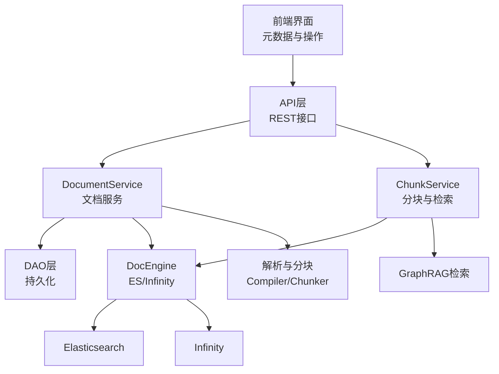
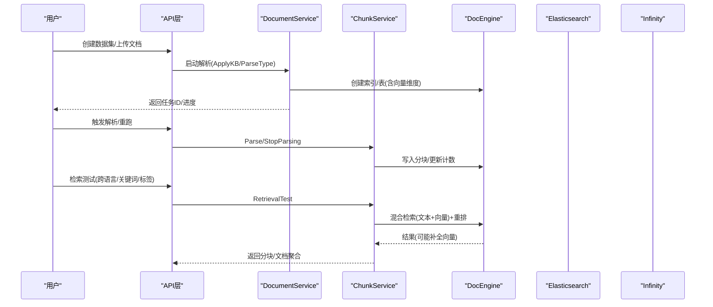
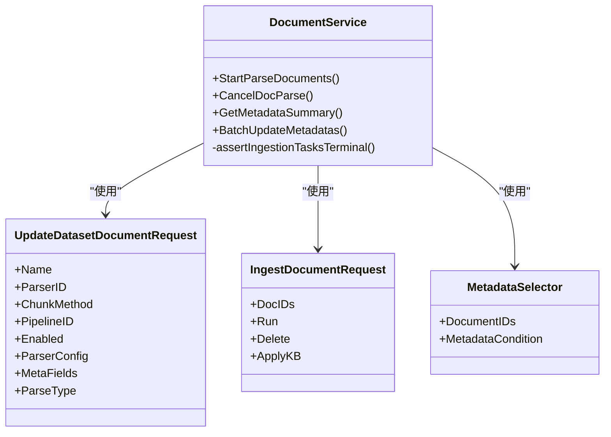
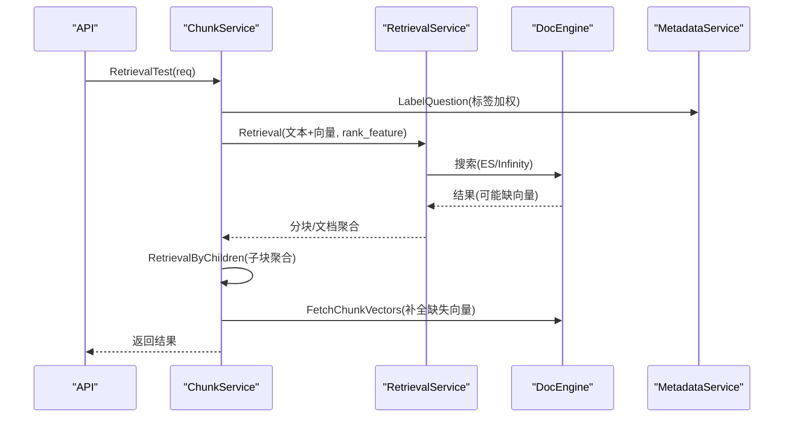
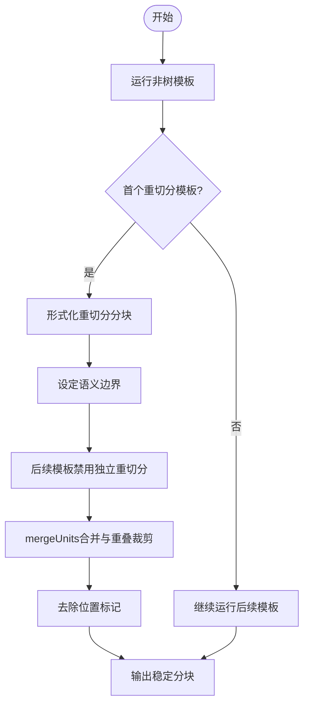
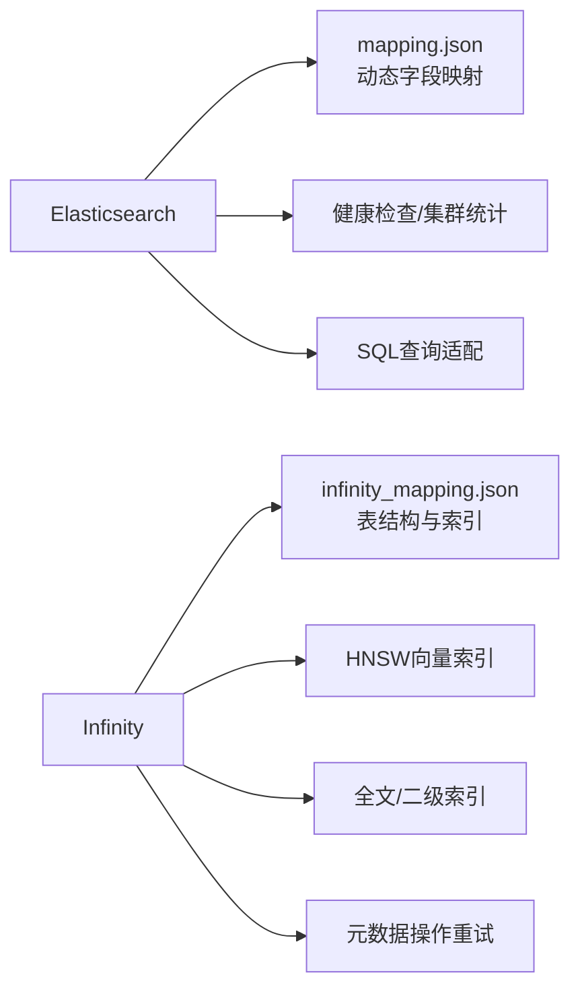
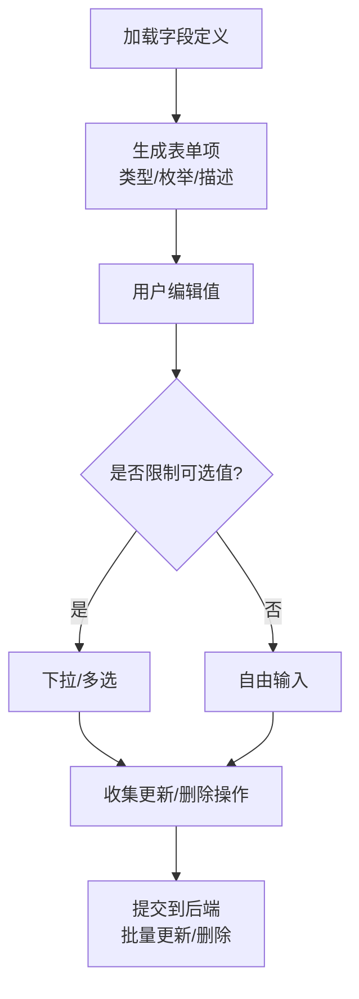
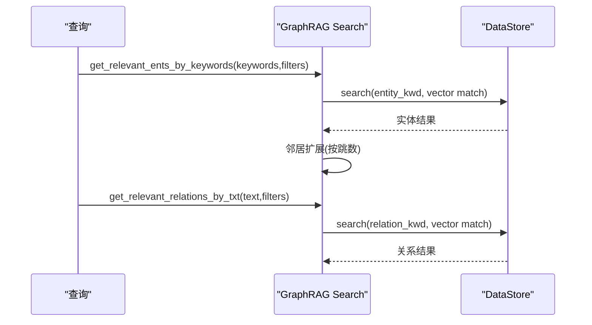
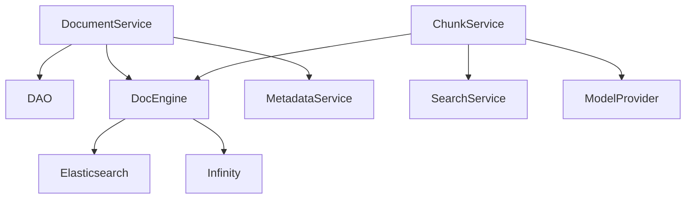

# 知识库管理

<cite>
**本文引用的文件**
- [internal/service/document/document.go](file://internal/service/document/document.go)
- [internal/service/chunk/chunk.go](file://internal/service/chunk/chunk.go)
- [common/doc_store/es_conn_base.py](file://common/doc_store/es_conn_base.py)
- [common/doc_store/infinity_conn_base.py](file://common/doc_store/infinity_conn_base.py)
- [conf/mapping.json](file://conf/mapping.json)
- [rag/flow/compiler/compiler.py](file://rag/flow/compiler/compiler.py)
- [internal/ingestion/component/chunker/token.go](file://internal/ingestion/component/chunker/token.go)
- [api/apps/restful_apis/chunk_api.py](file://api/apps/restful_apis/chunk_api.py)
- [web/src/pages/dataset/components/metedata/hooks/use-manage-modal.ts](file://web/src/pages/dataset/components/metedata/hooks/use-manage-modal.ts)
- [web/src/pages/dataset/components/metedata/interface.ts](file://web/src/pages/dataset/components/metedata/interface.ts)
- [web/src/pages/dataset/components/metedata/manage-values-modal.tsx](file://web/src/pages/dataset/components/metedata/manage-values-modal.tsx)
- [internal/entity/dataset.go](file://internal/entity/dataset.go)
- [rag/graphrag/search.py](file://rag/graphrag/search.py)
- [api/utils/health_utils.py](file://api/utils/health_utils.py)
- [test/unit_test/api/utils/test_oceanbase_health.py](file://test/unit_test/api/utils/test_oceanbase_health.py)
</cite>

## 目录
1. [简介](#简介)
2. [项目结构](#项目结构)
3. [核心组件](#核心组件)
4. [架构总览](#架构总览)
5. [详细组件分析](#详细组件分析)
6. [依赖关系分析](#依赖关系分析)
7. [性能与优化](#性能与优化)
8. [故障排查指南](#故障排查指南)
9. [结论](#结论)
10. [附录](#附录)

## 简介
本文件面向RAGFlow的知识库管理能力，覆盖数据集的创建、配置、管理与维护；文档分块策略（智能切分、模板匹配、重叠处理）；元数据与标签系统；版本控制与任务编排；向量搜索引擎（Elasticsearch、Infinity）的配置与调优；知识图谱构建、实体关系抽取与语义检索；以及运维监控、容量规划与备份恢复建议。

## 项目结构
围绕知识库管理的代码分布在以下层次：
- API层：REST接口负责数据集、文档、分块的增删改查与检索测试入口
- 服务层：DocumentService、ChunkService等封装业务逻辑，协调DAO、引擎与服务
- 引擎层：DocEngine抽象统一对接Elasticsearch与Infinity后端
- 解析与分块：编译器与分块器实现模板驱动的智能切分与合并
- 前端：元数据管理界面提供字段与值编辑能力
- 配置：索引映射、模型与检索参数集中管理

**图表来源**
- [internal/service/document/document.go:32-73](file://internal/service/document/document.go#L32-L73)
- [internal/service/chunk/chunk.go:75-116](file://internal/service/chunk/chunk.go#L75-L116)
- [common/doc_store/es_conn_base.py:37-53](file://common/doc_store/es_conn_base.py#L37-L53)
- [common/doc_store/infinity_conn_base.py:169-222](file://common/doc_store/infinity_conn_base.py#L169-L222)

**章节来源**
- [internal/service/document/document.go:32-73](file://internal/service/document/document.go#L32-L73)
- [internal/service/chunk/chunk.go:75-116](file://internal/service/chunk/chunk.go#L75-L116)

## 核心组件
- 文档服务（DocumentService）：负责文档生命周期、解析启动、任务发布、元数据聚合、存储清理等
- 分块与检索服务（ChunkService）：负责分块列表、获取、停止解析、检索测试、子块聚合、向量填充等
- 搜索引擎连接（ESConnectionBase / InfinityConnectionBase）：统一CRUD、索引管理、健康检查、统计与SQL支持
- 解析与分块（Compiler / Token Chunker）：模板驱动的切分、结构化重切分、重叠与合并策略
- 元数据管理（前端Hook/Modal）：字段定义、枚举值、批量更新与删除
- 知识图谱检索（GraphRAG Search）：实体与关系的语义检索与邻居扩展

**章节来源**
- [internal/service/document/document.go:32-73](file://internal/service/document/document.go#L32-L73)
- [internal/service/chunk/chunk.go:75-116](file://internal/service/chunk/chunk.go#L75-L116)
- [common/doc_store/es_conn_base.py:37-53](file://common/doc_store/es_conn_base.py#L37-L53)
- [common/doc_store/infinity_conn_base.py:169-222](file://common/doc_store/infinity_conn_base.py#L169-L222)
- [rag/flow/compiler/compiler.py:682-711](file://rag/flow/compiler/compiler.py#L682-L711)
- [internal/ingestion/component/chunker/token.go:499-536](file://internal/ingestion/component/chunker/token.go#L499-L536)
- [web/src/pages/dataset/components/metedata/hooks/use-manage-modal.ts:124-172](file://web/src/pages/dataset/components/metedata/hooks/use-manage-modal.ts#L124-L172)
- [web/src/pages/dataset/components/metedata/interface.ts:52-101](file://web/src/pages/dataset/components/metedata/interface.ts#L52-L101)
- [web/src/pages/dataset/components/metedata/manage-values-modal.tsx:1-42](file://web/src/pages/dataset/components/metedata/manage-values-modal.tsx#L1-L42)
- [rag/graphrag/search.py:108-131](file://rag/graphrag/search.py#L108-L131)

## 架构总览
知识库管理的关键流程包括：
- 创建与配置：通过API创建数据集与文档，设置解析器/流水线、相似度阈值与权重
- 解析与分块：Compiler按模板执行解析，Token Chunker进行智能切分与合并，支持重叠与边界处理
- 索引与存储：DocEngine将分块写入ES或Infinity，建立向量与全文索引
- 检索与增强：ChunkService检索测试，支持跨语言、关键词提取、标签加权、子块聚合、KG检索
- 元数据与标签：前端提供字段与值管理，后端支持批量更新与条件过滤

**图表来源**
- [internal/service/document/document.go:222-236](file://internal/service/document/document.go#L222-L236)
- [internal/service/chunk/chunk.go:118-133](file://internal/service/chunk/chunk.go#L118-L133)
- [common/doc_store/es_conn_base.py:120-165](file://common/doc_store/es_conn_base.py#L120-L165)
- [common/doc_store/infinity_conn_base.py:487-594](file://common/doc_store/infinity_conn_base.py#L487-L594)
- [api/apps/restful_apis/chunk_api.py:345-372](file://api/apps/restful_apis/chunk_api.py#L345-L372)

## 详细组件分析

### 文档服务（DocumentService）
- 职责：文档CRUD、解析启动选项（ApplyKB、RerunWithDelete）、任务发布、元数据摘要、存储清理
- 关键数据结构：UpdateDatasetDocumentRequest/Response、IngestDocumentRequest、MetadataSelector/Update/Delete
- 行为要点：
  - 解析前校验状态，避免运行中修改导致竞态
  - 支持按知识库配置合并parser_config与metadata
  - 批量元数据更新与删除，支持条件选择文档集合

**图表来源**
- [internal/service/document/document.go:32-73](file://internal/service/document/document.go#L32-L73)
- [internal/service/document/document.go:125-170](file://internal/service/document/document.go#L125-L170)
- [internal/service/document/document.go:222-287](file://internal/service/document/document.go#L222-L287)

**章节来源**
- [internal/service/document/document.go:32-73](file://internal/service/document/document.go#L32-L73)
- [internal/service/document/document.go:125-170](file://internal/service/document/document.go#L125-L170)
- [internal/service/document/document.go:222-287](file://internal/service/document/document.go#L222-L287)

### 分块与检索服务（ChunkService）
- 职责：分块列表/获取、停止解析、检索测试、子块聚合、向量填充
- 检索流程：权限校验→元数据过滤→跨语言/关键词→标签加权→混合检索→重排→子块聚合→向量补全
- 关键点：
  - 多租户与知识库权限校验
  - 支持从Search配置读取meta_data_filter与rerank候选数
  - 对ES返回零向量进行补全（hydrate），Infinity/OB已自带向量

**图表来源**
- [internal/service/chunk/chunk.go:118-133](file://internal/service/chunk/chunk.go#L118-L133)
- [internal/service/chunk/chunk.go:281-355](file://internal/service/chunk/chunk.go#L281-L355)
- [internal/service/chunk/chunk.go:416-460](file://internal/service/chunk/chunk.go#L416-L460)
- [internal/service/chunk/chunk.go:474-519](file://internal/service/chunk/chunk.go#L474-L519)

**章节来源**
- [internal/service/chunk/chunk.go:118-133](file://internal/service/chunk/chunk.go#L118-L133)
- [internal/service/chunk/chunk.go:281-355](file://internal/service/chunk/chunk.go#L281-L355)
- [internal/service/chunk/chunk.go:416-460](file://internal/service/chunk/chunk.go#L416-L460)
- [internal/service/chunk/chunk.go:474-519](file://internal/service/chunk/chunk.go#L474-L519)

### 解析与分块（Compiler与Token Chunker）
- Compiler：模板驱动解析，首个rechunk模板定义语义边界，后续模板消费正式分块并禁止再次独立重切分
- Token Chunker：文本路径下并行处理，mergeUnits执行硬上限合并与重叠裁剪，最终去除位置标记并输出稳定分块

**图表来源**
- [rag/flow/compiler/compiler.py:682-711](file://rag/flow/compiler/compiler.py#L682-L711)
- [internal/ingestion/component/chunker/token.go:499-536](file://internal/ingestion/component/chunker/token.go#L499-L536)

**章节来源**
- [rag/flow/compiler/compiler.py:682-711](file://rag/flow/compiler/compiler.py#L682-L711)
- [internal/ingestion/component/chunker/token.go:499-536](file://internal/ingestion/component/chunker/token.go#L499-L536)

### 搜索引擎后端（Elasticsearch与Infinity）
- Elasticsearch：
  - 索引映射：动态类型推断（int/long/float/date/kwd/tks/ltks/rank_feature/dense_vector/binary）
  - 健康检查、集群统计、刷新索引、SQL查询支持
  - 元数据索引：per-tenant doc_meta_es_mapping
- Infinity：
  - 表迁移与自动新增列、全文索引与二级索引创建
  - 向量索引HNSW参数（M、ef_construction、metric=cosine、encode=lvq）
  - 元数据表：per-tenant doc_meta_infinity_mapping，建id/kb_id/meta_fields二级索引
  - 重试机制：对RocksDB“Resource busy”错误指数退避重试

**图表来源**
- [conf/mapping.json:1-212](file://conf/mapping.json#L1-L212)
- [common/doc_store/es_conn_base.py:70-114](file://common/doc_store/es_conn_base.py#L70-L114)
- [common/doc_store/es_conn_base.py:120-165](file://common/doc_store/es_conn_base.py#L120-L165)
- [common/doc_store/es_conn_base.py:359-395](file://common/doc_store/es_conn_base.py#L359-L395)
- [common/doc_store/infinity_conn_base.py:224-280](file://common/doc_store/infinity_conn_base.py#L224-L280)
- [common/doc_store/infinity_conn_base.py:487-594](file://common/doc_store/infinity_conn_base.py#L487-L594)
- [common/doc_store/infinity_conn_base.py:598-668](file://common/doc_store/infinity_conn_base.py#L598-L668)
- [common/doc_store/infinity_conn_base.py:122-166](file://common/doc_store/infinity_conn_base.py#L122-L166)

**章节来源**
- [conf/mapping.json:1-212](file://conf/mapping.json#L1-L212)
- [common/doc_store/es_conn_base.py:70-114](file://common/doc_store/es_conn_base.py#L70-L114)
- [common/doc_store/es_conn_base.py:120-165](file://common/doc_store/es_conn_base.py#L120-L165)
- [common/doc_store/es_conn_base.py:359-395](file://common/doc_store/es_conn_base.py#L359-L395)
- [common/doc_store/infinity_conn_base.py:224-280](file://common/doc_store/infinity_conn_base.py#L224-L280)
- [common/doc_store/infinity_conn_base.py:487-594](file://common/doc_store/infinity_conn_base.py#L487-L594)
- [common/doc_store/infinity_conn_base.py:598-668](file://common/doc_store/infinity_conn_base.py#L598-L668)
- [common/doc_store/infinity_conn_base.py:122-166](file://common/doc_store/infinity_conn_base.py#L122-L166)

### 元数据与标签系统
- 前端：
  - 字段类型与枚举值推导，支持限制可选值
  - 批量删除与更新操作收集，支持本地保存模式
  - 值编辑模态框，支持多种输入控件与去重/校验
- 后端：
  - 支持按元数据条件筛选文档集合
  - 批量更新元数据，支持键值对与列表值操作

**图表来源**
- [web/src/pages/dataset/components/metedata/hooks/use-manage-modal.ts:124-172](file://web/src/pages/dataset/components/metedata/hooks/use-manage-modal.ts#L124-L172)
- [web/src/pages/dataset/components/metedata/interface.ts:52-101](file://web/src/pages/dataset/components/metedata/interface.ts#L52-L101)
- [web/src/pages/dataset/components/metedata/manage-values-modal.tsx:1-42](file://web/src/pages/dataset/components/metedata/manage-values-modal.tsx#L1-L42)
- [api/apps/restful_apis/chunk_api.py:345-372](file://api/apps/restful_apis/chunk_api.py#L345-L372)

**章节来源**
- [web/src/pages/dataset/components/metedata/hooks/use-manage-modal.ts:124-172](file://web/src/pages/dataset/components/metedata/hooks/use-manage-modal.ts#L124-L172)
- [web/src/pages/dataset/components/metedata/interface.ts:52-101](file://web/src/pages/dataset/components/metedata/interface.ts#L52-L101)
- [web/src/pages/dataset/components/metedata/manage-values-modal.tsx:1-42](file://web/src/pages/dataset/components/metedata/manage-values-modal.tsx#L1-L42)
- [api/apps/restful_apis/chunk_api.py:345-372](file://api/apps/restful_apis/chunk_api.py#L345-L372)

### 知识图谱检索与实体关系抽取
- GraphRAG检索：
  - 基于关键词的实体检索与向量匹配
  - 基于文本的关系检索，支持相似度阈值与候选数量
  - 邻居扩展：按跳数探索实体邻域，逐步扩大检索范围
- 结构化图搜索：
  - 精确名称优先，BM25兜底，结合细粒度分词提升召回

**图表来源**
- [rag/graphrag/search.py:108-131](file://rag/graphrag/search.py#L108-L131)

**章节来源**
- [rag/graphrag/search.py:108-131](file://rag/graphrag/search.py#L108-L131)

## 依赖关系分析
- 服务间耦合：
  - DocumentService依赖DAO、DocEngine、IngestionTaskService、MetadataService
  - ChunkService依赖DocEngine、SearchService、MetadataService、ModelProvider
- 外部依赖：
  - Elasticsearch/Infinity作为文档引擎，提供索引、向量与全文检索
  - 模型提供者用于嵌入、重排与LLM变换（跨语言、关键词提取）
- 潜在循环依赖：
  - 服务层通过接口注入避免直接循环引用（如startParseDocumentsFunc、cancelIngestionTaskFunc）

**图表来源**
- [internal/service/document/document.go:32-73](file://internal/service/document/document.go#L32-L73)
- [internal/service/chunk/chunk.go:75-116](file://internal/service/chunk/chunk.go#L75-L116)

**章节来源**
- [internal/service/document/document.go:32-73](file://internal/service/document/document.go#L32-L73)
- [internal/service/chunk/chunk.go:75-116](file://internal/service/chunk/chunk.go#L75-L116)

## 性能与优化
- 索引与映射：
  - ES：合理设置分片与副本、refresh_interval；利用dynamic_templates减少schema变更成本；dense_vector使用cosine相似度
  - Infinity：HNSW参数M、ef_construction影响召回与延迟；为高频过滤字段创建secondary索引；JSON列使用json_contains提升过滤效率
- 检索优化：
  - 调整similarity_threshold与vector_similarity_weight平衡文本与向量贡献
  - 使用rerank模型提升排序质量；控制rerank_candidates_count以平衡吞吐与精度
  - 子块聚合（RetrievalByChildren）减少重复展示，提升可读性
- 分块策略：
  - 首个rechunk模板定义语义边界，后续模板禁用独立重切分，避免碎片化
  - mergeUnits硬上限合并与重叠裁剪，保证分块大小可控且上下文连贯
- 健康与监控：
  - ES：cluster.health、indices stats、store size、JVM堆使用
  - Infinity：节点状态、表/索引创建重试、元数据操作指数退避
  - OceanBase（若启用）：连接状态、延迟、存储用量、QPS、慢查询、连接池统计

**章节来源**
- [conf/mapping.json:1-212](file://conf/mapping.json#L1-L212)
- [common/doc_store/es_conn_base.py:70-114](file://common/doc_store/es_conn_base.py#L70-L114)
- [common/doc_store/infinity_conn_base.py:487-594](file://common/doc_store/infinity_conn_base.py#L487-L594)
- [internal/service/chunk/chunk.go:416-460](file://internal/service/chunk/chunk.go#L416-L460)
- [rag/flow/compiler/compiler.py:682-711](file://rag/flow/compiler/compiler.py#L682-L711)
- [internal/ingestion/component/chunker/token.go:499-536](file://internal/ingestion/component/chunker/token.go#L499-L536)
- [api/utils/health_utils.py:248-301](file://api/utils/health_utils.py#L248-L301)

## 故障排查指南
- 解析与分块问题：
  - 检查文档状态是否为可编辑状态（未运行/已完成/失败/取消），避免运行中修改导致竞态
  - 确认首个rechunk模板成功产出正式分块，否则后续模板无法生效
  - 查看分块器日志，确认mergeUnits与重叠裁剪是否符合预期
- 检索异常：
  - 验证知识库embedding模型一致，跨库检索需同基模型
  - 检查meta_data_filter方法（auto/semi_auto）是否正确解析chat model
  - 对于ES返回零向量，确认hydrateChunkVectors是否执行成功
- 搜索引擎健康：
  - ES：检查cluster health、indices是否存在、refresh是否成功
  - Infinity：关注“Resource busy”重试次数与退避策略；确认表/索引创建完成
  - OceanBase：若启用，检查连接状态、延迟、存储用量、慢查询与QPS
- 元数据操作：
  - 确保字段类型与枚举值正确；列表字段在旧版varchar列上回退到filter_fulltext
  - 批量更新时注意delete-key语义，ES使用脚本替换meta_fields避免残留键

**章节来源**
- [internal/entity/dataset.go:76-87](file://internal/entity/dataset.go#L76-L87)
- [rag/flow/compiler/compiler.py:682-711](file://rag/flow/compiler/compiler.py#L682-L711)
- [internal/service/chunk/chunk.go:474-519](file://internal/service/chunk/chunk.go#L474-L519)
- [common/doc_store/es_conn_base.py:120-165](file://common/doc_store/es_conn_base.py#L120-L165)
- [common/doc_store/infinity_conn_base.py:122-166](file://common/doc_store/infinity_conn_base.py#L122-L166)
- [api/utils/health_utils.py:248-301](file://api/utils/health_utils.py#L248-L301)
- [test/unit_test/api/utils/test_oceanbase_health.py:178-276](file://test/unit_test/api/utils/test_oceanbase_health.py#L178-L276)

## 结论
RAGFlow的知识库管理提供了完整的文档生命周期与检索能力：通过模板驱动的解析与分块、统一的DocEngine抽象、灵活的元数据与标签系统、以及GraphRAG增强检索，满足复杂场景下的知识组织与问答需求。配合ES与Infinity的后端特性与调优手段，可在不同规模与性能要求下稳定运行。建议在生产环境重点关注索引映射、向量索引参数、重排模型配置与健康监控指标，以确保高可用与高性能。

## 附录
- 数据集模型字段：包含embd_id、tenant_embd_id、parser_id、pipeline_id、parser_config、相似度阈值与权重等
- 任务状态：未开始、运行中、取消、完成、失败、调度
- 解析器类型：演示、法律、手动、论文、书籍、QA、表格、通用、朴素、图片、音频、邮件、知识图谱等

**章节来源**
- [internal/entity/dataset.go:111-156](file://internal/entity/dataset.go#L111-L156)
- [internal/entity/dataset.go:64-100](file://internal/entity/dataset.go#L64-L100)