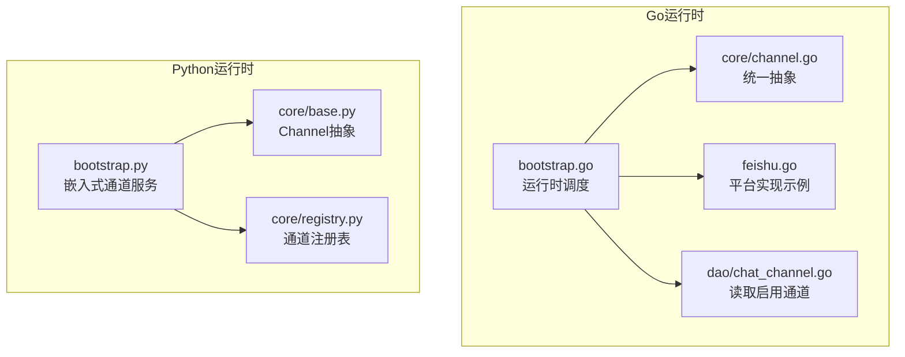
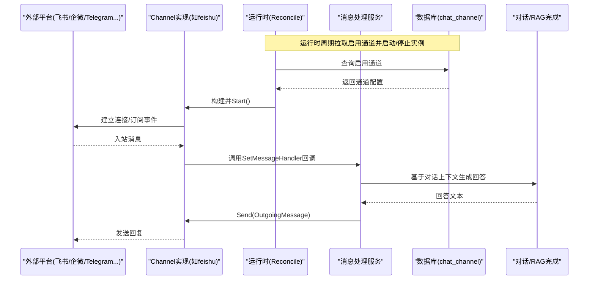
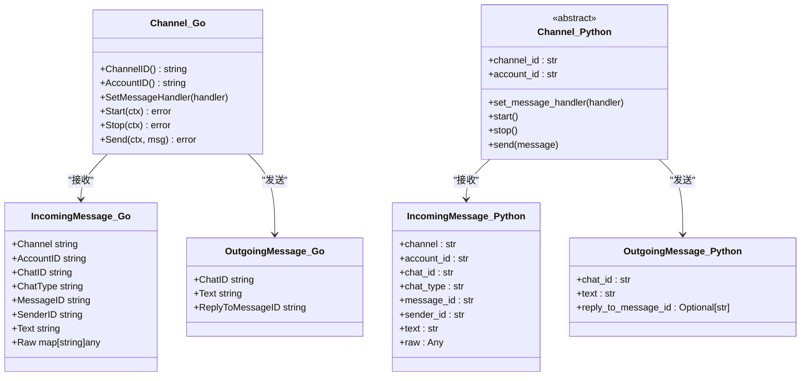
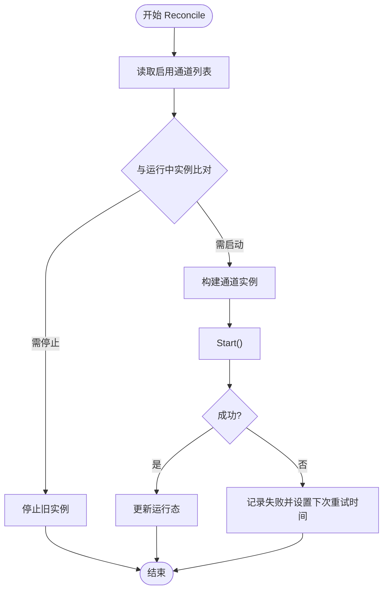
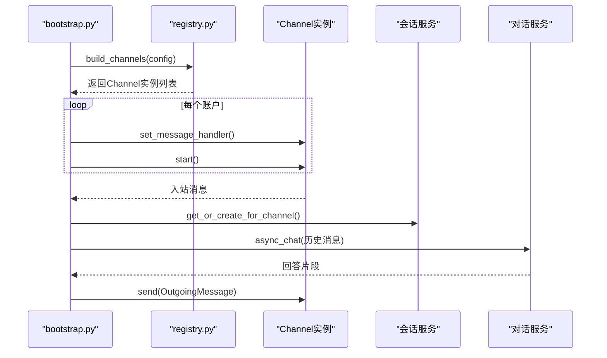
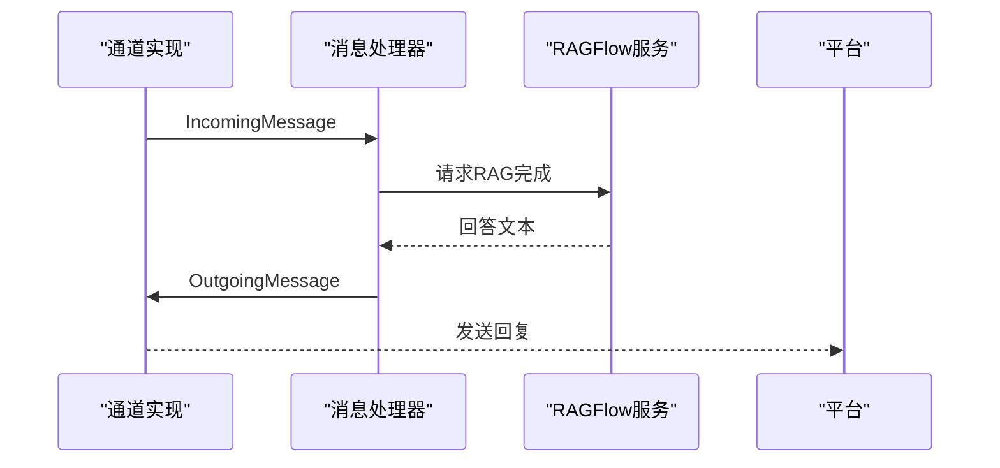
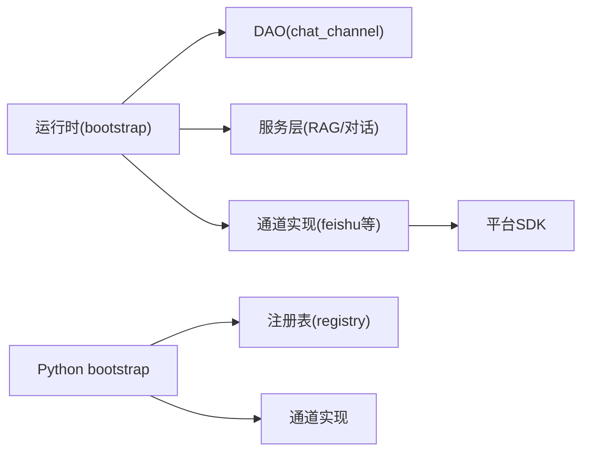

# 聊天通道概览

<cite>
**本文引用的文件**
- [internal/channels/bootstrap.go](file://internal/channels/bootstrap.go)
- [internal/channels/core/channel.go](file://internal/channels/core/channel.go)
- [internal/dao/chat_channel.go](file://internal/dao/chat_channel.go)
- [api/channels/bootstrap.py](file://api/channels/bootstrap.py)
- [api/channels/core/base.py](file://api/channels/core/base.py)
- [api/channels/core/registry.py](file://api/channels/core/registry.py)
- [internal/channels/feishu.go](file://internal/channels/feishu.go)
</cite>

## 目录
1. [简介](#简介)
2. [项目结构](#项目结构)
3. [核心组件](#核心组件)
4. [架构总览](#架构总览)
5. [详细组件分析](#详细组件分析)
6. [依赖关系分析](#依赖关系分析)
7. [性能与监控](#性能与监控)
8. [故障排查指南](#故障排查指南)
9. [结论](#结论)
10. [附录：通道开发最佳实践](#附录：通道开发最佳实践)

## 简介
本概览文档面向RAGFlow聊天集成平台，系统性阐述“聊天通道”的设计与实现。内容涵盖通道注册机制、消息路由流程、会话管理策略、统一抽象接口设计、通道生命周期管理、错误处理机制与性能监控等系统级特性，并提供通道开发的基础知识与最佳实践，帮助开发者快速理解并扩展聊天集成框架。

## 项目结构
RAGFlow的聊天通道系统由Go与Python两套运行时组成，分别服务于不同的部署场景与历史演进路径：
- Go侧（internal/channels）：提供统一的Channel抽象、运行时Reconciler、通道构建器与具体平台实现（如飞书、Discord、Telegram、WhatsApp、企业微信、钉钉等）。
- Python侧（api/channels）：嵌入API服务进程，通过周期性Reconcile将数据库中的启用通道配置映射为运行实例，并将入站消息桥接到对话与RAG完成流程。

图表来源
- [internal/channels/bootstrap.go:67-161](file://internal/channels/bootstrap.go#L67-L161)
- [internal/channels/core/channel.go:21-47](file://internal/channels/core/channel.go#L21-L47)
- [internal/channels/feishu.go:72-125](file://internal/channels/feishu.go#L72-L125)
- [internal/dao/chat_channel.go:62-67](file://internal/dao/chat_channel.go#L62-L67)
- [api/channels/bootstrap.py:52-92](file://api/channels/bootstrap.py#L52-L92)
- [api/channels/core/base.py:33-61](file://api/channels/core/base.py#L33-L61)
- [api/channels/core/registry.py:16-47](file://api/channels/core/registry.py#L16-L47)

章节来源
- [internal/channels/bootstrap.go:67-161](file://internal/channels/bootstrap.go#L67-L161)
- [api/channels/bootstrap.py:52-92](file://api/channels/bootstrap.py#L52-L92)

## 核心组件
- 统一抽象接口
  - Go：定义IncomingMessage、OutgoingMessage、MessageHandler与Channel接口，屏蔽平台差异。
  - Python：定义IncomingMessage、OutgoingMessage、Channel抽象类及消息分发保护。
- 运行时与Reconcile
  - Go：Runtime周期拉取数据库启用通道，计算指纹，启动/停止/重启实例，维护失败重试窗口。
  - Python：run_channels周期性对比期望与实际运行状态，调用构建器创建实例并设置消息处理器。
- 通道注册与构建
  - Python：registry维护通道构建器注册表，支持多账户配置合并与启用开关。
  - Go：buildChannel根据channel类型选择对应实现构造器。
- 数据访问
  - Go：DAO提供ListActive查询启用通道行，供Reconcile使用。
- 平台实现
  - Go：以飞书为例，封装SDK客户端、事件订阅、出站回复与去重队列等。

章节来源
- [internal/channels/core/channel.go:21-47](file://internal/channels/core/channel.go#L21-L47)
- [api/channels/core/base.py:11-61](file://api/channels/core/base.py#L11-L61)
- [internal/channels/bootstrap.go:98-161](file://internal/channels/bootstrap.go#L98-L161)
- [api/channels/bootstrap.py:222-262](file://api/channels/bootstrap.py#L222-L262)
- [api/channels/core/registry.py:16-47](file://api/channels/core/registry.py#L16-L47)
- [internal/dao/chat_channel.go:62-67](file://internal/dao/chat_channel.go#L62-L67)
- [internal/channels/feishu.go:72-125](file://internal/channels/feishu.go#L72-L125)

## 架构总览
下图展示从平台入站消息到RAG回答回发的端到端流程，以及运行时如何根据数据库配置动态管理通道实例。

图表来源
- [internal/channels/bootstrap.go:98-161](file://internal/channels/bootstrap.go#L98-L161)
- [internal/channels/bootstrap.go:249-287](file://internal/channels/bootstrap.go#L249-L287)
- [internal/channels/feishu.go:144-180](file://internal/channels/feishu.go#L144-L180)
- [api/channels/bootstrap.py:95-176](file://api/channels/bootstrap.py#L95-L176)

## 详细组件分析

### 统一抽象接口（Go/Python）
- Go Channel接口
  - 方法：ChannelID、AccountID、SetMessageHandler、Start、Stop、Send
  - 消息体：IncomingMessage包含渠道标识、账号、会话、消息ID、发送者、文本与原始负载；OutgoingMessage包含目标会话与回复引用。
- Python Channel抽象
  - 提供set_message_handler、start、stop、send抽象方法，并在内部对消息分发进行异常隔离，避免单条坏消息导致通道崩溃。

图表来源
- [internal/channels/core/channel.go:21-47](file://internal/channels/core/channel.go#L21-L47)
- [api/channels/core/base.py:11-61](file://api/channels/core/base.py#L11-L61)

章节来源
- [internal/channels/core/channel.go:21-47](file://internal/channels/core/channel.go#L21-L47)
- [api/channels/core/base.py:11-61](file://api/channels/core/base.py#L11-L61)

### 运行时与Reconcile（Go）
- 周期任务：每10秒执行一次Reconcile，比较“期望配置”与“实际运行”，决定启动、停止或重启通道。
- 配置指纹：对channel类型与credential进行哈希，用于检测配置变更触发重启。
- 失败重试：记录启动失败的通道，采用指数退避策略控制重试频率。
- WhatsApp网关同步：当存在whatsapp通道时，同步其网关状态。

图表来源
- [internal/channels/bootstrap.go:67-161](file://internal/channels/bootstrap.go#L67-L161)
- [internal/channels/bootstrap.go:163-199](file://internal/channels/bootstrap.go#L163-L199)
- [internal/channels/bootstrap.go:207-247](file://internal/channels/bootstrap.go#L207-L247)

章节来源
- [internal/channels/bootstrap.go:67-161](file://internal/channels/bootstrap.go#L67-L161)
- [internal/channels/bootstrap.go:163-199](file://internal/channels/bootstrap.go#L163-L199)
- [internal/channels/bootstrap.go:207-247](file://internal/channels/bootstrap.go#L207-L247)

### 运行时与Reconcile（Python）
- 通道注册：启动时导入内置通道包，使其自注册构建器。
- 期望配置：从数据库读取启用的通道，提取credential并计算指纹。
- 构建与启动：调用registry.build_channels按账户构建实例，设置消息处理器后启动。
- 消息处理：将入站消息追加到会话历史，调用对话服务的异步完成流程，得到回答后回发。

图表来源
- [api/channels/bootstrap.py:52-92](file://api/channels/bootstrap.py#L52-L92)
- [api/channels/bootstrap.py:95-176](file://api/channels/bootstrap.py#L95-L176)
- [api/channels/core/registry.py:24-47](file://api/channels/core/registry.py#L24-L47)

章节来源
- [api/channels/bootstrap.py:52-92](file://api/channels/bootstrap.py#L52-L92)
- [api/channels/bootstrap.py:95-176](file://api/channels/bootstrap.py#L95-L176)
- [api/channels/core/registry.py:24-47](file://api/channels/core/registry.py#L24-L47)

### 通道注册机制
- Python注册表：通过register_channel(name, builder)集中管理通道构建器；build_channels遍历配置，合并共享与账户级参数，跳过禁用项。
- Go构建器：buildChannel根据channel字符串分派到具体实现构造器（如飞书、Discord、QQBot、WhatsApp、Line、Telegram、企业微信、钉钉）。

章节来源
- [api/channels/core/registry.py:16-47](file://api/channels/core/registry.py#L16-L47)
- [internal/channels/bootstrap.go:289-311](file://internal/channels/bootstrap.go#L289-L311)

### 消息路由流程
- Go路径：通道实现收到平台消息后，调用已设置的MessageHandler，将IncomingMessage交给服务层处理，得到回答后通过Send回发。
- Python路径：通道实现收到消息后，进入_make_chat_handler，读取当前连接的对话，组装历史，调用async_chat获取回答，再send回平台。

图表来源
- [internal/channels/bootstrap.go:249-287](file://internal/channels/bootstrap.go#L249-L287)
- [api/channels/bootstrap.py:95-176](file://api/channels/bootstrap.py#L95-L176)

章节来源
- [internal/channels/bootstrap.go:249-287](file://internal/channels/bootstrap.go#L249-L287)
- [api/channels/bootstrap.py:95-176](file://api/channels/bootstrap.py#L95-L176)

### 会话管理策略
- 会话绑定：每条入站消息关联到特定会话（chat_id），Python路径通过ConversationService.get_or_create_for_channel确保会话存在。
- 历史维护：将用户消息追加到会话历史，过滤system与重复assistant消息，保证RAG输入质量。
- 对话连接：通道可动态连接不同对话，消息处理器每次读取最新连接，无需重启通道。

章节来源
- [api/channels/bootstrap.py:112-176](file://api/channels/bootstrap.py#L112-L176)

### 平台实现示例（飞书）
- 初始化：从配置解析app_id/app_secret/domain/timeout，创建REST与WS客户端。
- 生命周期：Start开启WebSocket事件订阅；Stop取消上下文并关闭WS客户端。
- 出站回复：Send根据是否带ReplyToMessageID选择直接回复或新建消息。

章节来源
- [internal/channels/feishu.go:72-125](file://internal/channels/feishu.go#L72-L125)
- [internal/channels/feishu.go:144-200](file://internal/channels/feishu.go#L144-L200)

## 依赖关系分析
- 运行时依赖DAO：Reconcile通过DAO读取启用通道，确保仅管理已启用的实例。
- 运行时依赖服务：消息处理器调用服务层完成RAG逻辑，解耦平台与业务。
- 通道实现依赖SDK：各平台实现依赖官方SDK进行事件订阅与消息收发。
- Python侧依赖注册表：通过注册表统一管理通道构建器，便于扩展与维护。

图表来源
- [internal/channels/bootstrap.go:98-161](file://internal/channels/bootstrap.go#L98-L161)
- [internal/dao/chat_channel.go:62-67](file://internal/dao/chat_channel.go#L62-L67)
- [api/channels/bootstrap.py:52-92](file://api/channels/bootstrap.py#L52-L92)
- [api/channels/core/registry.py:24-47](file://api/channels/core/registry.py#L24-L47)

章节来源
- [internal/channels/bootstrap.go:98-161](file://internal/channels/bootstrap.go#L98-L161)
- [internal/dao/chat_channel.go:62-67](file://internal/dao/chat_channel.go#L62-L67)
- [api/channels/bootstrap.py:52-92](file://api/channels/bootstrap.py#L52-L92)
- [api/channels/core/registry.py:24-47](file://api/channels/core/registry.py#L24-L47)

## 性能与监控
- 周期调度：Go与Python均使用固定间隔（如10秒）执行Reconcile，平衡实时性与资源占用。
- 失败重试：Go侧采用指数退避限制频繁重试，避免雪崩。
- 并发与缓冲：飞书实现使用worker与队列缓冲入站消息，降低峰值抖动影响。
- 日志与可观测性：关键节点输出日志（启动、停止、错误），便于定位问题。
- 建议指标
  - 通道启动成功率、失败重试次数
  - 入站消息吞吐与延迟
  - 出站消息发送成功率
  - 会话历史长度与内存占用

[本节为通用指导，不直接分析具体文件]

## 故障排查指南
- 通道无法启动
  - 检查凭证是否完整（如飞书的app_id/app_secret）
  - 查看失败记录与下次重试时间，确认是否因配置未生效
- 消息无响应
  - 确认通道已连接对话（chat_id），否则会被忽略
  - 检查RAG完成流程是否抛出异常并被捕获
- 出站失败
  - 校验OutgoingMessage必填字段（如chat_id）
  - 核对平台SDK返回码与限流策略

章节来源
- [internal/channels/bootstrap.go:163-199](file://internal/channels/bootstrap.go#L163-L199)
- [api/channels/bootstrap.py:112-176](file://api/channels/bootstrap.py#L112-L176)
- [internal/channels/feishu.go:182-200](file://internal/channels/feishu.go#L182-L200)

## 结论
RAGFlow的聊天通道系统通过统一抽象接口与双运行时（Go/Python）实现了跨平台的聊天集成能力。运行时负责通道生命周期管理与配置同步，消息路由将平台事件桥接到RAG完成流程，会话管理保障对话上下文一致性。该设计具备良好的可扩展性与可维护性，适合快速接入新平台并稳定运行于生产环境。

[本节为总结性内容，不直接分析具体文件]

## 附录：通道开发最佳实践
- 遵循统一抽象
  - 实现Channel接口（Go）或继承Channel抽象（Python），确保Start/Stop/Send语义清晰。
  - 正确处理IncomingMessage/OutgoingMessage字段，保证下游服务可识别。
- 健壮的生命周期
  - Start内建立必要连接，Stop内释放资源并清理状态。
  - 使用上下文控制协程生命周期，避免僵尸进程。
- 安全与容错
  - 对凭证进行最小权限校验，缺失时尽早失败。
  - 在消息处理器边界捕获异常，防止单条消息导致通道崩溃。
- 性能优化
  - 合理设置超时与重试策略，避免阻塞主循环。
  - 对高频消息使用队列或批处理，削峰填谷。
- 可观测性
  - 输出结构化日志，包含channel_id、account_id、message_id等关键标识。
  - 暴露必要指标以便监控告警。

[本节为通用指导，不直接分析具体文件]