# 聊天集成平台

<cite>
**本文引用的文件**
- [internal/channels/bootstrap.go](file://internal/channels/bootstrap.go)
- [internal/channels/core/channel.go](file://internal/channels/core/channel.go)
- [internal/channels/feishu.go](file://internal/channels/feishu.go)
- [internal/channels/discord.go](file://internal/channels/discord.go)
- [internal/channels/telegram.go](file://internal/channels/telegram.go)
- [internal/channels/line.go](file://internal/channels/line.go)
- [api/channels/bootstrap.py](file://api/channels/bootstrap.py)
- [api/channels/core/base.py](file://api/channels/core/base.py)
- [api/channels/core/registry.py](file://api/channels/core/registry.py)
</cite>

## 目录
1. [简介](#简介)
2. [项目结构](#项目结构)
3. [核心组件](#核心组件)
4. [架构总览](#架构总览)
5. [详细组件分析](#详细组件分析)
6. [依赖关系分析](#依赖关系分析)
7. [性能考虑](#性能考虑)
8. [故障排查指南](#故障排查指南)
9. [结论](#结论)
10. [附录](#附录)

## 简介
本文件面向“聊天集成平台”的实现与使用，系统性说明多平台聊天机器人（飞书、Discord、Telegram、Line 等）的适配器与配置方法，解释消息接收、格式转换、上下文保持与会话管理等核心流程；覆盖 Webhook 回调机制、实时通信协议（WebSocket）、长轮询（Long Polling）等技术细节；提供自定义聊天通道的开发指南（接口规范、消息格式、认证机制），并给出配置示例与调试建议，以及性能优化与安全最佳实践。

## 项目结构
本项目在 Go 与 Python 两侧均实现了聊天通道运行时：
- Go 侧：通过统一 Channel 接口抽象各平台适配器，由 bootstrap 负责从数据库读取已启用的渠道配置，动态构建并启动对应通道实例，并将入站消息桥接到 RAGFlow 服务。
- Python 侧：以嵌入式方式运行在 API 服务中，周期性 reconcile 数据库中的渠道配置，构建并启动通道，将入站消息路由到对话与 RAG 完成流程。

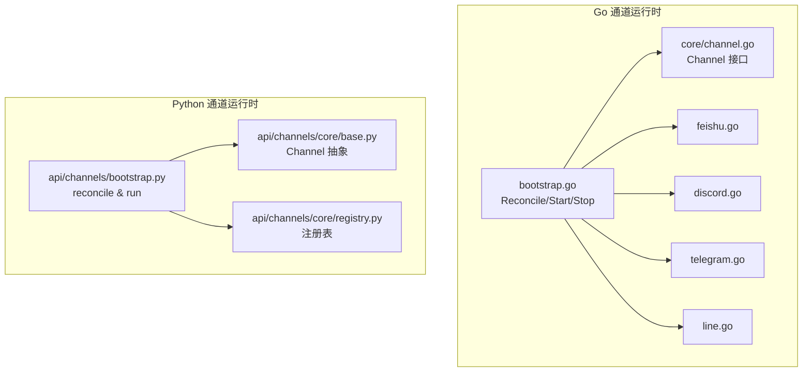

图表来源
- [internal/channels/bootstrap.go:67-161](file://internal/channels/bootstrap.go#L67-L161)
- [internal/channels/core/channel.go:21-47](file://internal/channels/core/channel.go#L21-L47)
- [api/channels/bootstrap.py:222-298](file://api/channels/bootstrap.py#L222-L298)
- [api/channels/core/base.py:33-61](file://api/channels/core/base.py#L33-L61)
- [api/channels/core/registry.py:24-48](file://api/channels/core/registry.py#L24-L48)

章节来源
- [internal/channels/bootstrap.go:67-161](file://internal/channels/bootstrap.go#L67-L161)
- [api/channels/bootstrap.py:222-298](file://api/channels/bootstrap.py#L222-L298)

## 核心组件
- 统一通道接口（Go）：定义 IncomingMessage/OutgoingMessage、MessageHandler、Channel 生命周期方法（Start/Stop/Send）。
- 统一通道接口（Python）：抽象 Channel 基类与消息数据结构，提供分发器与异常隔离。
- 通道运行时（Go）：周期 reconcile 数据库中的渠道配置，按指纹变化重启实例，管理失败重试与停止。
- 通道运行时（Python）：导入内置通道包，按配置构建实例，设置消息处理器，启动/停止通道。
- 平台适配器：实现具体平台的连接、事件接收、消息发送与鉴权。

章节来源
- [internal/channels/core/channel.go:21-47](file://internal/channels/core/channel.go#L21-L47)
- [api/channels/core/base.py:11-61](file://api/channels/core/base.py#L11-L61)
- [internal/channels/bootstrap.go:98-161](file://internal/channels/bootstrap.go#L98-L161)
- [api/channels/bootstrap.py:52-93](file://api/channels/bootstrap.py#L52-L93)

## 架构总览
下图展示从平台事件到 RAGFlow 回答的端到端流程，包括 Go 与 Python 两条路径。

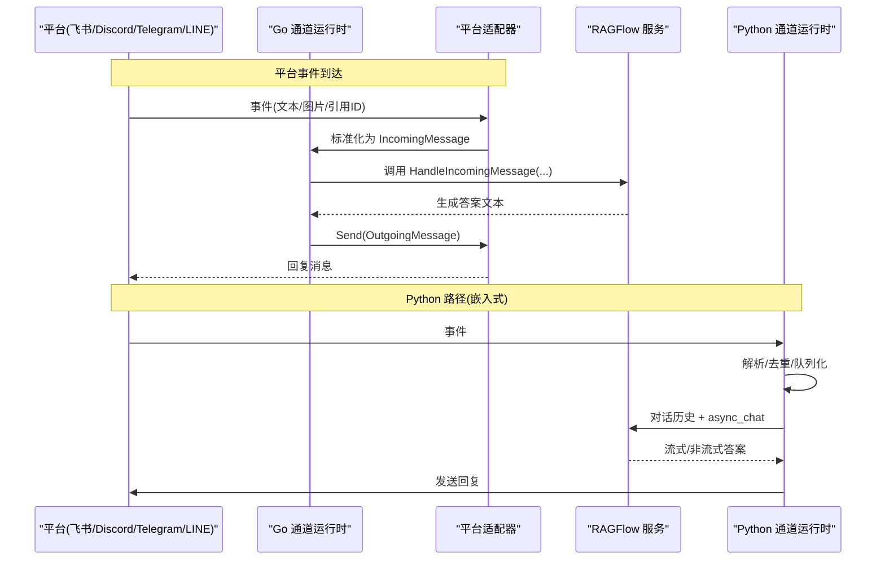

图表来源
- [internal/channels/bootstrap.go:249-287](file://internal/channels/bootstrap.go#L249-L287)
- [internal/channels/feishu.go:234-275](file://internal/channels/feishu.go#L234-L275)
- [internal/channels/discord.go:430-484](file://internal/channels/discord.go#L430-L484)
- [internal/channels/telegram.go:289-331](file://internal/channels/telegram.go#L289-L331)
- [internal/channels/line.go:241-285](file://internal/channels/line.go#L241-L285)
- [api/channels/bootstrap.py:95-176](file://api/channels/bootstrap.py#L95-L176)

## 详细组件分析

### 统一通道接口（Go）
- IncomingMessage/OutgoingMessage：承载通道名、账号ID、会话ID、消息ID、发送者、文本与原始负载。
- MessageHandler：处理入站消息的回调函数。
- Channel：定义 ChannelID/AccountID、SetMessageHandler、Start/Stop、Send。

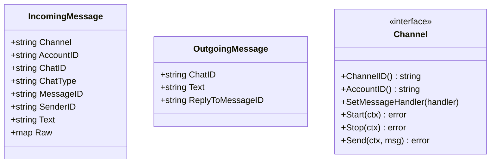

图表来源
- [internal/channels/core/channel.go:21-47](file://internal/channels/core/channel.go#L21-L47)

章节来源
- [internal/channels/core/channel.go:21-47](file://internal/channels/core/channel.go#L21-L47)

### 统一通道接口（Python）
- IncomingMessage/OutgoingMessage：数据类封装。
- Channel 抽象：set_message_handler、start/stop/send、_dispatch 异常隔离。
- registry：按名称注册与构建通道实例。

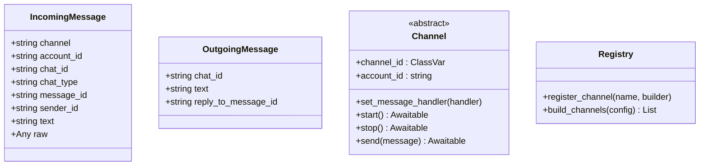

图表来源
- [api/channels/core/base.py:11-61](file://api/channels/core/base.py#L11-L61)
- [api/channels/core/registry.py:16-48](file://api/channels/core/registry.py#L16-L48)

章节来源
- [api/channels/core/base.py:11-61](file://api/channels/core/base.py#L11-L61)
- [api/channels/core/registry.py:24-48](file://api/channels/core/registry.py#L24-L48)

### 通道运行时（Go）
- Reconcile：周期扫描数据库启用渠道，计算指纹，比较运行态，执行 stop/start/restart。
- startChannel：构建平台通道，注入消息处理器，调用 Start，记录运行状态。
- 失败重试：指数退避，避免频繁重试。

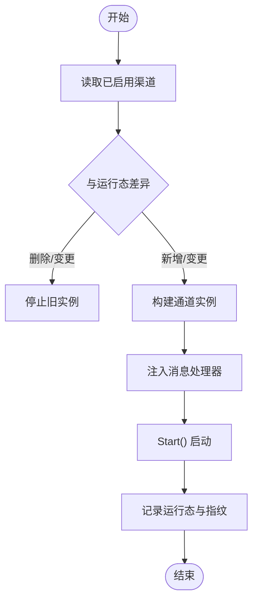

图表来源
- [internal/channels/bootstrap.go:98-161](file://internal/channels/bootstrap.go#L98-L161)
- [internal/channels/bootstrap.go:249-287](file://internal/channels/bootstrap.go#L249-L287)

章节来源
- [internal/channels/bootstrap.go:98-161](file://internal/channels/bootstrap.go#L98-L161)
- [internal/channels/bootstrap.go:249-287](file://internal/channels/bootstrap.go#L249-L287)

### 通道运行时（Python）
- _register_channels：按需导入内置通道包，缺失依赖仅禁用该通道。
- _desired_channels：读取数据库启用渠道，计算指纹。
- _reconcile：对比 desired vs running，执行 stop/start，同步 WhatsApp 网关开关。
- run_channels：主循环，周期性 reconcile。

```mermaid
sequenceDiagram
participant Loop as "run_channels"
participant DB as "数据库"
participant Reg as "注册表"
participant Ch as "通道实例"
Loop->>DB : 查询已启用渠道
DB-->>Loop : 渠道列表
Loop->>Reg : build_channels(合并配置)
Reg-->>Loop : 实例列表
Loop->>Ch : set_message_handler
Loop->>Ch : start()
Note over Loop : 每10秒重复 reconcile
```

图表来源
- [api/channels/bootstrap.py:52-93](file://api/channels/bootstrap.py#L52-L93)
- [api/channels/bootstrap.py:222-298](file://api/channels/bootstrap.py#L222-L298)

章节来源
- [api/channels/bootstrap.py:52-93](file://api/channels/bootstrap.py#L52-L93)
- [api/channels/bootstrap.py:222-298](file://api/channels/bootstrap.py#L222-L298)

### 平台适配器：飞书（Feishu）
- 接入方式：官方 SDK WebSocket 事件推送。
- 消息处理：事件解耦为 IncomingMessage，按会话分派 worker 串行处理，支持去重与超时。
- 发送消息：支持创建消息或回复消息（ReplyToMessageID）。

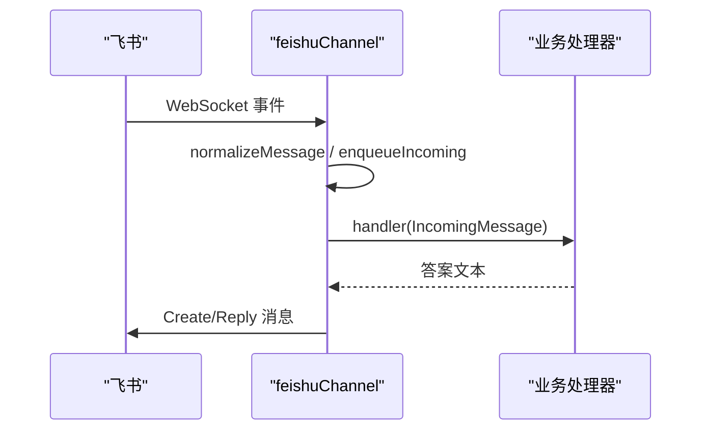

图表来源
- [internal/channels/feishu.go:234-275](file://internal/channels/feishu.go#L234-L275)
- [internal/channels/feishu.go:182-221](file://internal/channels/feishu.go#L182-L221)

章节来源
- [internal/channels/feishu.go:103-125](file://internal/channels/feishu.go#L103-L125)
- [internal/channels/feishu.go:182-221](file://internal/channels/feishu.go#L182-L221)
- [internal/channels/feishu.go:234-275](file://internal/channels/feishu.go#L234-L275)

### 平台适配器：Discord
- 接入方式：Gateway WebSocket 长连接，心跳保活，自动重连。
- 消息处理：过滤机器人消息与自身消息，按会话 worker 串行处理，支持速率限制重试。
- 发送消息：REST API 发送，支持引用回复。

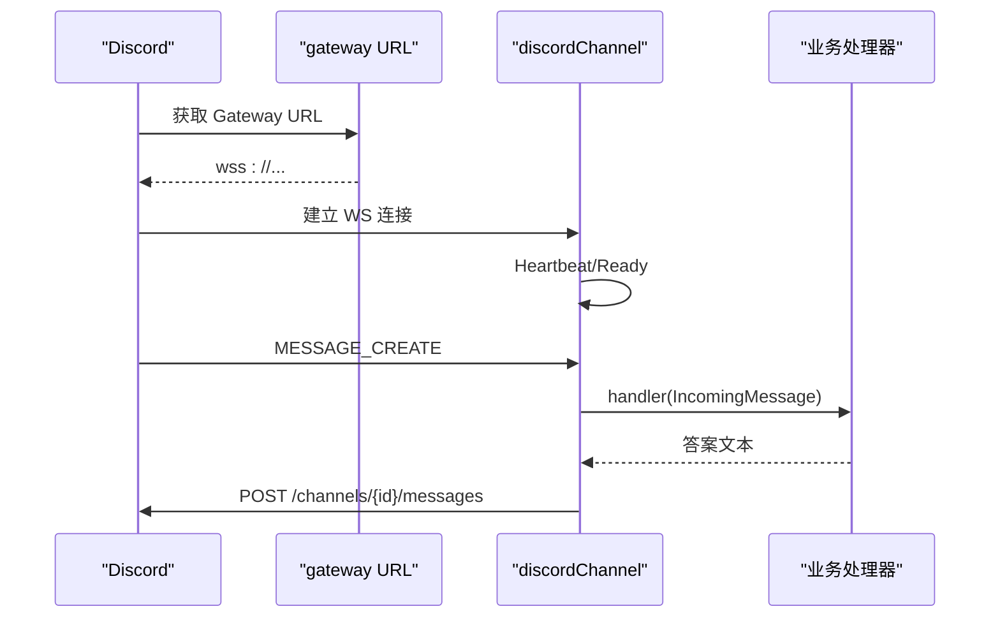

图表来源
- [internal/channels/discord.go:297-364](file://internal/channels/discord.go#L297-L364)
- [internal/channels/discord.go:430-484](file://internal/channels/discord.go#L430-L484)
- [internal/channels/discord.go:230-278](file://internal/channels/discord.go#L230-L278)

章节来源
- [internal/channels/discord.go:153-175](file://internal/channels/discord.go#L153-L175)
- [internal/channels/discord.go:230-278](file://internal/channels/discord.go#L230-L278)
- [internal/channels/discord.go:297-364](file://internal/channels/discord.go#L297-L364)

### 平台适配器：Telegram
- 接入方式：Bot API 长轮询（getUpdates），启动时清理 pending updates。
- 消息处理：有效消息映射为 IncomingMessage，直接调用处理器。
- 发送消息：sendMessage，支持 reply_parameters 引用回复。

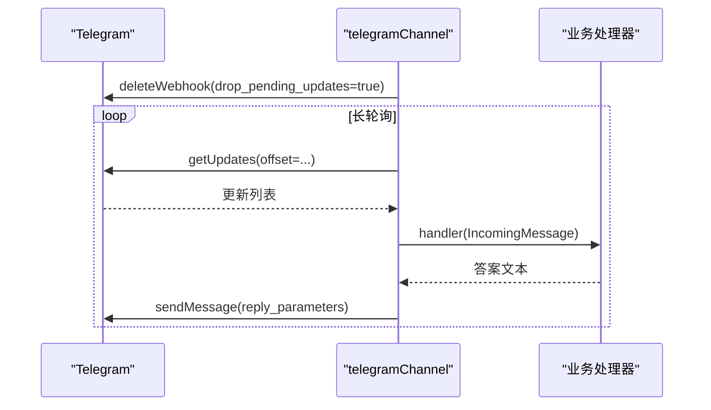

图表来源
- [internal/channels/telegram.go:226-263](file://internal/channels/telegram.go#L226-L263)
- [internal/channels/telegram.go:289-331](file://internal/channels/telegram.go#L289-L331)
- [internal/channels/telegram.go:199-224](file://internal/channels/telegram.go#L199-L224)

章节来源
- [internal/channels/telegram.go:119-134](file://internal/channels/telegram.go#L119-L134)
- [internal/channels/telegram.go:199-224](file://internal/channels/telegram.go#L199-L224)
- [internal/channels/telegram.go:226-263](file://internal/channels/telegram.go#L226-L263)

### 平台适配器：LINE
- 接入方式：自建 Webhook 服务器（可共享端口），校验签名后分发事件。
- 消息处理：事件标准化为 IncomingMessage，维护 reply token 缓存用于回复。
- 发送消息：push 或 reply 两种模式，依据是否携带 ReplyToMessageID。

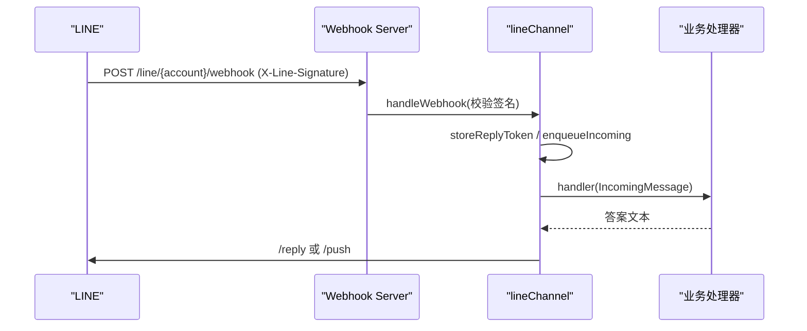

图表来源
- [internal/channels/line.go:241-285](file://internal/channels/line.go#L241-L285)
- [internal/channels/line.go:418-436](file://internal/channels/line.go#L418-L436)
- [internal/channels/line.go:478-547](file://internal/channels/line.go#L478-L547)

章节来源
- [internal/channels/line.go:120-152](file://internal/channels/line.go#L120-L152)
- [internal/channels/line.go:218-239](file://internal/channels/line.go#L218-L239)
- [internal/channels/line.go:478-547](file://internal/channels/line.go#L478-L547)

### 消息处理与上下文保持（Python 路径）
- 每个渠道消息会关联到对话（dialog）与用户会话（conversation）。
- 将用户消息追加到 conv.message，构造 reference，调用 async_chat 获取答案，持久化并回发。

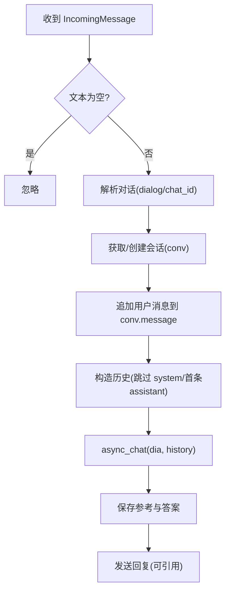

图表来源
- [api/channels/bootstrap.py:95-176](file://api/channels/bootstrap.py#L95-L176)

章节来源
- [api/channels/bootstrap.py:95-176](file://api/channels/bootstrap.py#L95-L176)

## 依赖关系分析
- Go 通道运行时依赖数据库读取渠道配置，并通过工厂方法构建具体平台通道。
- Python 通道运行时通过注册表动态加载通道实现，支持可选依赖隔离。
- 平台适配器依赖各自 SDK 或 HTTP/WebSocket 客户端。

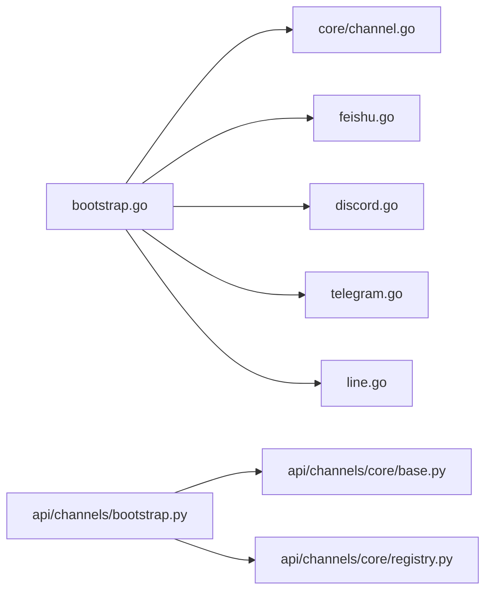

图表来源
- [internal/channels/bootstrap.go:289-311](file://internal/channels/bootstrap.go#L289-L311)
- [api/channels/bootstrap.py:52-93](file://api/channels/bootstrap.py#L52-L93)

章节来源
- [internal/channels/bootstrap.go:289-311](file://internal/channels/bootstrap.go#L289-L311)
- [api/channels/bootstrap.py:52-93](file://api/channels/bootstrap.py#L52-L93)

## 性能考虑
- 并发与队列：各平台适配器对高并发场景采用 per-chat 队列与 worker 串行处理，避免同一会话乱序；队列满时丢弃日志告警。
- 去重与过期：维护 seen 集合与 TTL，防止重复处理与内存泄漏。
- 超时与重试：HTTP/WS 请求设置超时；Discord 针对 429 进行指数退避与上限控制。
- 资源回收：Stop 时关闭连接、清空工作协程与缓存，确保优雅退出。
- 长轮询优化：Telegram 启动时 drop pending updates，减少积压。

[本节为通用指导，不直接分析具体文件]

## 故障排查指南
- 通道无法启动：检查 credential 必填字段（如 app_id/app_secret、token、channel_secret/channel_access_token），查看日志中构建失败的错误信息。
- 消息未送达：确认通道已绑定对话（chat_id），Python 路径下若未连接对话会忽略消息。
- 速率限制：Discord 返回 429 时按 Retry-After 等待；必要时降低发送频率或拆分消息。
- 签名校验失败：LINE Webhook 需正确配置 channel_secret 并在服务端验证 X-Line-Signature。
- 长轮询卡住：Telegram 网络异常时会重试；检查网络与代理设置。

章节来源
- [internal/channels/feishu.go:103-125](file://internal/channels/feishu.go#L103-L125)
- [internal/channels/discord.go:153-175](file://internal/channels/discord.go#L153-L175)
- [internal/channels/telegram.go:119-134](file://internal/channels/telegram.go#L119-L134)
- [internal/channels/line.go:120-152](file://internal/channels/line.go#L120-L152)
- [api/channels/bootstrap.py:95-176](file://api/channels/bootstrap.py#L95-L176)

## 结论
本平台通过统一的 Channel 抽象与双语言运行时（Go/Python），实现对多平台聊天机器人的灵活适配与统一管理。消息流从平台事件到 RAGFlow 回答具备清晰的职责边界与健壮的错误处理。结合队列、去重、超时与重试机制，可在高并发与不稳定网络环境下保持稳定。开发者可按接口规范快速扩展新通道，并通过配置与调试工具快速集成上线。

## 附录

### 自定义聊天通道开发指南
- 接口规范
  - Go：实现 core.Channel 接口，定义 ChannelID/AccountID、SetMessageHandler、Start/Stop、Send。
  - Python：继承 base.Channel，实现 start/stop/send，并在入口注册 builder。
- 消息格式
  - 入站：IncomingMessage（channel/account_id/chat_id/chat_type/message_id/sender_id/text/raw）。
  - 出站：OutgoingMessage（chat_id/text/reply_to_message_id）。
- 认证机制
  - 飞书：app_id/app_secret，支持 domain 切换。
  - Discord：bot token（支持前缀规范化），intents 配置。
  - Telegram：bot token，可选 api_base_url。
  - LINE：channel_secret/channel_access_token，Webhook 签名校验。
- 配置来源
  - Go：从 chat_channel.config.credential 读取平台凭证。
  - Python：通过 registry.build_channels 合并 shared 与 accounts 配置。

章节来源
- [internal/channels/core/channel.go:21-47](file://internal/channels/core/channel.go#L21-L47)
- [api/channels/core/base.py:33-61](file://api/channels/core/base.py#L33-L61)
- [internal/channels/bootstrap.go:207-247](file://internal/channels/bootstrap.go#L207-L247)
- [api/channels/core/registry.py:24-48](file://api/channels/core/registry.py#L24-L48)

### 配置示例（字段说明）
- 飞书
  - app_id/app_secret：必填
  - domain：可选（默认 feishu）
  - timeout_secs：可选（默认 30s）
- Discord
  - token：必填（支持 "Bot ..." 或 "Bearer ..." 前缀）
  - api_base_url/gateway_url：可选
  - intents：可选（默认包含必要意图）
  - timeout_secs：可选
- Telegram
  - token：必填
  - api_base_url：可选（默认 https://api.telegram.org）
- LINE
  - channel_secret/channel_access_token：必填
  - webhook_host/webhook_port：可选（默认 0.0.0.0:3001）
  - timeout_secs：可选

章节来源
- [internal/channels/feishu.go:103-125](file://internal/channels/feishu.go#L103-L125)
- [internal/channels/discord.go:153-175](file://internal/channels/discord.go#L153-L175)
- [internal/channels/telegram.go:119-134](file://internal/channels/telegram.go#L119-L134)
- [internal/channels/line.go:120-152](file://internal/channels/line.go#L120-L152)

### 安全与最佳实践
- 最小权限：为各平台应用配置最小必要权限（如仅消息读写）。
- 密钥管理：凭证存放于安全配置中心，避免硬编码。
- 传输安全：优先使用 HTTPS/WSS；LINE 必须校验签名。
- 限流与降级：遵循平台速率限制，实现退避与降级策略。
- 审计与日志：记录关键事件与错误，便于追踪与合规。

[本节为通用指导，不直接分析具体文件]