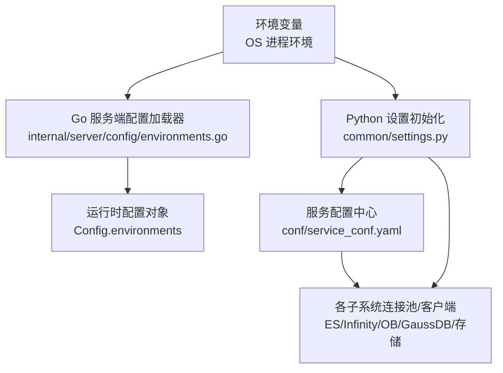
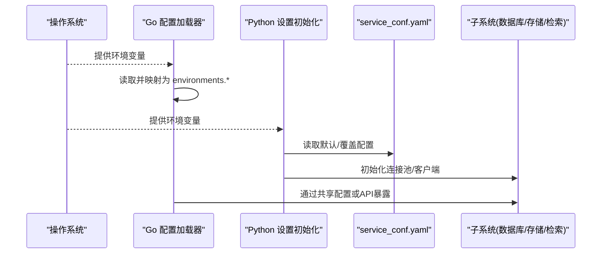
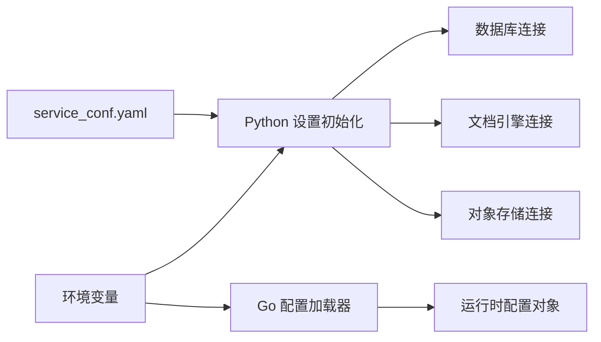

# 环境变量配置

<cite>
**本文引用的文件**
- [internal/common/environments.go](file://internal/common/environments.go)
- [internal/server/config/environments.go](file://internal/server/config/environments.go)
- [common/settings.py](file://common/settings.py)
- [conf/service_conf.yaml](file://conf/service_conf.yaml)
- [docker/.env-go](file://docker/.env-go)
- [api/ragflow_server.py](file://api/ragflow_server.py)
- [admin/server/services.py](file://admin/server/services.py)
- [internal/utility/path.go](file://internal/utility/path.go)
- [internal/service/system.go](file://internal/service/system.go)
</cite>

## 目录
1. [简介](#简介)
2. [项目结构](#项目结构)
3. [核心组件](#核心组件)
4. [架构总览](#架构总览)
5. [详细组件分析](#详细组件分析)
6. [依赖关系分析](#依赖关系分析)
7. [性能与可观测性](#性能与可观测性)
8. [故障排查指南](#故障排查指南)
9. [结论](#结论)
10. [附录：环境变量清单与最佳实践](#附录：环境变量清单与最佳实践)

## 简介
本文件系统性说明 RAGFlow 的环境变量配置体系，包括命名规范、优先级与加载机制；解释以 RAGFLOW_ 前缀的环境变量如何映射到内部配置项；覆盖数据库连接、存储、文档引擎、LLM 提供商等关键配置；并给出开发、测试、生产环境的差异化管理建议、与配置文件的重叠处理规则、热重载能力以及敏感信息安全管理最佳实践。

## 项目结构
RAGFlow 的配置由三部分构成：
- 环境变量：进程级配置，优先于配置文件，便于容器化与多环境管理
- 配置文件：位于 conf/service_conf.yaml（及子模块读取的 JSON），用于持久化与版本化管理
- 运行时服务发现：通过 Docker Compose 注入的服务名与端口（如 ES、Infinity、MinIO、Redis）

图表来源
- [internal/server/config/environments.go:121-254](file://internal/server/config/environments.go#L121-L254)
- [common/settings.py:307-480](file://common/settings.py#L307-L480)
- [conf/service_conf.yaml:1-194](file://conf/service_conf.yaml#L1-L194)

章节来源
- [internal/server/config/environments.go:121-254](file://internal/server/config/environments.go#L121-L254)
- [common/settings.py:307-480](file://common/settings.py#L307-L480)
- [conf/service_conf.yaml:1-194](file://conf/service_conf.yaml#L1-L194)

## 核心组件
- 环境变量常量定义与读取工具：统一在 Go 侧集中声明，提供 GetEnv/GetEnvSmall 等读取方法
- 服务端环境配置加载：将环境变量映射为 Config.environments 字段，供 Go 服务使用
- Python 设置初始化：启动时从环境变量与 service_conf.yaml 合并生成全局配置，驱动各子系统
- 配置路径解析：根据运行位置自动定位 conf 目录下的配置文件

章节来源
- [internal/common/environments.go:25-224](file://internal/common/environments.go#L25-L224)
- [internal/server/config/environments.go:121-254](file://internal/server/config/environments.go#L121-L254)
- [common/settings.py:307-480](file://common/settings.py#L307-L480)
- [internal/utility/path.go:94-112](file://internal/utility/path.go#L94-L112)

## 架构总览
下图展示“环境变量 → 配置对象 → 子系统”的加载链路，以及配置文件的作用域与优先级。

图表来源
- [internal/server/config/environments.go:121-254](file://internal/server/config/environments.go#L121-L254)
- [common/settings.py:307-480](file://common/settings.py#L307-L480)
- [conf/service_conf.yaml:1-194](file://conf/service_conf.yaml#L1-L194)

## 详细组件分析

### 环境变量命名规范与优先级
- 命名规范
  - 系统级开关与通用参数：使用全大写无下划线前缀（如 DB_TYPE、DOC_ENGINE、DEVICE、STORAGE_IMPL）
  - RAGFlow 专属参数：建议使用 RAGFLOW_ 前缀（如 RAGFLOW_SECRET_KEY、RAGFLOW_CONF_DIR、RAGFLOW_TTS_CACHE_TTL_SECONDS）
  - 第三方服务参数：按提供方约定（如 OPENAI_API_KEY、MINIO_HOST）
- 优先级
  - 环境变量 > 配置文件（service_conf.yaml）> 代码默认值
  - 同一来源内，后加载的值会覆盖先前的同名键（例如 Python 初始化阶段对 DOC_ENGINE 的多次赋值）

章节来源
- [internal/common/environments.go:34-224](file://internal/common/environments.go#L34-L224)
- [common/settings.py:307-480](file://common/settings.py#L307-L480)
- [conf/service_conf.yaml:1-194](file://conf/service_conf.yaml#L1-L194)

### RAGFLOW_ 前缀环境变量映射
- RAGFLOW_SECRET_KEY
  - 用途：会话签名/加密密钥
  - 行为：若长度不足或未设置，Python 侧会尝试从配置文件获取，否则回退到动态生成并告警
  - 参考路径：[common/settings.py:251-288](file://common/settings.py#L251-L288)
- RAGFLOW_CONF_DIR
  - 用途：指定配置文件根目录
  - 行为：Go 侧读取后影响配置查找路径
  - 参考路径：[internal/server/config/environments.go:227-230](file://internal/server/config/environments.go#L227-L230)
- RAGFLOW_TTS_CACHE_TTL_SECONDS
  - 用途：TTS 缓存过期时间（秒）
  - 行为：未设置时使用默认值（7天）
  - 参考路径：[internal/server/config/environments.go:252-254](file://internal/server/config/environments.go#L252-L254)

章节来源
- [common/settings.py:251-288](file://common/settings.py#L251-L288)
- [internal/server/config/environments.go:227-254](file://internal/server/config/environments.go#L227-L254)

### 数据库连接配置
- 元数据数据库类型：DB_TYPE
  - 支持 mysql、postgres、gaussdb、oceanbase 等
  - 当 DB_TYPE=gaussdb 时，仅读取 GAUSSDB_METADATA_* 系列环境变量，避免与文档引擎 GaussDB 配置混淆
  - 参考路径：[common/settings.py:131-154](file://common/settings.py#L131-L154)、[common/settings.py:307-310](file://common/settings.py#L307-L310)
- 文档引擎：DOC_ENGINE
  - 可选：elasticsearch、infinity、oceanbase、opensearch、seekdb、gaussdb、serenedb
  - 选择后会初始化对应的 docStoreConn/msgStoreConn
  - 参考路径：[common/settings.py:392-424](file://common/settings.py#L392-L424)
- 各引擎连接参数
  - Elasticsearch/OpenSearch：es/os 段
  - Infinity：infinity.uri/postgres_port/db_name
  - OceanBase/SeekDB：oceanbase/seekdb 段
  - GaussDB：gaussdb 段（注意与元数据 GaussDB 区分）
  - 参考路径：[conf/service_conf.yaml:9-65](file://conf/service_conf.yaml#L9-L65)

章节来源
- [common/settings.py:131-154](file://common/settings.py#L131-L154)
- [common/settings.py:392-424](file://common/settings.py#L392-L424)
- [conf/service_conf.yaml:9-65](file://conf/service_conf.yaml#L9-L65)

### 存储配置
- 存储实现：STORAGE_IMPL
  - 支持 MINIO、AWS_S3、OSS、AZURE_SPN/SAS、GCS、OPENDAL
  - 对应配置段：minio/s3/oss/azure/gcs/opendal
  - 参考路径：[common/settings.py:221-222](file://common/settings.py#L221-L222)、[common/settings.py:442-455](file://common/settings.py#L442-L455)
- MinIO 示例（Docker 默认）
  - MINIO_HOST/MINIO_PORT/MINIO_USER/MINIO_PASSWORD
  - 参考路径：[docker/.env-go:169-182](file://docker/.env-go#L169-L182)

章节来源
- [common/settings.py:221-222](file://common/settings.py#L221-L222)
- [common/settings.py:442-455](file://common/settings.py#L442-L455)
- [docker/.env-go:169-182](file://docker/.env-go#L169-L182)

### LLM 提供商设置
- 默认 LLM 配置来自 user_default_llm 段（factory/base_url/default_models）
- 可通过 COMPOSE_PROFILES 与 TEI_MODEL/TEI_BASE_URL 启用本地嵌入服务
- 参考路径：[common/settings.py:312-317](file://common/settings.py#L312-L317)、[common/settings.py:367-372](file://common/settings.py#L367-L372)
- 参考路径：[conf/service_conf.yaml:79-85](file://conf/service_conf.yaml#L79-L85)

章节来源
- [common/settings.py:312-317](file://common/settings.py#L312-L317)
- [common/settings.py:367-372](file://common/settings.py#L367-L372)
- [conf/service_conf.yaml:79-85](file://conf/service_conf.yaml#L79-L85)

### 安全与认证
- 注册开关：REGISTER_ENABLED / ENABLE_REGISTER
- 禁用密码登录：DISABLE_PASSWORD_LOGIN
- 参考路径：[common/settings.py:319-334](file://common/settings.py#L319-L334)、[docker/.env-go:323-327](file://docker/.env-go#L323-L327)

章节来源
- [common/settings.py:319-334](file://common/settings.py#L319-L334)
- [docker/.env-go:323-327](file://docker/.env-go#L323-L327)

### 调试与开发辅助
- 调试监听端口：RAGFLOW_DEBUGPY_LISTEN
- API 计时：RAGFLOW_API_TIMING
- 参考路径：[api/ragflow_server.py:84-166](file://api/ragflow_server.py#L84-L166)

章节来源
- [api/ragflow_server.py:84-166](file://api/ragflow_server.py#L84-L166)

## 依赖关系分析
- 环境变量与配置文件的耦合点
  - Python 初始化阶段同时读取环境变量与 service_conf.yaml，形成最终配置
  - Go 服务端通过 environments.go 将环境变量映射为运行时配置对象
- 外部依赖
  - 数据库：MySQL/PostgreSQL/GaussDB/OceanBase/SeekDB
  - 文档引擎：Elasticsearch/OpenSearch/Infinity
  - 对象存储：MinIO/AWS S3/OSS/Azure/GCS/OpenDAL
  - 缓存/队列：Redis/NATS/ClickHouse

图表来源
- [common/settings.py:307-480](file://common/settings.py#L307-L480)
- [internal/server/config/environments.go:121-254](file://internal/server/config/environments.go#L121-L254)
- [conf/service_conf.yaml:1-194](file://conf/service_conf.yaml#L1-L194)

章节来源
- [common/settings.py:307-480](file://common/settings.py#L307-L480)
- [internal/server/config/environments.go:121-254](file://internal/server/config/environments.go#L121-L254)
- [conf/service_conf.yaml:1-194](file://conf/service_conf.yaml#L1-L194)

## 性能与可观测性
- 批量与并发
  - DOC_BULK_SIZE、EMBEDDING_BATCH_SIZE 控制批处理大小
  - MAX_CONTENT_LENGTH 限制上传文件大小
  - 参考路径：[common/settings.py:500-503](file://common/settings.py#L500-L503)、[docker/.env-go:297-303](file://docker/.env-go#L297-L303)
- 日志与追踪
  - LOG_LEVELS 可调整包级日志级别
  - OTEL/Jaeger 可在 Compose profile 中启用
  - 参考路径：[docker/.env-go:305-312](file://docker/.env-go#L305-L312)、[docker/.env-go:220-227](file://docker/.env-go#L220-L227)

章节来源
- [common/settings.py:500-503](file://common/settings.py#L500-L503)
- [docker/.env-go:305-312](file://docker/.env-go#L305-L312)
- [docker/.env-go:220-227](file://docker/.env-go#L220-L227)

## 故障排查指南
- 常见问题
  - 无法连接数据库/文档引擎：检查 DB_TYPE/DOC_ENGINE 与对应连接参数是否一致
  - 存储不可用：确认 STORAGE_IMPL 与对应存储配置（如 minio/s3/oss）
  - 注册/登录异常：核对 REGISTER_ENABLED/DISABLE_PASSWORD_LOGIN
  - 大文件上传失败：调整 MAX_CONTENT_LENGTH 与 Nginx client_max_body_size
- 诊断步骤
  - 查看当前生效的环境变量快照（部分接口会返回）
  - 校验配置文件路径是否正确（RAGFLOW_CONF_DIR）
  - 逐步缩小范围：先关闭第三方依赖，验证最小可用配置

章节来源
- [admin/server/services.py:487-499](file://admin/server/services.py#L487-L499)
- [internal/utility/path.go:94-112](file://internal/utility/path.go#L94-L112)

## 结论
RAGFlow 采用“环境变量优先、配置文件兜底”的统一配置模型。通过集中化的环境变量常量与清晰的映射逻辑，实现了跨语言（Go/Python）一致的运行时配置。结合 Docker Compose 与环境隔离，可轻松实现开发、测试、生产的差异化部署。遵循本文的最佳实践，可显著提升配置的可维护性与安全性。

## 附录：环境变量清单与最佳实践

### 环境变量清单（节选）
- 系统与通用
  - DB_TYPE：元数据数据库类型（mysql/postgres/gaussdb/oceanbase）
  - DEVICE：推理设备（cpu/gpu）
  - DOC_ENGINE：文档引擎（elasticsearch/infinity/oceanbase/opensearch/seekdb/gaussdb/serenedb）
  - STORAGE_IMPL：对象存储实现（MINIO/AWS_S3/OSS/AZURE_*/GCS/OPENDAL）
  - MAX_CONTENT_LENGTH：最大请求体大小
- RAGFlow 专属（RAGFLOW_ 前缀）
  - RAGFLOW_SECRET_KEY：安全密钥（长度≥32）
  - RAGFLOW_CONF_DIR：配置文件根目录
  - RAGFLOW_TTS_CACHE_TTL_SECONDS：TTS 缓存 TTL（秒）
- 第三方服务
  - OPENAI_API_KEY、OPENAI_BASE_URL、OPENAI_MODEL
  - MINIO_HOST/MINIO_PORT/MINIO_USER/MINIO_PASSWORD
  - ES_HOST/ES_PORT/ELASTIC_PASSWORD
  - INFINITY_URI/INFINITY_PSQL_PORT
  - REDIS_HOST/REDIS_PORT/REDIS_PASSWORD

### 优先级与重叠处理规则
- 环境变量覆盖配置文件：相同键存在时，环境变量生效
- Python 初始化顺序：先读环境变量，再读 service_conf.yaml，最后应用默认值
- Go 配置加载：读取环境变量并写入运行时配置对象，不影响 Python 侧全局变量

### 热重载机制
- 当前实现中，配置在进程启动时加载；修改环境变量或配置文件需重启服务生效
- 如需热更新，建议在编排层进行滚动重启或蓝绿发布

### 敏感信息管理
- 使用环境变量注入密钥（如 RAGFLOW_SECRET_KEY、数据库密码、对象存储密钥）
- 避免将明文密钥提交至仓库；使用密钥管理服务（如 Vault、KMS）或编排平台 Secret
- 开启加密存储（RAGFLOW_CRYPTO_ENABLED）时需妥善保管 RAGFLOW_CRYPTO_KEY

### 环境差异化管理建议
- 开发
  - 使用 docker/.env-go 中的默认值快速启动
  - 启用调试端口（RAGFLOW_DEBUGPY_LISTEN）
- 测试
  - 通过 COMPOSE_PROFILES 切换不同后端（如 tei-cpu/tei-gpu）
  - 使用独立数据库/存储实例
- 生产
  - 强制设置强密码与 RAGFLOW_SECRET_KEY
  - 关闭注册（REGISTER_ENABLED=0）、按需禁用密码登录（DISABLE_PASSWORD_LOGIN=true）
  - 启用日志与追踪（LOG_LEVELS、OTEL/Jaeger）

章节来源
- [docker/.env-go:1-406](file://docker/.env-go#L1-L406)
- [common/settings.py:307-480](file://common/settings.py#L307-L480)
- [internal/server/config/environments.go:121-254](file://internal/server/config/environments.go#L121-L254)
- [conf/service_conf.yaml:1-194](file://conf/service_conf.yaml#L1-L194)