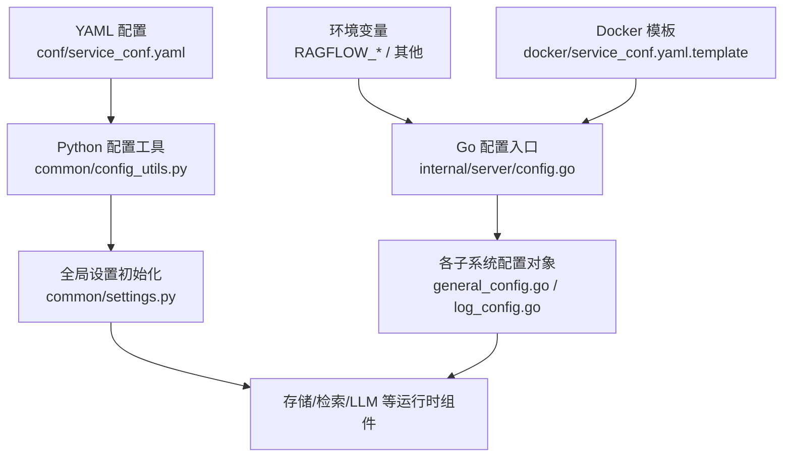
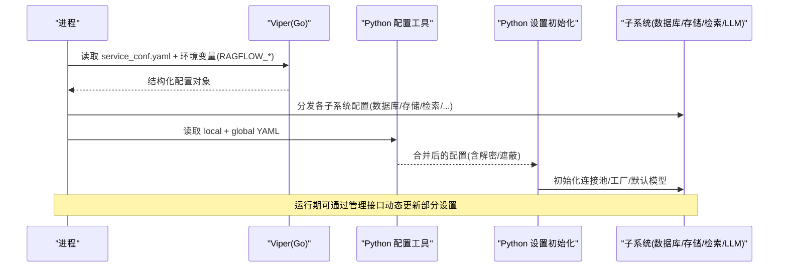
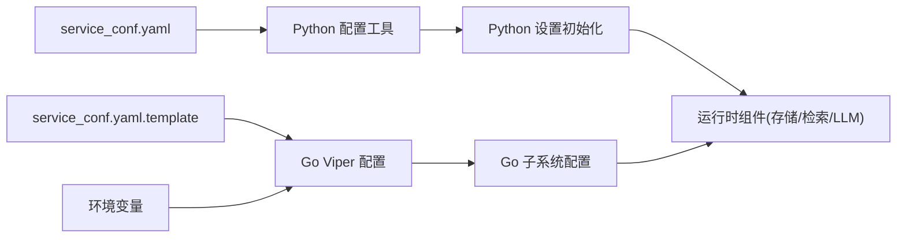

# 配置管理系统

<cite>
**本文引用的文件**
- [service_conf.yaml](file://conf/service_conf.yaml)
- [service_conf.yaml.template](file://docker/service_conf.yaml.template)
- [config_utils.py](file://common/config_utils.py)
- [settings.py](file://common/settings.py)
- [config.go](file://internal/server/config.go)
- [general_config.go](file://internal/server/config/general_config.go)
- [log_config.go](file://internal/server/config/log_config.go)
- [llm_factories.json](file://conf/llm_factories.json)
- [all_models.json](file://conf/all_models.json)
- [services.py](file://admin/server/services.py)
</cite>

## 目录
1. [简介](#简介)
2. [项目结构](#项目结构)
3. [核心组件](#核心组件)
4. [架构总览](#架构总览)
5. [详细组件分析](#详细组件分析)
6. [依赖关系分析](#依赖关系分析)
7. [性能考虑](#性能考虑)
8. [故障排查指南](#故障排查指南)
9. [结论](#结论)
10. [附录](#附录)

## 简介
本文件系统性说明 RAGFlow 的配置体系，覆盖环境变量、配置文件管理、动态配置更新、多环境差异化配置、配置验证与审计、以及安全注意事项。重点包括：
- 服务配置（主机、端口、心跳等）
- 数据库连接（MySQL、OceanBase、GaussDB、SeekDB、Infinity、SereneDB）
- 存储配置（MinIO、S3、OSS、GCS、Azure）
- LLM 提供商与默认模型配置
- 消息队列与缓存（NATS、Redis）
- 日志与可观测性（OpenTelemetry）
- 认证与权限（OAuth/OIDC、站点开关、客户端鉴权）
- 邮件（SMTP）
- 文档引擎（Elasticsearch/OpenSearch/Infinity/OceanBase/GaussDB/SereneDB）

## 项目结构
RAGFlow 的配置由 Python 侧与 Go 侧共同维护：
- Python 侧通过 YAML 配置与环境变量加载，提供读取、合并、解密与写入能力
- Go 侧通过 Viper 统一解析 YAML、环境变量与模板渲染，导出各子系统配置对象
- 运行时可通过管理接口对系统设置进行动态更新（如用户默认 LLM、功能开关等）

图表来源
- [config_utils.py:57-77](file://common/config_utils.py#L57-L77)
- [config.go:40-164](file://internal/server/config.go#L40-L164)
- [service_conf.yaml.template:1-100](file://docker/service_conf.yaml.template#L1-L100)

章节来源
- [config_utils.py:57-77](file://common/config_utils.py#L57-L77)
- [config.go:40-164](file://internal/server/config.go#L40-L164)
- [service_conf.yaml.template:1-100](file://docker/service_conf.yaml.template#L1-L100)

## 核心组件
- 配置加载与合并
  - Python：从 conf/local.service_conf.yaml 与 conf/service_conf.yaml 合并，支持敏感字段遮蔽输出与密码解密
  - Go：Viper 自动读取 service_conf.yaml、环境变量（前缀 RAGFLOW_），并解析为结构化配置
- 运行时设置初始化
  - Python：根据 DOC_ENGINE、STORAGE_IMPL_TYPE、DB_TYPE 等选择具体连接器与默认值
- 动态配置更新
  - 管理端服务提供按名称更新系统设置的接口，支持类型推断与校验
- 多环境差异
  - Docker 模板使用 ${VAR:-default} 语法注入环境变量；Go 侧支持 environment 覆盖 general 配置

章节来源
- [config_utils.py:57-77](file://common/config_utils.py#L57-L77)
- [config_utils.py:116-158](file://common/config_utils.py#L116-L158)
- [config.go:40-164](file://internal/server/config.go#L40-L164)
- [general_config.go:97-132](file://internal/server/config/general_config.go#L97-L132)
- [services.py:445-486](file://admin/server/services.py#L445-L486)

## 架构总览
下图展示配置在启动期的加载顺序与数据流向：

图表来源
- [config.go:40-164](file://internal/server/config.go#L40-L164)
- [config_utils.py:57-77](file://common/config_utils.py#L57-L77)
- [settings.py:307-480](file://common/settings.py#L307-L480)

## 详细组件分析

### 环境变量与配置文件优先级
- 环境变量
  - Go 侧：以 RAGFLOW_ 为前缀的环境变量自动映射到配置键（点号替换为下划线）
  - Python 侧：部分关键项通过环境变量覆盖（如 DB_TYPE、DOC_ENGINE、STORAGE_IMPL 等）
- 配置文件
  - 主配置：conf/service_conf.yaml
  - 本地覆盖：conf/local.service_conf.yaml（优先合并）
  - Docker 模板：docker/service_conf.yaml.template（部署时渲染）
- 优先级（从高到低）
  - 环境变量 > 本地覆盖(local.*) > 全局配置(service_conf.yaml) > 模板默认值

章节来源
- [config.go:56-68](file://internal/server/config.go#L56-L68)
- [config_utils.py:57-77](file://common/config_utils.py#L57-L77)
- [service_conf.yaml.template:1-100](file://docker/service_conf.yaml.template#L1-L100)

### 服务配置
- 服务监听与心跳
  - ragflow/admin 的 host 与 http_port
  - heartbeat_interval（心跳间隔）
- 日志
  - level/format/path/max_size/max_backups/max_age/compress
- 语言与模式
  - language/mode（由 general 子配置提供）

章节来源
- [service_conf.yaml:1-8](file://conf/service_conf.yaml#L1-L8)
- [service_conf.yaml.template:1-10](file://docker/service_conf.yaml.template#L1-L10)
- [log_config.go:31-65](file://internal/server/config/log_config.go#L31-L65)
- [general_config.go:76-132](file://internal/server/config/general_config.go#L76-L132)

### 数据库连接配置
- 元数据库
  - MySQL：name/user/password/host/port 等
  - OceanBase：scheme/config(db_name,user,password,host,port)
  - GaussDB：通过 GAUSSDB_METADATA_* 环境变量隔离元数据库连接
  - SeekDB：类似 OceanBase 的 lite 版本
- 文档/消息存储引擎
  - Elasticsearch/OpenSearch：hosts/username/password
  - Infinity：uri/postgres_port/db_name
  - SereneDB：host/port/user/password/db_name
- 连接参数
  - max_connections/stale_timeout/max_allowed_packet 等

章节来源
- [service_conf.yaml:9-65](file://conf/service_conf.yaml#L9-L65)
- [service_conf.yaml.template:9-72](file://docker/service_conf.yaml.template#L9-L72)
- [settings.py:147-158](file://common/settings.py#L147-L158)
- [settings.py:392-441](file://common/settings.py#L392-L441)

### 存储配置
- 对象存储
  - MinIO：user/password/host/bucket/prefix_path
  - S3/AWS：access_key/secret_key/region/endpoint_url/bucket
  - OSS：access_key/secret_key/endpoint_url/region/bucket/signature_version/addressing_style
  - GCS：bucket/prefix_path/endpoint_url
  - Azure：SPN/SAS 两种认证方式
- 加密存储
  - 可选启用 RAGFLOW_CRYPTO_ENABLED，并通过算法与密钥包装底层存储

章节来源
- [service_conf.yaml:18-23](file://conf/service_conf.yaml#L18-L23)
- [service_conf.yaml.template:18-27](file://docker/service_conf.yaml.template#L18-L27)
- [service_conf.yaml.template:115-148](file://docker/service_conf.yaml.template#L115-L148)
- [settings.py:442-473](file://common/settings.py#L442-L473)

### 消息队列与缓存
- 消息队列
  - NATS：host/port
  - Ingestor 任务队列：mq_type、并发 worker、编译器池大小
- 缓存
  - Redis：db/username/password/host

章节来源
- [service_conf.yaml:48-59](file://conf/service_conf.yaml#L48-L59)
- [service_conf.yaml.template:73-80](file://docker/service_conf.yaml.template#L73-L80)

### LLM 提供商与默认模型
- 提供商清单
  - llm_factories.json 定义厂商、模型能力标签、最大 token、是否支持工具等
- 模型清单
  - all_models.json 定义模型别名、上下文长度、输出上限等
- 默认模型与全局 API Key/Base URL
  - user_default_llm 中可设置 chat/embedding/rerank/asr/vision 模型及 per-model 的 factory/api_key/base_url
  - 全局 LLM_FACTORY/API_KEY/LLM_BASE_URL 作为兜底

章节来源
- [llm_factories.json:1-800](file://conf/llm_factories.json#L1-L800)
- [all_models.json:1-800](file://conf/all_models.json#L1-L800)
- [service_conf.yaml:79-85](file://conf/service_conf.yaml#L79-L85)
- [service_conf.yaml.template:100-105](file://docker/service_conf.yaml.template#L100-L105)
- [settings.py:312-363](file://common/settings.py#L312-L363)

### 认证、权限与 OAuth/OIDC
- 站点级认证
  - authentication.client.switch/http_app_key/http_secret_key
  - authentication.site.switch/disable_password_login
- OAuth/OIDC
  - oauth.oauth2/oidc.github 等客户端 ID、密钥、回调地址等
- 权限开关
  - permission.switch/component/dataset

章节来源
- [service_conf.yaml.template:170-204](file://docker/service_conf.yaml.template#L170-L204)
- [settings.py:381-390](file://common/settings.py#L381-L390)

### 邮件（SMTP）
- mail_server/mail_port/mail_use_ssl/mail_use_tls
- mail_username/mail_password/mail_default_sender/mail_frontend_url

章节来源
- [service_conf.yaml.template:205-215](file://docker/service_conf.yaml.template#L205-L215)
- [settings.py:485-498](file://common/settings.py#L485-L498)

### 可观测性与追踪
- OpenTelemetry
  - otel.host/port/secure/sample_ratio/stdout/enable

章节来源
- [service_conf.yaml:66-72](file://conf/service_conf.yaml#L66-L72)
- [service_conf.yaml.template:87-93](file://docker/service_conf.yaml.template#L87-L93)

### 动态配置更新与管理
- 管理端服务提供按名称更新系统设置的接口，支持：
  - 类型推断与校验
  - 不存在则创建新设置
  - 记录来源（admin）
- 配置导出与审计
  - 支持导出当前所有配置（脱敏）
  - 日志打印包含 key/value 便于审计

章节来源
- [services.py:445-486](file://admin/server/services.py#L445-L486)
- [config_utils.py:80-113](file://common/config_utils.py#L80-L113)
- [config.go:271-284](file://internal/server/config.go#L271-L284)

### 多环境配置管理
- Docker 模板使用 ${VAR:-default} 注入环境变量，便于不同环境差异化
- Go 侧 environment 可覆盖 general 中的数据库/文档引擎/语言等
- Python 侧通过环境变量覆盖关键开关（如 DOC_ENGINE、STORAGE_IMPL、DB_TYPE）

章节来源
- [service_conf.yaml.template:1-100](file://docker/service_conf.yaml.template#L1-L100)
- [general_config.go:97-132](file://internal/server/config/general_config.go#L97-L132)
- [settings.py:157-173](file://common/settings.py#L157-L173)

### 配置验证与安全
- 密码解密
  - 支持通过 encrypt_module/private_key 解密数据库密码
- 敏感信息遮蔽
  - 显示配置时对 password/access_key/secret_key/sas_token/client_secret/http_secret_key 等进行遮蔽
- 密钥管理
  - SECRET_KEY 优先从环境变量或配置获取，否则生成并持久化至 Redis
- 加密存储
  - 可选启用 RAGFLOW_CRYPTO_ENABLED，使用指定算法与密钥包装存储实现

章节来源
- [config_utils.py:124-158](file://common/config_utils.py#L124-L158)
- [config_utils.py:80-113](file://common/config_utils.py#L80-L113)
- [settings.py:251-288](file://common/settings.py#L251-L288)
- [settings.py:457-473](file://common/settings.py#L457-L473)

## 依赖关系分析

图表来源
- [config_utils.py:57-77](file://common/config_utils.py#L57-L77)
- [config.go:40-164](file://internal/server/config.go#L40-L164)
- [service_conf.yaml.template:1-100](file://docker/service_conf.yaml.template#L1-L100)

章节来源
- [config_utils.py:57-77](file://common/config_utils.py#L57-L77)
- [config.go:40-164](file://internal/server/config.go#L40-L164)

## 性能考虑
- 数据库连接池
  - MySQL 的 max_connections/stale_timeout 影响并发与连接回收
- 批量与批处理
  - DOC_BULK_SIZE、EMBEDDING_BATCH_SIZE 控制批量写入与嵌入计算效率
- 并发与队列
  - ingestor.max_concurrent_workers、file_syncer.max_concurrent_syncs 控制吞吐
- 日志轮转
  - max_size/max_backups/max_age 避免磁盘占用过高

章节来源
- [service_conf.yaml:9-17](file://conf/service_conf.yaml#L9-L17)
- [service_conf.yaml:73-78](file://conf/service_conf.yaml#L73-L78)
- [settings.py:500-503](file://common/settings.py#L500-L503)
- [log_config.go:31-65](file://internal/server/config/log_config.go#L31-L65)

## 故障排查指南
- 无法连接数据库
  - 检查 DB_TYPE 与对应 section 的 host/port/用户名/密码
  - 确认 GaussDB 元数据库通过 GAUSSDB_METADATA_* 正确配置
- 文档引擎不可用
  - 检查 DOC_ENGINE 与 es/os/infinity/oceanbase/gaussdb/serenedb 的连接信息
- 对象存储失败
  - 核对 STORAGE_IMPL_TYPE 与对应 section 的凭据与 endpoint
- LLM 调用失败
  - 检查 user_default_llm 的 model/factory/api_key/base_url
  - 确认 llm_factories.json 中模型可用
- 配置未生效
  - 确认环境变量前缀 RAGFLOW_ 与键名映射
  - 确认 local.* 覆盖是否被正确加载
- 日志过大
  - 调整 log.max_size/max_backups/max_age

章节来源
- [settings.py:147-173](file://common/settings.py#L147-L173)
- [settings.py:392-441](file://common/settings.py#L392-L441)
- [settings.py:442-473](file://common/settings.py#L442-L473)
- [settings.py:312-363](file://common/settings.py#L312-L363)
- [config.go:40-164](file://internal/server/config.go#L40-L164)

## 结论
RAGFlow 的配置体系通过“YAML + 环境变量 + 模板渲染”的多层机制，结合 Python 与 Go 双栈实现，提供了灵活、可扩展且安全的配置管理能力。通过动态更新、审计与加密能力，可满足开发、测试、生产等多环境的差异化需求，同时保障敏感信息与运行稳定性。

## 附录

### 常用环境变量速查
- 通用
  - RAGFLOW_HOST/RAGFLOW_PORT（服务监听）
  - TZ（时区）
- 数据库
  - DB_TYPE、MYSQL_*、OCEANBASE_*、GAUSSDB_METADATA_*、SEEKDB_*
- 文档引擎
  - DOC_ENGINE、ES_*、OS_*、INFINITY_*、SERENEDB_*
- 存储
  - STORAGE_IMPL、MINIO_*、S3_*、OSS_*、GCS_*、AZURE_*
- 缓存/队列
  - REDIS_*、NATS_*
- 可观测性
  - OTEL_*
- 安全
  - RAGFLOW_SECRET_KEY、RAGFLOW_CRYPTO_ENABLED、RAGFLOW_CRYPTO_ALGORITHM、RAGFLOW_CRYPTO_KEY

章节来源
- [service_conf.yaml.template:1-100](file://docker/service_conf.yaml.template#L1-L100)
- [settings.py:157-173](file://common/settings.py#L157-L173)
- [settings.py:251-288](file://common/settings.py#L251-L288)
- [settings.py:457-473](file://common/settings.py#L457-L473)