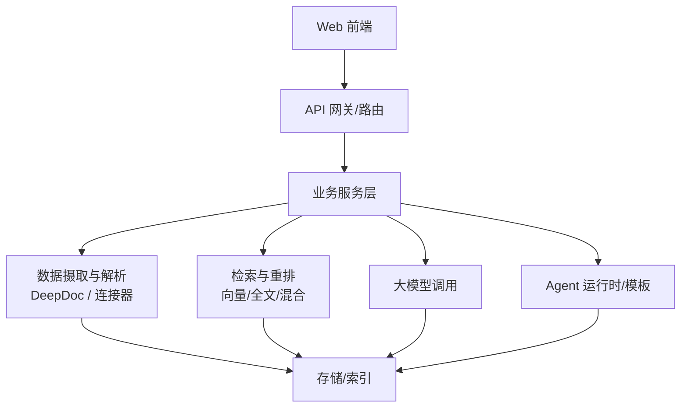
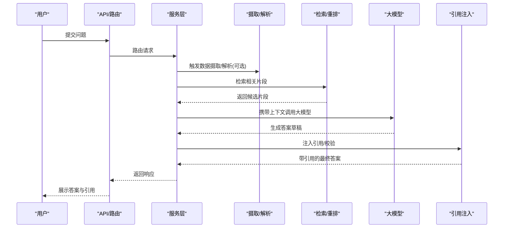
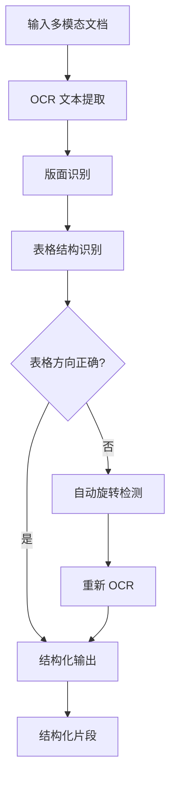
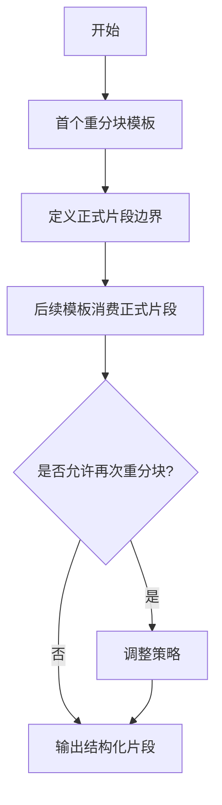
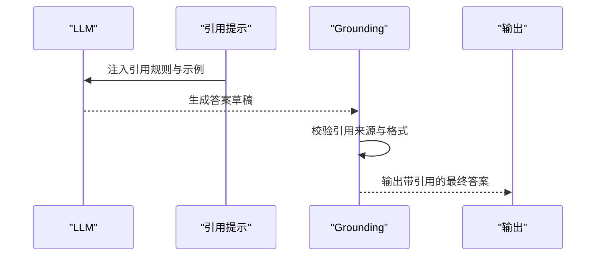
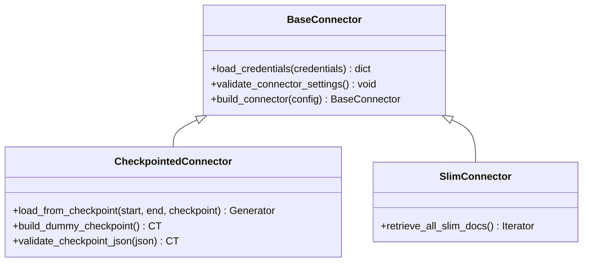
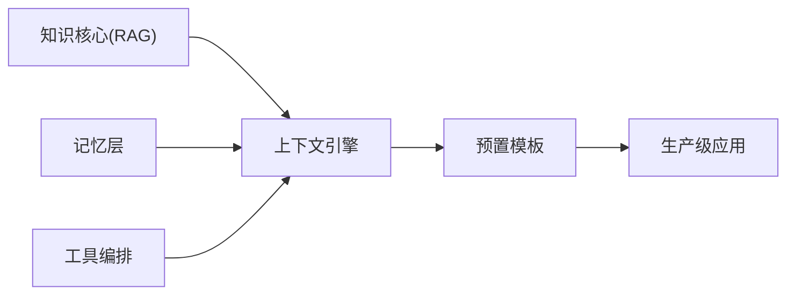
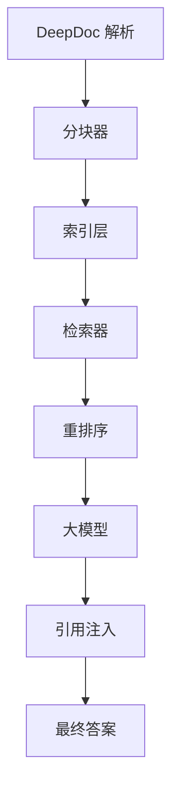

# 什么是RAGFlow

<cite>
**本文引用的文件**
- [README.md](file://README.md)
- [docs/basics/rag.md](file://docs/basics/rag.md)
- [docs/basics/agent_context_engine.md](file://docs/basics/agent_context_engine.md)
- [deepdoc/README.md](file://deepdoc/README.md)
- [common/data_source/interfaces.py](file://common/data_source/interfaces.py)
- [common/data_source/__init__.py](file://common/data_source/__init__.py)
- [internal/agent/component/prompts/citation.go](file://internal/agent/component/prompts/citation.go)
- [rag/flow/compiler/compiler.py](file://rag/flow/compiler/compiler.py)
- [rag/advanced_rag/knowlege_compile/structure.py](file://rag/advanced_rag/knowlege_compile/structure.py)
- [internal/ingestion/component/chunker/token.go](file://internal/ingestion/component/chunker/token.go)
- [agent/templates/deep_research.json](file://agent/templates/deep_research.json)
- [agent/templates/web_search_assistant.json](file://agent/templates/web_search_assistant.json)
</cite>

## 目录
1. [简介](#简介)
2. [项目结构](#项目结构)
3. [核心组件](#核心组件)
4. [架构总览](#架构总览)
5. [详细组件分析](#详细组件分析)
6. [依赖关系分析](#依赖关系分析)
7. [性能考量](#性能考量)
8. [故障排查指南](#故障排查指南)
9. [结论](#结论)
10. [附录](#附录)

## 简介
RAGFlow 是一款领先的开源检索增强生成（RAG）引擎，将前沿的 RAG 与 Agent 能力融合，为大型语言模型构建高保真、可追溯的上下文层。它提供端到端的 RAG 工作流，适配个人与企业级规模；通过融合的上下文引擎与预置 Agent 模板，帮助开发者以高效、精确的方式将复杂数据转化为生产就绪的 AI 系统。

其核心价值主张在于：
- 以“高质量输入，高质量输出”为原则，从多模态、异构数据中抽取结构化知识
- 基于模板的智能分块，兼顾语义完整性与检索粒度
- 减少幻觉的可信引用机制，使回答具备可溯源性
- 兼容多种异构数据源，打通企业内外部信息孤岛
- 借助上下文引擎与 Agent 模板，将复杂数据编排为可复用的生产级智能应用

对于初学者，RAG 的本质是在生成答案前，先从外部知识库检索最相关的上下文作为“证据”，再让大模型组织并生成答案。RAGFlow 在“检索”这一关键环节上做了深度优化，覆盖文档解析、分块策略、混合检索、重排序、引用注入等全链路，从而显著提升专业领域与实时信息的准确性与可信度。

**章节来源**
- [README.md:76-78](file://README.md#L76-L78)
- [docs/basics/rag.md:6-23](file://docs/basics/rag.md#L6-L23)

## 项目结构
RAGFlow 采用前后端分离与模块化设计：
- 前端：web 目录提供可视化界面与交互
- 后端服务：api、internal 目录承载 HTTP API、路由、服务逻辑与内部实现
- 数据处理：deepdoc 负责多模态文档解析与视觉识别；common/data_source 提供统一的数据源连接器接口与实现
- 检索与生成：rag 目录包含高级 RAG、流程编译、提示词与工具链
- Agent 与工作流：agent 目录提供组件、插件、沙箱与预置模板；internal/agent 提供运行时与执行框架
- 配置与部署：conf、docker、helm 提供模型配置、容器化与编排

**图表来源**
- [README.md:142-146](file://README.md#L142-L146)

**章节来源**
- [README.md:142-146](file://README.md#L142-L146)

## 核心组件
- 深度文档理解（DeepDoc）：面向 PDF、DOCX、Excel、PPT、图片等多模态文档的结构化解析，支持 OCR、版面识别、表格结构识别与自动旋转，提升复杂格式文档的知识抽取质量
- 基于模板的智能分块：通过模板驱动的分块策略，结合语义边界与结构感知，平衡检索精度与上下文完整性
- 引用与可信生成：内置引用注入与后处理校验，强制事实性引用，降低幻觉风险
- 异构数据源兼容：统一的连接器接口与工厂，支持云盘、数据库、协作平台、REST API 等多种数据源
- 上下文引擎与 Agent 模板：将 RAG、记忆与工具编排整合为统一的上下文装配层，并提供丰富的预置模板加速落地

**章节来源**
- [deepdoc/README.md:12-16](file://deepdoc/README.md#L12-L16)
- [deepdoc/README.md:45-110](file://deepdoc/README.md#L45-L110)
- [rag/flow/compiler/compiler.py:682-711](file://rag/flow/compiler/compiler.py#L682-L711)
- [internal/agent/component/prompts/citation.go:35-95](file://internal/agent/component/prompts/citation.go#L35-L95)
- [common/data_source/__init__.py:87-121](file://common/data_source/__init__.py#L87-L121)

## 架构总览
RAGFlow 的架构围绕“摄取—索引—检索—生成—引用”的全链路展开：
- 摄取：通过 DeepDoc 与数据源连接器，将多模态、异构数据标准化为结构化片段
- 索引：对片段进行嵌入与元数据标注，存入向量/全文/混合索引
- 检索：支持向量、全文与混合检索，并结合重排序与元数据过滤
- 生成：将检索结果作为上下文注入 LLM，生成答案
- 引用：在生成阶段或后处理阶段注入引用标记，确保答案可溯源

**图表来源**
- [README.md:142-146](file://README.md#L142-L146)
- [internal/agent/component/prompts/citation.go:35-95](file://internal/agent/component/prompts/citation.go#L35-L95)

**章节来源**
- [README.md:142-146](file://README.md#L142-L146)

## 详细组件分析

### 深度文档理解（DeepDoc）
- 功能要点：OCR、版面识别、表格结构识别、自动旋转、图注提取，将多模态文档转换为富含结构与语义的文本
- 价值：解决企业知识多以复杂格式存在的痛点，提升后续分块与检索的质量
- 关键能力：基础布局组件识别（标题、正文、表格、图片、公式等），表格自动旋转提高 OCR 准确率

**图表来源**
- [deepdoc/README.md:45-110](file://deepdoc/README.md#L45-L110)

**章节来源**
- [deepdoc/README.md:45-110](file://deepdoc/README.md#L45-L110)

### 基于模板的智能分块
- 设计理念：通过模板定义语义边界与分块策略，避免简单切分导致的语义碎片化
- 实现要点：编译器按模板顺序执行，首个重分块模板定义语义边界，后续模板消费正式片段且不重复重分块
- 效果：在保持完整性的同时提升检索精度，支持复杂文档结构的精细化处理

**图表来源**
- [rag/flow/compiler/compiler.py:682-711](file://rag/flow/compiler/compiler.py#L682-L711)

**章节来源**
- [rag/flow/compiler/compiler.py:682-711](file://rag/flow/compiler/compiler.py#L682-L711)

### 减少幻觉的引用机制
- 机制说明：在系统提示中强制要求对事实性内容进行引用，限制每句引用数量与位置，禁止非标准格式
- 后处理增强：支持“引用+ grounding”模板，将检索片段以结构化方式注入，确保仅引用提供的上下文
- 状态控制：当无可用片段时，不执行 grounding，状态反映“无片段”

**图表来源**
- [internal/agent/component/prompts/citation.go:35-95](file://internal/agent/component/prompts/citation.go#L35-L95)

**章节来源**
- [internal/agent/component/prompts/citation.go:35-95](file://internal/agent/component/prompts/citation.go#L35-L95)

### 异构数据源兼容性
- 统一接口：通过 BaseConnector、CheckpointedConnector、SlimConnector 等抽象，屏蔽不同数据源的差异
- 增量同步：支持 FULL_RESYNC、CURSOR、FINGERPRINT 三种增量能力，提升同步效率与可靠性
- 工厂模式：根据数据源类型动态构建连接器，扩展新源只需注册映射
- 覆盖范围：云盘、数据库、协作平台、邮件、REST API、对象存储等

**图表来源**
- [common/data_source/interfaces.py:213-310](file://common/data_source/interfaces.py#L213-L310)

**章节来源**
- [common/data_source/interfaces.py:15-26](file://common/data_source/interfaces.py#L15-L26)
- [common/data_source/interfaces.py:213-310](file://common/data_source/interfaces.py#L213-L310)
- [common/data_source/__init__.py:87-121](file://common/data_source/__init__.py#L87-L121)

### 上下文引擎与预置 Agent 模板
- 上下文引擎：将知识核心（高级 RAG）、记忆层与工具编排整合为统一的上下文装配层，实现自动化、可观测、可配置的上下文管理
- 预置模板：提供深研、网页搜索助手、数据分析助手、客服专家等多种场景模板，快速搭建生产级 Agent
- 价值：将“手工拼装提示词”升级为“工业级上下文工程”，降低维护成本，提升可扩展性与一致性

**图表来源**
- [docs/basics/agent_context_engine.md:28-36](file://docs/basics/agent_context_engine.md#L28-L36)
- [agent/templates/deep_research.json](file://agent/templates/deep_research.json)
- [agent/templates/web_search_assistant.json](file://agent/templates/web_search_assistant.json)

**章节来源**
- [docs/basics/agent_context_engine.md:28-36](file://docs/basics/agent_context_engine.md#L28-L36)
- [agent/templates/deep_research.json](file://agent/templates/deep_research.json)
- [agent/templates/web_search_assistant.json](file://agent/templates/web_search_assistant.json)

## 依赖关系分析
- 模块耦合：
  - 摄取与解析（DeepDoc）与分块器紧密耦合，影响后续检索质量
  - 检索与重排序依赖索引与元数据过滤，影响召回精度
  - 引用注入与 LLM 调用强关联，需保证上下文与引用格式一致
- 外部依赖：
  - 向量/全文/混合索引（Elasticsearch/Infinity/OceanBase 等）
  - 大模型服务（OpenAI、本地模型、多厂商兼容）
  - 数据源连接器（云盘、数据库、协作平台等）

**图表来源**
- [internal/ingestion/component/chunker/token.go:51-68](file://internal/ingestion/component/chunker/token.go#L51-L68)
- [rag/advanced_rag/knowlege_compile/structure.py:681-712](file://rag/advanced_rag/knowlege_compile/structure.py#L681-L712)

**章节来源**
- [internal/ingestion/component/chunker/token.go:51-68](file://internal/ingestion/component/chunker/token.go#L51-L68)
- [rag/advanced_rag/knowlege_compile/structure.py:681-712](file://rag/advanced_rag/knowlege_compile/structure.py#L681-L712)

## 性能考量
- 分块策略：合理设置分块大小与重叠，平衡召回率与存储成本；超大单元整体保留以避免过度拆分
- 检索优化：混合检索（向量+全文）结合重排序与元数据过滤，提升精准度
- 并发与限流：摄取与嵌入过程设置并发上限，保护下游服务
- 缓存与去重：对未变更内容避免重复嵌入，降低计算开销
- 监控与指标：记录摄取进度与错误，定位慢组件，持续优化

[本节为通用指导，不直接分析具体文件]

## 故障排查指南
- 引用无效或格式错误：检查引用提示与 grounding 模板是否正确注入；确认检索片段已传入系统消息
- 无片段导致 grounding 跳过：确认检索步骤是否成功返回片段；必要时调整检索策略或扩大召回范围
- 数据源连接失败：验证连接器配置与权限；使用增量能力（FINGERPRINT/CURSOR）提升稳定性
- 解析异常：检查 DeepDoc 的 OCR 与版面识别阈值；对扫描 PDF 启用表格自动旋转

**章节来源**
- [internal/agent/component/prompts/citation.go:35-95](file://internal/agent/component/prompts/citation.go#L35-L95)
- [common/data_source/interfaces.py:15-26](file://common/data_source/interfaces.py#L15-L26)

## 结论
RAGFlow 以“检索为核心、生成有依据”的理念，构建了从多模态文档理解到可信生成的全链路能力。通过深度文档解析、模板化智能分块、混合检索与重排序、引用注入与 grounding，以及异构数据源兼容与 Agent 模板，RAGFlow 将复杂数据转化为高保真、可溯源的生产就绪 AI 系统。对于初学者而言，理解 RAG 的关键在于“先检索、再生成”，而 RAGFlow 的价值在于把这一过程工程化、工业化与可配置化，助力企业快速构建可信、可控、可扩展的智能应用。

[本节为总结性内容，不直接分析具体文件]

## 附录
- 概念速览：
  - RAG：检索增强生成，先检索相关上下文，再由大模型生成答案
  - 上下文工程：将静态知识与动态记忆、工具能力组装为最佳上下文的过程
  - 混合检索：向量相似度与关键词匹配的结合，兼顾广度与精度
  - 重排序：对候选结果进一步评估相关性，优先更相关内容
  - 引用注入：在生成或后处理阶段插入引用标记，确保答案可溯源

[本节为概念解释，不直接分析具体文件]