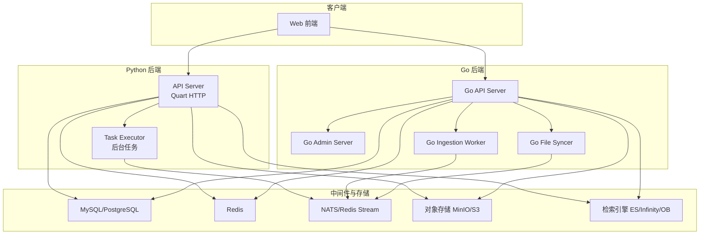
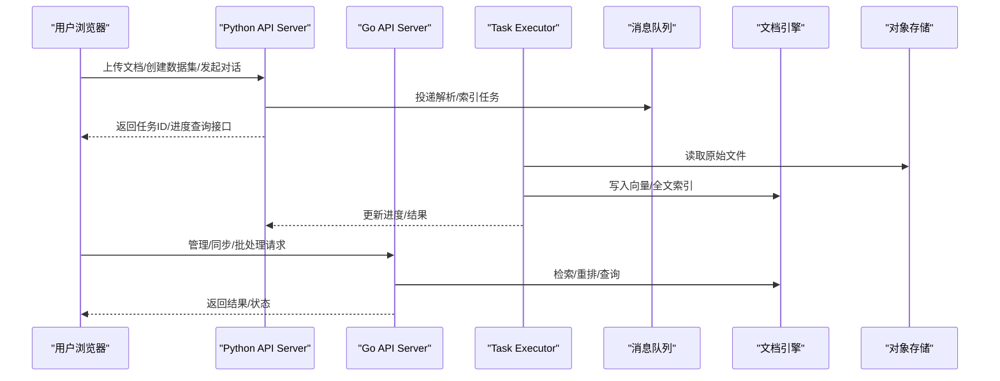
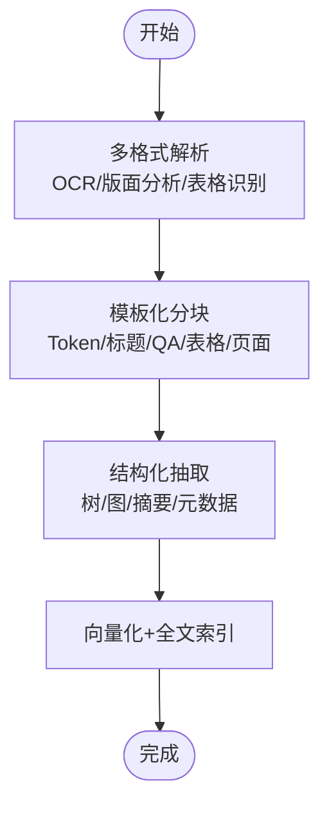
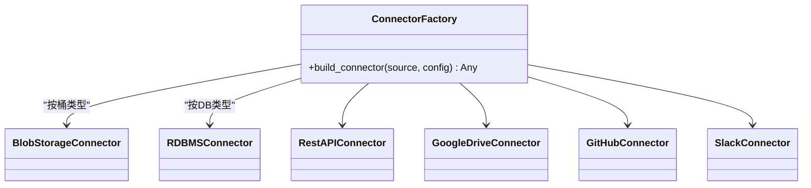
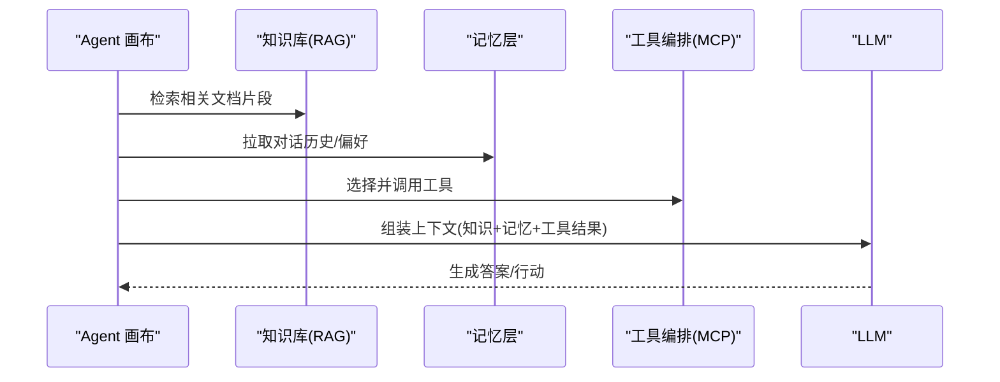
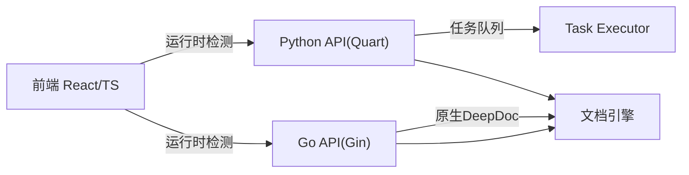
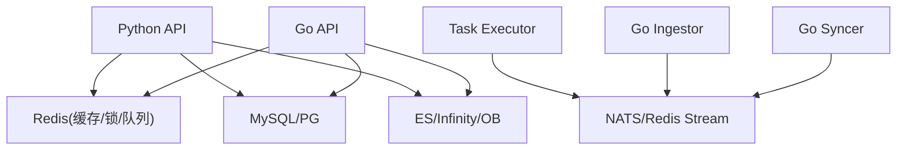

# 项目概览

<cite>
**本文引用的文件**
- [README.md](file://README.md)
- [docs/quickstart.mdx](file://docs/quickstart.mdx)
- [api/ragflow_server.py](file://api/ragflow_server.py)
- [cmd/ragflow_server.go](file://cmd/ragflow_server.go)
- [PROJECT_STRUCTURE.md](file://PROJECT_STRUCTURE.md)
- [docker/docker-compose.yml](file://docker/docker-compose.yml)
- [docs/basics/rag.md](file://docs/basics/rag.md)
- [docs/basics/agent_context_engine.md](file://docs/basics/agent_context_engine.md)
- [common/data_source/__init__.py](file://common/data_source/__init__.py)
- [internal/dao/connector.go](file://internal/dao/connector.go)
- [web/src/utils/backend-runtime.ts](file://web/src/utils/backend-runtime.ts)
</cite>

## 目录
1. [简介](#简介)
2. [项目结构](#项目结构)
3. [核心组件](#核心组件)
4. [架构总览](#架构总览)
5. [详细组件分析](#详细组件分析)
6. [依赖关系分析](#依赖关系分析)
7. [性能考量](#性能考量)
8. [故障排查指南](#故障排查指南)
9. [结论](#结论)
10. [附录：快速开始](#附录快速开始)

## 简介
RAGFlow 是一个以“深度文档理解”为核心的开源检索增强生成（RAG）引擎，将 RAG 与 Agent 能力融合，构建面向企业级场景的上下文层。其核心价值主张在于：
- 高质量输入、高质量输出：通过深度文档解析与结构化抽取，从复杂多模态数据中提炼高保真知识片段。
- 模板化分块：提供多种可解释的分块策略，兼顾语义聚焦与上下文完整。
- 减少幻觉的引用：可视化分块与可追溯引用，使回答有据可依。
- 异构数据源兼容：覆盖文档、表格、图片、网页、数据库、云存储等广泛来源。
- 自动化且可编排的 RAG 工作流：支持 LLM/Embedding 配置、混合检索与重排序、直观 API 集成。
- 面向 Agent 的上下文引擎：统一的知识、记忆与工具编排，实现从“手工提示工程”到“工业化上下文平台”的演进。

这些特性使得 RAGFlow 既能满足个人开发者快速搭建智能问答，也能支撑企业级大规模、多租户、多数据源的复杂应用。

**章节来源**
- [README.md:76-141](file://README.md#L76-L141)
- [docs/basics/rag.md:25-77](file://docs/basics/rag.md#L25-L77)
- [docs/basics/agent_context_engine.md:28-61](file://docs/basics/agent_context_engine.md#L28-L61)

## 项目结构
RAGFlow 采用前后端分离与多语言微服务协同的架构：
- Python 后端：基于 Quart 的异步 HTTP 服务，负责 API 路由、业务编排、任务调度与前端交互。
- Go 后端：可选的高性能服务实现，提供 API/Admin/Ingestor/Syncer 等多种运行模式，并内置原生 DeepDoc 能力。
- 前端：React + TypeScript 界面，支持双后端运行时切换与功能适配。
- 基础设施：MySQL/PostgreSQL、Redis、对象存储、消息队列（NATS/Redis Stream）、检索引擎（Elasticsearch/Infinity/OpenSearch/OceanBase）。

**图表来源**
- [PROJECT_STRUCTURE.md:53-96](file://PROJECT_STRUCTURE.md#L53-L96)
- [docker/docker-compose.yml:5-65](file://docker/docker-compose.yml#L5-L65)
- [cmd/ragflow_server.go:228-432](file://cmd/ragflow_server.go#L228-L432)

**章节来源**
- [PROJECT_STRUCTURE.md:98-164](file://PROJECT_STRUCTURE.md#L98-L164)
- [docker/docker-compose.yml:5-65](file://docker/docker-compose.yml#L5-L65)

## 核心组件
- 深度文档理解与解析：支持 PDF、DOCX、PPT、Excel、Markdown、HTML、JSON、图片、音频等多格式；具备 OCR、版面分析、表格识别等能力。
- 模板化分块与结构化抽取：提供 Token、标题层级、分组标题、QA、表格、页面等多种分块策略；支持知识编译与结构化产物（树/图）。
- 混合检索与重排序：向量相似度 + BM25 全文检索 + 元数据过滤 + 重排序，提升召回精度与相关性。
- 异构数据源连接器：覆盖网盘、协作平台、代码仓库、邮件、IM、数据库、REST API、RSS 等数十种来源。
- Agent 工作流与上下文引擎：可视化画布、组件化编排、工具调用、条件分支、循环；统一的知识、记忆与工具编排。
- 多租户与权限：团队管理、角色权限、API Key、模型提供者管理。
- 部署与运维：Docker Compose/Helm 一键部署，支持 CPU/GPU 模式，可观测日志与心跳上报。

**章节来源**
- [README.md:113-141](file://README.md#L113-L141)
- [docs/basics/rag.md:53-77](file://docs/basics/rag.md#L53-L77)
- [common/data_source/__init__.py:87-121](file://common/data_source/__init__.py#L87-L121)
- [docs/basics/agent_context_engine.md:28-61](file://docs/basics/agent_context_engine.md#L28-L61)

## 架构总览
RAGFlow 在运行时包含多个独立进程与服务，通过消息队列与缓存进行解耦协作：
- Python API Server：处理用户请求、编排业务流程、触发后台任务。
- Task Executor：消费 Redis Stream/NATS 中的任务，执行解析、分块、嵌入、索引等。
- Go 多模式服务：API/Admin/Ingestor/Syncer，提供高性能路径与原生 DeepDoc 能力。
- 存储与检索：关系型数据库持久化元数据，对象存储保存原始文件，检索引擎承载向量与全文索引。
- 前端：根据后端运行时动态适配不同后端的能力差异。

**图表来源**
- [api/ragflow_server.py:129-236](file://api/ragflow_server.py#L129-L236)
- [cmd/ragflow_server.go:696-726](file://cmd/ragflow_server.go#L696-L726)
- [PROJECT_STRUCTURE.md:53-96](file://PROJECT_STRUCTURE.md#L53-L96)

**章节来源**
- [api/ragflow_server.py:17-29](file://api/ragflow_server.py#L17-L29)
- [cmd/ragflow_server.go:228-432](file://cmd/ragflow_server.go#L228-L432)
- [PROJECT_STRUCTURE.md:53-96](file://PROJECT_STRUCTURE.md#L53-L96)

## 详细组件分析

### 文档解析与分块（模板化）
- 解析器族：PDF、DOCX、PPT、Excel、Markdown、HTML、JSON、图片、音频等，结合 OCR 与版面分析提取结构化信息。
- 分块策略：Token 切分、标题层级、分组标题、QA、表格、页面等；支持知识编译产出树/图结构，便于跨文档关联。
- 质量保障：可视化分块预览、人工干预、关键词加权，确保检索与生成的准确性。

**图表来源**
- [docs/basics/rag.md:29-47](file://docs/basics/rag.md#L29-L47)
- [rag/flow/compiler/compiler.py:682-711](file://rag/flow/compiler/compiler.py#L682-L711)
- [rag/advanced_rag/knowlege_compile/structure.py:1211-1242](file://rag/advanced_rag/knowlege_compile/structure.py#L1211-L1242)

**章节来源**
- [README.md:113-134](file://README.md#L113-L134)
- [docs/basics/rag.md:29-47](file://docs/basics/rag.md#L29-L47)

### 异构数据源连接器
- 统一抽象：通过连接器工厂按数据源类型动态构建连接实例，支持 Blob、RDBMS、REST API 等。
- 覆盖范围：网盘、协作平台、代码仓库、邮件、IM、数据库、RSS、Salesforce、Azure DevOps 等。
- 前端适配：根据后端运行时选择不同连接器展示与交互逻辑。

**图表来源**
- [common/data_source/__init__.py:87-121](file://common/data_source/__init__.py#L87-L121)
- [internal/dao/connector.go:43-81](file://internal/dao/connector.go#L43-L81)
- [web/src/utils/backend-runtime.ts:17-37](file://web/src/utils/backend-runtime.ts#L17-L37)

**章节来源**
- [common/data_source/__init__.py:87-121](file://common/data_source/__init__.py#L87-L121)
- [internal/dao/connector.go:43-81](file://internal/dao/connector.go#L43-L81)

### Agent 工作流与上下文引擎
- 上下文引擎：统一的知识（高级 RAG）、记忆（对话历史/偏好/状态）、工具（MCP 工具编排）三层能力。
- 工作流编排：可视化画布、组件化节点（LLM、工具、分支、循环、变量聚合等），DSL 驱动执行。
- 价值：将“手工提示工程”升级为“工业化的上下文平台”，降低维护成本、提高可扩展性。

**图表来源**
- [docs/basics/agent_context_engine.md:28-61](file://docs/basics/agent_context_engine.md#L28-L61)

**章节来源**
- [docs/basics/agent_context_engine.md:28-61](file://docs/basics/agent_context_engine.md#L28-L61)

### Python 与 Go 双语言微服务架构优势
- Python 侧：生态丰富、AI/ML 库完善、快速原型与业务编排能力强；Quart 异步框架提升并发处理能力。
- Go 侧：高性能、低延迟、内存安全；原生 DeepDoc 能力减少外部依赖；多模式（API/Admin/Ingestor/Syncer）灵活部署。
- 前端运行时检测：根据后端语言自动适配 UI 与能力，保证一致体验。

**图表来源**
- [web/src/utils/backend-runtime.ts:17-37](file://web/src/utils/backend-runtime.ts#L17-L37)
- [cmd/ragflow_server.go:162-167](file://cmd/ragflow_server.go#L162-L167)
- [PROJECT_STRUCTURE.md:38-49](file://PROJECT_STRUCTURE.md#L38-L49)

**章节来源**
- [web/src/utils/backend-runtime.ts:17-37](file://web/src/utils/backend-runtime.ts#L17-L37)
- [cmd/ragflow_server.go:162-167](file://cmd/ragflow_server.go#L162-L167)
- [PROJECT_STRUCTURE.md:38-49](file://PROJECT_STRUCTURE.md#L38-L49)

## 依赖关系分析
- 进程间通信：Python API 与 Task Executor 通过 Redis Stream/NATS 解耦；Go 服务通过心跳上报至 Admin。
- 数据存储：关系型数据库用于元数据与配置；对象存储用于原始文件；检索引擎承载向量与全文索引。
- 外部依赖：LLM/Embedding 提供商、OCR/VLM 服务、沙箱执行器等。
- 前端适配：根据后端运行时动态加载不同实现，屏蔽差异。

**图表来源**
- [api/ragflow_server.py:87-112](file://api/ragflow_server.py#L87-L112)
- [cmd/ragflow_server.go:365-399](file://cmd/ragflow_server.go#L365-L399)
- [PROJECT_STRUCTURE.md:53-96](file://PROJECT_STRUCTURE.md#L53-L96)

**章节来源**
- [api/ragflow_server.py:87-112](file://api/ragflow_server.py#L87-L112)
- [cmd/ragflow_server.go:365-399](file://cmd/ragflow_server.go#L365-L399)

## 性能考量
- 分块粒度与上下文长度：小分块利于语义匹配，大分块利于上下文完整；需结合模板与重排序平衡。
- 混合检索：向量+BM25+元数据过滤+重排序，提升召回精度与响应速度。
- 并发与扩展：Task Executor 多实例负载均衡；Go Ingestor 控制并发度；消息队列削峰填谷。
- 资源限制：vm.max_map_count 对 Elasticsearch/Infinity 至关重要；CPU/GPU 按需分配。
- 缓存与锁：Redis 分布式锁协调多实例进度更新，避免重复计算。

[本节为通用指导，不直接分析具体文件]

## 故障排查指南
- Elasticsearch/Infinity 连接异常：检查 vm.max_map_count 设置与容器健康状态。
- 文档解析停滞：查看日志与分块预览，必要时调整模板或手动干预。
- 服务启动失败：确认依赖服务（MySQL/Redis/NATS/MinIO）就绪；核对端口与环境变量。
- 前端网络异常：等待后端完全初始化后再访问；检查代理与端口映射。
- 多实例冲突：使用 Redis 分布式锁确保单一实例执行进度更新。

**章节来源**
- [docs/quickstart.mdx:45-83](file://docs/quickstart.mdx#L45-L83)
- [api/ragflow_server.py:87-112](file://api/ragflow_server.py#L87-L112)
- [docker/docker-compose.yml:5-65](file://docker/docker-compose.yml#L5-L65)

## 结论
RAGFlow 以深度文档理解为基础，结合模板化分块、混合检索与重排序，构建了高保真、可追溯的 RAG 能力；同时通过 Agent 上下文引擎统一知识、记忆与工具编排，推动从“手工提示工程”走向“工业化上下文平台”。Python 与 Go 双语言微服务架构兼顾生态与性能，支持灵活部署与横向扩展。借助 Docker Compose/Helm 的一键部署与完善的文档，RAGFlow 既适合初学者快速上手，也能为资深开发者提供足够的技术深度与扩展空间。

[本节为总结性内容，不直接分析具体文件]

## 附录：快速开始
- 系统要求：
  - CPU ≥ 4 核（x86），RAM ≥ 16 GB，磁盘 ≥ 50 GB
  - Docker ≥ 24.0.0，Docker Compose ≥ v2.26.1
  - Python ≥ 3.13（开发环境）
  - gVisor（可选，用于代码执行沙箱）
- 启动步骤：
  - 设置 vm.max_map_count ≥ 262144
  - 克隆仓库并进入 docker 目录
  - 使用预构建镜像启动服务（CPU/GPU 模式）
  - 检查服务日志确认启动成功
  - 浏览器访问服务器 IP 登录
  - 配置默认 LLM 与 Embedding 模型
- 基本使用：
  - 创建数据集，上传文件并解析
  - 查看分块结果并可人工干预
  - 创建聊天助手，绑定数据集并对话
  - 通过 HTTP/Python SDK 集成能力

**章节来源**
- [docs/quickstart.mdx:28-257](file://docs/quickstart.mdx#L28-L257)
- [README.md:148-255](file://README.md#L148-L255)